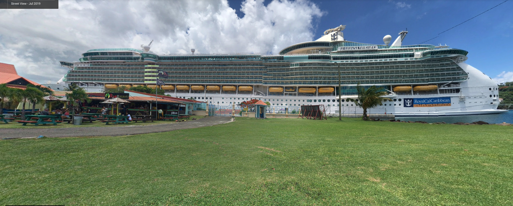

# Vacation

## 题目简述

题目照片拍到一艘 Royal Caribbean 邮轮和岸边名为 `Rum Therapy` 的地点。需要识别邮轮停靠城市，再给出附近的一家酿酒厂。



## 解题过程

先以 `Rum Therapy`、邮轮公司和加勒比港口为组合线索搜索。匹配地点位于 Saint Lucia 的 Castries 港区；照片中的码头方向和城市岸线与该位置一致。

再查看港口周边商户，符合题目“附近 brewery”条件的是：

```text
Antillia Brewing
```

因此按“城市_商户”格式提交：

```text
UMDCTF-{Castries_Antillia}
```

## 方法总结

旅游照片中的商户招牌往往比邮轮本身更具唯一性。先用招牌与行业/区域组合定位港口，再用船只、岸线和附近商户复核。正文已经展开城市与酿酒厂的对应关系，不依赖原搜索页面继续存在。
