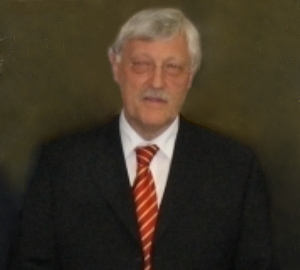

# UMDCTF2022 Ketchup Writeup

## 题目简述

题目只给出一张人物照片，要求识别其姓名，并按 `UMDCTF{firstname_lastname}` 提交。普通以图搜图无法直接命中，需要先做面部相似搜索找到同一人物的其他照片，再用清晰的中间图进行第二次反向图片搜索。



## 解题过程

仓库的官方解题说明给出以下证据链：

1. 先把题图提交给 PimEyes 一类面部搜索服务。Google Images 和 TinEye 对这张裁剪图没有给出有效身份结果。
2. 面部搜索结果会展示相似网页的缩略图。若页面不直接提供原图，可检查页面源代码或网络请求，取出第一条匹配对应的源图片地址。
3. 保存这张更清晰、在其他网站出现过的中间图，再提交给 Yandex Images 做普通反向图片搜索。
4. Yandex 的匹配页面给出人物姓名 `Heinz Paus`。

原官方说明中的 PimEyes 结果 UUID 属于一次性搜索结果，既不稳定也不承载独立证据，因此不保留该具体 URL；关键工具选择和两阶段检索逻辑已完整写入正文。

按题目格式转为小写并以下划线连接：

```text
UMDCTF{heinz_paus}
```

## 方法总结

人脸 OSINT 与普通相似图片搜索解决的问题不同。第一阶段用人脸特征跨图片找到同一人物，第二阶段用来源更明确的照片匹配包含姓名的网页。遇到搜索结果只显示缩略图时，页面源代码和网络请求常能恢复原图 URL；但最终结论仍应由出现姓名的独立页面交叉确认，而不是只凭相似度排名。
