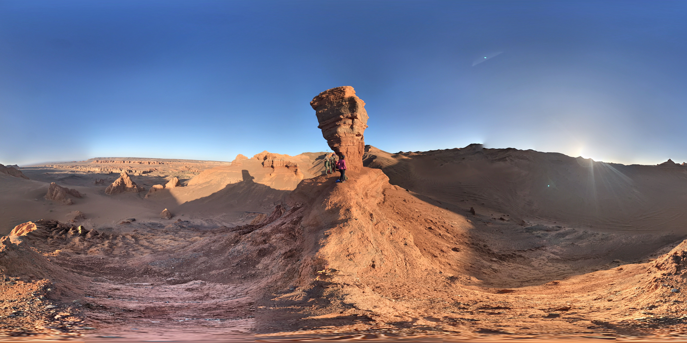

# literally arrakis I

## 题目简述

题目只给出一张沙漠地区的 Google Street View 全景，要求确定拍摄点的经纬度，并以 `UMDCTF{latitude,longitude}` 的格式提交。



## 解题过程

图中不是单纯的沙丘：中央是受侵蚀形成的红色层状砂岩柱和拱形轮廓，远处可见连续的裸露台地，地面则是砾石、细沙和冲沟混合的荒漠。这组特征应优先与峡谷或恶地地貌比较。

以“Gobi red sandstone canyon”“Mongolia desert rock arch”等组合检索候选，再逐一对照公开全景。Khermen Tsav 一带同时具有红色沉积岩、孤立岩柱、宽阔冲蚀盆地和南戈壁的极端荒漠环境；继续在地图全景中比对中央岩柱、右侧低矮岩脊以及远处台地的相对位置，即可落到拍摄点。

在 [Google Maps 目标机位](https://www.google.com/maps?q=43.4693781,99.8275023) 复核后，地图读数为：

```text
43.4693781,99.8275023
```

按题目格式提交：

```text
UMDCTF{43.4693781,99.8275023}
```

## 方法总结

沙漠地理定位不能只按“沙的颜色”判断国家。先区分沙丘、砂岩恶地、盐沼和火山砾石等地貌类型，再用岩层形态、山脊关系和全景机位进行二次对齐，能够显著减少相似景观造成的误判。
