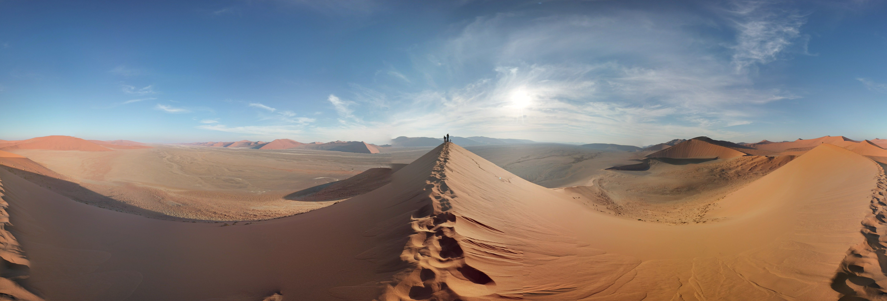

# literally arrakis II

## 题目简述

题目给出一张巨型沙丘群的 Google Street View 全景，要求定位拍摄点并提交精确经纬度。



## 解题过程

画面中有三类很强的地域线索：

1. 沙丘高度大、坡面平滑，迎风坡和背风坡形成清晰锐利的脊线；
2. 沙体呈铁锈红至橙色，符合古老沙粒长期氧化后的颜色；
3. 沙丘之间存在大面积浅灰白色平坦地面，类似盐土或黏土盆地。

“红色巨型沙丘 + 白色盐黏土盆地”的组合首先指向纳米比亚 Namib-Naukluft National Park 内的 Sossusvlei/Deadvlei 区域。随后在地图全景中比较右侧可供游客攀爬的沙脊、中央浅色盆地和远处连续沙丘的轮廓，可以确定对应机位。

在 [Google Maps 目标机位](https://www.google.com/maps?q=-24.7287779,15.4722992) 复核后，地图坐标为：

```text
-24.7287779,15.4722992
```

因此提交：

```text
UMDCTF{-24.7287779,15.4722992}
```

## 方法总结

本题的决定性证据不是“这里有沙丘”，而是红色高沙丘与浅色封闭盆地同时出现。先用独特地貌组合锁定景区，再用沙脊方向、游客路径和远景轮廓做全景级比对，最后才抄取坐标。
