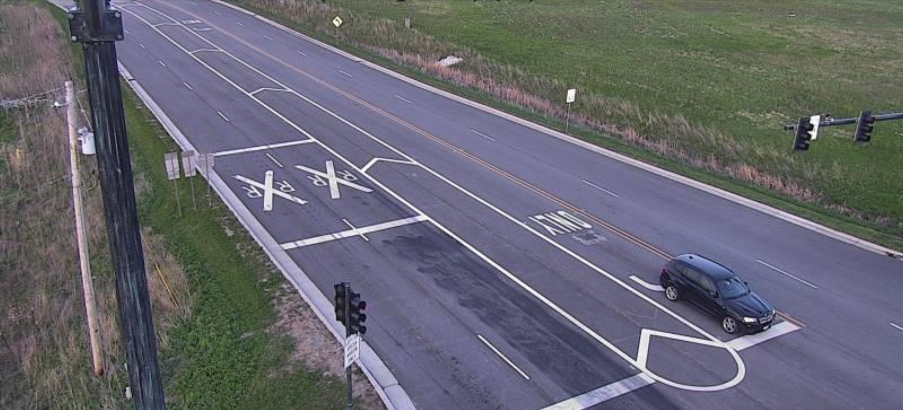

# road-2

## 题目简述

题目给出一张被裁掉底部标题的路口摄像头截图，要求恢复原摄像头显示的完整交叉口名称。



## 解题过程

截图中最重要的不是商店或车辆，而是路面上的路线盾牌。放大后可以辨认出 `83`，另一路线标识对应 `137`；画面又是有多组信号灯和转向车道的大型平面交叉口。

据此把范围缩小到 Illinois 的 IL 83 与 IL 137 共线或相交路段，再在交通摄像头目录中对比：

- 信号灯横臂数量与朝向；
- 车道数和左转等待区；
- 路面盾牌相对于路口的位置；
- 远处建筑、树线和摄像头视角。

匹配摄像头的标题不是简单的 `IL 83 & IL 137`，而是目录中的完整复合名称：

```text
IL 83-IL 137/IL 83-Atkinson Rd
```

题目明确要求采用原摄像头底部文字，因此斜杠、连字符和 `Rd` 都应保留。最终提交：

```text
UMDCTF{IL 83-IL 137/IL 83-Atkinson Rd}
```

## 方法总结

被裁剪的摄像头标题可以从路线盾牌反推。先用两个路线编号建立小规模候选集合，再以信号灯、转向车道和固定背景做视觉核验；最后必须复制目录中的完整标题，而不是自行改写成交叉口俗称。
