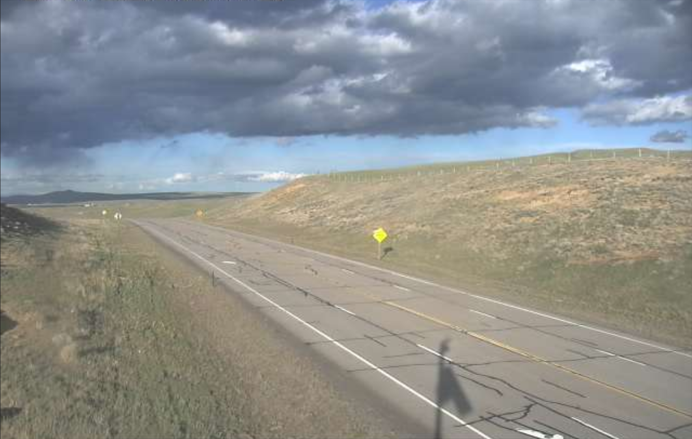

# road-3

## 题目简述

题目给出一张美国公路实时摄像头截图，要求确定离摄像头最近的城镇。



## 解题过程

截图缺少可直接搜索的文字，因此先从环境缩小州别：

- 开阔的高原草地和低矮、裸露的丘陵；
- 聚落与树木极少；
- 长直公路、宽路肩和远距离能见度；
- 强对流云层与半干旱地貌。

这些特征与 Wyoming 的州级 511 摄像头高度吻合。接下来逐项对比摄像头列表中的山脊轮廓、公路弯曲方向、路肩宽度和相机高度，而不是仅凭“看起来像怀俄明”下结论。

与截图固定地貌一致的站点位于 Hanna 附近。题目要求最近城镇并采用“城市, 州缩写”格式，所以答案为：

```text
UMDCTF{Hanna, WY}
```

## 方法总结

没有文字线索的道路定位依赖分层排除：先用生态与道路工程特征判断区域，再用官方摄像头目录逐站比对不会快速变化的地形轮廓。天气和车辆是瞬时信息，山脊、道路走向与相机位置才是可靠指纹。
