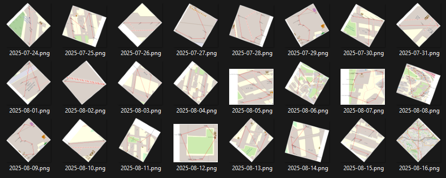

# NUS Geographer

## 题目简述

`diary.txt` 记录了 2025 年 7 月 24 日至 8 月 16 日每天按时间访问的 NUS 场地代码，并夹杂不合理的“温度”。场地代码可通过 NUSMods 的公开 `venues.json` 映射到坐标；同一天的坐标按时间连线形成一个字母，“温度”则是该字母需要校正的旋转角度。

## 解题过程

先用正则分别提取访问记录和角度记录：

```python
visit_re = re.compile(
    r"On (\d{2} \w+ \d{4}), I went ([A-Za-z0-9_\-/]+) at (\d{1,2}:\d{2} [AP]M)\."
)
angle_re = re.compile(r"How is it (\d+) degrees on (\d{2} \w+ \d{4})")
```

对每一天执行以下步骤：

1. 按时间排序访问记录。
2. 在赛事仓库附带的 `venues.json` 中，把场地代码换成经纬度。
3. 按访问顺序连接坐标点。
4. 以折线质心为中心，按当天给出的角度反向旋转。
5. 依日期升序读取 24 个字母。

绕质心 $(c_x,c_y)$ 旋转 $\theta$ 的坐标变换为：

$$
\begin{aligned}
x'&=(x-c_x)\cos\theta-(y-c_y)\sin\theta+c_x,\\
y'&=(x-c_x)\sin\theta+(y-c_y)\cos\theta+c_y.
\end{aligned}
$$

官方汇总图能看出每一天是一笔折线字符；地图底图和日期标签只用于定位与排序，不属于 flag 字符本身：



按 7 月 24 日到 8 月 16 日依次读取为：

```text
IM_JUST_A_NUSMODS_MONKEY
```

所以 flag 是：

```text
grey{IM_JUST_A_NUSMODS_MONKEY}
```

场地坐标来源是 [NUSMods 维护的 venues.json](https://github.com/nusmodifications/nusmods/blob/master/website/src/data/venues.json)；正文已经概括了所需字段和完整处理过程，链接仅用于数据来源追溯。

## 方法总结

- 核心技巧：用公开场地坐标把日记中的位置代码地理化，再以时间为笔画顺序、角度为旋转校正量恢复字符。
- 识别信号：位置代码来自同一校园、每一天包含多个有序地点、所谓温度均在 $0$ 到 $360$ 度且明显不符合天气常识。
- 复用要点：OSINT 数据可能随主分支更新；应使用与题目日期匹配的历史数据或赛事仓库冻结副本，避免坐标漂移。
