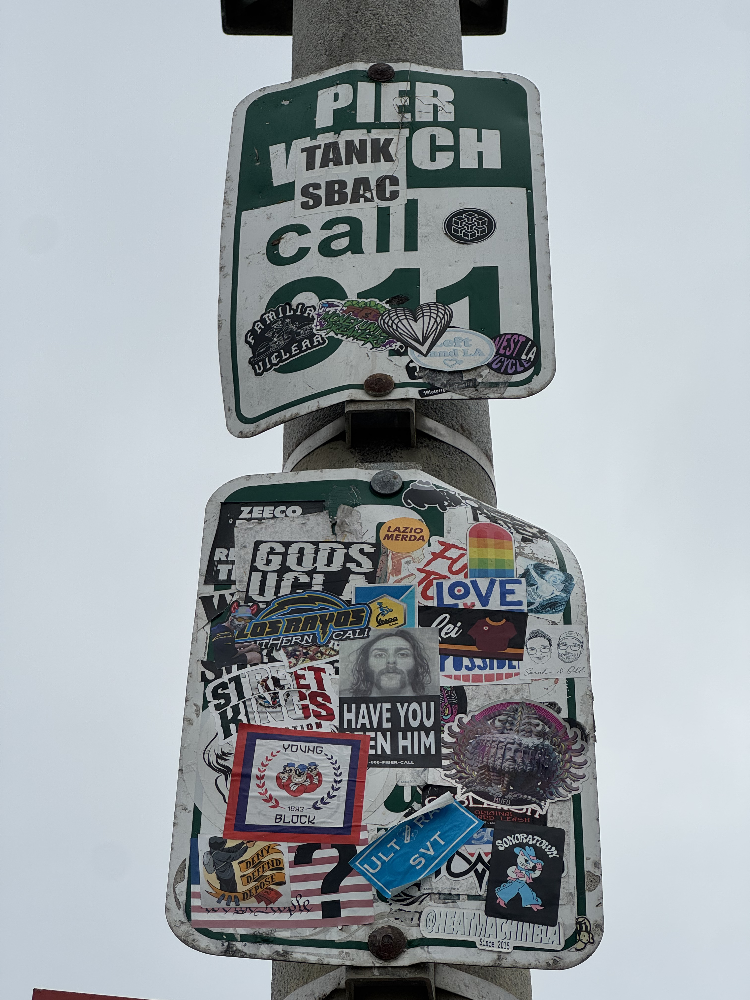

# Party in the USA

## 题目简述

附件是一张洛杉矶街头贴纸照片，要求找出 NUS Greyhats 留下标记的具体地点。照片中最关键的可检索线索不是贴纸本身，而是路牌上的 `PIER`、`VENICE` 和一组洛杉矶本地标识；这些信息把范围收敛到 Venice Beach 的 Venice Fishing Pier。

## 解题过程

先观察原图：



可提取的高价值线索包括：

- 上方路牌仍清晰保留 `PIER` 字样；
- 同一牌面能看到被贴纸部分遮挡的 `VENICE`；
- 下方有 `Los Angeles` 和 `West LA Cycle` 等本地关联文字；
- 题面明确地点在 LA，并要求提交地点名称。

组合搜索“Venice”“pier”“Los Angeles”即可定位到 Venice Fishing Pier。按题目要求把空格换成下划线并使用小写：

```text
grey{venice_fishing_pier}
```

## 方法总结

- 核心技巧：从现场照片中提取地名残片和设施类型，再用城市范围做交叉验证。
- 识别信号：地点名虽被贴纸遮挡，但 `PIER`、`VENICE` 与 LA 本地标识仍足以形成唯一组合。
- 复用要点：地理题应先记录图中可验证证据，再搜索候选点；不要仅凭“海滩加码头”的印象猜测旗标格式。
