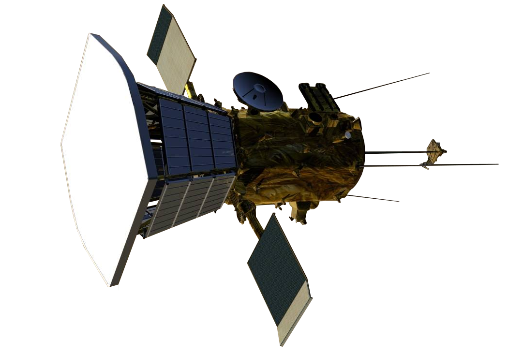

# Secret Mission

## 题目简述

附件是一张航天器示意图，要求识别任务名称，并把每个单词首字母大写后用下划线连接。

## 解题过程



图中航天器具有面向太阳的大型圆形隔热盾、盾后方机身以及展开的太阳能板，这些外形特征与 NASA 的 Parker Solar Probe 一致。按题目格式整理名称：

```text
n00bz{Parker_Solar_Probe}
```

## 方法总结

反向图片搜索给出候选后仍应核对可见结构，而不是只相信相似缩略图。本题最有区分度的特征是圆形热防护盾与太阳探测任务构型，因此保留原始线索图具有实际视觉价值。
