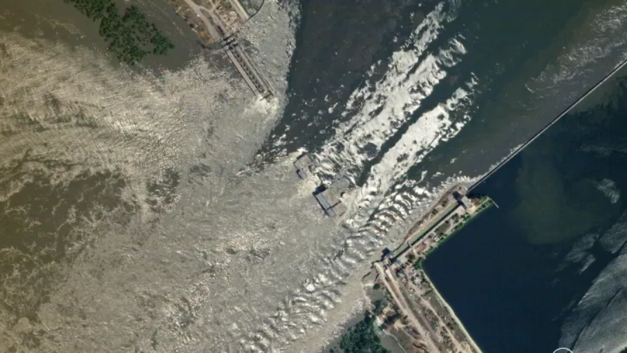

# Damn

## 题目简述

题目给出一张大坝的卫星图，要求提交大坝所在城市。图像对应 2023 年遭破坏的新卡霍夫卡大坝。

## 解题过程

原始卫星图保留了大坝、河道与邻近城区的空间关系：



对图片做反向搜索，可以定位到有关 Kakhovka Dam 坍塌的新闻图片。再用 `Kakhovka Dam city` 等关键词交叉查询地图和百科资料，确认大坝位于乌克兰城市 Nova Kakhovka。按题面格式提交：

```text
n00bz{Nova_Kakhovka}
```

## 方法总结

反向图片搜索负责识别地标，最终城市名仍应由地图或权威地点资料复核。提交时使用题面要求的英文专名与下划线，避免把大坝名误当作城市名。
