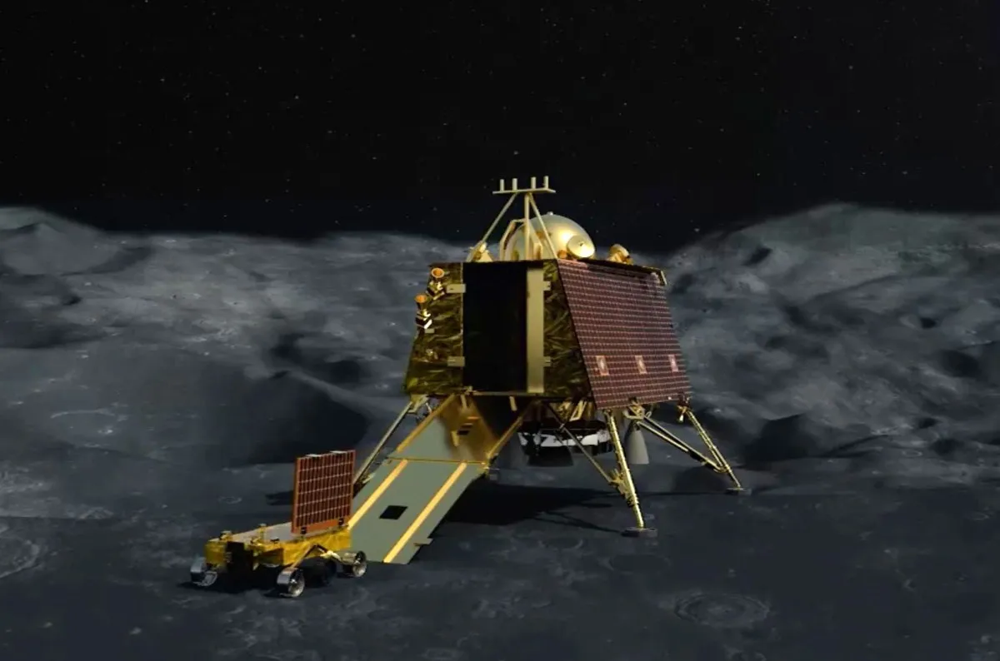

# Mission_Moon

## 题目简述

附件展示印度月球任务的着陆器与巡视器，要求识别任务、设备名称和计划着陆坐标，并使用指定博客中的坐标值保留一位小数。

## 解题过程

原图中的设备外观与任务标识是识别线索：



反向搜索可确认图片属于 Chandrayaan-2。再以任务名并限定题面指定的信息源搜索，资料给出着陆器名 `Vikram`、巡视器名 `Pragyan`，以及计划着陆点纬度 `70.9`、经度 `22.8`。按顺序和大小写组合：

```text
n00bz{Vikram_Pragyan_70.9_22.8}
```

## 方法总结

月球坐标存在不同候选和精度版本，因此不能只取任意搜索摘要。应遵循题面指定来源、确认纬经度顺序，并保持设备专名的大小写。
