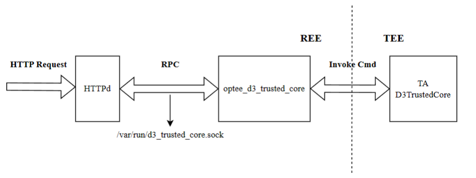
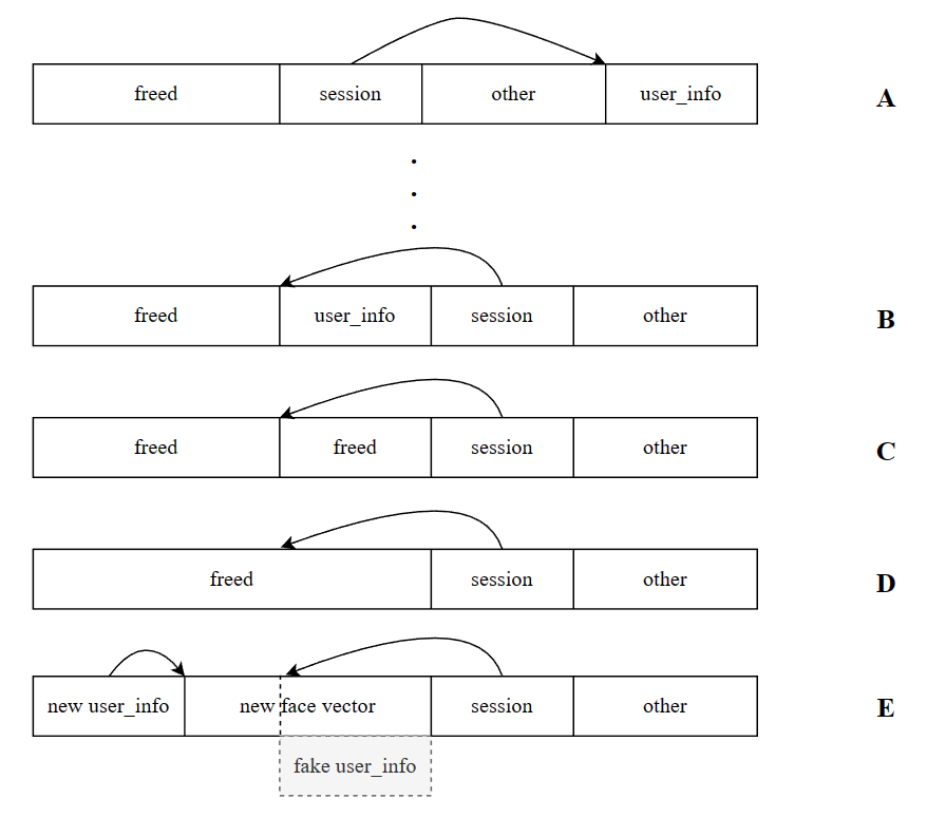
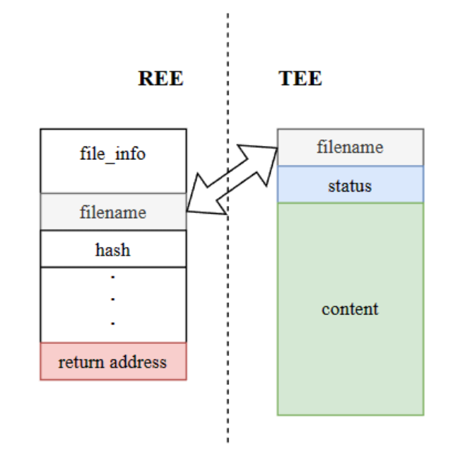

# d3TrustedHTTPd

## 题目简述

题目是 ARM OP-TEE 相关的综合利用。HTTPd 通过 RPC 中间件访问 TEE TA，TA 提供人脸认证和基于 OP-TEE secure storage 的文件系统。利用链分三步：RPC 字段注入泄露/伪造 face_id 登录；TOCTOU + TA 内 UAF 伪造 Admin session；最后利用 secure file system 的文件状态/重命名缺陷，借 `TEEC_MEMREF_TEMP_INPUT` 页对齐映射造成 CA 栈溢出，控制 `optee_d3_trusted_core` 读取 flag。

## 解题过程

Github Repo：d3ctf-2022-pwn-d3TrustedHTTPd。该仓库主要提供题目源码、TA/CA 交互代码和 exploit 参考；正文已经保留关键结构和漏洞点，因此复现时不应只依赖仓库链接。

作者：Eqqie @ D^3CTF

### 分析

这是一道 ARM TEE 漏洞利用题。我在常规 TEE Pwn 基础上写了一个 HTTPd 和一个 RPC 中间件。TA 为 HTTPd 提供认证服务，并提供一个基于 OP-TEE secure storage 的简单文件系统。HTTPd 基于 mini_httpd 编写，RPC 中间件位于 `/usr/bin/optee_d3_trusted_core`，它们的关系如下。



如果要读取 secure world（TEE）中的日志，可以在 `run.sh` 的 QEMU 参数中加入这一行：

```
-serial tcp:localhost:54320 -serial tcp:localhost:54321 \
```

本题包含大量代码，并且内存破坏建立在逻辑漏洞之上，所以逆向程序需要较长时间。BinaryAI 这类相似函数/库函数识别工具在本题中的价值是快速标出 OP-TEE API、TA entry、secure storage 相关函数，减少从裸汇编手动命名的工作量；真正的利用仍需要自己确认 RPC 解析、session 更新和文件系统结构。

调试时先从 REE 侧 HTTP 请求进入 RPC 边界，再对照 TA 侧处理函数定位登录、相似度查询和文件操作相关命令。

**步骤 1**

第一个漏洞出现在 HTTPd 与 `optee_d3_trusted_core` 之间的 RPC 实现中。HTTPd 获取 username 参数时只把空格替换为 null，然后把 username 拼接到 RPC 字符串末尾。

`username=` 参数解析时会分配缓冲区并 `urldecode`，过滤逻辑只检查空格等少数字符。

用户名长度超过 `0x80` 后会进入失败分支，但部分缓冲区释放与后续状态处理仍可影响堆布局。

`optee_d3_trusted_core` 解析 RPC 数据时认为不同字段可以用空格或 `\t`（%09）分隔，因此可以通过 `\t` 向 RPC 请求注入额外字段。

路由里存在 `get_similarity` 分支，可继续触发和用户信息相关的处理逻辑。

当攻击者请求使用 face_id 登录 `eqqie` 用户时，可以通过注入 `eqqie%09get_similarity` 泄露真实 face_id 向量与攻击者提交向量之间的相似度；这里的相似度用欧氏距离倒数表示。

攻击者可以用固定步长遍历 face_id 向量的每一维，例如

0.015，然后向服务端请求当前向量的相似度，找出每一维中让相似度最大的值。当 128 维都完成该计算后，就能得到整体相似度最高的向量；当相似度超过 TA 中 85% 的阈值时，即可通过 Face ID 认证并绕过登录限制。

### 步骤 2

第二步结合 TOCTOU 竞争条件漏洞和 TA 中的 UAF 漏洞完成用户提权，获取 Admin 用户权限。

使用 `/api/man/user/disable` API 禁用用户时，HTTPd 会分两步完成：第一步用 `command user kickout` 踢出对应用户，第二步用 `command user disable` 把该用户加入禁用列表。

命令分发中可以看到 `kickout` 与 `disable` 等用户状态操作，后续利用围绕这些命令改变用户结构状态。

同一 session 中调用 `TEEC_InvokeCommand` 是原子的，也就是说当前 Invoke 执行结束后，下一个 Invoke 才能开始执行，因此单次 Invoke 内不存在竞争。但这里实现 kickout 时调用了两次 `TEEC_InvokeCommand`，所以存在竞争窗口。

**Kickout** 函数通过遍历 session 列表，查找记录 UID 与待删除用户 UID 相同的 session 对象并释放它。

删除用户路径里会把 `user_info` 放回链表或释放，为后续 UAF 和重叠创造条件。

**Disable** 函数通过把 username 指定的用户从启用用户列表移动到禁用用户列表来实现。

按用户名查找 disabled 用户时，会从 `user_info` 中取出 `username` 指针并继续访问对象字段。

可以使用竞争思路：先登录一次 guest 用户，让它拥有 session；然后用两个线程并行执行 **禁用 guest 用户** 和 **登录 guest 用户**。存在一定概率在 `/api/man/user/disable` 接口踢出 guest 用户时，攻击者通过 `/api/login` 接口给 guest 用户创建新的 session，而 `/api/man/user/disable` 接口随后又把 guest 用户移入禁用列表。完成攻击后，攻击者手里会持有一个指向被禁用用户的 session。

基于这个前提，可以利用 TA 在 reset 用户时存在的 UAF 漏洞。这里用源码展示漏洞位置会更清楚。

`get_user_info_by_name` 在链表遍历中存在 use-after-free 检查缺口：对象释放后仍可能被后续链表项引用。

reset 用户时，如果该用户已经被禁用，就会进入图中逻辑。用户对象首先从用户列表中移除；如果 reset 时指定了 `set_face_id` 参数，则会申请一块内存保存新的 face_id 向量。随后 TA 使用 `d3_core_add_user_info` 重新创建用户。最后，TA 遍历所有 session 并比较 uid，以更新 session 引用的用户对象指针。但比较 UID 时没有使用 `session` - `>uid`，而是错误地使用了 `session` - `>user_info` - `>uid`。`session` - `>user_info` 指向的对象此前已经被释放，因此这里引用的是一块 freed chunk。如果能通过 heap fengshui 占住这块 chunk，就可以修改 `user_info` 对象中保存的 UID，绕过该 session 上用户对象引用的更新，并让 session 指向攻击者伪造的 fake user 对象。自然地，攻击者可以把 fake user 伪造成 Admin 用户。

完成这个 UAF 利用时，BGET allocator 资料很有用，因为 OP-TEE 使用的是类似 BGET 的堆。重要分配器行为包括：分配器从一个大的 free chunk 开始；分配会从 chunk 尾部切分；释放时会尝试合并相邻 chunk；free chunk 插入顺序近似 FIFO。为了利用该漏洞，需要先把堆布局从 A 调整到 B，再调用 reset 函数，随后利用 reset 函数中的 `delete` - `>create` - `>create` gadget。它会让堆布局按 C->D->E 的方式变化，最后通过控制新的 face data 伪造 Admin 用户。



**步骤 3**

拿到 Admin 权限后，就可以完整使用 TA 中基于 OP-TEE secure storage 实现的 secure file system；普通用户只有只读权限。

secure file system 删除文件或目录时有 **erase** 和 **mark** 两种模式。erase 模式会从 OP-TEE secure storage 中删除整个文件对象；mark 模式则只在文件节点中标记删除，并且在没有空闲槽位之前不会复用该节点。

secure file system 存储文件和目录时使用 `SecFile` 数据结构。创建目录时，status 会设置为 `0xffff1001`；对文件来说，这个值是 `0xffff0000`。删除目录有 **recursive** 和 **non-recursive** 两种选项。以 recursive 模式删除目录时，secure storage 中的数据不会被擦除，只会被标记为删除。

```
typedef struct SecFile sec_file_t;
typedef sec_file_t sec_dir_t;
#pragma pack(push, 4)
struct SecFile{
    uint32_t magic;
    char hash[TEE_SHA256_HASH_SIZE];
    uint32_t name_size;
    uint32_t data_size;
    char filename[MAX_FILE_NAME];
    uint32_t status;
    char data[0];
};
#pragma pack(pop)
```

`d3_core_create_secure_file` 创建文件时有一个小 bug：复用标记为删除的槽位时不会重写 `status` 字段；相比之下，

`d3_core_create_secure_dir` 没有这个缺陷。这个问题本身直接影响不大。

文件对象创建时会设置 `SEC_FILE_MAGIC`、`filename`、`data_size`、`status` 等字段，`filename` 长度固定但后续复制不严谨。

`new_file->filename` 来自用户可控文件名，`memcpy` 和字符串长度处理共同决定后续溢出面。

但文件重命名时还有另一个缺陷：允许设置长度为 128 字节的文件名。由于文件名字段最大长度也是 128，这会导致 filename 末尾丢失 null byte。这个漏洞与 `status` 字段未重写缺陷结合后，会在更新文件名长度时把文件名自身长度和文件内容长度一起计入。结果是在使用 `d3_core_get_sec_file_info` 读取文件信息时，文件名和文件内容会被一起带出。

`SecFile` 创建和状态检查处存在可被文件名长度影响的边界条件。

`SecFile` 结构的关键字段顺序为 `magic`、`hash[32]`、`name_size`、`data_size`、`filename[128]`、`status`、`data[]`；溢出目标是越过 `filename` 影响 `status` 或相邻数据。

调用 `d3_core_get_sec_file_info` 函数时，CA 中用于存储文件信息的指针会以 `TEEC_MEMREF_TEMP_INPUT` 方式传给 TA。这个指针引用的是 CA 栈上的缓冲区。

ROP 前需要通过文件对象和用户对象重叠泄露或控制 REE/TEE 之间可见的指针，再把返回地址附近的数据布置成可用链。

调试中确认了可控文件内容与返回地址附近布局之间的偏移关系。



CA 的 `TEEC_MEMREF_TEMP_INPUT` 类型参数传给 TA 时不是复制，而是映射。这个映射通常以 **page-aligned** 的方式完成，也就是说映射到 TA 地址空间中的不只是 `tmpref.size` 指定大小的数据，还包括同一页中的其他数据。图中展示的是 TA 的地址空间，标记位置是被映射进 TA 的 buffer 参数。

调试输出中的内存区域显示 TA 映射、栈和匿名区域地址，可用于确认 gadget 和可控数据所在范围。

本题中，借助 `d3_core_get_sec_file_info` 写入 buffer 的额外数据会在 CA 中造成 **stack overflow**。原因是 CA 中用于保存文件名的 buffer 只有 128 字节，只要文件内容足够大，就可以覆盖到 CA 的返回地址。由于 `optee_d3_trusted_core` 进程以 **root privileges** 运行，劫持其控制流后就能设法获取权限位为 `400` 的 `/flag.txt` 内容。注意在 buffer overflow 过程中，可以使用 `/api/secfs/file/update` 预先占用更大的 filename size，从而绕过 null byte 之后内容不能复制到 buffer 的限制。

借助静态编译的 `gdbserver`，可以快速确定能控制返回地址的栈位置。对带有 buffer 变量的函数，aarch64 会把返回地址放在栈顶以防被覆盖；实际被覆盖的是上层函数的返回地址。借助

aarch64 ELF 中的 **almighty gadget**，可以控制 `chmod` 函数把 `/flag.txt` 权限设置为 `766`，随后直接通过 HTTPd 读取 flag 内容。

最终在栈上能看到受控字符串与 gadget 地址，为返回劫持提供验证。

使用 `LDP X19, X20, [SP]; LDP X21, X22, [SP,#0x20]; LDP X29, X30, [SP,#0x30]; RET` 一类 gadget 完成寄存器恢复和返回劫持。

### 利用脚本

见 `exp.py` 中的代码。

## 方法总结

- 核心技巧：HTTPd 到 TA 的 RPC 注入、face_id 相似度侧信道、TOCTOU 竞争、TA UAF heap fengshui、OP-TEE secure storage 元数据缺陷、CA 栈溢出到 aarch64 ROP。
- 识别信号：TEE 题中如果普通世界服务把字符串 RPC 转给 TA，要检查分隔符解析差异；TA session 持有 user 指针且 reset/delete 交叉时，要检查 UAF。
- 复用要点：外部资料的必要信息是 OP-TEE API/堆分配器行为，而不是工具本身；最终拿 flag 依赖的是 `TEEC_MEMREF_TEMP_INPUT` 页对齐映射导致 CA 栈上相邻数据也可被 TA 写到。
