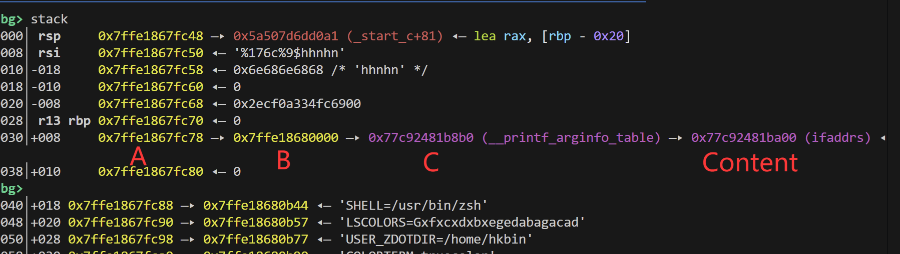
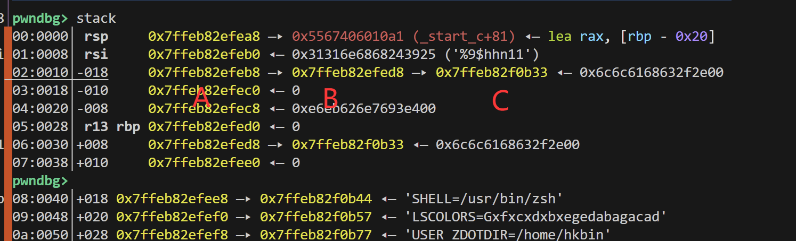
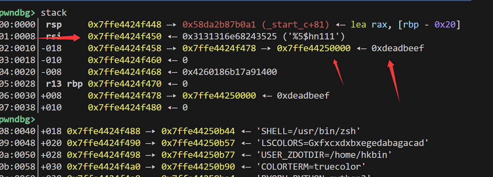
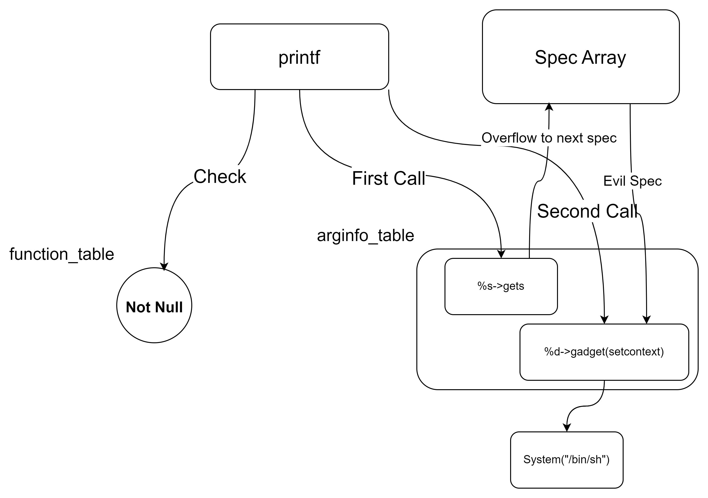

# Chuantongxiangyan WP

## 题目简述

题目是一个无限循环中的格式化字符串漏洞，目标是在循环内先获得任意写，再把任意写转化为 RCE。程序会反复读取格式串并调用 `printf`，栈上没有现成的三级指针链，因此需要借助 `argv` 和输入缓冲区手动搭出可用于 `%hn/%hhn` 的写链。

## 解题过程

第一步是构造任意写。格式化字符串任意写通常需要一条类似 `A -> B -> C` 的指针链，其中 C 是目标地址，先用 `%hhn/%hn` 改 C，再通过 B 向 C 指向的位置写值。但本题栈很干净，没有天然可用的三级链，只能借助 `argv` 和输入缓冲区手动搭链。

由于输入本身在栈上，可以把输入内容布置成新的指针节点：

难点在于格式串长度很紧。如果只用 `%hhn`，很难把 C 的最低字节从 `0x00` 调到 `0x08`。预期做法是配合 ASLR 爆破，并改用 `%hn`，例如 `%8c%4$hn`，寻找满足 `(argv & 0xffffffffffff0000) > input_buffer` 的运行状态。这样可以先稳定伪造 C 节点，再用同样方法伪造 D 节点。C 的值可控后，就能把 C 指到任意目标地址，实现逐字节任意写。

第二步是把任意写变成控制 RIP。题目没有开启 full RELRO，因此覆盖 `_exit@got` 是一种非预期路线。官方预期是借鉴 House of Husk，劫持 libc 中的 `__printf_arginfo_table` 与 `__printf_function_table`。

利用链如下：

1. 泄露 ELF、libc 和栈地址。
2. 通过任意写把 `__printf_arginfo_table` 指向可写区。
3. 为特定格式化 specifier 写入回调函数地址。
4. 第一次触发时让 `%A` 对应的回调跳到 `gets`，借助 `RDI` 指向的 Spec Array 写入伪造上下文。
5. 第二次触发时让 `%s` 对应的回调跳到 `setcontext + 68`，把前一步布置的寄存器状态转成 `system("/bin/sh")`。

触发格式串可以形如 `%A123%s`：第一个 specifier 负责写上下文，第二个 specifier 负责进入 `setcontext`。这样即使漏洞在无限循环中，也能在循环内完成控制流劫持。

## 方法总结

本题考察的是短格式串条件下的指针链构造和 House of Husk 的组合使用。先通过 `argv` 与栈上输入伪造 `A -> B -> C`，拿到任意写；再改写 `__printf_arginfo_table` / `__printf_function_table`，利用连续格式化 specifier 把一次 RIP 控制升级为可控寄存器上下文，最终执行 `system("/bin/sh")`。
