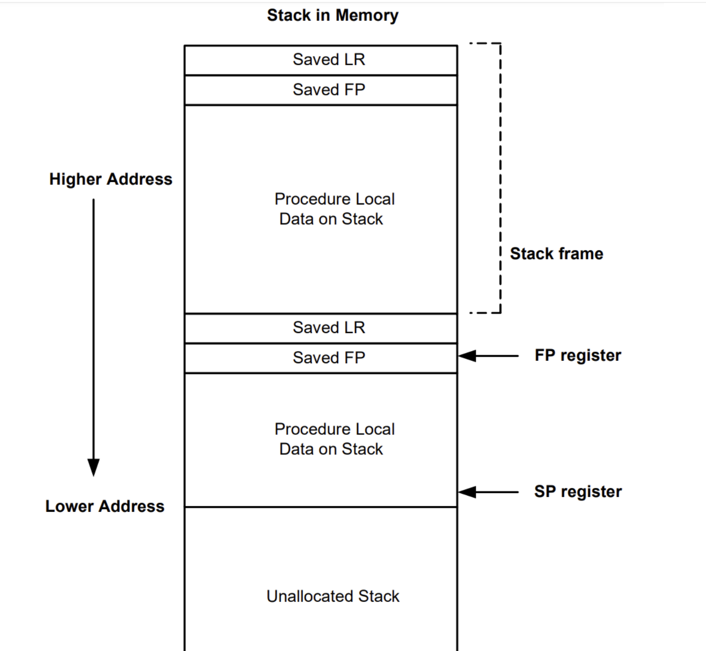
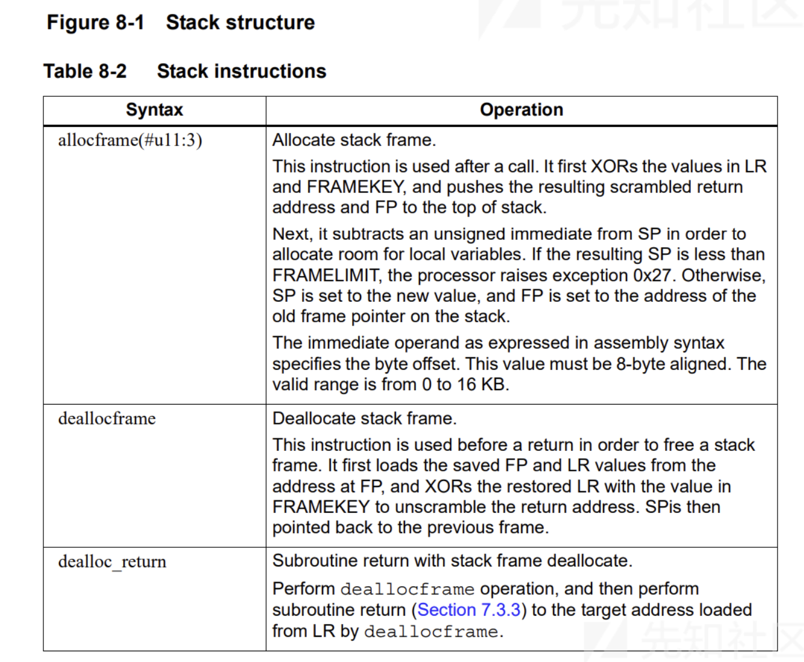
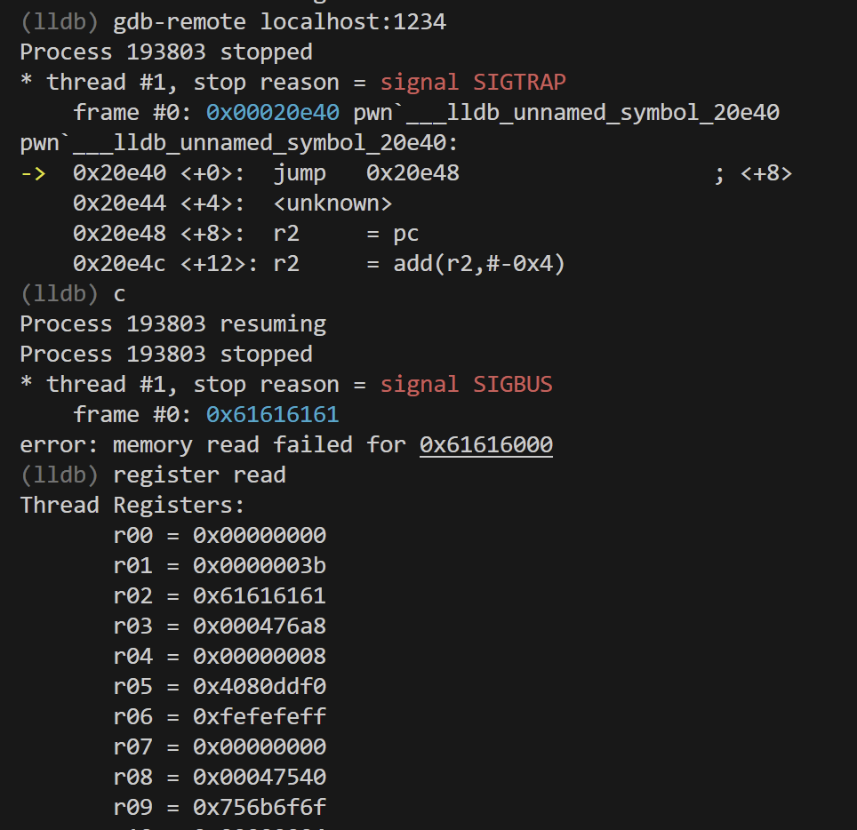

# Gate-Way WP

## 题目简述

题目是 Hexagon 架构 pwn，给出栈溢出原语，目标是在 Hexagon 下构造 ROP，最终执行 `execve("/bin/sh", NULL, NULL)`。解题重点是理解 Hexagon 的 SP/FP/LR、`dealloc_return` 栈帧恢复语义，以及如何把参数放入 R0/R1/R2/R6 后触发 `trap0(#1)`。

Hexagon 中 R29 是 SP，R30 是 FP，R31 是 LR。函数返回常见指令是 `dealloc_return`，它会同时销毁当前栈帧、恢复 FP/LR 并返回。



## 解题过程

先理解架构特性。Hexagon 的参数通常放在 R0、R1、R2 等寄存器中，部分指令用 `{ ... }` 包起来表示并行执行：



用 Hexagon 工具链反汇编后，可以找到两个关键 gadget。

第一个 gadget 从 SP 附近加载 R16 到 R19：

```asm
217e4: { r17:16 = memd(r29+#8); r19:18 = memd(r29+#0) }
217e8: { dealloc_return }
```

第二个 gadget 把 R16 到 R19 搬到 syscall 相关寄存器并触发 `trap0(#1)`：

```asm
214f4: { r0 = r16 }
214f8: { r1 = r17 }
214fc: { r2 = r18 }
21500: { r6 = r19 }
21504: { trap0(#1) }
```

利用栈溢出时，直接覆盖当前栈上的 FP/LR。思路是先跳到一个纯 `dealloc_return`，把 SP 迁移到全局可写缓冲区，再在该缓冲区布置伪造栈帧和寄存器值：

1. 溢出覆盖 FP 为 `data_buffer + 0x10`，LR 为 `dealloc_return`。
2. 第一层伪造栈帧把 LR 设置为加载 R16-R19 的 gadget。
3. 在新 SP 指向的位置放入 `r18=0`、`r19=221`、`r16="/bin/sh"`、`r17=0`。
4. 第二层伪造栈帧把 LR 设置为 syscall gadget。
5. 执行 `trap0(#1)`，其中 R6 为 syscall number 221，即 `execve`。

调试时可以用 `qemu-hexagon -d in_asm,exec,cpu,nochain,mmu -strace` 输出指令和寄存器状态；官方 WP 中也提到可以用 lldb 调试 Hexagon。



## 方法总结

这题的核心不是漏洞复杂度，而是换架构后的 ROP 习惯差异。Hexagon 的返回地址在 LR 中，`dealloc_return` 同时承担 x86-64 中 `leave; ret` 的效果。只要找到“从栈加载寄存器”和“把寄存器搬到 syscall 参数后 trap”的 gadget，就可以用常规栈迁移思路完成 exploit。
