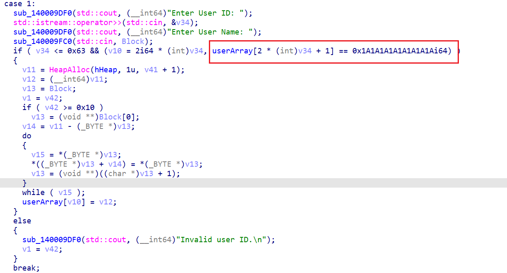
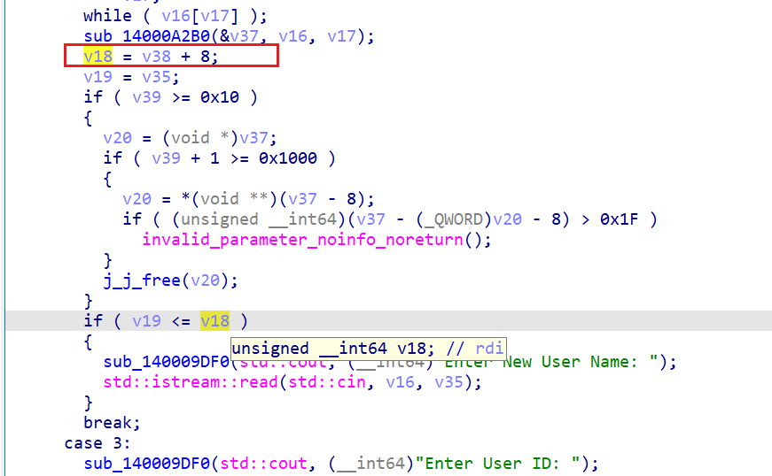
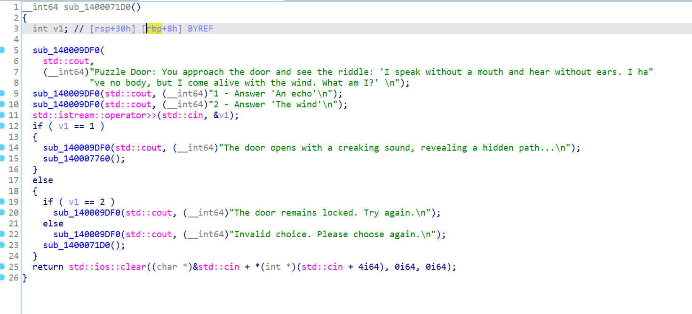
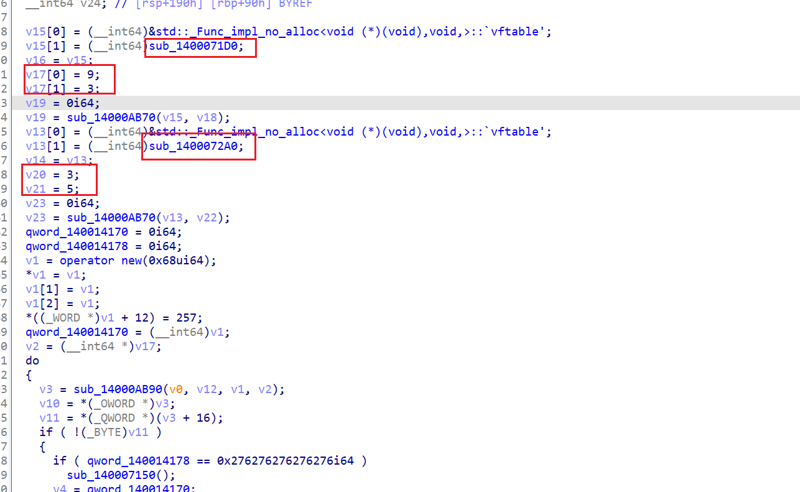
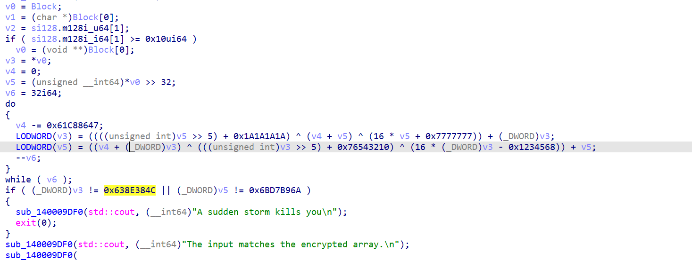
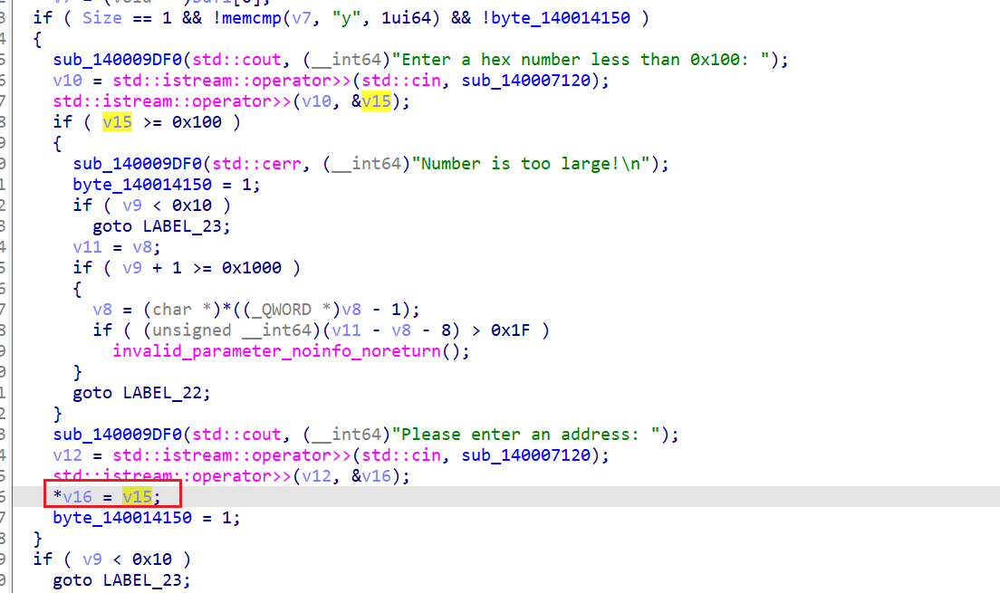
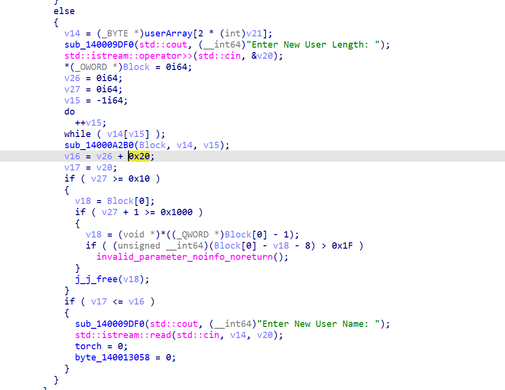
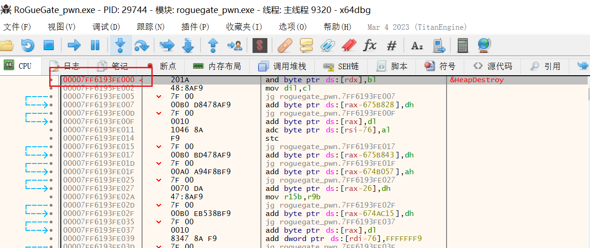

# RoGueGate

## 题目简述

题目是 Windows Pwn。程序创建私有 NT 堆并开启进程缓解策略，禁止创建子进程，因此最终需要走 ORW 或等价方式读 flag。主功能包含用户堆块管理和迷宫小游戏：堆块编辑存在逐次多写 8 字节的溢出，可结合 NT 堆 `unlink` 构造任意读写；迷宫中的 Puzzle Door 又提供一次小范围任意地址写能力，并泄露 `ucrtbase.dll` 与程序基址。

## 解题过程

IDA 分析表明程序创建的是 `NT` 堆，后续堆分配都来自 `hHeap`。

```C++
// 获取标准输出流(stdout)，并设置其缓冲策略为无缓冲
v11 = _acrt_iob_func(1u);
setvbuf(v11, 0i64, 4, 0i64);
// 获取标准输入流(stdin)，并设置其缓冲策略为无缓冲
v12 = _acrt_iob_func(0);
setvbuf(v12, 0i64, 4, 0i64);
// 获取标准错误流(stderr)，并设置其缓冲策略为无缓冲
v13 = _acrt_iob_func(2u);
setvbuf(v13, 0i64, 4, 0i64);
// 设置进程缓解策略，防止创建子进程，所以只能用ORW来进行读取flag
v16 = 1;
SetProcessMitigationPolicy(13i64, &v16);
// 创建堆，如果创建失败，输出错误消息并退出程序
hHeap = HeapCreate(1u, 0i64, 0i64);
if ( !hHeap )
{
  v14 = sub_140009DF0(std::cerr, (__int64)"Heap creation failed");
  std::ostream::operator<<(v14, sub_14000A1B0);
  exit(1);
}
```

进入 main 后可见程序先生成随机头部，然后让用户输入内容执行 sha512 运算，再将结果的前五位与给定值比对。这个比对用 Python 可快速穷举完成。

```python
import hashlib
def crack_sha512_5(sha_str):
    for num in range(10000,9999999999):
        res = hashlib.sha512(str(num).encode()).hexdigest()
        if res[0:5] == sha_str:
            print(str(num))
            return(str(num))
crack_sha512_5("95a64")
```

`startGame` 实现了六个主要功能：

```
Please choose an operation:
1. Create User  // 申请一个堆块。存储结构为一个数组，每个条目形如 `[flag, 地址]`。
2. Modify User  // 修改申请的堆块。读取时使用 `std::cin.read`，因此可读二进制流，但不能输入 `0x1a`，存在溢出。
3. Delete User  // 释放一个堆块。
4. Get User Name // 读取内存中的数据。
5. Into the forest!  // 进入迷宫。包含若干逆向分析点。
6. Exit
```

在操作堆块前存在一处检查，因为在 Windows 下 `0x1a` 表示 End of Text，输入 `0x1a` 会导致输入提前结束。




在编辑堆块时可以观察到，下一次分配长度为上一次已存字符串长度 + 8，即每次编辑都可以再额外多写 8 字节。




结合现有信息，可以泄露堆头、同时改写前向和后向指针并构造 `unlink`。但目前程序无法直接输入 `0x1a`，需要通过修改 `ucrtbase.dll` 中 `__pioinfo` 指针所指结构来实现。`__pioinfo` 指向的是 `__crt_lowio_handle_data` 结构体。

```C++
struct __declspec(align(8)) __crt_lowio_handle_data
{
  _RTL_CRITICAL_SECTION lock;
  __int64 osfhnd;
  __int64 startpos;
  unsigned __int8 osfile;  //修改为0x9
  __crt_lowio_text_mode textmode;
  char _pipe_lookahead[3];
  unsigned __int8 unicode : 1;
  unsigned __int8 utf8translations : 1;
  unsigned __int8 dbcsBufferUsed : 1;
  char mbBuffer[5];
};
```

进入迷宫后可确认这是一道走迷宫题。`w/a/s/d` 分别表示上、左、下、右。通过分析与调试可发现 `forest` 的引用中缺失了若干函数，再结合字符串可继续推进。



追踪引用可定位到注册事件的函数，并能把函数与坐标进行映射：分别是 `(x=9, y=3)` 与 `(x=3, y=5)`，借此隐藏该函数。



“Puzzle Door” 为答题取奖励的关卡。逆向分析后可以确认其为 TEA 加密流程。



将 `key = { 0x7777777, 0x1a1a1a1a1a, 0xfedcba98, 0x76543210 }` 和 `encrypted = { 0x638e384c, 0x6bd7b96a }` 带入 Python 解密，答题成功后可向任意地址写入小于 `0x100` 的整数。

```
def de_tea():
    v = [0x638e384c, 0x6bd7b96a]
    k = [0x7777777, 0x1a1a1a1a, 0xfedcba98, 0x76543210]
    v = decrypt(v, k)  #77696E5F70776E5F
    def int_to_hex_to_string(i):
        hex_value = format(i, 'x')
        bytes_obj = bytes.fromhex(hex_value)
        return bytes_obj.decode()
    s_back = int_to_hex_to_string(v[0])
    print(s_back[::-1])
    s_back = int_to_hex_to_string(v[1])
    print(s_back[::-1])
#win_pwn_
```



`ask_creature` 函数中，可以发现是`ucrtbase.dll`和程序的基址。同时获得一次大于0x20的读写。



到此为止的思路如下：

1. 申请五个堆块，释放第 2 个和第 4 个。
2. 泄露基址的同时，改写堆块 #2 的头部构造 `unlink`，使得 #2 指针指向其自身指针存储位置。
3. `unlink` 构造完成后改写 `__crt_lowio_handle_data` 结构中的 `osfile`。
4. 覆写后可改写堆块 #3 指针存储，实现任意地址读写。

另一种做法是在获得 `unlink` 后不走迷宫分支，而直接返回主线并改写其他数组中的指针，让其指向相邻可控地址。

获得任意读写后，可通过导入表泄露其他模块地址，由此再泄露 `ntdll` 基址，进而得到栈地址。



## 方法总结

- 核心技巧：Windows NT 堆溢出构造 `unlink`，再配合迷宫奖励写入和 `__crt_lowio_handle_data.osfile` 绕过 `0x1a` 输入限制，最终建立任意读写。
- 识别信号：Windows 程序使用 `HeapCreate` 私有堆、堆块表保存 `[flag, 地址]`、编辑长度按旧字符串长度增长时，应检查堆头覆盖和 `unlink`。
- 复用要点：Windows Pwn 要同时关注 CRT 输入状态、进程缓解策略和 DLL 基址泄露；不能只按 Linux heap 思路看堆块。
