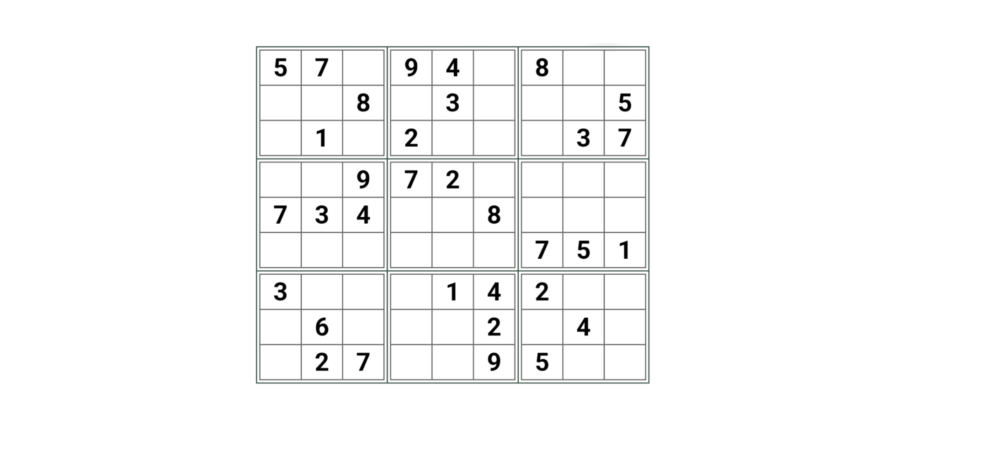
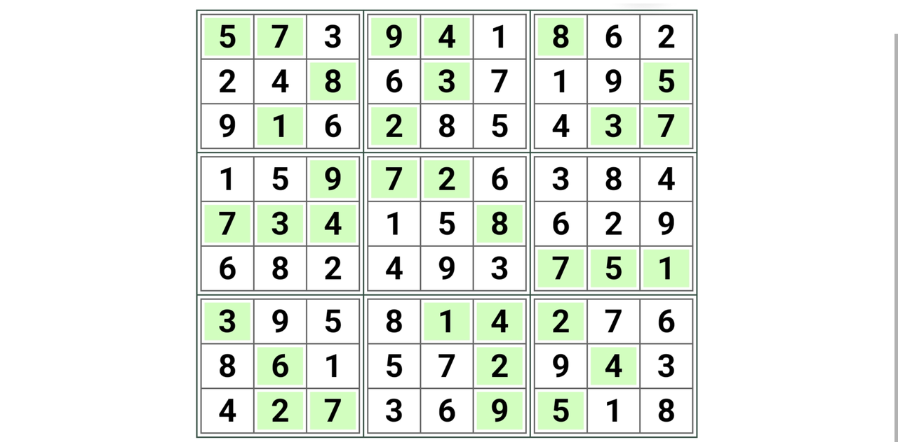

# LittlePuzzle

## 题目简述

附件 `Puzzle.jar` 内只有一个主要类。反编译后可见静态字段 `board` 是 $9\times9$ 数组，`check(row, col)` 分别检查行、列和 $3\times3$ 宫，说明题目本质是数独。程序要求按从上到下、从左到右的顺序，只输入原棋盘中空格位置的数字。

## 解题过程

从类的静态初始化代码恢复棋盘，0 表示待填位置：

```text
5 7 0 | 9 4 0 | 8 0 0
0 0 8 | 0 3 0 | 0 0 5
0 1 0 | 2 0 0 | 0 3 7
------+-------+------
0 0 9 | 7 2 0 | 0 0 0
7 3 4 | 0 0 8 | 0 0 0
0 0 0 | 0 0 0 | 7 5 1
------+-------+------
3 0 0 | 0 1 4 | 2 0 0
0 6 0 | 0 0 2 | 0 4 0
0 2 7 | 0 0 9 | 5 0 0
```



可以用回溯搜索求唯一解，同时按原棋盘的空位顺序生成程序所需输入：

```python
board = [
    [5, 7, 0, 9, 4, 0, 8, 0, 0],
    [0, 0, 8, 0, 3, 0, 0, 0, 5],
    [0, 1, 0, 2, 0, 0, 0, 3, 7],
    [0, 0, 9, 7, 2, 0, 0, 0, 0],
    [7, 3, 4, 0, 0, 8, 0, 0, 0],
    [0, 0, 0, 0, 0, 0, 7, 5, 1],
    [3, 0, 0, 0, 1, 4, 2, 0, 0],
    [0, 6, 0, 0, 0, 2, 0, 4, 0],
    [0, 2, 7, 0, 0, 9, 5, 0, 0],
]
original = [row[:] for row in board]

def solve() -> bool:
    for row in range(9):
        for col in range(9):
            if board[row][col] != 0:
                continue

            for value in range(1, 10):
                box_row = row // 3 * 3
                box_col = col // 3 * 3
                valid = (
                    value not in board[row]
                    and all(board[i][col] != value for i in range(9))
                    and all(
                        board[i][j] != value
                        for i in range(box_row, box_row + 3)
                        for j in range(box_col, box_col + 3)
                    )
                )
                if valid:
                    board[row][col] = value
                    if solve():
                        return True
                    board[row][col] = 0
            return False
    return True

assert solve()

answer = "".join(
    str(board[row][col])
    for row in range(9)
    for col in range(9)
    if original[row][col] == 0
)
print(answer)
```

唯一解为：

```text
5 7 3 | 9 4 1 | 8 6 2
2 4 8 | 6 3 7 | 1 9 5
9 1 6 | 2 8 5 | 4 3 7
------+-------+------
1 5 9 | 7 2 6 | 3 8 4
7 3 4 | 1 5 8 | 6 2 9
6 8 2 | 4 9 3 | 7 5 1
------+-------+------
3 9 5 | 8 1 4 | 2 7 6
8 6 1 | 5 7 2 | 9 4 3
4 2 7 | 3 6 9 | 5 1 8
```



程序实际需要输入 48 个空位数字，而不是完整的 81 位棋盘：

```text
316224671996854156384156296824939587681579343618
```

验证通过后，程序内部的 `flag()` 对该答案串做变换并输出：

```text
0xGame{4d340a40fcd088c5dc9c48778e5643a666b53e42}
```

## 方法总结

逆向谜题时应先识别数据结构和校验语义，再决定是否需要逐指令分析。本题的行、列、宫检查已经充分表明它是数独；真正容易出错的是输入格式——主函数只消费原棋盘中值为 0 的位置，提交完整棋盘反而不会通过。
