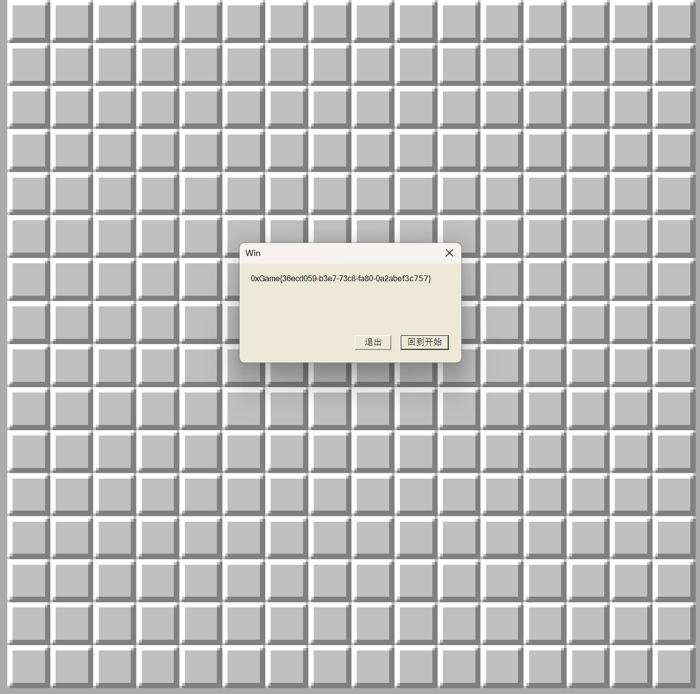

# MineSweeper

## 题目简述

题目是一个未启用 IL2CPP 的 Unity 扫雷游戏，核心逻辑位于 `Minesweeper_Data/Managed/Assembly-CSharp.dll`。`Game.Update` 在胜利条件成立后调用 `Game.crypt`，以资源文件中的 44 字节密文生成 flag。

源码与资源交叉检查后可以确认：

- `Game.key` 为 `0xoX0XOxOXoxGAME`，用于控制下标置换；
- `Game.haha` 为 `This is: True_KEY!for #0xgAmE_Unity~Cryption`，是被置换的 44 字节异或密钥；
- `Resources.Load<TextAsset>("enc")` 读取 `resources.assets` 中名为 `enc` 的资源，程序只使用其前 44 字节；
- 解密逻辑只是一次密钥置换后逐字节异或，并不是完整的 RC4。

## 解题过程

用 dnSpy 或 ILSpy 打开 `Assembly-CSharp.dll`，定位 `Game.crypt(byte[] Key)`。函数先令 `j = 0`，再对前 44 个密钥字节执行：

```text
j = (j + Game.key[i % Game.key.Length]) % 44
swap(Key[i], Key[j])
```

置换结束后，函数从后向前计算 `result[i] ^= Key[i]`。异或的遍历方向不影响每个位置的结果，因此可直接按正序还原。资源中的密文为：

```text
45213e085731094d424542445d5a4b4b5256164466456c405744333551750d581571111b0b0876044f5c683c
```

据此编写静态解密脚本：

```python
schedule = b"0xoX0XOxOXoxGAME"
key = bytearray(b"This is: True_KEY!for #0xgAmE_Unity~Cryption")
cipher = bytes.fromhex(
    "45213e085731094d424542445d5a4b4b"
    "5256164466456c405744333551750d58"
    "1571111b0b0876044f5c683c"
)

j = 0
for i in range(44):
    j = (j + schedule[i % len(schedule)]) % 44
    key[i], key[j] = key[j], key[i]

flag = bytes(cipher[i] ^ key[i] for i in range(44))
print(flag.decode())
```

运行结果为：

```text
0xGame{36ecd059-b3e7-73c8-fa80-0a2abef3c757}
```

也可以直接修改游戏逻辑触发原有输出路径。例如把新游戏的雷数改为 `0`、强制令 `gamewin = true`，或者在 `Update` 中直接调用：

```csharp
CustomMessageBox.Show(
    this.crypt(Encoding.ASCII.GetBytes(Game.haha)),
    "Win"
);
```

重新编译并运行后，游戏会弹出同一结果：



## 方法总结

Unity Mono 题应优先检查 `Assembly-CSharp.dll`，再沿胜利条件追踪最终输出函数。本题的关键不是通关扫雷，而是识别 `crypt` 中“固定下标置换 + 固定密文异或”的可逆过程。静态还原能完整验证算法；修改胜利条件则适合作为动态交叉验证。
