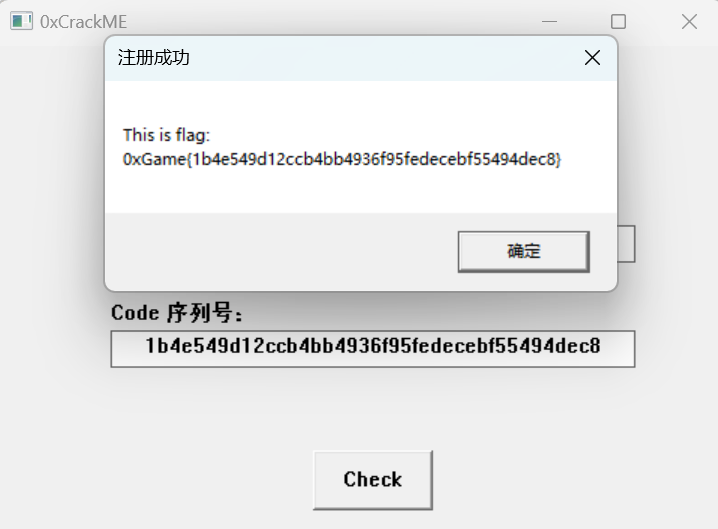

# Register

## 题目简述

题目是一个 32 位 Windows GUI crackme，要求输入指定用户名及其序列号。程序将用户名经过按字节异或后计算 SHA-1，并把十六进制摘要作为正确序列号；flag 则是在该摘要外套上 `0xGame{}`。

## 解题过程

运行程序可以看到用户名与序列号输入框。逆向时可在 IDA 中交叉引用窗口标题 `0xCrackMe` 定位 `WinMain`，再沿注册的 `lpfnWndProc` 找到窗口回调函数。也可以直接交叉引用子窗口相关字符串，定位负责校验的 `sub_411B10`，随后进入核心函数 `sub_4112DA`。

校验逻辑可整理为以下三步：

1. 用户名必须严格等于 `0xGameUser`，从而排除其他输入产生的多解；
2. 程序计算 `time(NULL) >> 28`，并把结果作为单字节异或值；
3. 对用户名的每个字节执行异或，再计算 SHA-1，最终把 40 个小写十六进制字符与序列号输入比较。

这里不能笼统地把时间值称为“永远固定”。在 2024 年比赛环境对应的 Unix 时间区间内，`time(NULL) >> 28` 的值为 `6`，因此预期异或掩码是 `0x06`。如果在跨越该时间区间的系统上重新运行原程序，动态校验值可能变化，但比赛所需 flag 仍应按题目发布时的值计算。

还原脚本如下：

```python
import hashlib

username = b"0xGameUser"
mask = 6
xored = bytes(value ^ mask for value in username)
serial = hashlib.sha1(xored).hexdigest()

print(xored)
print(serial)
print(f"0xGame{{{serial}}}")
```

中间值与最终结果为：

```text
异或后：b'6~AgkcSuct'
SHA-1：1b4e549d12ccb4bb4936f95fedecebf55494dec8
flag：0xGame{1b4e549d12ccb4bb4936f95fedecebf55494dec8}
```

将该 SHA-1 摘要作为序列号提交，程序会进入注册成功分支：



## 方法总结

Win32 GUI crackme 可从窗口标题、控件文本和消息回调的交叉引用快速定位校验函数。本题的关键是准确还原“指定用户名 → 时间高位异或 → SHA-1”的数据流，并认识到 `time(NULL) >> 28` 只是长时间内保持不变，而不是数学意义上的常量。记录完整中间值可以避免把时间因子、摘要编码或大小写处理写得含糊。
