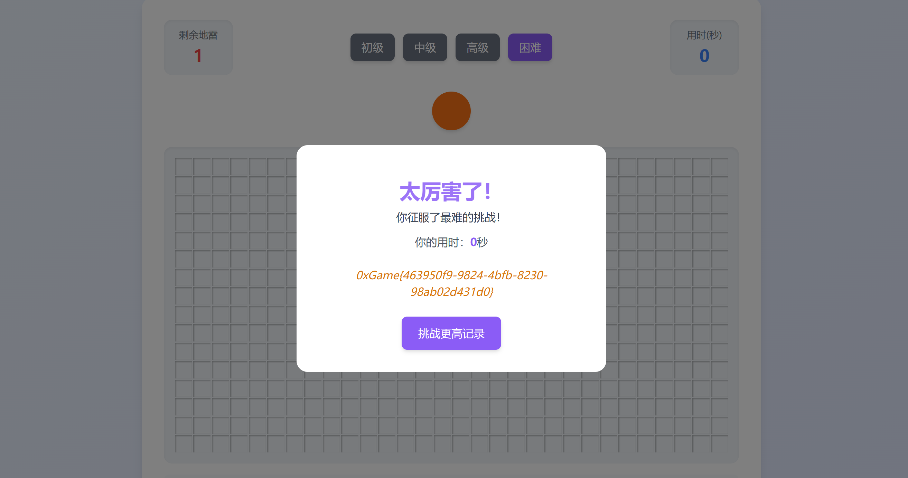

# Minesweeper

## 题目简述

附件是一个本地扫雷网页，由 `minesweeper.html` 加载混淆后的 `ms_obfus.js`。普通难度获胜只显示用时，只有 `expert`（界面中的“困难”）难度会进入 flag 解码分支。

题目的关键并不是完整还原所有变量名，而是找到仍以对象字面量保存的难度参数、胜利条件和困难模式弹窗函数。把困难模式的雷数从 300 改成 1，就能快速触发真实胜利逻辑；flag 本身由一段字节串和固定文本循环异或得到。

## 解题过程

### 1. 修改困难模式的雷数

`ms_obfus.js` 中的难度配置没有被隐藏：

```javascript
const difficulty = {
    easy: { rows: 0x9, cols: 0x9, mines: 0xA },
    medium: { rows: 0x10, cols: 0x10, mines: 0x28 },
    hard: { rows: 0x10, cols: 0x1E, mines: 0x63 },
    expert: { rows: 0x10, cols: 0x1E, mines: 0x12C },
};
```

其中 `expert` 是 $16\times30$ 棋盘，`0x12C=300`。只需把这一项改为 `0x1`：

```javascript
expert: { rows: 0x10, cols: 0x1E, mines: 0x1 },
```

无需同时修改其他三个难度，因为 flag 分支明确要求当前难度为 `expert`。

第一次点击时，布雷函数会排除点击格周围 $3\times3$ 的区域，然后才随机放雷。因此只剩一个雷时，首次点击必定安全，空白区域的递归展开通常会立即揭开全部非雷格。

### 2. 确认胜利与 flag 分支

胜利检查的等价逻辑为：

```javascript
const safeCells = game.rows * game.cols - game.mines;
let revealedSafeCells = 0;

for (let row = 0; row < game.rows; row++) {
    for (let col = 0; col < game.cols; col++) {
        if (game.revealed[row][col] && game.board[row][col] !== "M") {
            revealedSafeCells++;
        }
    }
}

if (revealedSafeCells === safeCells) {
    finishGame(true);
}
```

而胜利处理函数只有在 `currentDifficulty === "expert"` 时才调用困难模式弹窗。弹窗又调用 flag 生成函数：取内置的 44 字节数据，与普通胜利提示中的 `message2`——`WebIsInteresting`——按索引循环异或。

不运行网页也可以直接解码：

```python
encoded = bytes.fromhex(
    "671d25281e2c154053415c46440f574a6e5d507d5e7d0c12075f5d414759435e"
    "6f040079412d5a475416550e"
)
key = b"WebIsInteresting"

flag = bytes(
    value ^ key[index % len(key)]
    for index, value in enumerate(encoded)
).decode()

print(flag)
```

输出：

```text
0xGame{463950f9-9824-4bfb-8230-98ab02d431d0}
```

若按网页路线操作，修改脚本后重新加载页面，选择“困难”并点击棋盘，也会显示同一结果：



## 方法总结

本题的最短路径是“定位明文配置 → 只降低困难模式雷数 → 触发原生胜利分支”。面对前端混淆时，不必一开始就追求完整反混淆；配置对象、关键字符串和分支比较往往仍能直接暴露控制点。

同时要继续追踪结果的生成方式，而不能只停在界面截图。这里的 flag 不是硬编码明文，而是用 `WebIsInteresting` 对 44 字节常量循环异或；把这一过程写成独立脚本后，即使浏览器环境或外部 CDN 不可用，也能离线复现最终答案。
