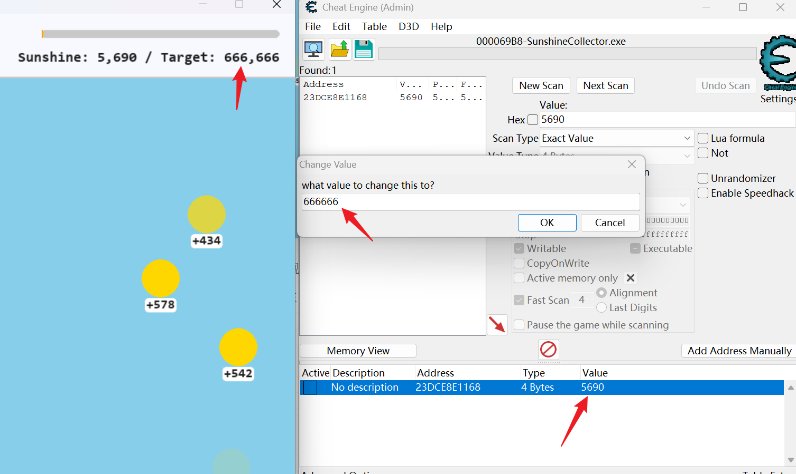

# 收集阳光吧

## 题目简述

附件 `SunshineCollector.exe` 是一个由 Pygame 编写并通过 PyInstaller 打包的小游戏。玩家点击太阳后，每次会随机增加 200～800 点阳光；当阳光值达到 `666666` 时，程序进入胜利状态并显示 flag。

本题有两条直接的解题路线：一是使用 Cheat Engine 修改运行时的阳光值；二是脱去 UPX、提取 PyInstaller 主模块并还原固定异或解密逻辑。后一条路线可以不依赖游戏状态，直接静态恢复真实 flag。

## 解题过程

### 方法一：修改运行时阳光值

启动游戏后，在 Cheat Engine 中附加到 `SunshineCollector.exe`，按当前界面显示的阳光值进行“精确数值、4 Bytes”首次扫描。点击几次太阳，使数值发生变化，再用新值继续扫描，即可逐步缩小到保存 `SUNSHINE` 的内存位置。



把该位置改为 `666666` 后，再点击一次太阳触发 `check_win()`；也可以在数值达到目标后按 `Ctrl+Shift+F`，直接进入胜利状态。地址受 ASLR 和每次运行的对象分配影响，因此应按数值变化重新扫描，不要把某次运行得到的地址当作固定地址。

### 方法二：静态提取并解密

先对附件脱壳，再从 PyInstaller 包中提取 Python 字节码：

```bash
upx -d SunshineCollector.exe -o SunshineCollector-unpacked.exe
pyinstxtractor-ng SunshineCollector-unpacked.exe
pydisasm SunshineCollector-unpacked.exe_extracted/main.pyc > main.dis
```

`main.pyc` 中的 `GameState` 保存了目标值、密文块和构造密钥所需的三个常量：

```python
SUNSHINE = 0
TARGET = 666666
KEY_BASE_A = 170
KEY_BASE_B = 174
KEY_XOR_CONST = 213
FAKE_FLAG = "1xGame{Th1s_1s_4_F4k3_Flag_try_a_new_way}"
```

`calculate_key()` 的等价逻辑为：

```python
key_sum = KEY_BASE_A + KEY_BASE_B
final_key = (key_sum & 0xff) ^ KEY_XOR_CONST
```

因此密钥为 $((170+174)\bmod 256)\oplus 213=141=0x8d$。`decrypt_flag()` 依次遍历七个密文块，将每个字节与该密钥异或，再按 UTF-8 解码。完整恢复脚本如下：

```python
encrypted_blocks = [
    b"\xbd\xf5\xca\xec\xe0\xe8\xf6\xce\xbd\xe1",
    b"\xe1\xe8\xee\xf9\xe4\xe3\xea\xd2\xde\xf8",
    b"\xc3\xfe\xe5\xe4\xe3\xe8\xd2\xbc\xfe\xd2",
    b"\xeb\xf8\xe3\xe3\xf4\xb2\xd4\xbd\xf8\xd2",
    b"\xfa\xbc\xe1\xe1\xd2\xea\xe8\xf9\xd2\xde",
    b"\xf8\xe3\xe3\xf4\xd2\xe8\xfb\xe8\xff\xf4",
    b"\xe9\xec\xf4\xf0",
]

key = ((170 + 174) & 0xff) ^ 213
flag = b"".join(
    bytes(value ^ key for value in block)
    for block in encrypted_blocks
).decode("utf-8")
print(flag)
```

运行后得到：

```text
0xGame{C0llecting_SuNshine_1s_funny?Y0u_w1ll_get_Sunny_everyday}
```

程序中虽然存在 `FAKE_FLAG` 常量，但胜利弹窗调用的是 `decrypt_flag()`；这个假 flag 只是干扰项，不参与真实 flag 的生成和显示。

## 方法总结

动态路线利用了客户端本地保存胜利计数、且没有完整性校验的问题，修改阳光值即可满足判定；静态路线则利用 UPX、PyInstaller 和 Python 字节码特征定位主模块，再按程序原有逻辑解密密文。遇到类似本地小游戏时，应同时检查运行时状态是否可改，以及打包资源中是否直接包含可逆的 flag 生成逻辑。
