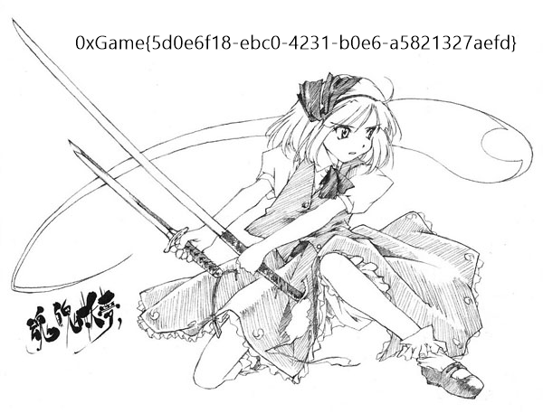

# 云消雾散

## 题目简述

题目给出一个 64 位 Windows 程序 `img.exe` 和一张无法正常辨认内容的 `enc.bmp`。程序没有使用标准 RC4：它只借用了 RC4 的 S 盒初始化和状态更新方式，随后直接交换图像数据中的字节位置，并未生成密钥流与数据异或。因此，恢复图片的关键是准确逆转每一次位置交换，同时保留程序未处理的文件前缀和尾部数据。

## 解题过程

### 确认文件布局与固定密钥

在程序字符串中可以直接找到固定密钥：

```text
114514puiqneravcixpbhqn;afnv-92piwgspdifjv
```

解析 `enc.bmp` 可得：文件总长为 823678 字节，图像宽 600、高 -457、位深 24 位。负高度说明像素行按自顶向下顺序保存。程序连续原样读取并写回 `0x0e`、`0x28`、`0x400` 字节，即保留前 $14+40+1024=1078$ 字节，随后才处理剩余数据。剩余长度恰好为：

$$
600\times457\times3=822600
$$

需要注意，BMP 头中的 `bfOffBits` 实际为 54，而且该图是 24 位真彩色图，不能仅凭通用 BMP 格式把额外的 1024 字节解释成调色板。这里保留 1078 字节，是由程序的实际读写逻辑决定的。

### 还原自定义置换

算法先初始化 `S[0..255]`，再进行一轮类似 RC4 KSA 的置换。数据处理阶段每次先更新 `i`、`j` 并交换 `S[i]` 与 `S[j]`，然后交换当前 256 字节分组内偏移为 `i`、`j` 的两个数据字节。循环上界是 `len / 256 * 256`，所以只处理完整分组：

$$
\left\lfloor\frac{822600}{256}\right\rfloor\times256=822528
$$

最后 72 字节没有参与置换，必须原样保留。逆变换时，先只更新 S 盒直到加密末状态，再从最后一次循环向前回退：先撤销数据交换，再撤销 S 盒交换，最后反推上一轮的 `j` 和 `i`。

完整恢复脚本如下：

```python
from pathlib import Path

KEY = b"114514puiqneravcixpbhqn;afnv-92piwgspdifjv"
PREFIX_SIZE = 0x0E + 0x28 + 0x400


def initialize_sbox(key: bytes) -> list[int]:
    sbox = list(range(256))
    i = 0
    j = 0
    for _ in range(256):
        i = (i + 1) & 0xFF
        j = (j + sbox[i] + key[i % len(key)]) & 0xFF
        sbox[i], sbox[j] = sbox[j], sbox[i]
    return sbox


def undo_permutation(data: bytearray, key: bytes) -> None:
    sbox = initialize_sbox(key)
    processed = len(data) // 256 * 256

    # 先把状态推进到加密结束时的 i、j 和 S 盒。
    i = 0
    j = 0
    for _ in range(processed):
        i = (i + 1) & 0xFF
        j = (j + sbox[i]) & 0xFF
        sbox[i], sbox[j] = sbox[j], sbox[i]

    # 按相反顺序撤销每一轮的两次交换和状态更新。
    for k in range(processed - 1, -1, -1):
        base = k // 256 * 256
        data[base + i], data[base + j] = data[base + j], data[base + i]
        sbox[i], sbox[j] = sbox[j], sbox[i]
        j = (j - sbox[i]) & 0xFF
        i = (i - 1) & 0xFF


source = Path("enc.bmp")
target = Path("dec.bmp")
blob = source.read_bytes()

if len(blob) != 823678:
    raise ValueError(f"unexpected enc.bmp size: {len(blob)}")

prefix = blob[:PREFIX_SIZE]
payload = bytearray(blob[PREFIX_SIZE:])
undo_permutation(payload, KEY)
target.write_bytes(prefix + payload)
print(f"wrote {target} ({target.stat().st_size} bytes)")
```

运行后得到可以正常显示的 `dec.bmp`，图片顶部直接给出了 flag：



```text
0xGame{5d0e6f18-ebc0-4231-b0e6-a5821327aefd}
```

## 方法总结

看到 RC4 风格的 S 盒更新时，不能默认算法一定会生成密钥流并执行异或；本题真正的数据操作是分组内的位置交换。逆置换必须从末状态倒序撤销，并严格复现循环边界。处理图片时也应以程序的真实文件读写为准：本题固定保留 1078 字节、仅处理 822528 字节，余下 72 字节不变，这些边界条件缺一不可。
