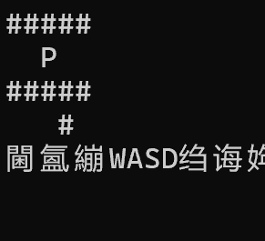
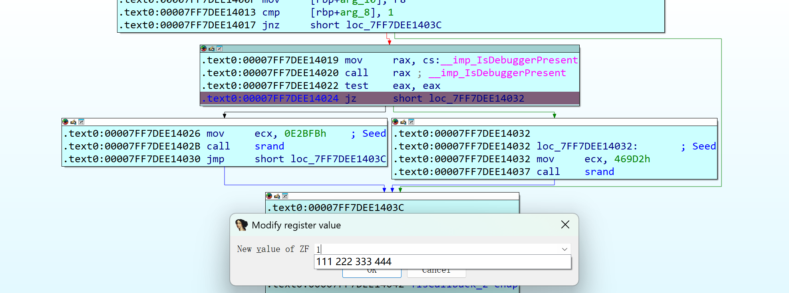
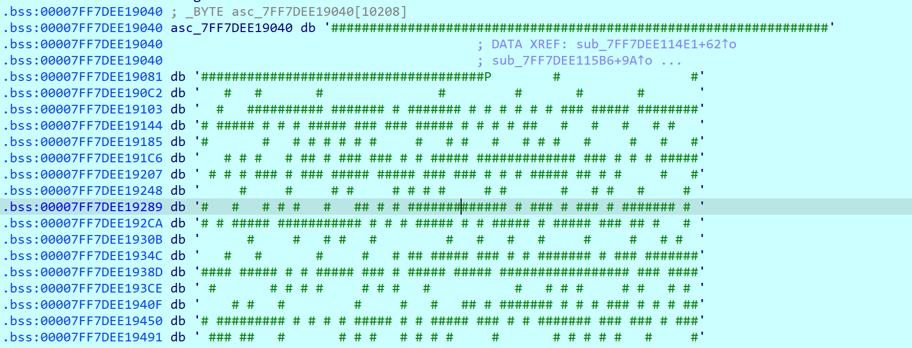

# 夜雀之歌

## 题目简述

附件是一个 Windows 控制台迷宫程序，使用 `WASD` 移动，但界面只显示玩家周围的一小块区域，无法直接观察完整路线。程序在初始化阶段调用 `IsDebuggerPresent`：无调试器时以 `0x469D2` 初始化 `rand()`，检测到调试器时则改用 `0xE2BFB`，从而生成另一张假地图。真实地图是 `101 × 101` 的字符数组，起点为 `P`，终点为 `E`；最终 flag 是真实地图最短路径小写字符串的 MD5。

## 解题过程

### 定位反调试造成的地图差异

正常运行时只能看到局部迷宫：



调试前后起点附近的墙体不同，说明地图生成依赖会被调试环境改变的状态。导入表中存在 `IsDebuggerPresent`，其调用后的分支为：

```c
if (IsDebuggerPresent())
    srand(0xE2BFB);  // 调试器下的假地图
else
    srand(0x469D2);  // 正常运行时的真实地图
```



在 `test eax, eax` 后把 ZF 改为 `1`，即可强制进入 `jz` 指向的无调试器分支；静态补丁让 `IsDebuggerPresent` 返回 `0` 也能达到同样效果。关键不是简单跳过检测，而是必须让后续 `srand()` 使用真实种子 `0x469D2`，否则导出的仍是另一张合法但错误的迷宫。

### 导出完整真实地图

继续运行到地图生成结束，交叉引用可定位保存迷宫的全局缓冲区。缓冲区分配了 `10208` 字节，其中前 $101 \times 101 = 10201$ 字节是按行连续存储的地图，字符含义为：

```text
#  墙
空格  可行走区域
P  起点
E  终点
```



从该全局变量起始地址保存前 `10201` 字节为 `maze.bin`。按 101 字节一行切分后，可确认起点坐标为 `(1, 1)`，终点坐标为 `(99, 99)`；坐标均按从零开始的 `(row, column)` 表示。

### BFS 求最短路径并计算 flag

用 BFS 记录每个格子的前驱和进入方向。以下脚本直接读取调试器导出的原始缓冲区，不需要在 WP 中保存一万余字节的低价值地图常量：

```python
from collections import deque
from hashlib import md5
from pathlib import Path

HEIGHT = 101
WIDTH = 101

raw = Path("maze.bin").read_bytes()
if len(raw) < HEIGHT * WIDTH:
    raise ValueError("maze dump is shorter than 101 * 101 bytes")

maze = [
    raw[row * WIDTH : (row + 1) * WIDTH].decode("ascii")
    for row in range(HEIGHT)
]


def find(marker):
    for row, line in enumerate(maze):
        column = line.find(marker)
        if column != -1:
            return row, column
    raise ValueError(f"marker {marker!r} not found")


start = find("P")
end = find("E")
assert start == (1, 1)
assert end == (99, 99)

# 与题解使用的顺序一致：上、下、左、右。
directions = [
    (-1, 0, "w"),
    (1, 0, "s"),
    (0, -1, "a"),
    (0, 1, "d"),
]

queue = deque([start])
parent = {start: (None, None)}

while queue:
    row, column = queue.popleft()
    if (row, column) == end:
        break

    for dr, dc, move in directions:
        neighbor = row + dr, column + dc
        nr, nc = neighbor
        if not (0 <= nr < HEIGHT and 0 <= nc < WIDTH):
            continue
        if maze[nr][nc] == "#" or neighbor in parent:
            continue
        parent[neighbor] = ((row, column), move)
        queue.append(neighbor)

if end not in parent:
    raise RuntimeError("no path from P to E")

moves = []
current = end
while current != start:
    current, move = parent[current]
    moves.append(move)

path = "".join(reversed(moves))
digest = md5(path.encode()).hexdigest()

print(f"path length: {len(path)}")
print(f"path md5: {digest}")
print(f"0xGame{{{digest}}}")
```

输出为：

```text
path length: 1536
path md5: f971495b0d9d053566abab04f0d6f98c
0xGame{f971495b0d9d053566abab04f0d6f98c}
```

1536 步路径中，$s-w=98$、$d-a=98$，也与从 `(1, 1)` 移动到 `(99, 99)` 的净位移一致。因此 flag 为 `0xGame{f971495b0d9d053566abab04f0d6f98c}`。

## 方法总结

本题的核心不是手动走迷宫，而是识别反调试对随机种子的影响。遇到“正常运行和调试时数据不同”的程序，应检查 `IsDebuggerPresent`、时间、随机种子及初始化回调，并确保绕过后走的是正常分支，而不是只让程序不退出。对于只显示局部视野的迷宫，直接从全局缓冲区导出完整布局，再用 BFS 求路径；超长地图和路径不必堆进 WP，只需保留数据格式、导出范围、搜索规则和可验证的长度与哈希。
