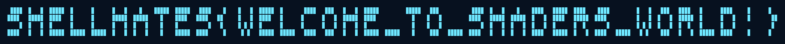

# BSidesAlgiers2025 - Perspective

## 题目简述

题目只提供一个静态链接的 Go x86-64 程序 `perspective`，并提示“要从不同角度观察”以及 flag 全部使用大写。程序并不直接保存明文 flag：它读取一组四维 `float32` 向量，依次施加两轮随机矩阵、一次随机缩放和一次随机平移，再用类 XTEA 算法加密序列化结果，最后与程序内置的目标字节串比较。

仓库没有官方解题脚本，因此本题需要从二进制中还原完整的正向管线，然后按相反顺序恢复几何数据。决定性障碍不是猜字符串，而是同时复现 Go 的 `math/rand` 序列、逆转浮点变换，并从恢复出的三维体素中选择正确投影。

## 解题过程

### 1. 定位目标数据与输入格式

逆向 `main.main` 后可以确认，程序将输入每 16 字节解释为四个小端 `float32`，即一个向量 $(x,y,z,w)$。内置目标切片长 `0xd000` 字节，对应：

$$
\frac{0xd000}{16}=3328
$$

个四维向量。目标切片的数据位于 ELF 文件偏移 `0x1832c0`，因此可直接从二进制中取出 `0xd000` 字节，无需让程序进入正常校验流程。

程序对每个向量执行的正向顺序如下：

1. 使用种子 `1337` 生成每个向量对应的第一轮状态矩阵并左乘向量；
2. 使用种子 `4242` 生成缩放量 $s=\operatorname{Float32}()+0.5$，将前三个分量乘以 $s$；
3. 使用种子 `9999` 生成第二轮状态矩阵并左乘向量；
4. 使用种子 `7777` 为前三个分量分别加上 $5\times\operatorname{Float32}()$；
5. 将结果按小端 `float32` 序列化，再按 8 字节一组加密。

每个状态矩阵先初始化为 $4\times4$ 单位矩阵，然后设置：

$$
M_{0,1}=0.2r_0,\quad M_{1,2}=0.2r_1,\quad M_{2,0}=0.2r_2
$$

以及：

$$
M_{0,0}=0.8+r_3,\quad M_{1,1}=0.8+r_4,\quad M_{2,2}=0.8+r_5
$$

其中 $r_i$ 是由该矩阵自己的 Go 随机数生成器产生的 `Float32()`。外层种子 `1337` 或 `9999` 先逐包生成一个 `Int63()`，这个值才是对应矩阵的内部种子。若直接用 Python 标准库的随机数生成器替代，输出序列不会一致。

### 2. 解密内置目标

末层算法是 32 轮类 XTEA 结构，密钥四个 `uint32` 分量为：

```text
[5555, 0, 0xDEADAB5C, 0xCAFEBABE]
```

轮常量为 `0x9e3779b9`。对每个 8 字节分组按小端读取 `v0`、`v1`，从 `sum = 0xc6ef3720` 开始逆转 32 轮：

```go
func xteaDecrypt(v0, v1 uint32) (uint32, uint32) {
	const delta = uint32(0x9e3779b9)
	key := [4]uint32{5555, 0, 0xdeadab5c, 0xcafebabe}
	sum := uint32(0xc6ef3720)
	for i := 0; i < 32; i++ {
		v1 -= (((v0 << 4) ^ (v0 >> 5)) + v0) ^
			(sum + key[(sum>>11)&3])
		sum -= delta
		v0 -= (((v1 << 4) ^ (v1 >> 5)) + v1) ^
			(sum + key[sum&3])
	}
	return v0, v1
}
```

解密后重新按小端解释为 `float32`，得到经过四层几何变换后的 3328 个向量。

### 3. 逆转随机几何管线

必须严格按正向流程的逆序恢复数据：

1. 用 Go `math/rand` 和种子 `7777` 重放随机数，对每个包的前三个分量减去相应平移量；
2. 用种子 `9999` 重建每个包的第二轮矩阵，通过高斯消元求逆矩阵并左乘当前向量；
3. 用种子 `4242` 重放缩放量，将前三个分量除以 $s$；
4. 用种子 `1337` 重建第一轮矩阵，求逆后左乘当前向量。

用伪代码表示就是：

```text
packets = XTEA_DECRYPT(embedded_target)
packets = SUBTRACT_TRANSLATION(packets, seed=7777)
packets = APPLY_INVERSE_MATRICES(packets, seed=9999)
packets = DIVIDE_SCALE(packets, seed=4242)
packets = APPLY_INVERSE_MATRICES(packets, seed=1337)
```

恢复结果共有 3328 个顶点。每连续 8 个顶点构成一个单位立方体，所以一共得到：

$$
\frac{3328}{8}=416
$$

个体素。对每组 8 个顶点取三维坐标均值作为体素中心，再沿 $z$ 轴投影到 $x$-$y$ 平面。将中心坐标归一化为 `round(x - 0.5)` 与 `round(y - 0.5)` 后，体素形成四行像素字形；不同深度的体素在投影中可能落到同一像素。



投影可以直接读出：

```text
SHELLMATES{WELCOME_TO_SHADERS_WORLD!}
```

这也与题面“flag 使用大写”的提示一致，因此最终 flag 为：

```text
SHELLMATES{WELCOME_TO_SHADERS_WORLD!}
```

需要说明的是，逆矩阵运算会经历 `float32` 舍入。将恢复出的近似坐标重新送入原程序时，视觉结构和文本均能稳定恢复，但逐字节重加密比较仍会因浮点末位误差返回 `Check Failed`。因此这里没有把二进制的精确通过误写成已验证事实；flag 的证据来自可读的完整体素投影和题面给出的大小写约束。

## 方法总结

本题把 flag 编码成三维体素，再用确定性的随机仿射变换和分组加密隐藏。正确思路是先从 ELF 中提取内置目标，逆转最外层类 XTEA，再按照“平移、第二轮矩阵、缩放、第一轮矩阵”的逆序还原坐标。实现时最容易出错的地方有两个：一是必须复现 Go `math/rand` 的随机序列及两层种子关系，二是浮点逆变换只能得到近似原坐标，不能仅凭重新加密的字节相等判断视觉恢复是否成功。最终将每 8 个顶点聚合为体素并选择 $x$-$y$ 投影，即可读出完整大写 flag。
