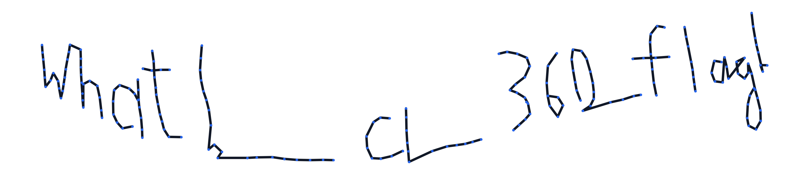

# BSidesAlgiers2025 - void

## 题目简述

题目是一个 A-Frame 三维绘图页面。`index.html` 记录画笔世界坐标 $(x,y,z)$，并计算视线经纬角 `lon/lat`；混淆的 `d.js` 定义了遥测变换、202 个目标点和误差为 $10^{-4}$ 的逐点比较器。目标不是在浏览器中盲画，而是逆向可逆变换，从目标遥测恢复角坐标并把笔迹画出来。

## 解题过程

去掉常量混淆后，`telemetryPipeline` 对每个点执行：

$$
\begin{aligned}
v_1 &= \operatorname{round}(x^3,6),\\
v_2 &= \operatorname{round}(12.5y+100,6),\\
v_3 &= \operatorname{round}(\tan(\mathrm{lat}),6),\\
v_4 &= \operatorname{round}(\mathrm{lon}+x,6),\\
v_5 &= \operatorname{round}\left(\frac{1}{z-5},6\right).
\end{aligned}
$$

五个分量都能单独求逆：

$$
\begin{aligned}
x &= \sqrt[3]{v_1}, & y &= \frac{v_2-100}{12.5},\\
\mathrm{lat} &= \arctan(v_3), & \mathrm{lon} &= v_4-x,\\
z &= 5+\frac{1}{v_5}.
\end{aligned}
$$

直接让 Node 执行 `d.js`，再对全局数组 `d` 应用逆变换即可。这里使用 `Math.cbrt` 是为了正确处理负数立方根：

```javascript
const fs = require("fs");
const vm = require("vm");

const context = {
  console,
  alert: message => console.log(message),
};
vm.createContext(context);
vm.runInContext(fs.readFileSync("d.js", "utf8"), context);

const points = context.d.map(q => {
  const x = Math.cbrt(q.v1);
  return {
    x,
    y: (q.v2 - 100) / 12.5,
    z: 5 + 1 / q.v5,
    lat: Math.atan(q.v3),
    lon: q.v4 - x,
  };
});

// d.js 内部重新做 telemetryPipeline 并逐项比较。
context.probeStream(points, context.d);  // [✓] PASSED

fs.writeFileSync(
  "angles.csv",
  points.map(p => `${p.lon},${p.lat}`).join("\n"),
);
```

`index.html` 的提交处理先调用一次 `telemetryPipeline`，而 `probeStream` 内部还会再调用一次；按页面原样点击提交会发生重复变换。离线直接把恢复点交给 `probeStream` 才与比较器的真实输入契约一致，并能得到 `[✓] PASSED`。

把 `angles.csv` 中的 `lon` 作为横轴、`lat` 作为纵轴，按原顺序连接相邻点；跨笔画的大跳跃不要连线。恢复图像如下：



笔迹可读为：

```text
WHAT LIES BEYOND
```

题面只说明包装为 `shellmates{result}`，仓库没有保存平台端 flag 常量或官方题解，因而无法仅凭附件证明空格是否应换成下划线。按可见大写结果和常见提交格式，候选写作：

`shellmates{WHAT_LIES_BEYOND}`

确定性证据是短语本身和 `probeStream` 的逐点通过；下划线规范属于格式推断，不能与前者混称为附件内已验证事实。

## 方法总结

- 混淆代码中先化简常量和运算，再判断各输出分量是否可逆；本题无需拟合或暴力搜索。
- 带符号立方根不能直接写成 `v ** (1/3)`，否则负数会得到非实数结果。
- 图形类逆向应同时保留数值校验和视觉证据：`probeStream` 证明坐标正确，重建图证明坐标表达的文本含义。
