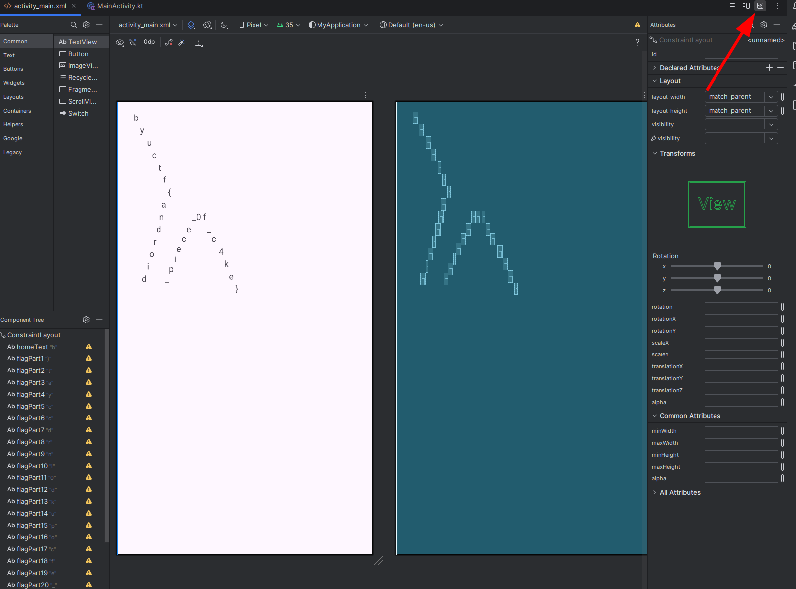

# Baby Android 1

## 题目简述

题目给出一个 Android APK。`MainActivity.onCreate` 先加载 `activity_main` 布局，随后调用 `Utilities.cleanUp()`，把 `flagPart1` 到 `flagPart28` 的 `TextView` 文本全部清空，并把主页文字改成 `Too slow!!`。

flag 字符实际保存在布局 XML 中，但控件编号并不是阅读顺序；每个字符的位置由 ConstraintLayout 的边距和约束决定。因此主要障碍是还原资源布局，而非绕过运行时校验。

## 解题过程

用 JADX 或 apktool 查看资源，能在 `activity_main.xml` 中找到 28 个单字符 `TextView`。例如 `flagPart1` 的文本是 `}`，但它通过 `layout_marginBottom` 和 `layout_marginEnd` 被放在最终图案的右下区域，说明不能按资源 ID 编号拼接。

有两种可靠做法：

1. 把 XML 放入兼容的 Android Studio ConstraintLayout 预览中直接渲染；
2. 解析每个控件的水平、垂直约束和边距，按屏幕坐标排序后重建二维字符布局。

渲染结果如下，字符的空间排列直接组成 flag：



读取布局得到：

```text
byuctf{android_piece_0f_c4ke}
```

## 方法总结

- 核心技巧：从 APK 资源层恢复被运行时代码清空的初始文本，并按布局坐标而非资源编号读取。
- 识别信号：界面启动后立即删改控件内容，而 XML 中仍存在单字符文本和大量定位约束时，flag 可能藏在静态布局中。
- 复用要点：Android 资源 ID 的数字或名称顺序不等于视觉顺序；可以渲染原布局，也可以规范化约束后做坐标排序。
