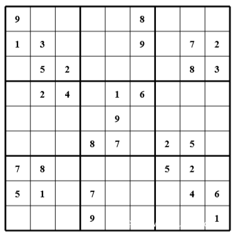

# Ancient Game v2

## 题目简述

题目用类似 OISC 的自定义虚拟架构实现数独校验，指令只有 4 类，逻辑操作通过 NAND 组合实现，并带有分支控制和两个 I/O 中断。输入的 50 字节 flag 被转移进 9x9 数独空格，再与 `xor_table` 异或，随后校验行、列、宫和数字范围。解法不需要完整化简所有 NAND 逻辑，只要跟踪控制流并抽取“不能跳到 wrong”的约束，再对数独约束求解即可。

题目资料地址：https://github.com/yype/D3CTF_Rev/tree/master/AncientGameV2

作者说明该题先写了一套类似 OISC 的虚拟架构和 assembler，再用 assembler 生成给选手的 challenge；解题不必还原全部 NAND 逻辑，只需要跟踪控制流并符号化“不要跳到 Sorry”的约束。README 还记录了赛时 `outofnumbers(var)` 错写成 `return var in range(10)` 导致多解，赛后修正为 `range(1,10)`，并附有 `sol.py` 作为验证脚本。

## 解题过程

本题用类似 OISC 的虚拟架构实现了一个经典数独验证，指令共 4 种类型，逻辑操作均通过 NAND 门实现，同时引入了一个分支控制以及两个 I/O 中断。

XOR / AND / OR 等都可以通过 NAND 组合实现，例如：

```cpp
xor x,y =>
xor_tmp[0] = y NAND y
xor_tmp[1] = x NAND xor_tmp[0]
xor_tmp[2] = x NAND x
xor_tmp[3] = y NAND xor_tmp[2]
x = xor_tmp[1] NAND xor_tmp[3]
```

基于如下事实：

```java
Q = A XOR B = [ B NAND ( A NAND A ) ] NAND [ A NAND ( B NAND B ) ]
```

条件跳转可以通过配合 `if (a <= 0) { if (b >= 0) {  ip = b; continue; } }` 实现。

数独验证程序的代码节选如下：

```java
welcome = mkstr("**************************n**  Welcome To D^3CTF   **n**   Ancient Game V2    **n**************************nnInput Flag:")
wrong = mkstr("nSorry, please try again.n")
correct = mkstr("nCorrect.n")

flag = new(50)
// distract = new(1000)
grid = new(81)

// initialize the puzzle
set(grid[0],9)
set(grid[5],8)
set(grid[9],1)
set(grid[10],3)
set(grid[14],9)
set(grid[16],7)
...
set(grid[71],6)
set(grid[75],9)
set(grid[80],1)

__code_start__

// print the welcome message
print(welcome)

// get input
input(flag[0])
input(flag[1])
input(flag[2])
input(flag[3])
input(flag[4])
input(flag[5])
...
input(flag[46])
input(flag[47])
input(flag[48])
input(flag[49])

// transfer chars in the flag into the grids

long_transfer(flag[0],grid[1])
long_transfer(flag[1],grid[2])
...
long_transfer(flag[47],grid[77])
long_transfer(flag[48],grid[78])
long_transfer(flag[49],grid[79])

// xor with xor_table, which is introduced 
//   for generating different flags to different teams

grid[1] = grid[1] ^ xor_table[0]
grid[2] = grid[2] ^ xor_table[1]
grid[3] = grid[3] ^ xor_table[2]
grid[4] = grid[4] ^ xor_table[3]
grid[6] = grid[6] ^ xor_table[4]
grid[7] = grid[7] ^ xor_table[5]
...
grid[77] = grid[77] ^ xor_table[47]
grid[78] = grid[78] ^ xor_table[48]
grid[79] = grid[79] ^ xor_table[49]

// verify the sudoku game

// rows
jmp _label_wrong if grid[4] == grid[5]
jmp _label_wrong if grid[4] == grid[6]
jmp _label_wrong if grid[4] == grid[7]
...
jmp _label_wrong if grid[3] == grid[7]
jmp _label_wrong if grid[3] == grid[8]

// columns
jmp _label_wrong if grid[0] == grid[9]
jmp _label_wrong if grid[0] == grid[18]
jmp _label_wrong if grid[0] == grid[27]
...
jmp _label_wrong if grid[62] == grid[80]
jmp _label_wrong if grid[71] == grid[80]

// subgrids
jmp _label_wrong if grid[0] == grid[1]
jmp _label_wrong if grid[0] == grid[2]
jmp _label_wrong if grid[0] == grid[9]
jmp _label_wrong if grid[0] == grid[10]
...
jmp _label_wrong if grid[78] == grid[79]
jmp _label_wrong if grid[78] == grid[80]
jmp _label_wrong if grid[79] == grid[80]

// check range

jmp _label_wrong if outofnumbers(grid[1])
jmp _label_wrong if outofnumbers(grid[2])
jmp _label_wrong if outofnumbers(grid[3])
jmp _label_wrong if outofnumbers(grid[4])
...
jmp _label_wrong if outofnumbers(grid[76])
jmp _label_wrong if outofnumbers(grid[77])
jmp _label_wrong if outofnumbers(grid[78])
jmp _label_wrong if outofnumbers(grid[79])

_label_correct:
print(correct)
return

_label_wrong:
print(wrong)
return
```

针对该架构编写编译器，上述代码经过编译后，即为选手拿到的题目。

要做出该题，不用化简所有的逻辑操作，由于没有复杂的循环，可以通过简单的控制流跟踪与符号分析，找出防止控制流跳转至输出“Sorry”的条件，得到符号约束，最后进行约束求解即可。

赛期中，由于出题人的疏忽，错误地将 `outofnumbers(var)` 函数实现写成了 `return var in range(10)` ，导致多解的产生。由于目标数独应只允许填入 1~9， 正确的写法应为 `return var in range(1, 10)` 。

**Sudoku Map**



## 方法总结

- 核心技巧：把自定义 VM 中的 NAND 逻辑提升为布尔/算术约束，不逐条手算所有门电路，而是围绕控制流跳转条件提取约束。
- 识别信号：VM 程序出现大量相等性比较、固定 9x9 grid、行列宫检查和输入映射时，应迅速识别为数独约束题。
- 复用要点：先恢复输入字符到 grid 的映射和 `xor_table`，再求数独解并反推 flag；范围检查实现错误会导致多解，复现时要按实际二进制逻辑而不是题目预期约束求解。
