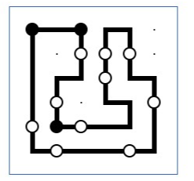

# d3w0w

## 题目简述

题目是一个 Windows 逆向题，校验逻辑分成普通 32-bit 入口和一段借助 WoW64 机制隐藏的 64-bit 逻辑。输入格式是 `d3ctf{[1-4]*}`，内部会把字符映射成方向序列，最终等价于求一个 Masyu logic puzzle 的闭环路径。

## 解题过程

只需要逆向 sub_401000 与 sub_401220

sub_401000 检测 flag 的格式 d3ctf{[1-4]*}

对输入的字符串做了映射，创建二维数组保存了映射。

sub_401220 利用了 wow64 的机制，做了小小的混淆，只要把那部分 dump 出来，或者以其他方式，使用64-bits 解析就能比较清楚的得到程序逻辑。

sub_401220 ，根据数据的以及每次取模条件，判断失败的几个条件，可以猜测题目是一个 logic puzzle，这个对输入做几轮筛查后最后进入循环判断是否是一个闭环。

每个点有四个方向，有两种关键的点位置，存在不同的逻辑。这里既可以直接逆向，也可以查找与 logic puzzle 有关的线索。MASYU。

最后再还原出路径。

map[i][j] 以左上角为起点 map[0][0] ,向右，向下为正。

走路的时候，根据映射的过程，可以知道，上下左右，分别为 ,3142

## 方法总结

- 核心技巧：先在 `sub_401000` 中确认输入格式和字符到方向的映射，再把 WoW64 相关代码 dump 或按 64-bit 重新解析，避免被模式切换干扰。
- 关键识别：循环判断、四方向移动、特定点位规则和闭环约束都指向 Masyu；识别出 puzzle 类型后，就可以把逆向结果转化为路径求解。
- 复用要点：遇到题目把输入映射成 `1/2/3/4` 这类方向序列时，应优先检查是否是迷宫、路径或 logic puzzle，而不是只盯汇编条件跳转。
