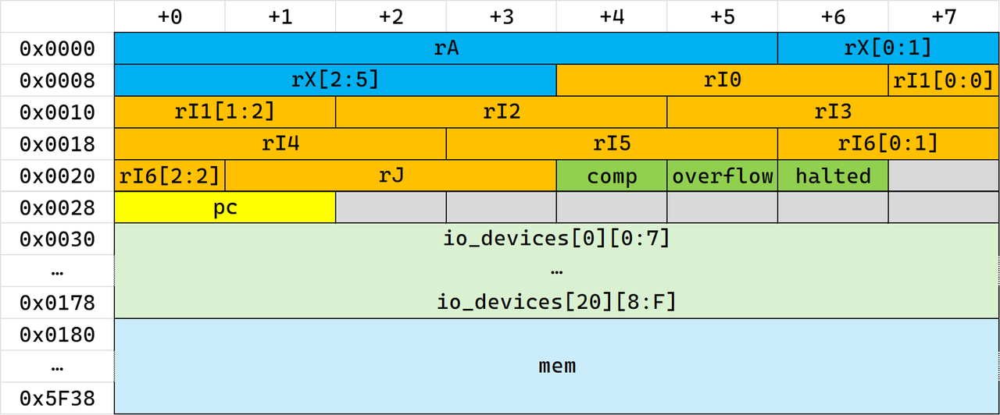

# modern_legacy

## 题目简述

程序接收一段至少 35 个字符的输入并进行校验。换行不会提前结束读取，二进制中也找不到明文提示字符串。Detect It Easy 只能识别出普通 MSVC PE64，但 `.rdata` 中大量 `library/std/src/...`、UTF-8 编码错误和 Rust panic 文本表明它实际是 Rust 程序，MSVC 只是后端。

Rust 入口把 `sub_140008C40` 传给运行时启动函数，因此该函数就是逻辑上的 `modern_legacy::main`。其中存在一个反复调用 `sub_140005200`、直到 halted 标志置位的循环。继续分析可确认：程序实现了 Donald Knuth MIX 架构的变体，使用 6 字节机器字、4000 字内存和虚函数式 I/O 设备；真正的校验逻辑作为 MIX 字节码运行。

## 解题过程

### 识别 VM 调度器

`sub_140005200(vm)` 的行为具有典型解释器特征：

1. `vm + 38` 的 halted 字节非零时直接返回；
2. 读取 `vm + 40` 处的 16 位 PC，并检查其小于 4000；
3. 从 `vm + 384 + 6 * PC` 取一个 6 字节机器字；
4. PC 加一；
5. 根据 opcode 进入大 `switch`，调用相邻的指令处理函数。

加减法处理函数还会按 MIX 的符号—数值表示更新 A 寄存器，并在结果超出五个数据字节时设置 overflow。I/O 指令则通过 21 个 `Option<Box<dyn Device>>` 风格的对象及 vtable 调用完成，这解释了为什么提示字符串没有作为 ASCII 字面量出现在 PE 中。

恢复后的主要状态结构为：

```c
struct Word6 {
    uint8_t data[6];
};

struct Word3 {
    uint8_t data[3];
};

struct Device {
    uint64_t tag;
    void *vtable;
};

struct VM {
    struct Word6 r_a;
    struct Word6 r_x;
    struct Word3 r_i[7];
    struct Word3 r_j;
    uint8_t comp;
    uint8_t overflow;
    uint8_t halted;
    uint16_t pc;
    struct Device io_devices[21];
    struct Word6 mem[4000];
};
```



MIX 的一个机器字由 1 字节符号和 5 字节数据组成。指令字可按以下顺序解释：

```text
sign | address_hi | address_lo | index | field | opcode
```

其中 field 又拆成 `L:R` 两个三位字段。`op == 5, 6, 39..55` 时，field 还用于区分同一主 opcode 下的次级操作，例如 `HLT`、移位、条件跳转和寄存器修改。

### 提取并反汇编 MIX 内存

最直接的方法是在第一次调用调度器前下断点。此时 VM 已初始化而尚未执行，转储 `vm + 384` 开始的 $4000\times6=24000$ 字节即可得到 `vm_mem.bin`。

下面的最小解析器展示了机器字拆分方式。指令名可按标准 MIX opcode 表补齐；即使暂时只打印数字，也足以定位跳转、I/O 和数据区：

```python
#!/usr/bin/env python3
import struct
from pathlib import Path


def decode_field(field: int) -> tuple[int, int]:
    return field // 8, field % 8


memory = Path("vm_mem.bin").read_bytes()
if len(memory) != 4000 * 6:
    raise ValueError(f"unexpected memory size: {len(memory)}")

for pc, raw in enumerate(struct.iter_unpack(">BhBBB", memory)):
    sign, address, index, field, opcode = raw
    if sign:
        address = -address
    left, right = decode_field(field)
    print(
        f"{pc:04d}  "
        f"addr={address:6d}  "
        f"index={index:2d}  "
        f"field={left}:{right}  "
        f"op={opcode:02d}"
    )
```

字节码的有效逻辑集中在 `0..123`，`3000` 以后主要是常量、提示文本、密钥和密文：

- `3001`：XTEA 的 delta；
- `3019..3025`：七个 40 位密文字；
- `3200`：35 字符输入缓冲区；
- `76..79`：四个连续机器字组成的 XTEA 密钥。

### 处理 MIX 的返回约定

静态查看第 79 字时，其地址字段是 3999，因此最后一个密钥字看起来是：

```text
0x0f9f000027
```

但 MIX 的 `STJ`/跳转约定会修改返回跳转。执行跳转后，`rJ` 保存静态下一条指令地址；被调用过程再用 `STJ` 把 `rJ` 写入返回用 `JMP` 的地址字段。第 79 字最终由 3999 改成 101，即地址字节从 `0f 9f` 变为 `00 65`。

所以真实密钥为：

```c
static const uint64_t KEY[4] = {
    0x0c1d00050f,
    0x0001000137,
    0x000400022f,
    0x0065000027
};
```

如果只静态 dump 初始内存而忽略 `STJ` 的自修改行为，第四个密钥字会错误。

### 还原 40 位 XTEA 变体

每个 MIX 数据字只有 5 字节，因此模数为：

$$
2^{40}
$$

delta 位于地址 3001，其实际值为：

$$
\delta=\mathtt{0x9e38538a49}.
$$

原总 WP 称它等于 $\left\lfloor 2^{40}/\varphi\right\rfloor$，但后者实际为 `0x9e3779b97f`，两者并不相等。求解时必须使用字节码中提取的 `0x9e38538a49`，只能把它视作接近 TEA 黄金比例常量的题目自定义值。轮函数进行 32 轮运算；右移前只取五字节有效值，最终结果也截断为 40 bit。

七个密文字为：

```c
static uint64_t cipher[7] = {
    0x000000058b0e5eda,
    0x000000f48afab6bb,
    0x000000f47bfb8cbf,
    0x0000005fb0c2b766,
    0x0000008a6528f759,
    0x0000007acea379b5,
    0x000000c0850d08ce
};
```

程序并非把它们分成互不相交的二元组，而是依次加密重叠窗口 `(word[0], word[1])`、`(word[1], word[2])`，直到 `(word[5], word[6])`。因此解密必须按相反顺序，从窗口 5 退到窗口 0。

### MIX 字符表与完整求解器

MIX 使用自己的字符编号。题目在 Rust 层通过一张 56 项表把 MIX 字符转换为 Unicode；flag 用到的项目都落在 ASCII 范围。下面的求解器包含完整字符表、40 位 XTEA 逆变换和反向窗口顺序：

```c
#include <stdint.h>
#include <stdio.h>

#define MASK40 0xffffffffffULL

static const uint32_t CHAR_MAP[56] = {
    0x0020, 0x0041, 0x0042, 0x0043, 0x0044, 0x0045, 0x0046,
    0x0047, 0x0048, 0x0049, 0x0027, 0x004a, 0x004b, 0x004c,
    0x004d, 0x004e, 0x004f, 0x0050, 0x0051, 0x0052, 0x00b0,
    0x0022, 0x0053, 0x0054, 0x0055, 0x0056, 0x0057, 0x0058,
    0x0059, 0x005a, 0x0030, 0x0031, 0x0032, 0x0033, 0x0034,
    0x0035, 0x0036, 0x0037, 0x0038, 0x0039, 0x002e, 0x002c,
    0x0028, 0x0029, 0x002b, 0x002d, 0x002a, 0x002f, 0x003d,
    0x0024, 0x003c, 0x003e, 0x0040, 0x003b, 0x003a, 0x201a
};

static const uint64_t KEY[4] = {
    0x0c1d00050f,
    0x0001000137,
    0x000400022f,
    0x0065000027
};

static void decipher(uint64_t block[2])
{
    const uint64_t delta = 0x9e38538a49;
    uint64_t v0 = block[0];
    uint64_t v1 = block[1];
    uint64_t sum = (delta * 32) & MASK40;

    for (unsigned int round = 0; round < 32; ++round) {
        v1 -= (
            (((v0 << 4) ^ ((v0 & MASK40) >> 5)) + v0)
            ^ (sum + KEY[(sum >> 11) & 3])
        );
        sum = (sum - delta) & MASK40;
        v0 -= (
            (((v1 << 4) ^ ((v1 & MASK40) >> 5)) + v1)
            ^ (sum + KEY[sum & 3])
        );
    }

    block[0] = v0 & MASK40;
    block[1] = v1 & MASK40;
}

static void print_mix_word(uint64_t word)
{
    for (int shift = 32; shift >= 0; shift -= 8) {
        uint8_t code = (word >> shift) & 0xff;
        if (code == 0) {
            continue;
        }
        if (code >= sizeof(CHAR_MAP) / sizeof(CHAR_MAP[0])) {
            fputc('?', stdout);
            continue;
        }
        uint32_t character = CHAR_MAP[code];
        if (character > 0x7f) {
            fputc('?', stdout);
        } else {
            fputc((int)character, stdout);
        }
    }
}

int main(void)
{
    uint64_t cipher[7] = {
        0x000000058b0e5eda,
        0x000000f48afab6bb,
        0x000000f47bfb8cbf,
        0x0000005fb0c2b766,
        0x0000008a6528f759,
        0x0000007acea379b5,
        0x000000c0850d08ce
    };

    for (int index = 5; index >= 0; --index) {
        decipher(&cipher[index]);
    }

    for (unsigned int index = 0; index < 7; ++index) {
        print_mix_word(cipher[index]);
    }
    fputc('\n', stdout);
    return 0;
}
```

输出：

```text
D3CTF(TECH-EV0LVE,EMBR@C3-PR0GR3SS)
```

把该字符串输入原程序，会得到成功提示：

```text
NOW MARCH BEYOND, AND REVIVE THE LEGACY.
```

## 方法总结

本题的关键是从 Rust 运行时入口、固定步长取指、PC 上界和设备 vtable 四组证据确认 MIX VM，而不是在巨大 Rust 反编译结果中逐函数硬追。动态转储初始化后的 `mem[4000]` 可以可靠提取字节码，但仍要注意 `STJ` 会在运行时修改返回跳转，从而改变密钥数据。

算法层面是 40 位 XTEA 与重叠窗口链。复现时必须同时处理五字节截断、MIX 字符表、窗口逆序和第四个密钥字的自修改。外部 MIX 资料有助于命名寄存器和指令，但正文已经给出本题所需的状态布局、指令格式、调用约定和完整解密器，无需依赖外链才能复现。
