# d3kernel

## 题目简述

题目是 Windows kernel / userland 混合逆向。用户态程序会和驱动通过 `DeviceIoControl` 通信，同时存在 R3 和 R0 两层反调试。解题主线是先绕过反调试，定位驱动中处理 `DeviceIoControl` 的大函数，再逆向其中的虚拟机逻辑恢复用户名和密码；另有一个非预期方向是利用校验过程的逐字节比较特征进行爆破。

## 解题过程

### 绕过R3 反调试

挂上WinDbg 双机调试加载驱动之后，发现WinDbg 不再响应了（如图），应该是通过`KdDisableDebugger`禁用了调试器。

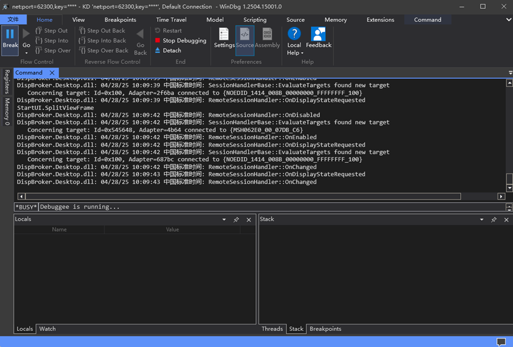

打开YDArk，看到驱动注册了两个回调和一个线程。

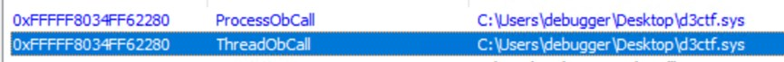


直接调试client，发现创建了一个shellcode，引发除零异常以隐藏程序控制流。

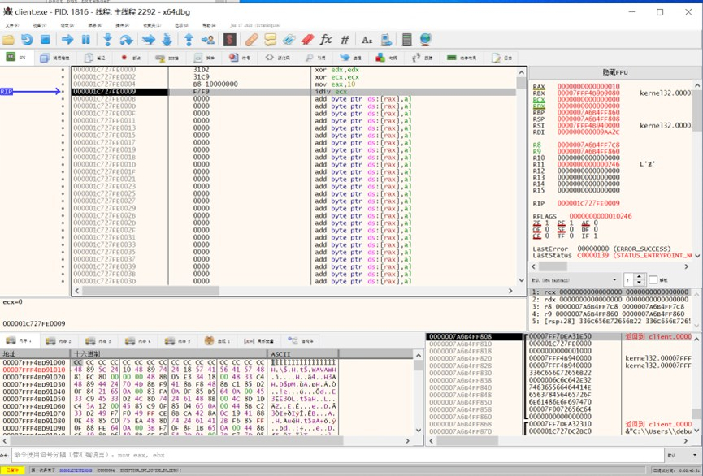

继续往下，又是一个故意的空指针异常。

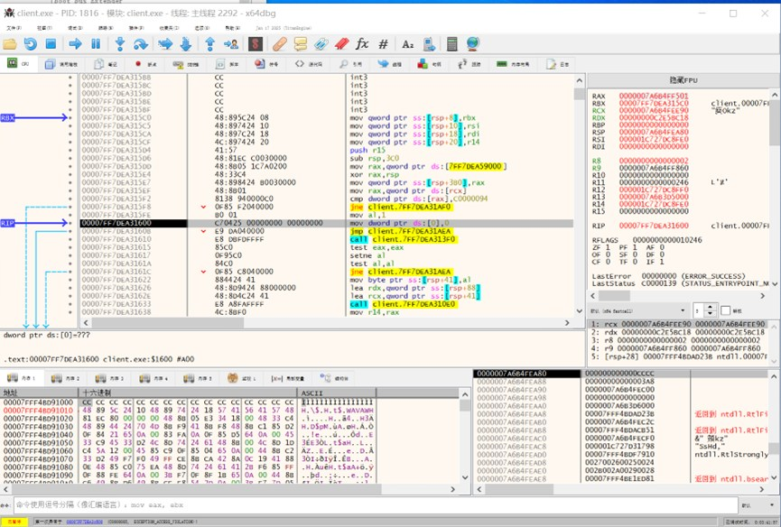

题目有反调试，先对几个检测调试器的函数下断点。

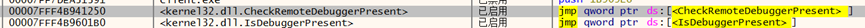

都被断下了，说明程序使用了这两个函数检测调试器。

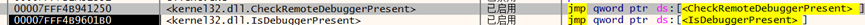

手动patch，使这些函数直接`ret`返回。

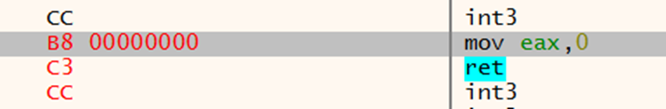

单步回到检测调试器的代码中，可以看到隐藏了导入表，函数都是动态获取的。

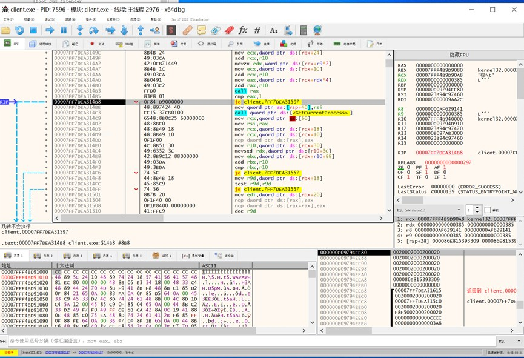

在下一个`call rax`下断点，发现确实调用了`CheckRemoteDebuggerPresent`。

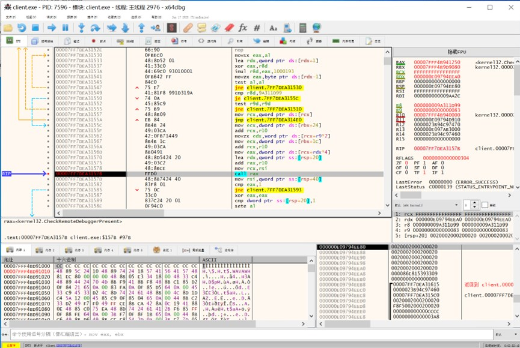

直接patch 返回值检测（两个检测都要patch，否则将会进入`fake_main`里）


慢慢跟到`CreateFileW`。

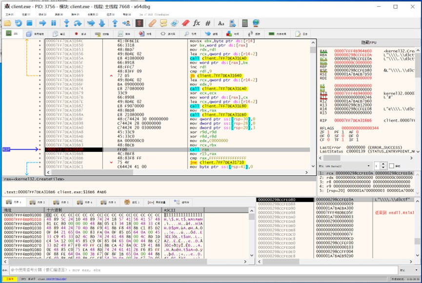

下一个`call rax`为`DeviceIoControl`，发现进程是通过`DeviceIoControl`与驱动通信的。由此我们可以得知程序与驱动交互所使用的结构体等信息。

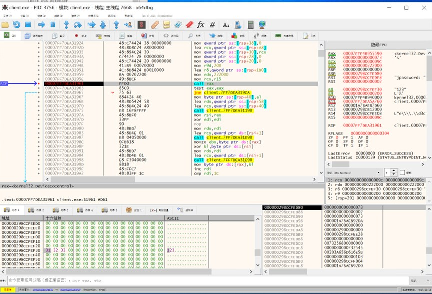

### 绕过R0 反调试

当我们配置好双机调试，加载驱动后，我们发现windbg 不再响应我们的命令，这是由于`KdDisableDebugger`关闭了双机调试，所以我们要在加载驱动之前patch 一下`KdDisableDebugger`，使它不发挥任何作用。

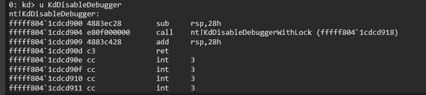

直接在`KdDisableDebugger`的开头`ret`

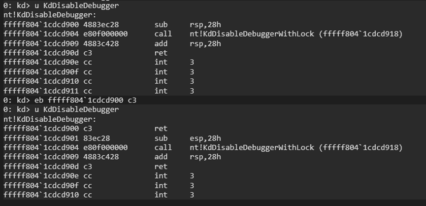

现在加载驱动就不会掉调试器了。当然你也可以以`nop`填充驱动本身创建线程处的代码，条条大路通罗马。

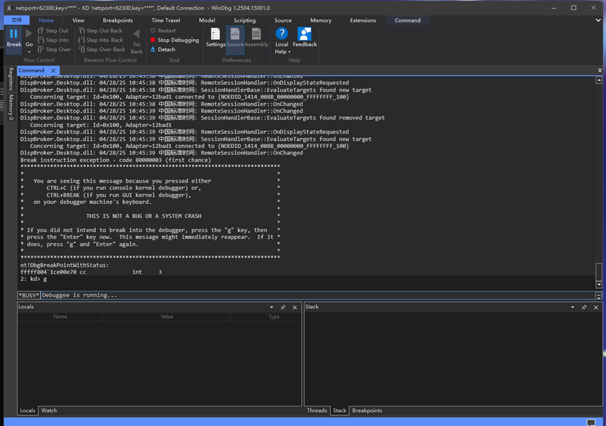

### 预期解：虚拟机的逆向

既然已经知道是`DeviceIoControl`，那就看看`DRIVER_OBJECT`里的`MajorFunction`。

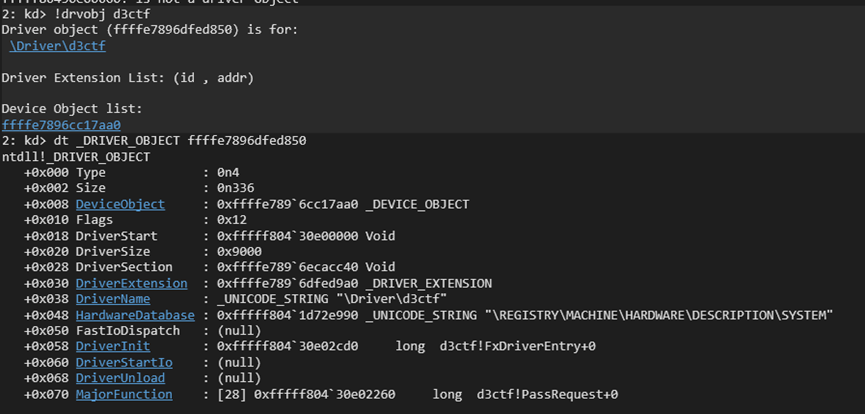

第十五个函数就是`DeviceIoControl`的处理函数了，下断点，再去用户层发请求看看。

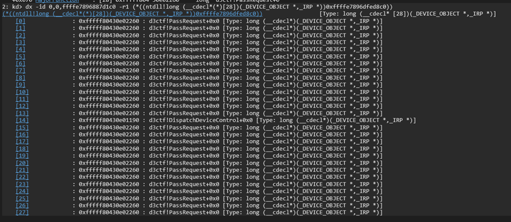

成功被断下。

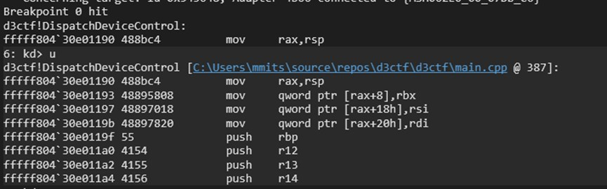

在ida 里可以看到这个函数超级大，inline 了一堆东西。

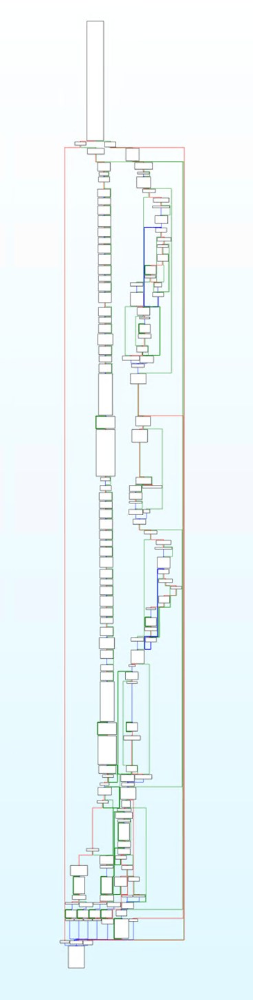

另外还发现它调用了一个看起来像虚拟机的函数。

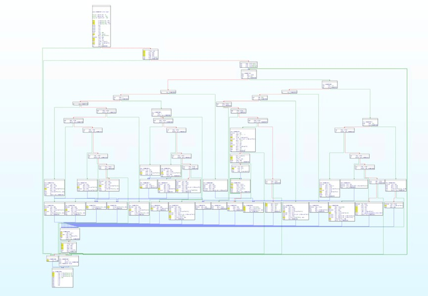

把伪代码扔给ChatGPT 看。

AI 辅助整理出的部分 opcode 语义如下，后续仍以动态调试和伪代码核对为准：

| opcode | 语义 |
|---|---|
| 1 | 加法，将 `a + b` 压栈 |
| 2 | 异或，计算 `a ^ b` |
| 3 | 比较，结果为 1 或 0 |
| 4 | 乘法 |
| 5 | 减法 |
| 6 | 相等比较 |
| 7-11 | 条件跳转或无条件跳转 |
| 12 | 从变量池读取数据到栈 |

基本上都是正确的，接下来逆向虚拟机实际执行的代码，对`vm_init`下断点。

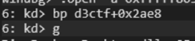

其中参数分别为虚拟机结构体，虚拟机的代码指针，虚拟机代码长度。

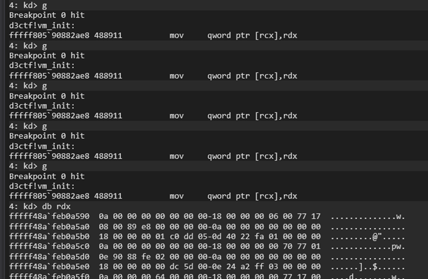

断下后寻找一个`code_size`最大的，查看虚拟机代码。

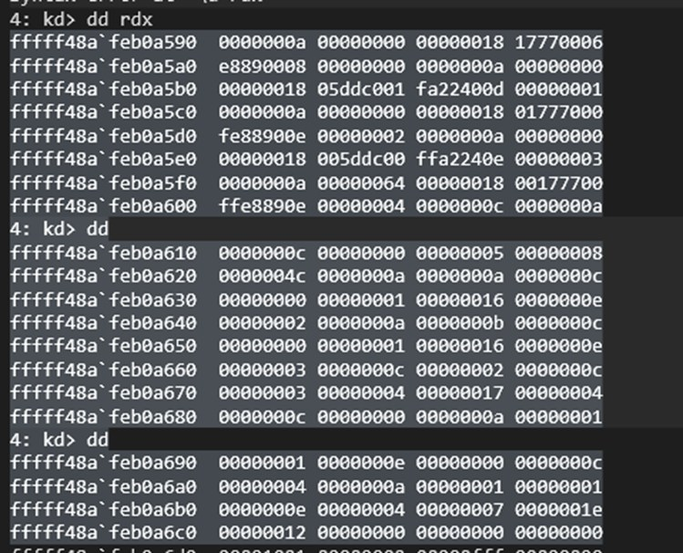

根据虚拟机代码中的定义可以得出这段虚拟机代码是将两个输入的数字异或，第一个数字为buffer 的长度。

通过IDA 查看到编码后的username 和password 为：

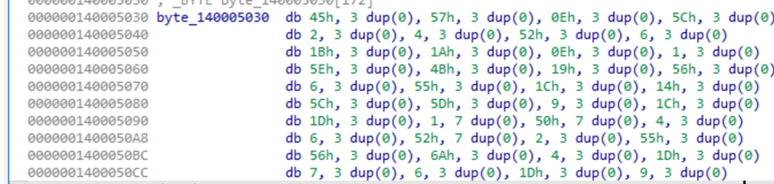

编写一个python 脚本解密：

```python
def decrypt(buffer):
    decrypted = [len(buffer)]
    for i in range(len(buffer)):
        decrypted.append(buffer[i] ^ decrypted[i])
    return "".join([chr(x) for x in decrypted[1:]])
```

脚本输出如下：

```text
Decrypted user: mitsuha
Decrypted password: a68dfb06-798f-4bd1-9e81-011aaec113f0
```

### 非预期解：爆破

在比赛过程中，我注意到有一些选手使用了爆破的方法，这是由于这段编码较为简单，而且有很强的特征，因此我们可以在驱动验证编码后的内容是否相等的时候下断点，当我们的输入字符正确的话，我们应该可以观测到`memcmp`访问了下一个字节的数据。下面我们将会验证这个想法。

这是驱动验证编码后的内容是否相等处的代码。

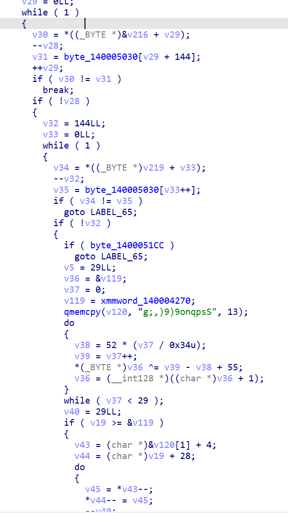

我们只要在`if ( v30 != v31 )`处下断点，即可知道这一位是否就是正确的。

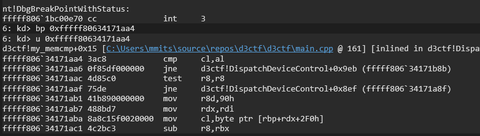

当我们输入用户名为111111 时，跳转成立，则1 不是用户名的第一位。

```text
name: 111111
password: 123
driver sent me a message: zako, try again
```

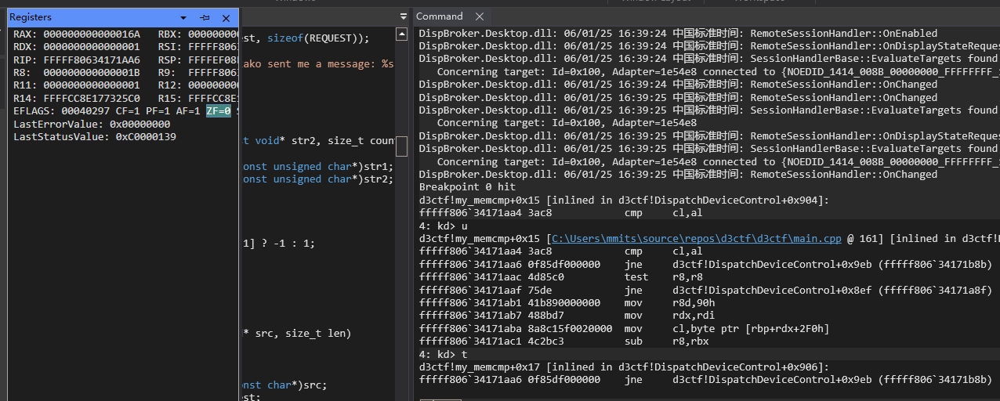

我们可以这样依次尝试，当我们输入m111111 时，跳转不成立，则m 是用户名的第一位。

```text
name: m111111
password: 123
```

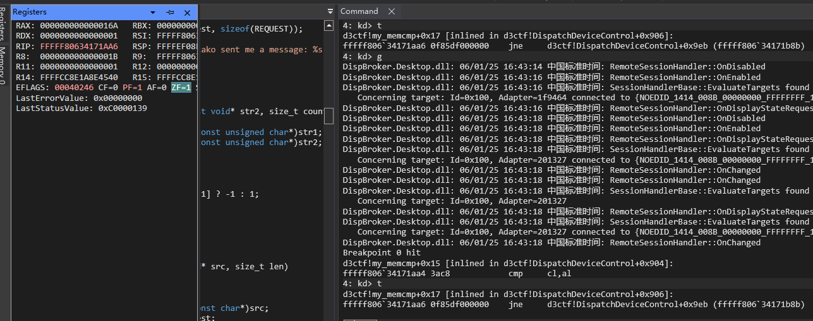

这样你只需要爆破7 + 36 次即可得出答案！

## 方法总结

- 核心技巧：先分别处理 R3/R0 反调试，再沿 `DeviceIoControl` 找到驱动校验入口，最终把虚拟机执行逻辑还原为简单异或编码。
- 识别信号：驱动题中用户态程序动态解析 API、隐藏导入表、与驱动通信且驱动函数巨大时，应优先确认 IOCTL 处理函数和是否存在 VM/解释器层。
- 复用要点：预期路线是 VM 逆向，非预期路线利用逐字节比较副作用；两者都依赖先稳定调试环境，避免 `KdDisableDebugger` 和用户态反调试干扰。
