# d3piano

## 题目简述

题目是一个 Android 模拟钢琴 app，界面只有一个八度的 12 个琴键。每次按键都会把琴键序号传给 native `check`，通过后执行 `getflag`。表层 `libD3Piano.so` 看起来使用 GMP/RSA 校验输入，但真正的关键在另一个 `libMediaPlayer.so`：它在 `init_array` 中创建线程并用 gumpp / Frida 风格的 hook 篡改 `getkeysoundindex`、`check` 和 `get_flag` 相关逻辑。解题需要先识别 hook 链，再恢复 Salsa20 与变种 LZW 压缩后的音符序列。

## 解题过程

题目是一个模拟钢琴的app，只包含了钢琴中的一个八度，7 个白键5 个黑键。如下是绘制琴键的逻辑，从逻辑中我们知道0-6 依次代表白键，7-11 代表黑键。

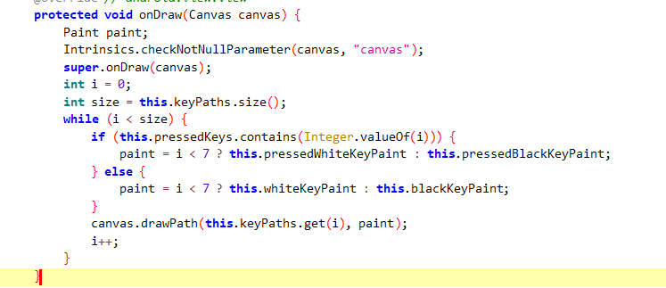

加载琴音资源，根据keysoundnames 数组的内容加载琴音资源，keysoundnames 数组内容由native 函数getkeysoundnames(12)获取。

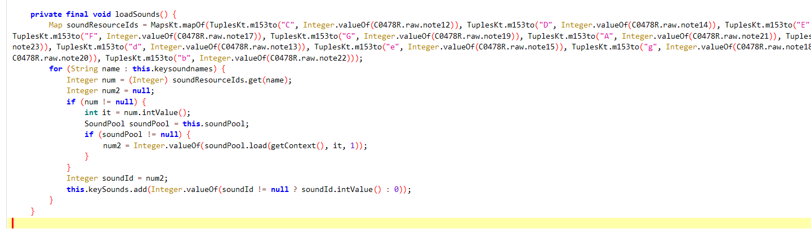

```java
public final native String[] getkeysoundnames(int size);
```

触摸逻辑，获取当前触摸位置，判断属于哪个琴键，切换琴键的画笔，然后发出声音。如果是0 号白键就使用keySounds[0]，而keySounds[0]的音调由keysoundnames 数组决定，比如keysoundnames[0]==”C”，则0 号白键就发出”C“的音调。每次按下都会将琴键的序号传给native 的check 函数进行判断，如果返回true 就执行getflag 的逻辑，然后log 出flag。

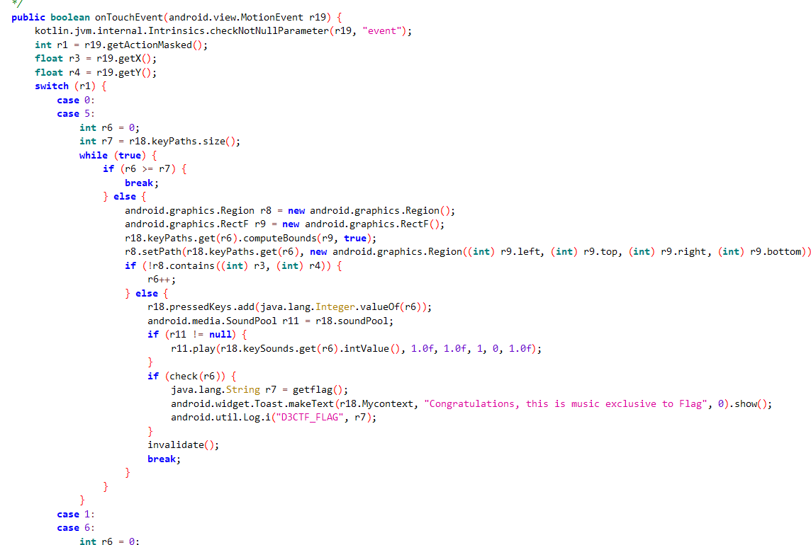

接下来分析native 层，程序只加载了一个libD3Piano.so。对getkeysoundnames 函数进行分析，发现会获取一个keysoundindex，然后根据keysoundindex 生成soundnames 数组

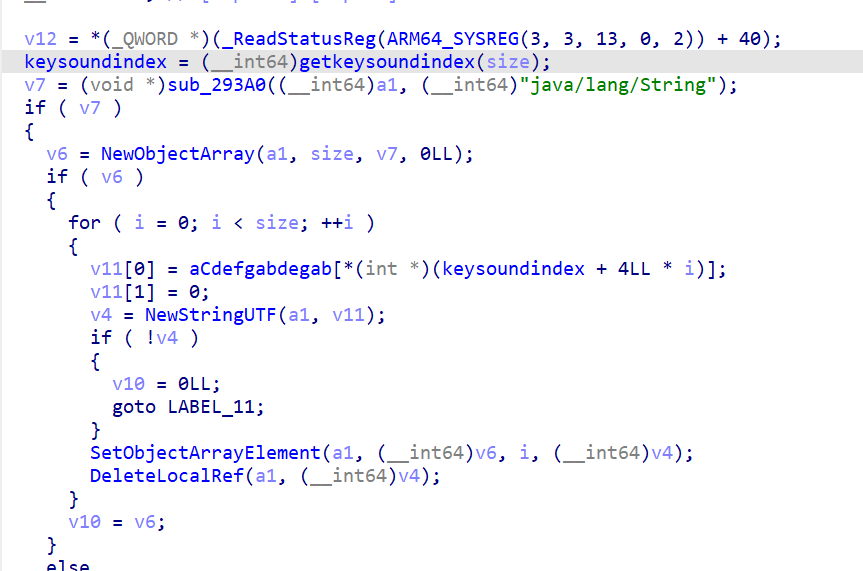

getkeysoundindex 函数有些复杂（这是使用了C++），这里就是生成一个0-11 乱序的数组。（但是其实你可以不用分析getkeysoundindex，你如果弹过琴或者了解一些音乐你就会发现，琴键的音调是完全正确的。这里的生成乱序keysoundindex 没有生效，keysoundindex 就是0-11 的顺序）

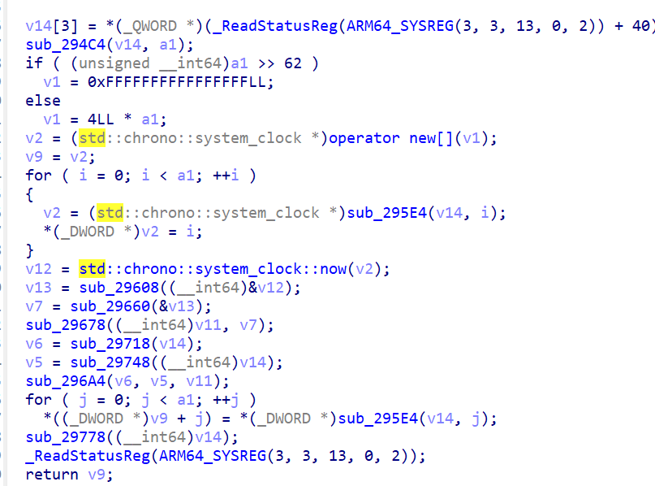

分析一下check 函数，发现这里使用了GMP 大数库，而且很多函数的符号ida 都分析错误，影响分析，可以对着GMP 的头文件修改一下。当然也可以选择丢给ai。这里的逻辑就是把琴键的index 拼接成一个12 进制字符串然后作为大数值，丢进c 加密，然后在转换成16 进制字符串，在进行比较。

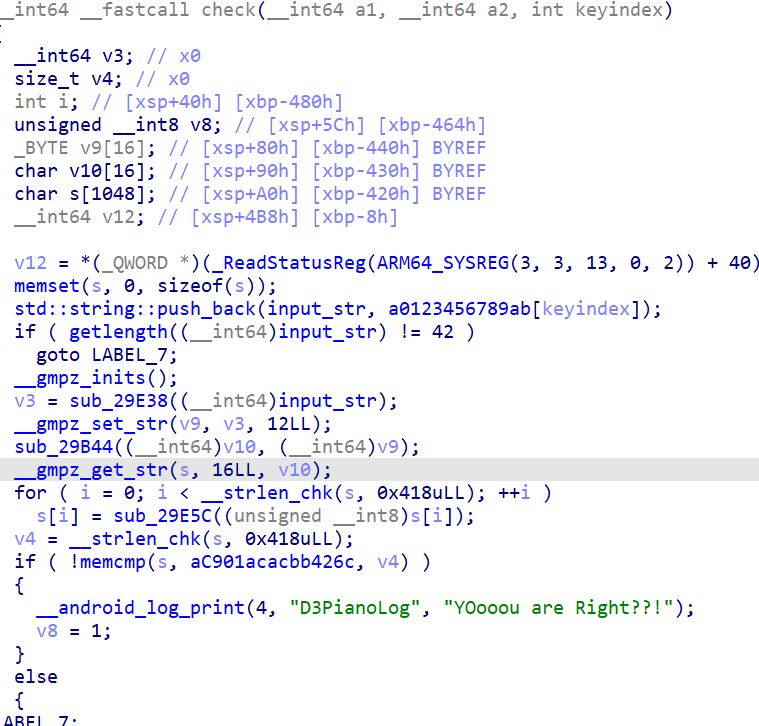

sub_29B44 稍微分析一下，其实就是RSA 加密。

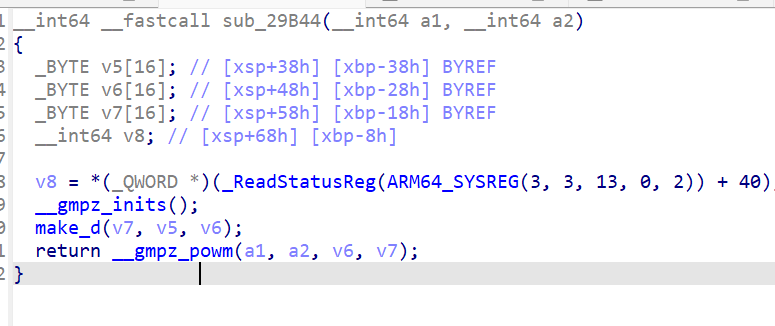

make_d 的逻辑，通过keysoundindex 与rand 生成一个gmp_randseed，然后生成两个素数，由于我们在前面知道keysoundindex 就是0-11 的顺序，那么gmp_randseed就是固定的，所以可以实现解密。

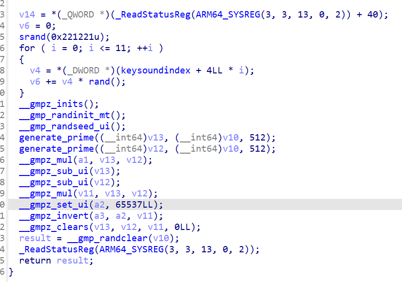

getflag 函数的逻辑，将输入的12 进制字符串转换为16 进制字符串在转换成ascii 字符串。

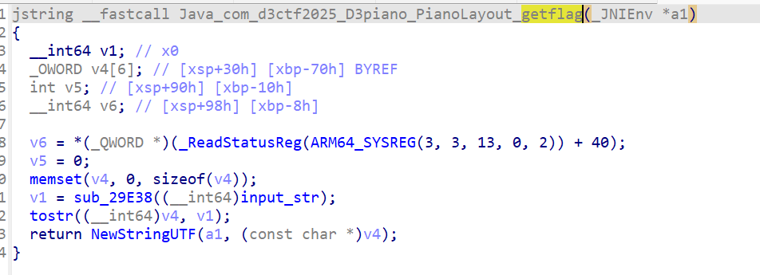

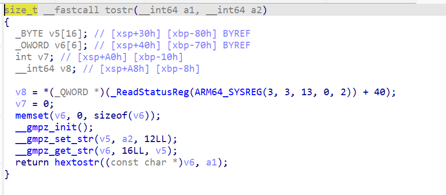

check 函数就是在根据按下的琴键序号作为12 进制数，进行rsa 加密后检查如果正确，就将12 进制数转换成16 进制数再到ascii 码字符串。所以我们只需要解密rsa，代码如下，但是是fake_flag

```python
from Crypto.Util.number import long_to_bytes
p =0xcd88775691357147eea5dc584718edab9ca314cdd52a8c1cf847dbbb8371798f15e9bdca2bfaa4595d47eecae21bea38691a26e1c707867b5ea2f6f2f03bf4c+1
q =0x565c0138487b57e4b76d0924163f67facb17a77f83e354cc3c8432879dab4611c2442cdd73f71c9e6cb4e56a7c45a403148e6d558f986ec6505882ae095c34d2+1
d =0x2e4f4254c529f4ef40d28a6595e60bb28b1d11ab13328000fb63cf77836a423259af8a8881d73e1868cd66bbd78920f38033f9f1e0e406b82f0aee50fdbe2567e0ac329e80e9abbb7075f4711157844e9fcb666200b1c4ef05b3cc66278221c9e6bd7250caf2be2a3793cf1f2dd43918d6ead0ee851eccf43e48750b6fab2f9
e = 65537
c=0xc901acacbb426c9c447acda82513965ccc3faf6c9dc58d24ed34b62c7fb1548f9ad06b9355c7d20704cfdfdfc89a3f893801e31719564683fdc7de26d807ed27f898edb3efd51b6e8e2a192d6a0929554342adfed541cd8399da0fbacfeaa5b608b887fd74f4f0e31f9bb5816c54163b8e46d27553798233bef6eaf848c64e
n=p*q
mm=pow(c,e,n)
print("解密后的flag（字符串）:", long_to_bytes(mm).decode())
```

//解密后的flag（字符串）: This_is_a_fake_flag

回顾一下之前的分析过程会发现，getkeysoundindex 是一个很奇怪的点，没有生成打乱的0-11，而是生成顺序的0-11(如果你尝试了调试或者frida-hook 也会发现有检测，但是libD3Piano.so 没有很明显的检测逻辑。)getkeysoundindex 可能被hook 了。libD3Piano.so 链接了这两个库，但是很明显使用了libgmp.so，没有使用另一个所以这个libMediaPlayer.so 肯定在init_array 里面藏了东西。因为在链接时会调用init_array 的内容。

```text
Needed Library: libMediaPlayer.so
Needed Library: libgmp.so
```

libMediaPlayer.so 的init_array 的内容，可疑的函数只有sub_8938CC

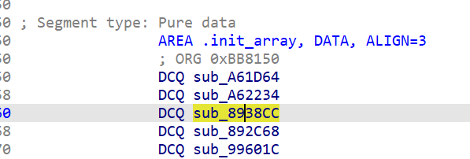

初始化了三个信号量，创建了四个线程，每个线程都执行不同的函数。

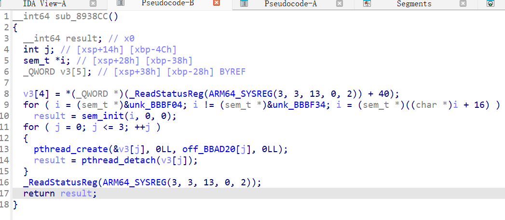

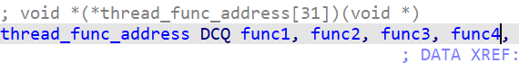

func1 的分析，是检测调试与frida 的函数，通过检测线程名称来检测是否处于调试/hook 状态。检测到就直接exit 退出，绕过检测直接nop 掉exit 函数或者重定向comm 文件内容。

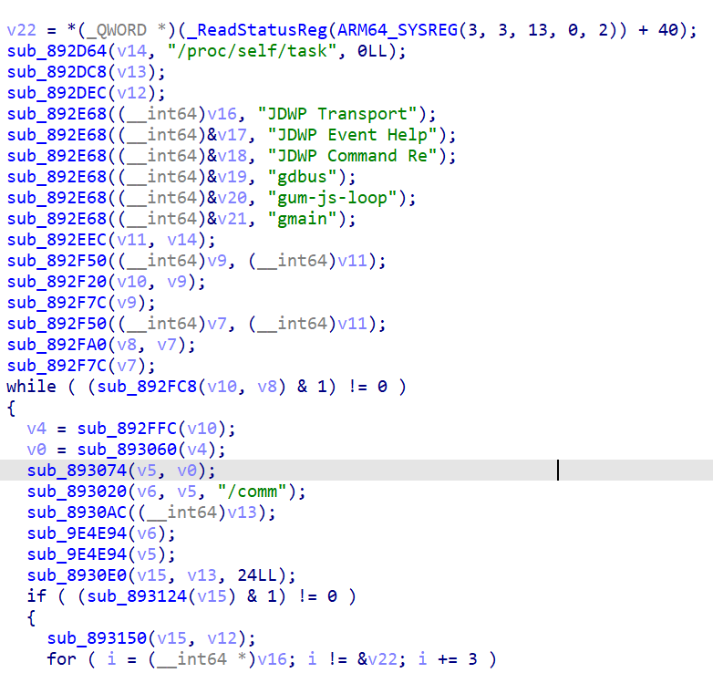

剩下的三个func 涉及到了信号量。执行顺序为func3→func2→func4

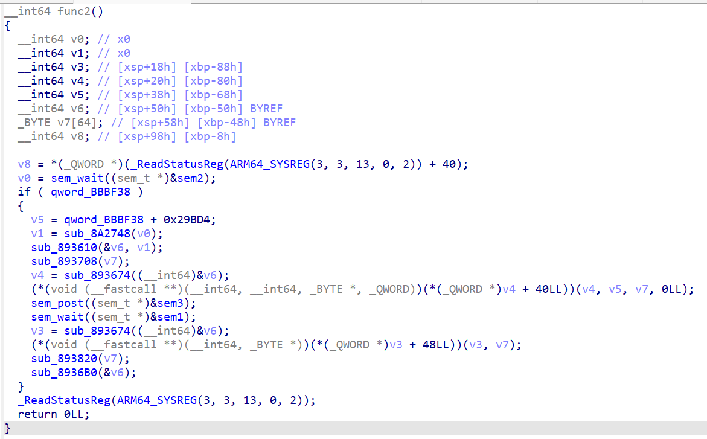

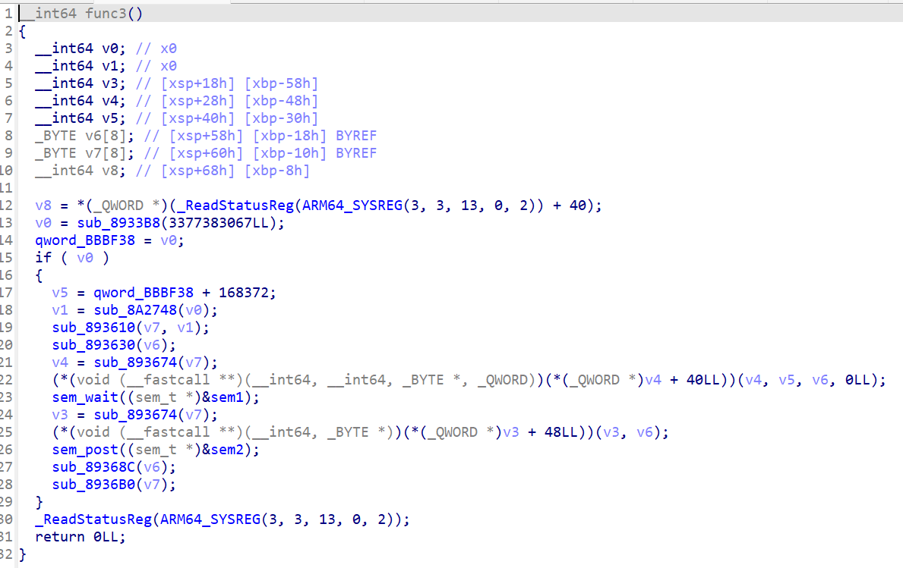

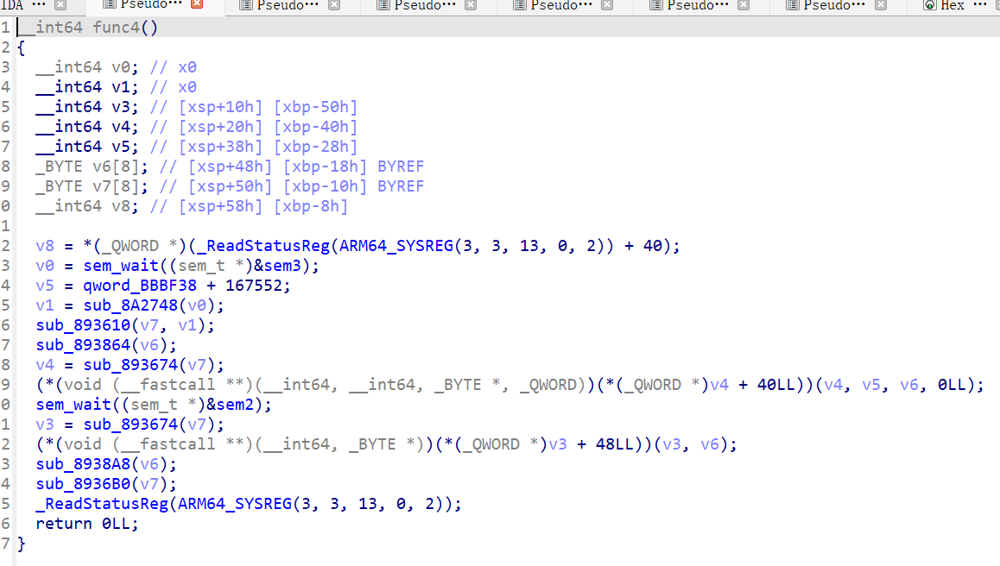

从func3 开始分析。根据hash 获取到对应的lib 库的基址，然后得到getkeysoundindex 函数地址，调用两个虚表函数，然后func2 启动。那么结合之前的猜测肯定就是hook 的逻辑。

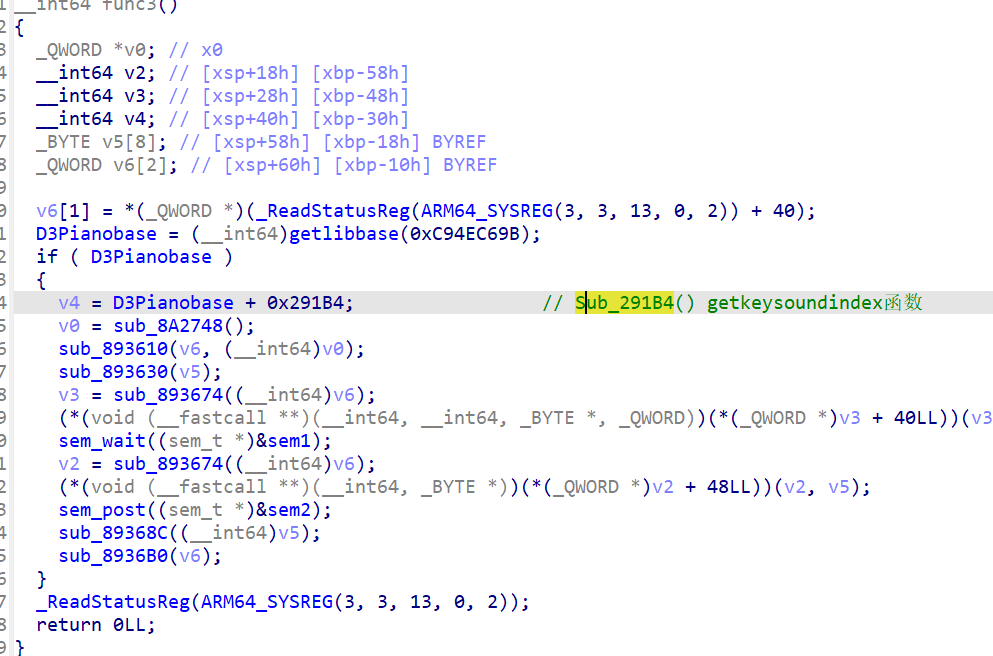

如果细心的话会发现这样的字符串，所以hook 的逻辑应该是通过frida 写的。gumpp是Frida 的C++接口，你可以在github 上找到源代码。

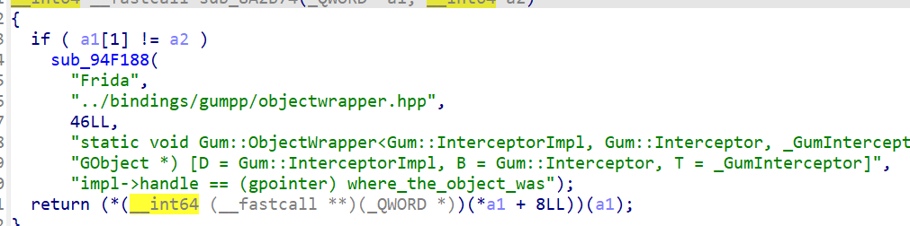

对于gumpp hook 一个函数的过程是这样的。那么其实那两个虚表函数一个就是attach 一个是detach

1. 创建拦截器，实现on_enter、on_leave 函数

2. 使用interceptor-进行attach/detach官方的示例文件创建拦截器部分的示例

```c
class BacktraceTestListener : public Gum::InvocationListener
{ // 创建拦截器，继承自InvocationListener，实现on_enter、on_leave。
public:
  BacktraceTestListener() // 构造函数，势例化backtracer
      : backtracer(Gum::Backtracer_make_accurate())
  {
  }
  // 实现on_enter 函数，在hook 函数被调用时执行
  virtual void on_enter(Gum::InvocationContext *context)
  {
    g_string_append_c(static_cast<GString *>(context->get_listener_function_data_ptr()),
                      '>');
    Gum::ReturnAddressArray return_addresses;
    //生成返回地址数组
    backtracer->generate(context->get_cpu_context(), return_addresses);
    g_assert_cmpuint(return_addresses.len, >=, 1);
#if !defined(HAVE_DARWIN) && !defined(HAVE_ANDROID)
    Gum::ReturnAddress first_address = return_addresses.items[0];
    Gum::ReturnAddressDetails rad;
    g_assert_true(Gum::ReturnAddressDetails_from_address(first_address, rad));
    g_assert_true(g_str_has_suffix(rad.function_name, "_can_get_stack_trace_from_invocation_context"));
    gchar *file_basename = g_path_get_basename(rad.file_name);
    g_assert_cmpstr(file_basename, ==, "backtracer.cxx");
    g_free(file_basename);
#endif
  }
  // 实现on_leave 函数，在hook 函数返回时执行
  virtual void on_leave(Gum::InvocationContext *context)
  {
    g_string_append_c(static_cast<GString *>(context->get_listener_function_data_ptr()),
                      '<');
  }
  Gum::RefPtr<Gum::Backtracer> backtracer; // backtracer 对象
};
```

那么很明显我们要找到拦截器的也就是Listener 的实现，直接字符串搜Listener

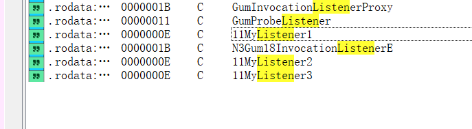

也可以点进这个函数找一下。

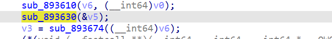

func3→MyListener1、func2→MyListener2、func4→MyListener3。func3 函数hook 函数sub291B4。修改了返回值，然后func2 运行。

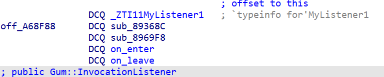

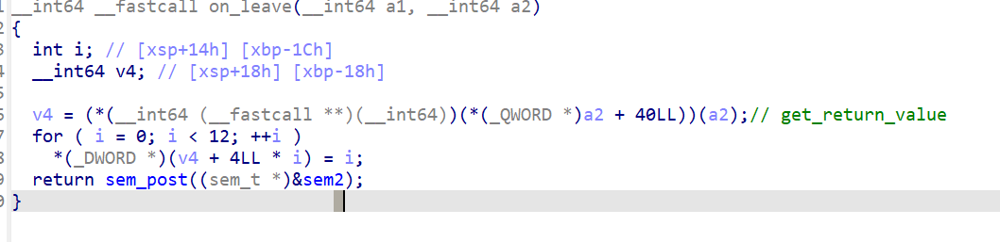

func2 hook 偏移0x29BD4，其实就是check 函数。

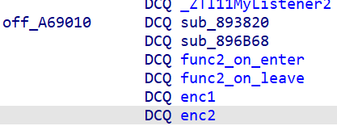

```c
__int64 __fastcall func2_on_enter(_QWORD *a1, __int64 a2)
{
  v16 = *(_QWORD *)(_ReadStatusReg(ARM64_SYSREG(3, 3, 13, 0, 2)) + 40);
  //调用 get_nth_argument_ptr(2) 获取第三个参数其实就是check(i)的i，也就是传进去的琴键序号
  v12 = (*(__int64 (__fastcall **)(__int64, __int64))(*(_QWORD *)a2 + 24LL))(a2, 2LL);
  v15 = 0;
  memset(v14, 0, sizeof(v14));
  //如果长度小于91
  if ( (unsigned __int64)length(a1 + 1) < 0x5B )
  {
    // CDEFGABdegab 根据序号push 音调
    result = push((__int64)(a1 + 1), (__int64)&aCdefgabdegab[v12]);
  }
  else //长度大于91 时
  {
    //先异或
    for ( i = 0; i <= 90; ++i )
    {
      v7 = byte_BBACC2[i];
      v2 = (_BYTE *)get(a1 + 1, i);
      *v2 ^= v7;
    }
    //然后根据异或后的字符串，获取到对应的音调的下标保存到qword_BBBF40
    for ( j = 0; j <= 90; ++j )
    {
      for ( k = 0; k <= 11; ++k )
      {
        v3 = (unsigned __int8 *)get(a1 + 1, j);
        if ( v3 == (unsigned __int8)aCdefgabdegab[k] )
          sub_8975C4((__int64)qword_BBBF40, (__int64)&k);
      }
    }
    //调用虚表函数1
    (*(void (__fastcall **)(_QWORD *))(a1 + 32LL))(a1);
    v4 = length(a1 + 1);
    //调用虚表函数2
    (*(void (__fastcall **)(_QWORD *, _OWORD *, __int64, _QWORD *, char *, __int64))(*a1 + 40LL))(
      a1,
      v14,
      v4,
      a1 + 4,
      aCdefgabdegab,
      0x221221LL);
    v5 = length(a1 + 1);
    //比较
    result = memcmp(&unk_BBAD40, v14, v5);
    if ( !(_DWORD)result )
      byte_BBBF00 = 1;
  }
  _ReadStatusReg(ARM64_SYSREG(3, 3, 13, 0, 2));
  return result;
}
```

on_leave 修改返回值

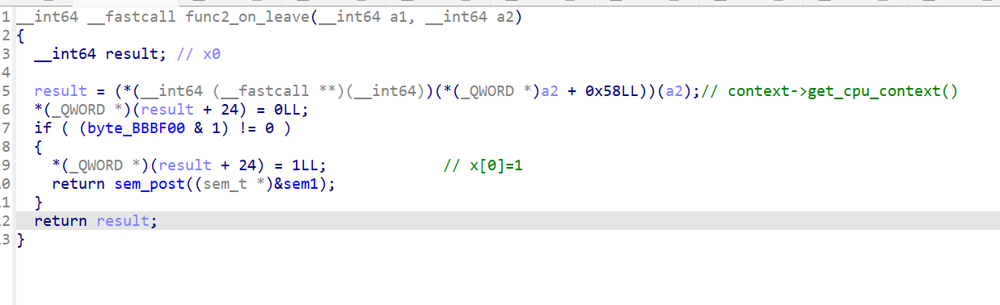

在func2 attach 上函数后，func4 执行。func4 hook 偏移0x28E80，也就是get_flag函数的tostr。

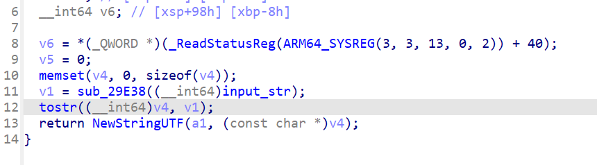

其实就是把func2_on_enter 函数里面根据异或加密后的音调在转换成12 进制数，丢给tostr。

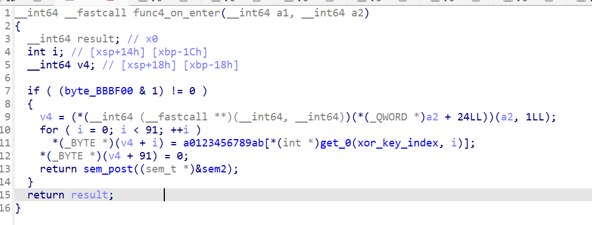

那么现在就需要分析两个虚表函数加密，然后写出解密获取到输入的音调数组转换成12 进制再转换成字符串输出就可以。那么来分析enc1 与enc2，enc1 函数有点抽象，先分析enc2 函数。很明显的salsa20 加密。

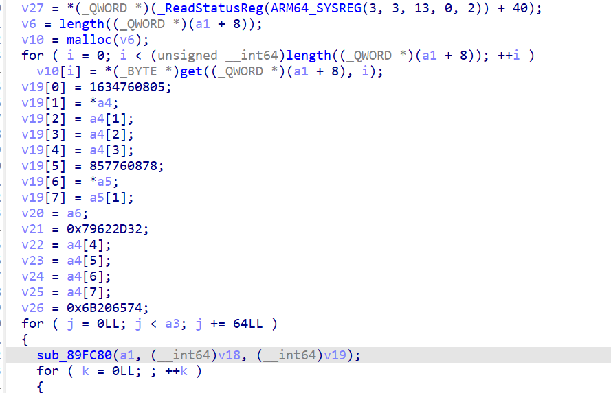

可以尝试先解密enc2 函数，key 是类成员，找到类的构造函数。

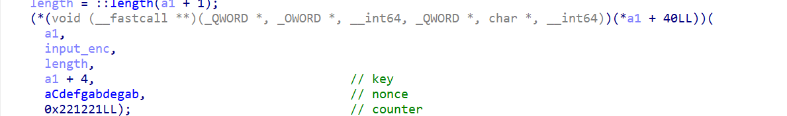

这就是key，被加密了，解密一下。

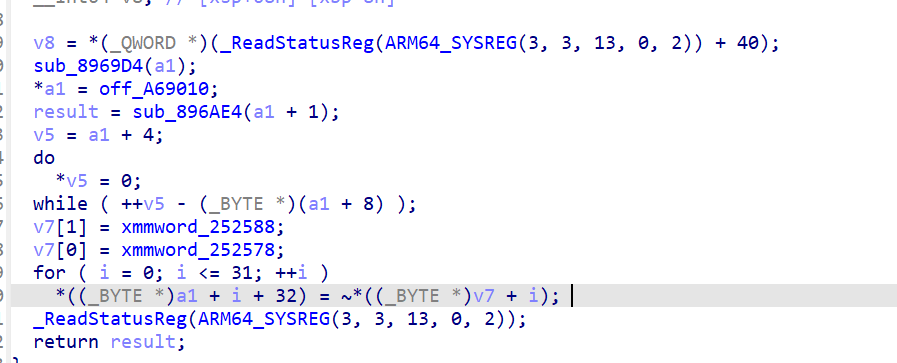

```
welCoME_70_D3c7F_2025-r3VERSE!!!
```

解密代码

```c
#include <cstdio>
#include <cstring>
#include <format>
#include <iostream>
#include <fstream>
#include <cstdint>
#include <vector>
#define ROTL(a, b) ((((uint32_t)(a)) << ((uint32_t)(b))) |
(((uint32_t)(a)) >> (32 - ((uint32_t)(b)))))
#define QUARTERROUND(a, b, c, d) \\
    a += b;                      \\
    d ^= a;                      \\
    d = ROTL(d, 16);             \\
    c += d;                      \\
    b ^= c;                      \\
    b = ROTL(b, 12);             \\
    a += b;                      \\
    d ^= a;                      \\
    d = ROTL(d, 8);              \\
    c += d;                      \\
    b ^= c;                      \\
    b = ROTL(b, 7);
unsigned char flag_enc[74] = {
    0x2E, 0xD2, 0xDF, 0x53, 0x41, 0xE6, 0x51, 0xA2, 0xD0, 0x8E,
0x43, 0x59, 0x6F, 0xC4, 0x15, 0xAD,
    0x97, 0xC2, 0x98, 0xBD, 0x11, 0x05, 0xFE, 0xFF, 0x96, 0x4C,
0xE8, 0x06, 0x50, 0x0E, 0x1D, 0xCA,
    0x0E, 0xB2, 0x18, 0xCA, 0x06, 0x54, 0x2E, 0xFA, 0xCD, 0x19,
0xD2, 0x9E, 0xDB, 0x9E, 0x33, 0xCC,
    0x5D, 0xAF, 0xED, 0x69, 0x4A, 0xEF, 0x17, 0xB8, 0xD8, 0x40,
0x14, 0x48, 0xCD, 0x37, 0xFC, 0xD0,
    0x14, 0x5C, 0x3C, 0x31, 0xC9, 0x15, 0xE6, 0xCF, 0x77, 0x28};
void salsa20_core(uint32_t out[16], const uint32_t in[16])
{
    uint32_t x[16];
    int i;
    for (i = 0; i < 16; ++i)
    {
        x[i] = in[i];
    }
    for (i = 0; i < 10; ++i)
    {
        // 列轮
        QUARTERROUND(x[0], x[4], x[8], x[12])
        QUARTERROUND(x[5], x[9], x[13], x[1])
        QUARTERROUND(x[10], x[14], x[2], x[6])
        QUARTERROUND(x[15], x[3], x[7], x[11])
        // 行轮
        QUARTERROUND(x[0], x[1], x[2], x[3])
        QUARTERROUND(x[5], x[6], x[7], x[4])
        QUARTERROUND(x[10], x[11], x[8], x[9])
        QUARTERROUND(x[15], x[12], x[13], x[14])
    }
    for (i = 0; i < 16; ++i)
    {
        out[i] = x[i] + in[i];
    }
}
void salsa20_encrypt(uint8_t *ciphertext, size_t length, const uint8_t *key, const uint8_t *nonce, uint64_t counter)
{
    uint32_t state[16];
    uint32_t block[16];
    size_t i, j;
    uint8_t *keystream = (uint8_t *)block;
    uint8_t *plaintext = (uint8_t *)malloc(74);
    for (int n = 0; n < 74; n++)
    {
        plaintext[n] = flag_enc[n];
    }
    // 初始化状态
    state[0] = 0x61707865;
    state[1] = *(uint32_t *)&key[0];
    state[2] = *(uint32_t *)&key[4];
    state[3] = *(uint32_t *)&key[8];
    state[4] = *(uint32_t *)&key[12];
    state[5] = 0x3320646e;
    state[6] = *(uint32_t *)&nonce[0];
    state[7] = *(uint32_t *)&nonce[4];
    state[8] = (uint32_t)(counter & 0xFFFFFFFF);
    state[9] = (uint32_t)(counter >> 32);
    state[10] = 0x79622d32;
    state[11] = *(uint32_t *)&key[16];
    state[12] = *(uint32_t *)&key[20];
    state[13] = *(uint32_t *)&key[24];
    state[14] = *(uint32_t *)&key[28];
    state[15] = 0x6b206574;
    for (i = 0; i < length; i += 64)
    {
        salsa20_core(block, state);
        for (j = 0; j < 64 && i + j < length; ++j)
        {
            ciphertext[i + j] = plaintext[i + j] ^ keystream[j];
        }
        // 更新计数器
        if (++state[8] == 0)
        {
            ++state[9];
        }
    }
}
int main()
{
    uint8_t key[] = "welCoME_70_D3c7F_2025-r3VERSE!!!";
    uint8_t nonce[] = "CDEFGABdegab";
    uint64_t counter = (uint64_t)0x221221;
    uint8_t ciphertext[74];
    salsa20_encrypt(ciphertext, sizeof(flag_enc), key, nonce, counter);
    for (int i = sizeof(flag_enc) - sizeof(ciphertext); i < sizeof(flag_enc); i++)
    {
        printf("%c", ciphertext[i]);
    }
    return 0;
}
```

能看到一些可见字符串，还需要分析enc1。我们观察到enc 的输入91 个字节，确只输出了74 个字节，可以猜测是某种压缩算法，结合enc2 解出的格式，应该是LZW压缩算法。可以去网上搞一份LZW 压缩代码去对着比较一下。（这里出题人由于代码编写失误写错了压缩算法的一个变量类型意外的定义成了uint8，导致LZW 压缩算法不是一个完全正确的LZW，然后意外发现非常有反AI 的效果而且可以写出解压缩代码，所以打算保留。）那么直接解压缩就好了。

```c
void LZW_decode(std::vector<uint8_t> &compressed)
{
    std::unordered_map<int, std::vector<uint8_t>> dictionary;
    for (int i = 0; i < 256; ++i)
    {
        dictionary[i] = {static_cast<uint8_t>(i)};
    }
    std::vector<uint8_t> codes;
    for (uint8_t byte : compressed)
    {
        codes.push_back(static_cast<int>(byte));
    }
    std::vector<uint8_t> result;
    uint8_t next_code = 0;
    if (codes.empty())
        return;
    uint8_t prev_code = codes[0];
    result.insert(result.end(), dictionary[prev_code].begin(), dictionary[prev_code].end());
    for (size_t i = 1; i < codes.size(); ++i)
    {
        uint8_t curr_code = codes[i];
        std::vector<uint8_t> entry;
        if (curr_code == next_code)
        {
            entry = dictionary[prev_code];
            entry.push_back(dictionary[prev_code][0]);
        }
        else if (dictionary.count(curr_code))
        {
            entry = dictionary[curr_code];
        }
        else
        {
            std::cerr << "Error: Invalid code " << curr_code << std::endl;
            return;
        }
        result.insert(result.end(), entry.begin(), entry.end());
        std::vector<uint8_t> new_entry = dictionary[prev_code];
        new_entry.push_back(entry[0]);
        dictionary[next_code++] = new_entry;
        prev_code = curr_code;
    }
    std::string decoded_string(result.begin(), result.end());
    std::cout << decoded_string << std::endl;
}
int main()
{
    uint8_t key[] = "welCoME_70_D3c7F_2025-r3VERSE!!!";
    uint8_t nonce[] = "CDEFGABdegab";
    uint64_t counter = (uint64_t)0x221221;
    uint8_t ciphertext[74];
    salsa20_encrypt(ciphertext, sizeof(flag_enc), key, nonce, counter);
    // for (int i = sizeof(flag_enc) - sizeof(ciphertext); i < sizeof(flag_enc); i++)
    // {
    //     printf("0x%02x,", ciphertext[i]);
    // }
    std::vector<uint8_t> inputkeysname;
    // inputkeysname = {
    //     0x62, 0x45, 0x62, 0x41, 0x41, 0x43, 0x45, 0x42, 0x43, 0x47, 0x09, 0x42,
    //     0x64, 0x42, 0x45, 0x05, 0x43, 0x62, 0x64, 0x61, 0x0e, 0x08, 0x47, 0x42,
    //     0x41, 0x61, 0x18, 0x65, 0x0c, 0x45, 0x65, 0x44, 0x64, 0x47, 0x41, 0x64,
    //     0x44, 0x61, 0x42, 0x67, 0x1b, 0x1b, 0x46, 0x46, 0x42, 0x46, 0x65, 0x45,
    //     0x61, 0x46, 0x47, 0x64, 0x46, 0x01, 0x41, 0x34, 0x36, 0x67, 0x64, 0x67,
    //     0x44, 0x42, 0x3c, 0x27, 0x67, 0x67, 0x02, 0x65, 0x46, 0x61, 0x67, 0x13,
    //     0x1b, 0x02
    // };
    for (int i = 0; i < sizeof(ciphertext); i++)
    {
        inputkeysname.push_back(ciphertext[i]);
    }
    LZW_decode(inputkeysname);
    return 0;
}
```

```text
bEbAACEBCGGGBdBECECbdaECCGGBAaAaedBEeDdGAdDaBgededFFBFeEaFGdFEbAFEAF
gdgDBDBgeggbAeFagaEedbA
```

```python
enc="bEbAACEBCGGGBdBECECbdaECCGGBAaAaedBEeDdGAdDaBgededFFBFeEaFGdFEbAFEAFgdgDBDBgeggbAeFagaEedbA"
keys="CDEFGABdegab"
twelve="0123456789AB"
tmp=""
for i in enc:
       tmp+=twelve[keys.index(i)]
tmp=int(tmp,12)
print(long_to_bytes(tmp).decode())
```

```text
Fly1ng_Pi@n0_Key$_play_4_6e@utiful~melody
```

小彩蛋如果通过正常输入得到flag 的话，你将会听到周杰伦的《稻香》输入如下：

```
eCeeFFFFGeeCeeFFFFGeaGFeFeFeGeGbbbbbbbbGFeFGGGGGGCCeeeeFFFeGGGbbbbbb
bbGFeFGGGGGGCCeeeeFFFee
```

## 方法总结

- 核心技巧：不要被表层 RSA fake flag 误导，要检查 native 库的 `init_array` 和额外 so，识别隐藏 hook 后恢复真正参与校验和出 flag 的加密链。
- 识别信号：APK 中一个 so 明显做业务逻辑，另一个看似无关的 so 却被链接并有线程、信号量、Listener、gumpp/Frida 字符串时，应怀疑运行时 hook。
- 复用要点：先还原按键序号到音名的映射，再解 Salsa20 得到中间序列，最后按题目里的异常 LZW 变体解压并转回 12 进制输入。
