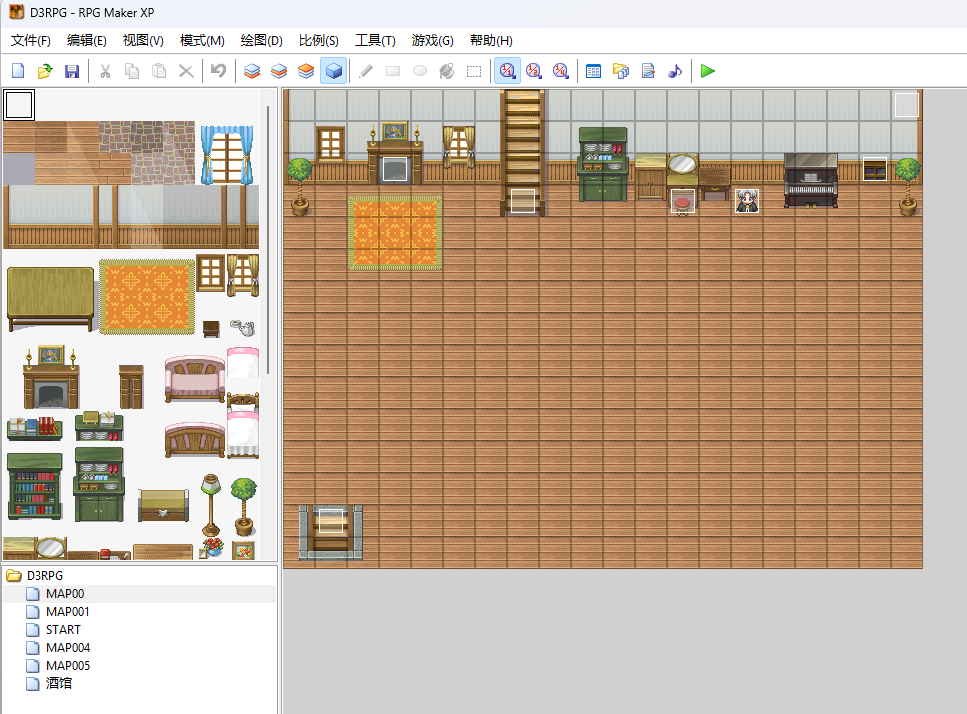
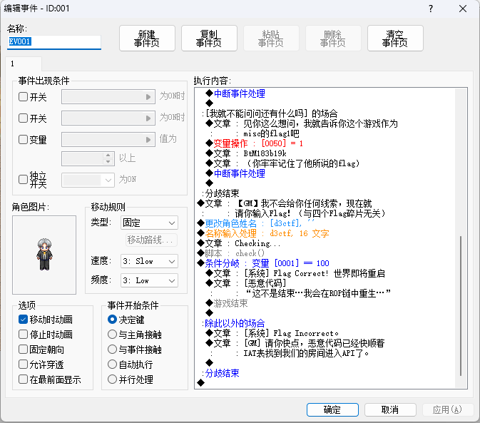

# d3rpg-revenge

## 题目简述

附件与 `d3rpg-signin` 相同，但本题重点是 GM 输入框背后的脚本和 DLL 校验。游戏基于 RPG Maker XP / RGSS，资源包被改造成 `d3rpg.d3ssad`，实际是修改过文件头和 magic 迭代算法的 RGSSAD 归档。解题有两条主线：预期路线是脱壳 RGSS 引擎并还原资源包，分析 Ruby 脚本中的修改版 XXTEA；非预期路线是直接在内存中搜索明文 Ruby 脚本和 `check_flag` 调用。

## 解题过程

附件与 d3rpg-signin 相同，但这次的主题是 GM 问题解决。与 GM 沟通后，GM 会打开一个输入框，要求您输入 Flag，然后进行检查。我们通过IDA 分析了secret_dll.dll，发现里面确实有flag 函数，但是Base64 编码后和答案差不多，解码后发现这个Base64 并不是flag，所以主要的加密逻辑应该在游戏中，于是有了以下思路：1.对游戏进行脱壳（预期解）分析算法及DLL 调用解开flag，2.CheatEngine 搜索脚本（预期）直接获取算法。先说一下意外的解决办法：由于这个游戏引擎运行时没有内存保护，所有脚本都是明文存储在内存中的，我们可以直接搜索DLL 导出函数“check_flag”，然后观察脚本上下文，就能知道算法，从而解出Flag。以下是该问题的预期解决方案：首先，我们使用IDA 分析d3rpg.dll。从字符串中我们很容易看出这是一个由RGSS 引擎开发的游戏。经过网上搜索，我们可以知道这是一个由RPG Maker XP 开发的游戏。我们下载这个软件并随机打包一个程序，可以知道这个DLL 的原始名称是“RGSS103J.dll”。由于这个DLL 带有压缩壳，作者首先对这个DLL 进行解包，然后进行魔法修改算法，最终得到这个DLL。

IDA 字符串中可以看到 `RGSS`、`RTP`、`Ruby`、`module` 等 RPG Maker / RGSS 运行时相关标志，因此可以确定资源和脚本层才是分析重点。

然后，我们分析了“secret_dll.dll”和“d3rpg.exe”。它们都添加了UPX 壳，但没有进行其他修改。我们只需使用UPX 即可移除它们。d3rpg.exe 没有什么值得分析的，它只是一个绘制窗口并加载DLL 的程序。在secret_dll.dll 中，只有文本比较，所以我们的分析重点是如何脱壳游戏。d3rpg.d3ssad 实际上是修改了前两个字节的d3rpg.rgssad。我们动态调试d3rpg.exe 并破坏CreateFileW，以找到该程序解密.d3ssad 的代码片段（位于d3rpg.dll 中），并定位关键代码。

```c
int __cdecl sub_1000A7E0(LPCSTR lpFileName)
{
  int v2; // esi
  int v3; // edi
  int v4; // ebx
  int i; // eax
  LONG v6; // edi
  char Destination[272]; // [esp+0h] [ebp-1011Ch] BYREF
  char v8[8]; // [esp+110h] [ebp-1000Ch] BYREF
  char Source[65536]; // [esp+118h] [ebp-10004h] BYREF
  if ( !*lpFileName )
    return 1;
  // modified0：文件头
  strcpy(v8, "D3SSAD");
  v8[7] = 1;
  sub_10088B70(lpFileName, 1);
  if ( !dword_1012E55C )
    return 0;
  sub_100889D0(Source, 8);
  if ( memcmp(Source, v8, 8u) )
    return 0;
  v2 = -877986834; // modified1 ：magic
  memset(Destination, 0, sizeof(Destination));
  if ( (unsigned int)sub_100889D0(Source, 4) < 4 )
    return 1;
  while ( 1 )
  {
    v3 = v2 ^ *(_DWORD *)Source;
    v4 = 9 * v2 + 114; // modified2 ：v*7+3 -> v*9 + 114
    if ( (v2 ^ *(_DWORD *)Source) >= 260 )
      break;
    if ( sub_100889D0(Source, v2 ^ *(_DWORD *)Source) >= v3 )
    {
      for ( i = 0; i < v3; v4 = 9 * v4 + 114 ) // modified2：v*7+3 -> v*9 + 114
        Source[i++] ^= v4;
      Source[v3] = 0;
      strncpy(Destination, Source, 0x104u);
      if ( (unsigned int)sub_100889D0(Source, 4) >= 4 )
      {
        v6 = v4 ^ *(_DWORD *)Source;
        v2 = 9 * v4 + 114; // modified2：v*7+3 -> v*9 + 114
        *(_DWORD *)&Destination[260] = sub_100889F0(0, 1);
        *(_DWORD *)&Destination[264] = v6;
        *(_DWORD *)&Destination[268] = v2;
        sub_1000A730(Destination);
        sub_100889F0(v6, 1);
        memset(Destination, 0, sizeof(Destination));
        if ( (unsigned int)sub_100889D0(Source, 4) >= 4 )
          continue;
      }
    }
    return 1;
  }
  return 0;
}
```

其实，RUBY 的 Load 中也有修改过的 v*7+3 -> v*9 + 114，但由于比赛时间较短，并且考虑到选手的情绪，这两点没有修改成不同的算法。下面的 secret_dll.dll 也只有一个 strcmp 函数。我原本想用 inline hook 动态修改这里的代码，可惜了。我们也可以使用未修改的 RGSS103J.dll，去掉压缩壳后再与这个 .dll 进行比较，找到关键点。具体的 DLL 脱壳和 Bindiff 技术这里就不再赘述了。

参考的 rgssad 解包脚本来自 `https://github.com/luxrck/rgssad`。这个工具的关键作用是解析 RPG Maker 的 RGSSAD/RGSS2A/RGSS3A 资源归档，按照文件头中的 version 和 magic 迭代值解密文件名与文件内容。本题不能直接使用原脚本，因为题目把文件头改成 `D3SSAD`，并把 magic 迭代从原始的 `v * 7 + 3` 改成 `v * 9 + 114`，所以需要在脚本中同步修改文件头、初始 magic 和 `advance_magic`。

用这个修改一下，根据 IDA 的逆向结果修改一些小点。修改后的 Rgssad 脱壳代码

```rust
use std::convert::TryInto;
use std::env;
use std::fs;
use std::fs::File;
use std::io::Error;
use std::io::ErrorKind;
use std::io::Read;
use std::io::Seek;
use std::io::SeekFrom;
use std::io::Write;
use std::path::Path;
extern crate regex;
use regex::Regex;
static __VERSION__: &str = env!("CARGO_PKG_VERSION");
// 错误信息
static E_INVALIDHDR: &str = "Input file header mismatch.";
static E_INVALIDVER: &str = "Not supported version (must be 1-3 /10).";
static E_INVALIDMGC: &str = "Magic number read failed.";
fn advance_magic(magic: &mut u32) -> u32 {
    let old = *magic;
    *magic = magic.wrapping_mul(9).wrapping_add(114);
    old
}
fn ru32(stream: &mut File, result: &mut u32) -> Result<(), Error>
{
    let mut buf = [0; 4];
    stream.read_exact(&mut buf)?;
    *result = u32::from_le_bytes(buf);
    Ok(())
}
fn wu32(stream: &mut File, data: u32) -> Result<(), Error> {
    let buf = data.to_le_bytes();
    stream.write_all(&buf)
}
/// 持续读取，直到缓冲区填满或遇到 EOF。
fn read_until_full(stream: &mut File, buf: &mut [u8]) -> Result<usize, Error> {
    let mut nb = 0;
    loop {
        match stream.read(&mut buf[nb..]) {
            Ok(0) => return Ok(nb),
            Ok(n) => nb += n,
            Err(ref e) if e.kind() == ErrorKind::Interrupted => continue,
            Err(e) => return Err(e),
        }
    }
}
struct EntryData {
    offset: u32,
    magic: u32,
    size: u32,
}
struct Coder {
    buf: Vec<u8>,
}
impl Coder {
    /// 将文件数据从 stream_in 加密 / 解密后写入 stream_out。
    fn copy(
        &mut self,
        stream_in: &mut File,
        stream_out: &mut File,
        data: &EntryData,
    ) -> Result<(), Error> {
        assert!(self.buf.len() % 4 == 0); // 用于对齐
        stream_in.seek(SeekFrom::Start(data.offset as u64))?;
        let mut magic = data.magic;
        let mut size = data.size; // 剩余待读取字节数
        loop {
            let limit = self.buf.len().min(size as usize);
            let count = read_until_full(stream_in, &mut self.buf[..limit])?;
            if count == 0 {
                return Ok(());
            }
            let buf = &mut self.buf[..count];
            let (prefix, middle, suffix) = unsafe { buf.align_to_mut::<u32>() };
            assert!(prefix.len() == 0); // assume buf is aligned
            for i in 0..middle.len() {
                let mut w = u32::from_le(middle[i]);
                w ^= advance_magic(&mut magic);
                middle[i] = w.to_le();
            }
            for i in 0..suffix.len() {
                suffix[i] ^= (magic >> (i * 8)) as u8;
            }
            size -= count as u32;
            stream_out.write_all(buf)?;
        }
    }
}
struct Entry {
    name: String,
    data: EntryData,
}
struct RGSSArchive {
    magic: u32,
    version: u8,
    entry: Vec<Entry>,
    stream: File,
}
impl RGSSArchive {
    fn create(location: &str, version: u8) -> Result<Self, Error> {
        let mut stream = File::create(location)?;
        if (version < 1 || version > 3) && version != 10 {
            return Err(Error::new(ErrorKind::InvalidData, E_INVALIDVER));
        }
        if version == 10 {
            stream.write_all(&[0x9E, 0x83, 0x42, 0x0E, 0x4E, 0xBD,
0xDC, 0x6D])?;
        } else {
            stream.write_all(&[b'D', b'3', b'S', b'S', b'A', b'D',
b'\0', version])?;
        }
        let magic = if version == 10 {
            0x2B804BE2u32
        } else if version == 3 {
            0u32
        } else {
            0xCBAAFBEEu32
        };
        let entry = vec![];
        Ok(RGSSArchive {
            magic,
            version,
            entry,
            stream,
        })
    }
    fn open(location: &str) -> Result<Self, Error> {
        let mut stream = File::open(location)?;
        let mut header = [0u8; 8];
        stream.read_exact(&mut header)?;
        if &header[..8] == [0x9E, 0x83, 0x42, 0x0E, 0x4E, 0xBD,
0xDC, 0x6D] {
            return RGSSArchive::open_rgssad(stream, 10u8);
        }
        if &header[..6] != b"D3SSAD" {
            return Err(Error::new(ErrorKind::InvalidData, E_INVALIDHDR));
        }
        // 检查 rgssad 文件版本。
        match header[7] {
            1 | 2 => RGSSArchive::open_rgssad(stream, header[7]),
            3 => RGSSArchive::open_rgss3a(stream, header[7]),
            _ => Err(Error::new(ErrorKind::InvalidData, E_INVALIDVER)),
        }
    }
    fn open_rgssad(mut stream: File, version: u8) -> Result<Self, Error> {
        let mut magic = match version {
            10u8 => 0x2B804BE2u32,
            _ => 0xCBAAFBEEu32,
        };
        let mut entry = vec![];
        loop {
            let mut name_len: u32 = 0;
            if ru32(&mut stream, &mut name_len).is_err() {
                break;
            }
            name_len ^= advance_magic(&mut magic);
            let mut name = vec![0u8; name_len as usize];
            stream.read_exact(&mut name)?;
            for i in 0..(name_len as usize) {
                name[i] ^= advance_magic(&mut magic) as u8;
                if name[i] == b'\\' {
                    name[i] = b'/'
                }
            }
            let name = String::from_utf8(name);
            if name.is_err() {
                break;
            }
            let name = name.unwrap();
            let mut data = EntryData {
                size: 0,
                offset: 0,
                magic: 0,
            };
            if ru32(&mut stream, &mut data.size).is_err() {
                break;
            }
            data.size ^= advance_magic(&mut magic);
            data.offset = stream.seek(SeekFrom::Current(0))? as u32;
            data.magic = magic;
            stream.seek(SeekFrom::Current(data.size as i64))?;
            entry.push(Entry { name, data });
        }
        stream.seek(SeekFrom::Start(0))?;
        Ok(RGSSArchive {
            magic,
            version,
            entry,
            stream,
        })
    }
    fn open_rgss3a(mut stream: File, version: u8) -> Result<Self, Error> {
        let mut magic = 0u32;
        let mut entry = vec![];
        if ru32(&mut stream, &mut magic).is_err() {
            return Err(Error::new(ErrorKind::InvalidData, E_INVALIDMGC));
        }
        magic = magic.wrapping_mul(9).wrapping_add(3);
        loop {
            let mut offset: u32 = 0;
            let mut size: u32 = 0;
            let mut start_magic: u32 = 0;
            let mut name_len: u32 = 0;
            if ru32(&mut stream, &mut offset).is_err() {
                break;
            };
            offset ^= magic;
            if offset == 0 {
                break;
            }
            if ru32(&mut stream, &mut size).is_err() {
                break;
            }
            size ^= magic;
            if ru32(&mut stream, &mut start_magic).is_err() {
                break;
            }
            start_magic ^= magic;
            if ru32(&mut stream, &mut name_len).is_err() {
                break;
            }
            name_len ^= magic;
            let mut name = vec![0u8; name_len as usize];
            stream.read_exact(&mut name)?;
            for i in 0..(name_len as usize) {
                name[i] ^= (magic >> 8 * (i % 4)) as u8;
                if name[i] == b'\\' {
                    name[i] = b'/'
                }
            }
            let name = String::from_utf8(name);
            if name.is_err() {
                break;
            }
            let name = name.unwrap();
            let data = EntryData {
                size,
                offset,
                magic: start_magic,
            };
            entry.push(Entry { name, data });
        }
        stream.seek(SeekFrom::Start(0))?;
        Ok(RGSSArchive {
            magic,
            version,
            entry,
            stream,
        })
    }
    fn write_entries(&mut self, root: &Path) -> Result<(), Error> {
        match self.version {
            1 | 2 | 10 => self.write_entries_rgssad(root),
            3 => self.write_entries_rgss3a(root),
            _ => Err(Error::new(ErrorKind::InvalidData, E_INVALIDVER)),
        }
    }
    fn write_entries_rgssad(&mut self, root: &Path) -> Result<(), Error> {
        let mut coder = Coder {
            buf: vec![0u8; 8192],
        };
        for &Entry { ref name, ref data } in &self.entry {
            println!("Packing: {}", name);
            let mut name_len: u32 = name.len().try_into().unwrap();
            name_len ^= advance_magic(&mut self.magic);
            wu32(&mut self.stream, name_len)?;
            let mut name_buf = name.as_bytes().to_vec();
            for i in 0..name_buf.len() {
                if name_buf[i] == b'/' {
                    name_buf[i] = b'\\'
                }
                name_buf[i] ^= advance_magic(&mut self.magic) as u8;
            }
            self.stream.write_all(&name_buf)?;
            let mut size = data.size;
            size ^= advance_magic(&mut self.magic);
            wu32(&mut self.stream, size)?;
            let mut file = File::open(root.join(name))?;
            coder.copy(
                &mut file,
                &mut self.stream,
                &EntryData {
                    offset: 0,
                    size: data.size,
                    magic: self.magic,
                },
            )?;
        }
        Ok(())
    }
    fn write_entries_rgss3a(&mut self, root: &Path) -> Result<(), Error> {
        // 布局如下
        //   +------+-----+-------+------+------+---+------+ //   |Header|Magic|Entries|File 1|File 2|...|File n|
        //   +------+-----+-------+------+------+---+------+ // 先计算 Entries 末尾的偏移
        let mut off: u32 = 8 + 4; // Header + Magic
        for &Entry { ref name, .. } in &self.entry {
            // 每个 entry 为 16 字节加文件名长度
            let name_len: u32 = name.len().try_into().unwrap();
            off = off.checked_add(name_len).unwrap();
            off = off.checked_add(16).unwrap();
        }
        off = off.checked_add(4).unwrap(); // 终止 entry 列表
        // 接着计算每个 entry 的偏移。
        for entry in &mut self.entry {
            entry.data.offset = off;
            off = off.checked_add(entry.data.size).unwrap();
            // 也为每个 entry 选择一个 magic，这里可以自由选择。
            entry.data.magic = 0xCBAAFBEEu32;
        }
        // 最后全部写出。
        wu32(&mut self.stream, self.magic)?;
        self.magic = self.magic.wrapping_mul(9).wrapping_add(3);
        for &Entry { ref name, ref data } in &self.entry {
            wu32(&mut self.stream, data.offset ^ self.magic)?;
            wu32(&mut self.stream, data.size ^ self.magic)?;
            wu32(&mut self.stream, data.magic ^ self.magic)?;
            wu32(&mut self.stream, name.len() as u32 ^ self.magic)?;
            let mut name_buf = name.as_bytes().to_vec();
            for i in 0..name_buf.len() {
                if name_buf[i] == b'/' {
                    name_buf[i] = b'\\'
                }
                name_buf[i] ^= (self.magic >> 8 * (i % 4)) as u8;
            }
            self.stream.write_all(&name_buf)?;
        }
        wu32(&mut self.stream, 0u32 ^ self.magic)?;
        let mut coder = Coder {
            buf: vec![0u8; 8192],
        };
        for &Entry { ref name, ref data } in &self.entry {
            println!("Packing: {}", name);
            let mut file = File::open(root.join(name))?;
            coder.copy(
                &mut file,
                &mut self.stream,
                &EntryData {
                    offset: 0,
                    size: data.size,
                    magic: data.magic,
                },
            )?;
        }
        Ok(())
    }
}
fn usage() {
    println!(
        "Extract rgssad/rgss2a/rgss3a files.Commands:help version list        <archive>unpack      <archive> <folder> [<filter>]pack        <folder> <archive> [<version>]"
    );
}
fn list(archive: RGSSArchive) {
    for Entry { name, data } in archive.entry {
        println!(
            "{}: EntryData {{ size: {}, offset: {}, magic: {} }}",
            name, data.size, data.offset, data.magic
        );
    }
}
fn pack(src: &str, out: &str, version: u8) {
    fn walkdir(archive: &mut RGSSArchive, d: &Path, r: &Path) {
        for entry in fs::read_dir(&d).unwrap() {
            let entry = entry.unwrap();
            let path = entry.path();
            if path.is_dir() {
                walkdir(archive, &path, r);
            } else {
                let name = path.strip_prefix(r).unwrap().to_str().unwrap();
                let size = fs::metadata(&path).unwrap().len();
                let size: u32 = size.try_into().unwrap();
                archive.entry.push(Entry {
                    name: name.to_string(),
                    data: EntryData {
                        size,
                        offset: 0, // 稍后计算
                        magic: 0,  // 稍后计算
                    },
                });
            }
        }
    };
    let root = Path::new(src);
    if !root.is_dir() {
        eprintln!("FAILED: source is not a directory.");
        return;
    }
    let mut archive = match RGSSArchive::create(out, version) {
        Ok(x) => x,
        Err(e) => {
            eprintln!("FAILED: unable to create output file. {}", e);
            return;
        }
    };
    // 第一遍：收集文件名和大小
    walkdir(&mut archive, root, root);
    // 第二遍：写入文件数据。
    if let Err(e) = archive.write_entries(root) {
        eprintln!("FAILED: unable to write archive. {}", e);
        return;
    }
}
fn unpack(mut archive: RGSSArchive, dir: &str, filter: &str) {
    fn create(location: String) -> File {
        let path = Path::new(location.as_str());
        fs::create_dir_all(path.parent().unwrap()).unwrap();
        File::create(path.to_str().unwrap()).unwrap()
    }
    let entries = archive.entry.iter();
    let filter = match Regex::new(filter) {
        Ok(re) => re,
        Err(_) => {
            eprintln!("FAILED: Invalid regex filter: {}", filter);
            return;
        }
    };
    let mut coder = Coder {
        buf: vec![0u8; 8192],
    };
    for Entry { name, data } in entries {
        if !filter.is_match(name) {
            continue;
        }
        println!("Extracting: {}", name);
        let mut file = create(format!("{}/{}", dir, name));
        if let Err(err) = coder.copy(&mut archive.stream, &mut file, data) {
            eprintln!("FAILED: key save failed, {}", err.to_string());
            return;
        }
    }
}
fn main() {
    let args: Vec<String> = env::args().collect();
    /*
    let args = vec![
        "reversed".to_string(),
        "unpack".to_string(),
r###"C:\Users\Administrator\Desktop\MarioTheMusicBoxRemastered_v10 3\Bins\Remastered.ari"###
            .to_string(),
r###"C:\Users\Administrator\Desktop\MarioTheMusicBoxRemastered_v10 3\unpack"###.to_string(),
    ];
     */
    if args.len() < 2 {
        usage();
        return;
    }
    match args[1].as_str() {
        "help" => usage(),
        "version" => {
            assert!(args.len() == 2);
            println!("version: {}", __VERSION__);
        }
        "list" => {
            assert!(args.len() == 3);
            let archive = RGSSArchive::open(args[2].as_str());
            if let Err(err) = archive {
                eprintln!("FAILED: file parse failed, {}", err.to_string());
                return;
            }
            let archive = archive.unwrap();
            list(archive);
        }
        "unpack" => {
            assert!(args.len() > 3 && args.len() < 6);
            let archive = RGSSArchive::open(args[2].as_str());
            if let Err(err) = archive {
                eprintln!("FAILED: file parse failed, {}", err.to_string());
                return;
            }
            let archive = archive.unwrap();
            unpack(
                archive,
                args[3].as_str(),
                if args.len() == 5 {
                    args[4].as_str()
                } else {
                    ".*"
                },
            );
        }
        "pack" => {
            assert!(args.len() > 3 && args.len() < 6);
            let mut version = if args[3].ends_with(".ari") {
                10
            } else if args[3].ends_with(".rgss3a") {
                3
            } else if args[3].ends_with(".rgss2a") {
                2
            } else {
                1
            };
            if args.len() == 5 {
                version = match args[4].parse() {
                    Ok(v) => v,
                    Err(_) => {
                        eprintln!("FAILED: {}", E_INVALIDVER);
                        return;
                    }
                }
            };
            pack(args[2].as_str(), args[3].as_str(), version);
        }
        _ => usage(),
    }
}
```

解压后您可以获得以下资源。

```text
解包后主要得到 Data、Graphics、res 等资源目录。
```

我们可以从d3rpg.ini 中发现Scripts 是Unknown（文件名）。

```ini
[Game]
Library=d3rpg.dll
Scripts=Unknown
Title=d3rpg
```

将 Unknown 改为 Scripts.rxdata，放入 Data 文件夹，然后将 res 目录复制到游戏文件夹，删除加密文件（d3rpg.d3ssad），然后使用 RPG Maker XP 打开游戏项目。注意：您需要先新建或从新项目复制 Game.rxproj 文件到当前游戏目录，然后才能使用 RPG Maker XP 打开它。



打开脚本界面，在GM NPC 中找到check()。



“Scene_Loads”（其实是 XXTEA，只是一个假的名字）代码片段：

```ruby
#==============================================================================
# ■ Scene_Loads
#------------------------------------------------------------------------------
#  处理游戏内部画面的类。
#==============================================================================
module Scene_RPG
  class Secret_Class
    DELTA = 0x1919810 | (($de1ta + 1) * 0xf0000000)
    def initialize(new_key)
      @key = str_to_longs(new_key)
      if @key.length < 4
        @key.length.upto(4) { |i| @key[i] = 0 }
      end
    end
    def self.str_to_longs(s, include_count = false)
      s = s.dup
      length = s.length
      ((4 - s.length % 4) & 3).times { s << "\0" }
      unpacked = s.unpack('V*').collect { |n| int32 n }
      unpacked << length if include_count
      unpacked
    end
    def str_to_longs(s, include_count = false)
      self.class.str_to_longs s, include_count
    end
    def self.longs_to_str(l, count_included = false)
      s = l.pack('V*')
      s = s[0...(l[-1])] if count_included
      s
    end
    def longs_to_str(l, count_included = false)
      self.class.longs_to_str l, count_included
    end
    def self.int32(n)
      n -= 4_294_967_296 while (n >= 2_147_483_648)
      n += 4_294_967_296 while (n <= -2_147_483_648)
      n.to_i
    end
    def int32(n)
      self.class.int32 n
    end
    def mx(z, y, sum, p, e)
      int32(
        ((z >> 5 & 0x07FFFFFF) ^ (y << 2)) + ((y >> 3 & 0x1FFFFFFF) ^ (z << 4))
      ) ^ int32((sum ^ y) + (@key[(p & 3) ^ e] ^ z))
    end
    def self.encrypt(key, plaintext)
      self.new(key).encrypt(plaintext)
    end
    def encrypt(plaintext)
      return '' if plaintext.length == 0
      v = str_to_longs(plaintext, true)
      v[1] = 0 if v.length == 1
      n = v.length - 1
      z = v[n]
      y = v[0]
      q = (6 + 52 / (n + 1)).floor
      sum = $de1ta * DELTA
      p = 0
      while(0 <= (q -= 1)) do
        sum = int32(sum + DELTA)
        e = sum >> 2 & 3
        n.times do |i|
          y = v[i + 1];
          z = v[i] = int32(v[i] + mx(z, y, sum, i, e))
          p = i
        end
        p += 1
        y = v[0];
        z = v[p] = int32(v[p] + mx(z, y, sum, p, e))
      end
      longs_to_str(v).unpack('a*').pack('m').delete("\n")
    end
    def self.decrypt(key, ciphertext)
      self.new(key).decrypt(ciphertext)
    end
  end
end
def validate_flag(input_flag)
  c_flag = input_flag + "\0"
  result = $check_flag.call(c_flag)
  result == 1
end
def check
  flag = $game_party.actors[0].name
  key = Scene_RPG::Secret_Class.new('rpgmakerxp_D3CTF')
  cyphertext = key.encrypt(flag)
  if validate_flag(cyphertext)
    $game_variables[1] = 100
  else
    $game_variables[1] = 0
  end
end
def check1
  flag = $game_party.actors[0].name
  if flag == "ImPsw"
    $game_variables[2] = 100
  else
    $game_variables[2] = 0
  end
end
```

通过分析可知，这是一个经过修改的XXTEA，然后将密文传入secret_dll.dll 的check_flag 中。注意：secret_dll 的全局导入在Main 函数中被隐藏，而Main 函数中存在一些反调试机制，如果被调试，XXTEA 将无法正常工作。

最后我们分析secret_dll.dll，这是一个简单的strcmp。

DLL 中最终只对传入密文和固定字符串做比较，真正的加密逻辑在 Ruby 脚本里完成。

此时，我们可以编写解密脚本了：这里，我想介绍一下 regadgets 库：一个用于逆向工程竞赛的 Python3 工具库。名称来源于 Reverse 和 Gadgets。Gadgets 是一段实现简单算法或函数的代码。它的目标是成为一个像 pwntools 一样易于使用的库，欢迎开源贡献者贡献代码。

```python
from regadgets import *
# pip install regadgets
raw = decode_b64('LhVvfepywFIsHb8G8kNdu49J3k0=')
enc = xxtea_decrypt(raw, b'rpgmakerxp_D3CTF', delta=0xf1919810)
print(enc)
# b'Y0u_R_RPG_M4st3r\x10\x00\x00\x00'
```

Flag: d3ctf{Y0u_R_RPG_M4st3r}

## 方法总结

- 核心技巧：识别 RPG Maker XP / RGSS 资源包格式，修改现有 rgssad 解包器以适配题目改过的文件头和 magic 更新公式，再分析解包出的 Ruby 脚本。
- 识别信号：游戏 DLL 中出现 `RGSS103J.dll`、`Scripts.rxdata`、`Game.rxproj`、`check_flag` 等标志时，应把重点放在 RGSS 归档和 Ruby 脚本逻辑上。
- 复用要点：这类题不要只看 DLL 中的假 flag；真正算法常在脚本层。若引擎运行时脚本明文留在内存，也可用 Cheat Engine 搜索导出函数名快速定位脚本上下文。
