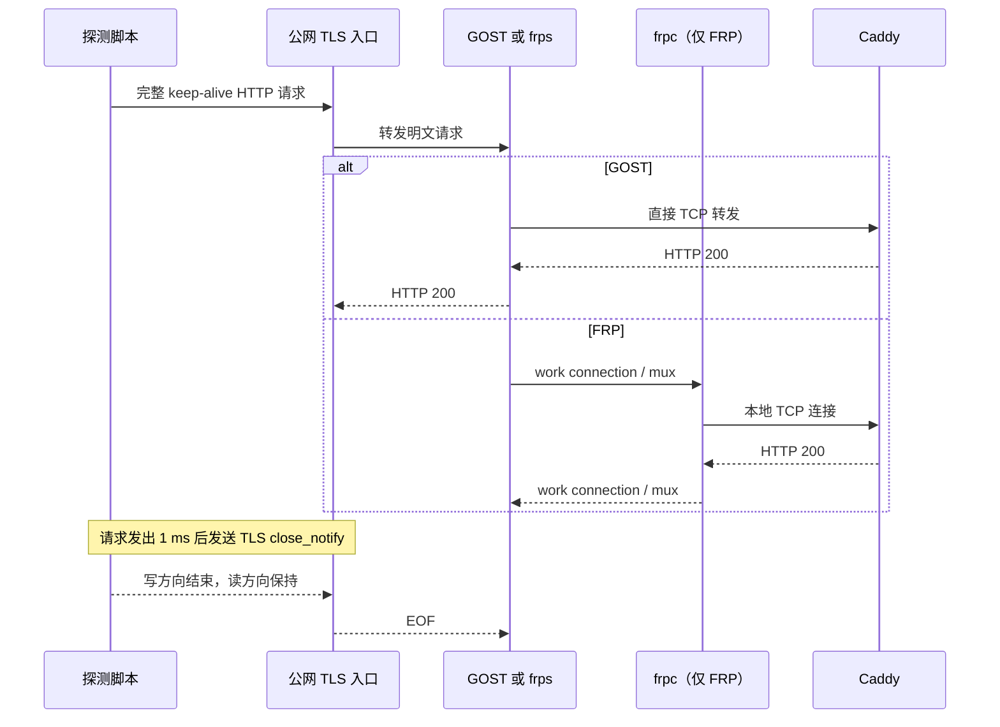

# proxyport

## 题目简述

题目提供两个 TLS 服务：

- 交互服务首先要求完成 26 bit SHA-256 PoW，然后连续进行 20 轮判断；
- 转发服务在每一轮随机使用 GOST 或 FRP，把连接转发到同一个 Caddy HTTP 服务；
- 每轮最多建立 5 个探测连接，并提交 `answer gost` 或 `answer frp`；
- 20 轮全部判断正确后才返回 flag，中途不反馈单轮答案是否正确。

无论当前使用哪种转发器，普通 HTTP 请求都只会得到类似以下内容：

```http
HTTP/1.1 200 OK
Server: Caddy
Content-Length: 5

caddy
```

因此题目不是通过 HTTP 内容识别后端，也不能依靠某个工具特有的应用层握手。GOST 和 FRP 在这里都是透明 TCP 转发器，真正的识别信号来自客户端半关闭连接时，两条转发链对数据与 EOF 的处理先后顺序。

## 解题过程

### 1. 解析交互协议与 PoW

交互服务给出随机十六进制前缀，并要求寻找十进制字符串 `X`，满足：

```text
sha256(prefix || str(X))
```

的前 26 bit 全为 0。脚本把 `prefix` 按 ASCII 原样参与哈希，使用多进程按步长枚举：

```python
def has_leading_zero_bits(digest: bytes, bits: int) -> bool:
    whole_bytes, remaining_bits = divmod(bits, 8)
    if digest[:whole_bytes] != b"\x00" * whole_bytes:
        return False
    if remaining_bits == 0:
        return True
    return digest[whole_bytes] < (1 << (8 - remaining_bits))
```

求得后提交：

```text
pow <suffix>
```

随后服务端输出 `round 01/20 ready`，此时才开始当前轮的 5 次转发探测。

### 2. 排除应用层内容与绝对时延

先后测试了普通 HTTP、SOCKS5 greeting、HTTP `CONNECT`、PROXY protocol 头和不同请求方法。它们都会被原样送到 Caddy，无法触发 GOST 或 FRP 自身的协议响应，说明公开端口只是透明 TCP 数据口。

普通首包时延也不可靠。公网 TLS 入口存在约 `0.2 s` 和 `0.5 s` 的不同网络路径，同一轮的 5 条连接就可能落入不同簇。用固定阈值、最小值、中位数或 `HTTP 首包时间 / TCP RTT` 分类，均会把入口路径误当成代理类型。

这一步的关键 pivot 是：不再测“响应有多快”，而是构造一个很短的关闭竞态，只判断“响应能否抢在 EOF 触发的清理之前穿过转发链”。

### 3. 比较 GOST 与 FRP 的连接关闭路径

GOST v2 的 TCP direct forward handler 接受连接后直接拨号后端，再调用双向复制。其 [`transport`](https://github.com/ginuerzh/gost/blob/v2.12.0/server.go#L105-L123) 启动两个复制 goroutine，但收到任意一个方向的结束结果后就返回；外层 handler 随即关闭客户端和后端连接。TCP 转发入口可见 [`forward.go`](https://github.com/ginuerzh/gost/blob/v2.12.0/forward.go#L106-L158)。

逻辑可以简化为：

```go
go copy(client, backend)
go copy(backend, client)
<-firstFinished
close(client)
close(backend)
```

FRP 的公开端口由 `frps` 接受。它先取得 work connection，再把用户连接和 work connection 交给 `libio.Join`；`frpc` 还要把 work connection 与本地 Caddy 连接再次拼接。FRP 的服务端入口可见 [`server/proxy/proxy.go`](https://github.com/fatedier/frp/blob/v0.70.1/server/proxy/proxy.go#L263-L335)，客户端连接本地服务的路径可见 [`client/proxy/proxy.go`](https://github.com/fatedier/frp/blob/v0.70.1/client/proxy/proxy.go#L167-L235)，双向复制实现来自 [`fatedier/golib/io.Join`](https://github.com/fatedier/golib/blob/v0.8.1/io/io.go#L28-L51)。

所以两种实现都会因客户端方向出现 EOF 而积极清理连接。差别不是“一个支持半关闭、另一个不支持”，而是响应与关闭信号需要经过的链不同：



如果在请求后立即结束写方向，两种实现都来不及返回响应；如果等待太久，两种实现都能返回。恰当的短延迟会落在两者的竞态窗口之间：

- GOST 的直连链较短，Caddy 响应先穿过转发器，因此客户端还能读到 `HTTP/1.1 200 OK`；
- FRP 还要经过 `frps → work connection/mux → frpc`，客户端 EOF 先触发连接清理，因此本次探测读不到 HTTP 响应。

### 4. 本地校准竞态窗口

使用官方发布的 GOST 2.12.0 和 FRP 0.70.1，在相同 HTTP 后端上重复测试。这里的版本用于复现实验，并不用于臆测远端镜像的精确版本。

发送完整请求后等待指定时间，再半关闭客户端写方向，结果如下：

| 延迟 | GOST 成功返回 | FRP 成功返回 |
|---:|---:|---:|
| 0 ms | 0 / 25 | 0 / 25 |
| 0.5 ms | 2 / 25 | 0 / 25 |
| 1 ms | 23 / 25 | 0 / 25 |
| 2 ms | 25 / 25 | 25 / 25 |

`1 ms` 正好位于可区分区间。远端独立会话进一步出现稳定双峰：每轮 5 次相同探测要么全部得到响应，要么全部无响应。将 5 个探测并发执行后仍然保持 `5/5` 与 `0/5`，同时可以满足服务端的单轮时间限制。

最终判定规则为：

```python
response_votes = sum(
    observation.get("responseObserved") is True
    for observation in observations
)
answer = "gost" if response_votes >= 3 else "frp"
```

多数票阈值设为 3，而不是只看一次结果，可以容忍偶发调度抖动。

### 5. 在 TLS 上正确发送半关闭

公开入口要求 TLS，不能直接对 Python `SSLSocket` 调用：

```python
sock.shutdown(socket.SHUT_WR)
```

这样做只会在 TCP 层发送 FIN，并破坏 `SSLSocket` 的状态；后续 `recv()` 可能得到尚未解密的 TLS record，而不是 HTTP 明文。

解题脚本改用 `ssl.MemoryBIO` 和 `SSLObject`，显式控制 TLS 数据：

1. 用 `SSLObject.write()` 生成包含 HTTP 请求的 TLS application-data record；
2. 把 `MemoryBIO` 中的密文发到网络；
3. 等待 1 ms；
4. 调用一次 `SSLObject.unwrap()`，发送 TLS `close_notify`；
5. 不关闭底层 socket 的读方向，继续接收 TLS record；
6. 把收到的密文写回输入 BIO，再用 `SSLObject.read()` 解密；
7. 能读到 `HTTP/1.1 200 OK` 就为 GOST 投一票，否则为 FRP 投票。

核心结构如下，完整实现见同目录的 `solve.py`：

```python
incoming = ssl.MemoryBIO()
outgoing = ssl.MemoryBIO()
tls = context.wrap_bio(
    incoming,
    outgoing,
    server_side=False,
    server_hostname=host,
)

# 完成握手后发送请求
tls.write(HTTP_REQUEST)
flush_outgoing()
time.sleep(0.001)

# 第一次 unwrap 会发出 close_notify，并等待对端关闭
try:
    tls.unwrap()
except ssl.SSLWantReadError:
    pass
flush_outgoing()

# 保留读方向，继续接收并解密可能返回的 HTTP 响应
while receive_encrypted():
    try:
        response += tls.read(65536)
    except ssl.SSLWantReadError:
        continue
```

PoW 使用 `spawn` 多进程，避免 fork 已经建立的 TLS 连接；每轮的 5 个竞态探测使用线程并发，因为主要耗时是网络 I/O。

### 6. 完整远程验证

成功会话的 20 轮结果如下：

| 轮次 | 响应票数 | 判断 |
|---:|---:|---|
| 1 | 0 / 5 | FRP |
| 2 | 0 / 5 | FRP |
| 3 | 5 / 5 | GOST |
| 4 | 0 / 5 | FRP |
| 5 | 5 / 5 | GOST |
| 6 | 5 / 5 | GOST |
| 7 | 0 / 5 | FRP |
| 8 | 0 / 5 | FRP |
| 9 | 5 / 5 | GOST |
| 10 | 0 / 5 | FRP |
| 11 | 0 / 5 | FRP |
| 12 | 5 / 5 | GOST |
| 13 | 0 / 5 | FRP |
| 14 | 0 / 5 | FRP |
| 15 | 0 / 5 | FRP |
| 16 | 0 / 5 | FRP |
| 17 | 0 / 5 | FRP |
| 18 | 5 / 5 | GOST |
| 19 | 5 / 5 | GOST |
| 20 | 5 / 5 | GOST |

服务端最终返回：

```text
All answers are correct.
d3ctf{DIvE-InT0_Th3-1ower_NEtW0rk_l@yER_wllL_yOU-seE_tHe_truth0}
```

在 WSL Kali 中可按以下方式复现：

```bash
source /home/kali/miniforge3/etc/profile.d/conda.sh
conda activate ctf-tools
cd "/mnt/d/文档/新建文件夹/D3CTF2026/proxyport"
python solve.py --workers 32
conda deactivate
```

脚本会在同目录更新：

- `solve-transcript.json`：PoW 参数、每轮票数、每条探测的原始观察和最终输出；
- `flag.txt`：远端确认过的 flag。

## 方法总结

- 核心技巧：在完整请求后制造约 1 ms 的 TLS 半关闭竞态，用“响应是否在 EOF 清理前返回”识别透明 TCP 转发链。
- 识别信号：两个候选服务的应用层响应完全一致，但一个是直接端口转发，另一个还经过 work connection 或多路复用隧道；这时应研究 EOF、半关闭、缓冲与双向复制的实现，而不是继续枚举 HTTP payload。
- TLS 要点：`SSLSocket.shutdown(SHUT_WR)` 不等于干净的 TLS 半关闭。需要用 `close_notify` 表示 TLS 写方向结束，并保持读方向继续解密响应。
- 稳定性要点：绝对 RTT 会被公网入口污染；短竞态只比较同一连接内的数据与 EOF 顺序。5 次并发探测加多数票既能抗抖动，也能满足单轮时限。
- 易错点：等待 0 ms 时两者都失败，等待 2 ms 以上时两者都成功；只有先在已知实现上标定临界窗口，才能得到稳定指纹。
