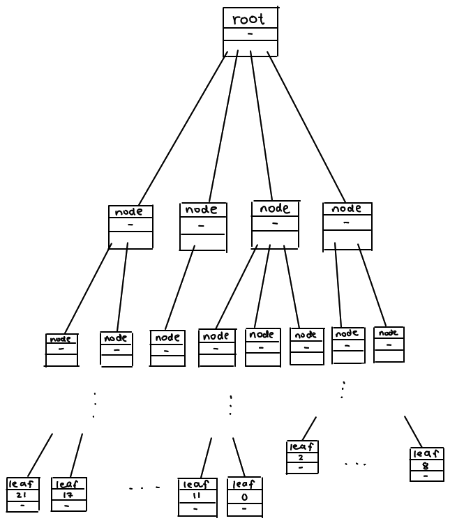
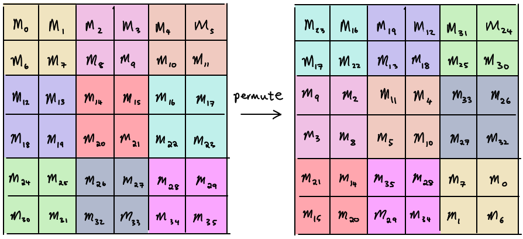
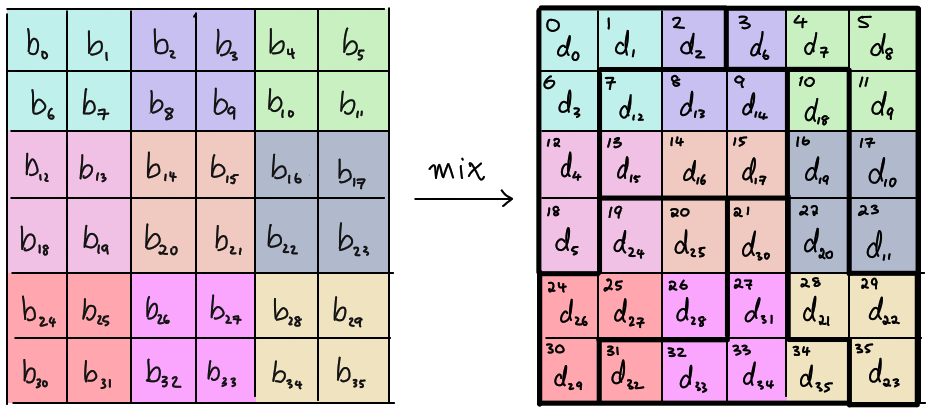

# DownUnderCTF 2021 - flag checker

## 题目简述

程序读取恰好 36 字节的候选 flag，连续执行 16 轮 `mix` 和 `permute`，再与硬编码的 36 字节目标比较。两种变换都是可逆的：树结构最终只实现固定置换，混合函数则是 $GF(2^8)$ 上的可逆线性变换，因此从目标值逆推 16 轮即可恢复输入。

## 解题过程

### 提取轮函数与目标值

主流程可整理为：

```c
if (strlen(input) != 36)
    die();

for (int i = 0; i < 16; i++) {
    mix(input);
    tree = generate_tree(input);
    permute(input, tree);
}

if (memcmp(input, FINAL, 36) != 0)
    die();
```

最终比较值为：

```text
0f4f733c41c6a4afb441d665c899aab36c99613c4edd704615663c1b7f16a66f2313126e
```

程序每轮先混合、后置换，所以逆向一轮时必须先执行逆置换，再执行逆混合。

### 把树访问还原成固定置换

`generate_tree` 每次都以 `0x1337` 重置自定义 LCG。树的形状和 `permute` 使用的根节点偏移因而在每轮都相同；叶节点虽然装入当前输入字节，但最终只是按固定顺序重新排列它们。



可在调试器中跳过 `mix`，输入 36 个互不相同的字符，观察 `permute` 返回后的次序。得到输出位置到输入位置的映射：

```python
PBOX = [
    23, 16, 19, 12, 31, 24, 17, 22, 13, 18, 25, 30,
     9,  2, 11,  4, 33, 26,  3,  8,  5, 10, 27, 32,
    21, 14, 35, 28,  7,  0, 15, 20, 29, 34,  1,  6,
]

def inv_permute(data):
    out = [0] * 36
    for output_pos, input_pos in enumerate(PBOX):
        out[input_pos] = data[output_pos]
    return out
```



### 在有限域上表示混合函数

底层函数为：

```c
uint8_t m2(uint8_t b) {
    return (b << 1) ^ (((b >> 7) & 1) * 0x1b);
}
```

这正是 AES 字节域中的乘以 $\alpha$。使用：

$$
GF(2^8)=GF(2)[\alpha]/(\alpha^8+\alpha^4+\alpha^3+\alpha+1),
$$

字节异或对应域加法，`m2(b)` 对应 $2b$。每组六个字节满足：

$$
\begin{aligned}
d_0&=3b_0+3b_2+2b_4, & d_1&=3b_1+3b_3+2b_5,\\
d_2&=2b_0+b_4,       & d_3&=2b_1+b_5,\\
d_4&=3b_0+2b_2,       & d_5&=3b_1+2b_3.
\end{aligned}
$$

即：

$$
\begin{bmatrix}d_0\\d_1\\d_2\\d_3\\d_4\\d_5\end{bmatrix}
\;=\;
\begin{bmatrix}
3&0&3&0&2&0\\
0&3&0&3&0&2\\
2&0&0&0&1&0\\
0&2&0&0&0&1\\
3&0&2&0&0&0\\
0&3&0&2&0&0
\end{bmatrix}
\begin{bmatrix}b_0\\b_1\\b_2\\b_3\\b_4\\b_5\end{bmatrix}.
$$



六组索引为：

```python
GROUPS = [
    [0, 1, 2, 6, 12, 18],
    [3, 4, 5, 11, 17, 23],
    [7, 8, 9, 13, 14, 15],
    [10, 16, 22, 28, 29, 35],
    [19, 20, 24, 25, 26, 30],
    [21, 27, 31, 32, 33, 34],
]
```

上述矩阵在该有限域中可逆。SageMath 可直接构造域与逆矩阵：

```sage
R.<alpha> = PolynomialRing(GF(2))
F = GF(2^8, alpha, modulus=alpha^8 + alpha^4 + alpha^3 + alpha + 1)
Fi = F.fetch_int

M = Matrix(F, [[Fi(x) for x in row] for row in [
    [3, 0, 3, 0, 2, 0],
    [0, 3, 0, 3, 0, 2],
    [2, 0, 0, 0, 1, 0],
    [0, 2, 0, 0, 0, 1],
    [3, 0, 2, 0, 0, 0],
    [0, 3, 0, 2, 0, 0],
]])
M_inv = ~M
```

对每组当前输出向量左乘 `M_inv`，再把有限域元素转回字节，便得到逆混合结果。

### 逆推十六轮

从硬编码目标字节开始重复：

```python
state = bytes.fromhex(
    "0f4f733c41c6a4afb441d665c899aab36c99613c4edd704615663c1b7f16a66f2313126e"
)

for _ in range(16):
    state = inv_permute(state)
    state = inv_mix(state, GROUPS, M_inv)

print(bytes(state).decode())
```

恢复出：

```text
DUCTF{rev3rs1bl3___and___1nv3rtibl3}
```

## 方法总结

本题把固定置换藏在随机生成的树中，又把字节混合写成不易辨认的位运算。确定性种子使树访问可降维为一张置换表；`0x1b` 约减常数则揭示混合发生在模多项式 $\alpha^8+\alpha^4+\alpha^3+\alpha+1$ 定义的 $GF(2^8)$ 上。提取两种可逆变换后，以“逆置换、逆矩阵”的顺序倒推 16 轮即可。
