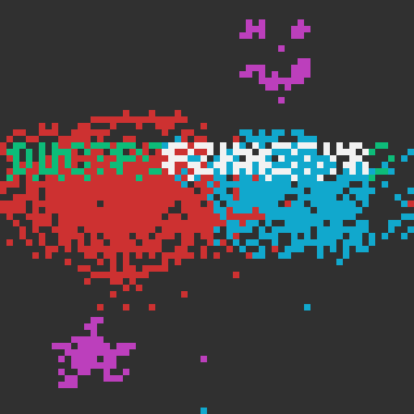

# DownUnderCTF 2022 artisan Writeup

## 题目简述

题目给出绘图程序 `artisan` 和保存文件 `flag.art`。文件并不是常见图片格式：画布固定为 $64\times64$，每个像素只有 8 种颜色，因此一个像素只需 3 bit；程序还对像素流使用 Morton（Z-order）顺序和一个单字节 LZ77 变体压缩。目标是还原保存格式并重建画布中的 flag。

## 解题过程

先根据程序中的 `oddbits` 函数还原像素位置。第 $n$ 个像素的坐标为：

```python
def oddbits(n):
    n = ((n & 0x44444444) >> 1) | (n & 0x11111111)
    n = ((n & 0x30303030) >> 2) | (n & 0x03030303)
    n = ((n & 0x0F000F00) >> 4) | (n & 0x000F000F)
    n = ((n & 0x00FF0000) >> 8) | (n & 0x000000FF)
    return n

x = oddbits(n)
y = oddbits(n >> 1)
```

接着处理压缩流。若字节最高位为 0，它就是字面量；若最高位为 1，则中间 5 bit 给出长度减 3，最低 2 bit 给出额外回溯偏移。其解压逻辑可写为：

```python
unpacked = bytearray()
for p in packed:
    if p & 0x80:
        run = ((p & 0x7c) >> 2) + 3
        off = p & 3
        unpacked += unpacked[-run - off:][:run]
    else:
        unpacked.append(p)
```

解压结果恰为 2048 字节，即 $64\times64\div2$。每个字节保存两个 3-bit 色号：偶数序号像素取 `byte >> 3 & 7`，奇数序号像素取 `byte & 7`。把色号放回 Morton 坐标即可得到完整画布。



从画布读取到：

```text
DUCTF{FZKAITYR}
```

## 方法总结

本题的关键不是图像隐写，而是逆向私有文件格式。应依次区分压缩层、像素打包层和空间遍历层：先按最高位标志解压到 2048 字节，再拆出两个 3-bit 色号，最后用 `oddbits` 逆映射到二维画布。任意一层的顺序颠倒，都会得到长度正确但空间结构混乱的结果。
